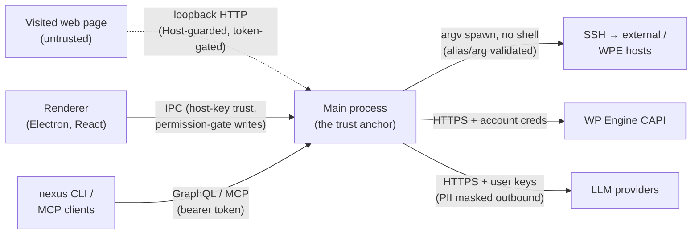

# Security Policy

Nexus AI is a Local (by WP Engine) addon that runs on a developer's machine with that developer's
privileges. It runs local HTTP servers, an MCP server and a GraphQL endpoint, spawns SSH and WP-CLI
against WordPress and WP Engine hosts, stores API keys and credentials, and runs LLM-driven agents.
We take the security of that surface seriously.

## Reporting a vulnerability

**Please do not open a public GitHub issue for security problems.**

Report privately through GitHub's **private vulnerability reporting**: the repository's **Security**
tab → **Report a vulnerability**. Include the version (`nexus --version` or the addon's
`package.json`), your OS, and enough detail to reproduce.

We aim to acknowledge a report within a few business days and to keep you updated as we investigate
and fix. Please give us reasonable time to release a fix before any public disclosure.

## Supported versions

Security fixes are made against the latest released minor version. Older versions are not patched —
update to the latest release (`nexus update`, then reload the addon in Local).

| Version | Supported |
|---|---|
| latest minor | ✅ |
| older | ❌ (please update) |

## Security measures

A summary of the controls currently in place (not an exhaustive design document):

- **Local servers bind to `127.0.0.1` only.** The MCP server, AI gateway/event server, AI proxy,
  GraphQL endpoint and OAuth callback are loopback-only and token-authenticated.
- **Credentials are encrypted at rest** via Electron `safeStorage`; OAuth uses PKCE. Secrets are
  redacted (and freeform command surfaces withheld) from all audit and diagnostic logs.
- **Remote commands are argv-array subprocess calls, never a shell**, and SSH aliases and
  `~/.ssh/config` fields are validated to prevent option/directive injection.
- **Host keys use trust-on-first-use** with fingerprint verification; a changed host key is
  hard-refused, and approving a new key is possible only from Local's Settings UI.
- **A fail-closed permission gate** governs writes to remote (production) environments; destructive
  and privilege-granting operations require explicit human confirmation and are refused for
  autonomous agents. Permission-gate settings are changeable only from the Settings UI.
- **Auto-updates are cryptographically verified.** Release tarballs are signed with an Ed25519 key
  in CI, and the CLI refuses to install any addon whose signature is missing or invalid — see
  [`docs/release-signing.md`](docs/release-signing.md).

## Local attack surface

Everything runs on the developer's machine and binds loopback only. Ports are picked from a range
at startup.

| Process | Bind | Port range | Auth | If reached by a hostile local caller |
|---|---|---|---|---|
| MCP server | `127.0.0.1` | 10800–10899 | Bearer token (`nexus-ai-mcp-connection-info.json`, 0600) | Full MCP tool surface — but Tier 3 requires confirmation and is refused for agents |
| AI gateway / event server | `127.0.0.1` | 13000–13100 | Random token; loopback `Host` required; localhost-only CORS; `/models` authed | Spend on the user's LLM keys with a valid token; config disclosure blocked |
| AI proxy (Ollama) | `127.0.0.1` | 13100–13199 | — | Local Ollama proxy only |
| GraphQL endpoint (Local platform) | `127.0.0.1` | 4000 | Bearer token (`graphql-connection-info.json`) | Full GraphQL surface incl. mutating WPE ops; permission-gate keys are UI-only |
| OAuth callback | `127.0.0.1` | 49054–49058 | PKCE + `state` | One-shot auth-code redirect only |

Notes: the bearer/connection tokens are the real boundary — anything on the machine that can read
those files can call the corresponding server. A visited web page cannot: loopback `Host`
validation defeats DNS rebinding, and CORS is never wildcard.

## Trust boundaries

The main process is the single trust anchor: it holds the credentials, enforces the permission
gate, and is the only component that reaches production hosts. The renderer, CLI, and MCP clients
all authenticate to it; a prompt-injected LLM is confined by the Tier gate (destructive ops need
human confirmation and are refused for agents), and permission-gate settings are changeable only
through the renderer's IPC channel, never the token-shared GraphQL/CLI path.

## Release integrity

Every published release tarball carries a detached Ed25519 signature (`<asset>.tgz.sig`). The CLI
verifies it against a public key embedded in the client before extracting or loading the addon.
Maintainers: the signing keypair, rotation, and how to cut a signed release are documented in
[`docs/release-signing.md`](docs/release-signing.md).
