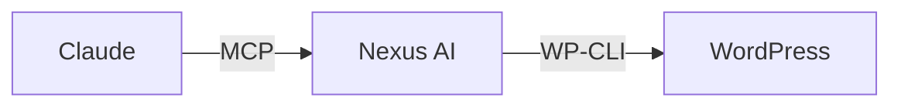

# Nexus AI Documentation

This directory contains the **MkDocs Material** documentation site for Nexus AI.

## Local Development

### Prerequisites

- Python 3.x
- pip

### Setup

```bash
# Install dependencies
pip install -r requirements.txt

# Serve locally
mkdocs serve

# Open browser
open http://127.0.0.1:8000
```

### Build

```bash
# Build static site
mkdocs build

# Output: site/
```

## Structure

```
docs-site/
├── docs/                      # Markdown content
│   ├── index.md              # Landing page
│   ├── cli/                  # CLI/MCP documentation
│   ├── mcp-tools/            # Tool reference (AI-optimized)
│   ├── ui-addon/             # UI addon docs
│   ├── architecture/         # System architecture
│   ├── developer/            # Developer guide
│   ├── api/                  # API reference
│   ├── integrations/         # Integration guides
│   ├── features/             # Feature details
│   └── reference/            # Reference materials
├── mkdocs.yml                # MkDocs configuration
├── requirements.txt          # Python dependencies
└── README.md                 # This file
```

## Writing Docs

### Frontmatter

All pages should include frontmatter:

```yaml
---
title: Page Title
description: Brief description for SEO and AI
keywords: [relevant, keywords, for, search]
---
```

### AI-Optimized Content

For MCP tool documentation, include structured metadata:

```yaml
---
title: wp_plugin_list
description: List WordPress plugins on local or remote sites
keywords: [wordpress, wp-cli, plugins, mcp]
tool_name: wp_plugin_list
access: [local, remote]
safety_tier: 1
---
```

### Mermaid Diagrams

Use Mermaid for architecture diagrams:

````markdown

````

### Code Tabs

Use tabs for multi-language or multi-context examples:

````markdown
=== "Local Site"

    ```json
    {"site_id": "abc123"}
    ```

=== "WPE Site"

    ```json
    {"install_name": "mysite-prod"}
    ```
````

### Admonitions

Use admonitions for important information:

```markdown
!!! tip "Pro Tip"
    Use SSH ControlMaster for faster remote operations.

!!! warning "Warning"
    This operation cannot be undone.

!!! note "Note"
    This feature requires Local 9.0.0+.
```

## Deployment

### GitHub Pages

Docs are automatically deployed to GitHub Pages on push to `main`.

**URL:** https://wpengine.github.io/local-addon-nexus-ai/

### Manual Deploy

```bash
# Build and deploy to gh-pages branch
mkdocs gh-deploy
```

## Configuration

### MkDocs Config

`mkdocs.yml` contains:

- **Site metadata** - Name, description, author
- **Theme configuration** - Material theme with dark mode
- **Navigation structure** - Sidebar organization
- **Plugins** - Search, tags
- **Markdown extensions** - Mermaid, admonitions, code highlighting

### Custom CSS

`docs/stylesheets/extra.css` contains:

- AI-optimized content styling
- Safety tier badges
- Access method badges
- Tool grid layouts
- Metadata display

## Content Guidelines

### For AI Assistants

- **Structured schemas** - Use TypeScript interfaces for tool inputs
- **Clear examples** - Show multiple use cases per tool
- **Error handling** - Document common errors and solutions
- **Cross-references** - Link to related tools and docs

### For Humans

- **Clear hierarchy** - Use headings consistently
- **Concise** - Get to the point quickly
- **Visual** - Use diagrams and tables
- **Searchable** - Include keywords in frontmatter

### For Both

- **Complete** - Don't assume prior knowledge
- **Accurate** - Test all code examples
- **Current** - Update docs with code changes
- **Linked** - Cross-reference related content

## Adding Pages

### 1. Create Markdown File

```bash
touch docs/new-section/new-page.md
```

### 2. Add Frontmatter

```yaml
---
title: New Page
description: Description for SEO
keywords: [relevant, keywords]
---
```

### 3. Update Navigation

Edit `mkdocs.yml`:

```yaml
nav:
  - New Section:
    - Overview: new-section/index.md
    - New Page: new-section/new-page.md
```

### 4. Preview Locally

```bash
mkdocs serve
```

## Best Practices

### Tool Documentation

1. **Start with metadata** - Frontmatter with tool details
2. **Overview** - 1-2 sentence description
3. **Schema** - TypeScript interface for inputs
4. **Examples** - Multiple use cases with tabs
5. **Response** - Show expected output
6. **Errors** - Document common errors
7. **Related** - Link to related tools

### Architecture Docs

1. **Diagram first** - Show, don't just tell
2. **Layers** - Separate concerns (UI, Core, Data)
3. **Flows** - Use sequence diagrams for processes
4. **Performance** - Include benchmarks where relevant
5. **Trade-offs** - Explain design decisions

### Guides

1. **Prerequisites** - List requirements upfront
2. **Steps** - Clear numbered steps
3. **Screenshots** - Show UI when helpful (use sparingly)
4. **Troubleshooting** - Common issues at the end
5. **Next steps** - Link to related guides

## Maintenance

### Updating Docs

When code changes:

1. **Update tool schemas** - Reflect API changes
2. **Update examples** - Test all code examples
3. **Update architecture** - Reflect design changes
4. **Update benchmarks** - Re-run performance tests

### Checking Links

```bash
# Build with strict mode (fails on broken links)
mkdocs build --strict
```

### Search Index

Search index is automatically generated on build. No manual intervention needed.

## Help

- **MkDocs:** https://www.mkdocs.org
- **Material Theme:** https://squidfunk.github.io/mkdocs-material
- **Mermaid:** https://mermaid.js.org

## License

Same as Nexus AI (proprietary/WP Engine internal).
