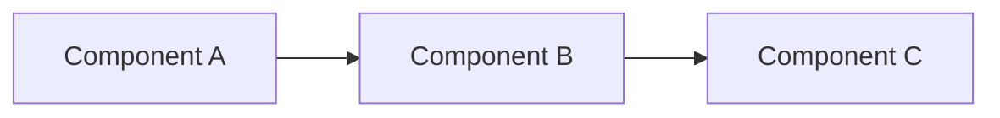

# Documentation Setup Summary

**Status:** ✅ Complete foundation ready
**Date:** 2026-03-19

## What Was Created

### Core Infrastructure (7 files)

1. **mkdocs.yml** - MkDocs Material configuration
   - Site metadata and navigation structure
   - Material theme with dark mode
   - Mermaid diagram support
   - Search, code highlighting, tabs, admonitions
   - Complete navigation tree (80+ pages)

2. **requirements.txt** - Python dependencies
   - mkdocs >=1.5.3
   - mkdocs-material >=9.5.0
   - pymdown-extensions >=10.7

3. **docs/stylesheets/extra.css** - Custom styling
   - AI-optimized content display
   - Safety tier badges
   - Access method badges
   - Tool grid layouts
   - Metadata display

4. **.github/workflows/docs.yml** - GitHub Actions deployment
   - Auto-deploy on push to main
   - Builds with `mkdocs build --strict`
   - Deploys to GitHub Pages

5. **package.json** - NPM scripts (convenience)
   - `npm run serve` - Local development server
   - `npm run build` - Build static site
   - `npm run deploy` - Deploy to GitHub Pages
   - `npm run create-placeholders` - Generate placeholder pages

6. **.gitignore** - Git ignores
   - `site/` build output
   - Python cache files

7. **README.md** - Documentation for docs contributors
   - Setup instructions
   - Writing guidelines
   - Deployment process

### Content Pages (7 files)

**Created:**
1. **docs/index.md** - Landing page with overview
2. **docs/cli/index.md** - CLI/MCP server complete guide
3. **docs/mcp-tools/index.md** - Tool reference overview
4. **docs/mcp-tools/wordpress.md** - WordPress tools (12 tools documented)
5. **docs/architecture/overview.md** - System architecture with Mermaid diagrams
6. **docs/getting-started/index.md** - Getting started guide
7. **docs/stylesheets/extra.css** - Custom CSS

**To be created (60+ pages):**
Run `npm run create-placeholders` to generate placeholder pages for all sections.

### Helper Scripts (1 file)

8. **scripts/create-placeholders.sh** - Bash script
   - Generates placeholder pages for all 60+ documented sections
   - Adds frontmatter and TODO markers
   - Preserves existing pages

## Key Features

### AI-Optimized Content

Every page includes structured frontmatter for AI assistants:

```yaml
---
title: wp_plugin_list
description: List WordPress plugins on local or remote sites
keywords: [wordpress, wp-cli, plugins, mcp]
tool_name: wp_plugin_list
access: [local, remote]
safety_tier: 1
---
```

### Mermaid Diagrams

Architecture diagrams render in the browser:

- System architecture
- Data flow (sequence diagrams)
- Component relationships
- Process flows

### Material Design

**Theme features:**
- Light/dark mode toggle
- Instant loading
- Search with suggestions
- Code copy buttons
- Tab groups for examples
- Admonitions (tip, warning, note)
- Mobile responsive

### Safety & Access Badges

Custom badges for tool documentation:

- <span class="safety-tier-1">SAFE</span> - Read-only operations
- <span class="safety-tier-2">CAUTION</span> - Modifications
- <span class="safety-tier-3">DESTRUCTIVE</span> - Irreversible ops

- <span class="access-badge">LOCAL</span> - Local sites only
- <span class="access-badge">REMOTE</span> - WPE sites only
- <span class="access-badge">BOTH</span> - Both local and remote

## Quick Start

### 1. Install Dependencies

```bash
cd docs-site
pip install -r requirements.txt
```

Or:

```bash
npm run install
```

### 2. Create Placeholder Pages

```bash
npm run create-placeholders
```

This creates ~60 placeholder pages with TODO markers.

### 3. Serve Locally

```bash
npm run serve
```

Open http://127.0.0.1:8000

### 4. Fill In Content

Edit markdown files in `docs/` and see live updates.

### 5. Build & Deploy

```bash
# Build static site
npm run build

# Deploy to GitHub Pages
npm run deploy
```

Or push to `main` and GitHub Actions will auto-deploy.

## Documentation Structure

```
docs-site/docs/
├── index.md                        # Landing page ✅
│
├── cli/                            # CLI/MCP Server
│   ├── index.md                    # ✅ Complete
│   ├── installation.md             # TODO
│   ├── mcp-setup.md               # TODO
│   ├── authentication.md          # TODO
│   ├── commands.md                # TODO
│   ├── examples.md                # TODO
│   ├── local-sites.md             # TODO
│   ├── wpe-sites.md               # TODO
│   ├── wp-cli.md                  # TODO
│   ├── bulk-operations.md         # TODO
│   ├── error-handling.md          # TODO
│   ├── performance.md             # TODO
│   └── troubleshooting.md         # TODO
│
├── mcp-tools/                      # MCP Tools Reference
│   ├── index.md                    # ✅ Complete
│   ├── local-sites.md              # TODO
│   ├── wpe-sites.md                # TODO
│   ├── wordpress.md                # ✅ Complete (12 tools)
│   ├── search.md                   # TODO
│   ├── fleet.md                    # TODO
│   ├── telemetry.md                # TODO
│   ├── tool-schemas.md             # TODO
│   └── tool-matrix.md              # TODO
│
├── getting-started/                # Getting Started
│   ├── index.md                    # ✅ Complete
│   ├── choose-interface.md         # TODO
│   ├── cli-quick-start.md          # TODO
│   ├── ui-quick-start.md           # TODO
│   ├── first-scan.md               # TODO
│   ├── first-ai-query.md           # TODO
│   └── next-steps.md               # TODO
│
├── ui-addon/                       # UI Addon (10 pages - TODO)
├── architecture/                   # Architecture (11 pages, 1 ✅)
├── developer/                      # Developer Guide (10 pages - TODO)
├── api/                            # API Reference (6 pages - TODO)
├── integrations/                   # Integrations (6 pages - TODO)
├── features/                       # Features (8 pages - TODO)
└── reference/                      # Reference (8 pages - TODO)
```

## Content Patterns

### Tool Documentation Template

````markdown
---
title: tool_name
description: One-line description
keywords: [relevant, keywords]
tool_name: tool_name
access: [local, remote]
safety_tier: 1
---

# tool_name

Brief description (1-2 sentences).

<div class="metadata">
<dl>
  <dt>Access</dt>
  <dd><span class="access-badge">LOCAL</span> <span class="access-badge">REMOTE</span></dd>
  <dt>Safety Tier</dt>
  <dd><span class="safety-tier safety-tier-1">1 - SAFE</span></dd>
  <dt>Returns</dt>
  <dd>What it returns</dd>
</dl>
</div>

### Input Schema

```typescript
{
  parameter: string;  // Description
}
```

### Examples

=== "Example 1"

    ```json
    {"parameter": "value"}
    ```

=== "Example 2"

    ```json
    {"parameter": "other"}
    ```

### Response

```json
{
  "content": [{
    "type": "text",
    "text": "Result"
  }]
}
```

### Related Tools

- [other_tool](#other_tool)
````

### Architecture Page Template

````markdown
---
title: Architecture Topic
description: Description
keywords: [architecture, design]
---

# Architecture Topic

## Overview

High-level description.



## Details

Detailed explanation.

## Trade-offs

Design decisions and trade-offs.

## Performance

Performance characteristics.
````

## Next Steps

### Fill in Priority Pages (Day 1)

1. **CLI documentation** (12 pages)
   - Installation
   - MCP setup
   - Commands reference
   - Examples

2. **MCP tools** (6 pages)
   - Local sites tools
   - WPE sites tools
   - Search tools
   - Fleet tools
   - Tool schemas
   - Tool matrix

3. **Getting started** (5 pages)
   - CLI quick start
   - UI quick start
   - First scan
   - First AI query

### Fill in Architecture (Day 2)

4. **Architecture** (10 pages)
   - CLI architecture
   - UI architecture
   - Data flow
   - MCP protocol
   - Tool registry
   - Vector database
   - WPE integration
   - Telemetry
   - Shared core

### Fill in Reference (Day 3)

5. **Reference** (8 pages)
   - CLI command reference
   - Tool reference
   - Error codes
   - Changelog
   - Roadmap
   - FAQ
   - Glossary
   - Performance benchmarks

### Fill in Guides (Day 4)

6. **Developer guide** (10 pages)
7. **UI addon** (10 pages)
8. **Integrations** (6 pages)
9. **Features** (8 pages)

## Deployment

### GitHub Pages URL

Once deployed: `https://wpengine.github.io/local-addon-nexus-ai/`

### Auto-Deploy

On every push to `main` branch, GitHub Actions will:
1. Install Python dependencies
2. Build docs with `mkdocs build --strict`
3. Deploy to GitHub Pages

### Manual Deploy

```bash
mkdocs gh-deploy
```

## Maintenance

### Adding New Tools

When adding a new MCP tool:

1. Add to appropriate tool category page (e.g., `mcp-tools/wordpress.md`)
2. Follow the tool documentation template
3. Update `mcp-tools/index.md` to list it
4. Update `mcp-tools/tool-matrix.md` capability matrix
5. Add to `reference/tool-reference.md`

### Updating Architecture

When architecture changes:

1. Update Mermaid diagrams in `architecture/*.md`
2. Update code examples to match
3. Update performance benchmarks if relevant

### Versioning

Consider using `mike` for version-specific docs:

```bash
pip install mike
mike deploy --push --update-aliases 1.0 latest
```

## Resources

- **MkDocs:** https://www.mkdocs.org
- **Material Theme:** https://squidfunk.github.io/mkdocs-material
- **Mermaid:** https://mermaid.js.org
- **Writing Guide:** See `README.md` in this directory

## Status Summary

**Created:** 15 files
**Pages complete:** 7 pages (index, CLI overview, tool reference, WordPress tools, architecture overview, getting started)
**Pages to create:** ~60 pages (use `npm run create-placeholders`)

**Estimated time to complete:**
- Priority pages (CLI, tools, getting started): 1-2 days
- Architecture and reference: 1-2 days
- Guides and features: 2-3 days
- **Total: 4-7 days** for comprehensive documentation

---

**Documentation site is ready to build!** 🚀

Run `npm run create-placeholders && npm run serve` to get started.
