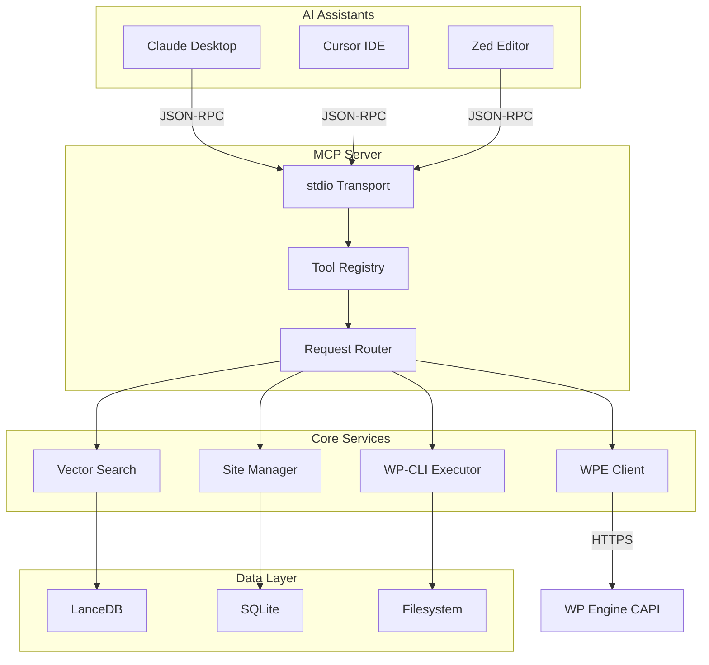
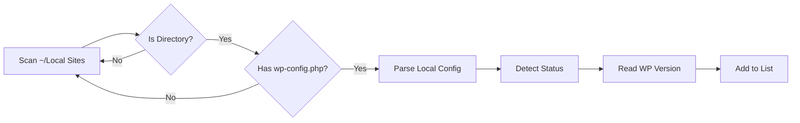
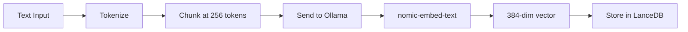
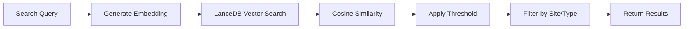
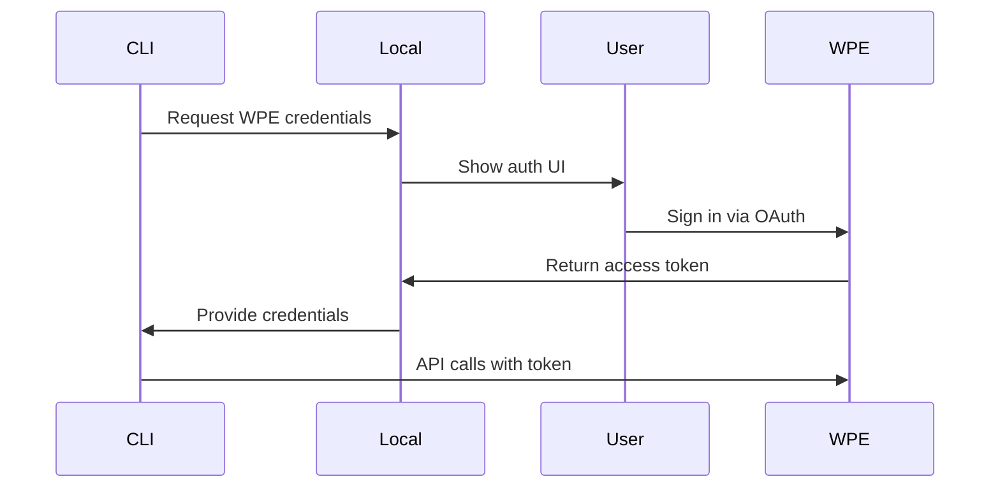
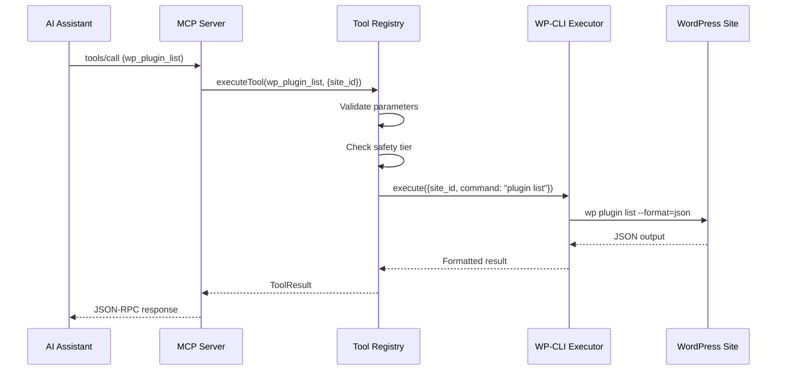

# CLI Architecture

Deep dive into the Nexus AI CLI and MCP server architecture.

## System Overview



## Components

### 1. MCP Server

The Model Context Protocol server is the main entry point for AI assistants.

**Location:** `src/cli/mcp-server.ts`

**Responsibilities:**

- Accept JSON-RPC requests via stdio
- Route tool calls to appropriate handlers
- Stream responses back to client
- Handle errors and timeouts

**Implementation:**

```typescript
import { Server } from '@modelcontextprotocol/sdk/server/index.js';
import { StdioServerTransport } from '@modelcontextprotocol/sdk/server/stdio.js';

class NexusMCPServer {
  private server: Server;
  private transport: StdioServerTransport;

  constructor() {
    this.server = new Server({
      name: 'nexus-ai',
      version: '1.0.0'
    }, {
      capabilities: {
        tools: {}
      }
    });

    this.transport = new StdioServerTransport();
    this.registerHandlers();
  }

  private registerHandlers() {
    // List available tools
    this.server.setRequestHandler(ListToolsRequestSchema, async () => ({
      tools: this.registry.getAllTools()
    }));

    // Execute tool calls
    this.server.setRequestHandler(CallToolRequestSchema, async (request) => {
      const { name, arguments: args } = request.params;
      return await this.registry.executeTool(name, args);
    });
  }

  async start() {
    await this.server.connect(this.transport);
    console.error('Nexus MCP server running on stdio');
  }
}
```

**Protocol:**

The server implements the [Model Context Protocol](https://modelcontextprotocol.io) specification:

1. **Initialization:**
   ```json
   // Client → Server
   {
     "jsonrpc": "2.0",
     "method": "initialize",
     "params": {
       "protocolVersion": "2024-11-05",
       "capabilities": {},
       "clientInfo": {
         "name": "claude-desktop",
         "version": "0.7.0"
       }
     },
     "id": 1
   }

   // Server → Client
   {
     "jsonrpc": "2.0",
     "result": {
       "protocolVersion": "2024-11-05",
       "capabilities": {
         "tools": {}
       },
       "serverInfo": {
         "name": "nexus-ai",
         "version": "1.0.0"
       }
     },
     "id": 1
   }
   ```

2. **Tool Discovery:**
   ```json
   // Client → Server
   {
     "jsonrpc": "2.0",
     "method": "tools/list",
     "id": 2
   }

   // Server → Client
   {
     "jsonrpc": "2.0",
     "result": {
       "tools": [
         {
           "name": "wp_plugin_list",
           "description": "List WordPress plugins",
           "inputSchema": { /* JSON Schema */ }
         },
         // ... 90+ more tools
       ]
     },
     "id": 2
   }
   ```

3. **Tool Execution:**
   ```json
   // Client → Server
   {
     "jsonrpc": "2.0",
     "method": "tools/call",
     "params": {
       "name": "wp_plugin_list",
       "arguments": {
         "site_id": "abc123"
       }
     },
     "id": 3
   }

   // Server → Client
   {
     "jsonrpc": "2.0",
     "result": {
       "content": [
         {
           "type": "text",
           "text": "✓ Found 15 plugins:\n\n1. Akismet 5.3.1..."
         }
       ]
     },
     "id": 3
   }
   ```

### 2. Tool Registry

Centralized registry of all MCP tools.

**Location:** `src/cli/tool-registry.ts`

**Responsibilities:**

- Register and discover tools
- Validate tool parameters
- Execute tools with error handling
- Apply safety tiers

**Implementation:**

```typescript
interface ToolDefinition {
  name: string;
  description: string;
  inputSchema: JSONSchema;
  handler: (params: unknown) => Promise<ToolResult>;
  safetyTier: 1 | 2 | 3;
  metadata?: {
    localOnly?: boolean;
    remoteOnly?: boolean;
  };
}

class ToolRegistry {
  private tools = new Map<string, ToolDefinition>();

  register(tool: ToolDefinition) {
    this.tools.set(tool.name, tool);
  }

  getAllTools(): ToolDefinition[] {
    return Array.from(this.tools.values()).map(t => ({
      name: t.name,
      description: t.description,
      inputSchema: t.inputSchema
    }));
  }

  async executeTool(name: string, params: unknown): Promise<ToolResult> {
    const tool = this.tools.get(name);
    if (!tool) {
      throw new Error(`Tool not found: ${name}`);
    }

    // Validate parameters
    this.validateParams(params, tool.inputSchema);

    // Apply safety checks
    await this.checkSafety(tool, params);

    // Execute handler
    try {
      return await tool.handler(params);
    } catch (error) {
      return this.formatError(error);
    }
  }

  private validateParams(params: unknown, schema: JSONSchema) {
    const ajv = new Ajv();
    const validate = ajv.compile(schema);
    if (!validate(params)) {
      throw new Error(`Invalid parameters: ${ajv.errorsText(validate.errors)}`);
    }
  }
}
```

**Tool Categories:**

Tools are organized by category:

```typescript
// Local site tools
registerTool({
  name: 'local_list_sites',
  category: 'local',
  handler: async () => { /* ... */ }
});

// WP Engine tools
registerTool({
  name: 'wpe_get_installs',
  category: 'wpe',
  handler: async (params) => { /* ... */ }
});

// WordPress tools
registerTool({
  name: 'wp_plugin_list',
  category: 'wordpress',
  handler: async (params) => { /* ... */ }
});

// Search tools
registerTool({
  name: 'search_site_content',
  category: 'search',
  handler: async (params) => { /* ... */ }
});
```

### 3. Site Manager

Discovers and manages WordPress sites.

**Location:** `src/cli/site-manager.ts`

**Responsibilities:**

- Discover Local sites
- Fetch WP Engine sites
- Cache site metadata
- Detect site status (running/halted)

**Implementation:**

```typescript
class SiteManager {
  private localSitesPath: string;
  private cache = new Map<string, SiteInfo>();

  constructor() {
    // Default Local sites path
    this.localSitesPath = path.join(os.homedir(), 'Local Sites');
  }

  async listLocalSites(): Promise<LocalSite[]> {
    const sites: LocalSite[] = [];

    // Read Local Sites directory
    const entries = await fs.readdir(this.localSitesPath);

    for (const entry of entries) {
      const sitePath = path.join(this.localSitesPath, entry);
      const stat = await fs.stat(sitePath);

      if (!stat.isDirectory()) continue;

      // Check for WordPress installation
      const wpPath = path.join(sitePath, 'app', 'public');
      if (!await this.isWordPress(wpPath)) continue;

      // Parse Local site config
      const config = await this.parseLocalConfig(sitePath);

      // Detect site status
      const status = await this.detectStatus(config);

      sites.push({
        id: config.id,
        name: entry,
        path: sitePath,
        domain: config.domain,
        status: status,
        wp_version: await this.getWPVersion(wpPath),
        php_version: config.php_version,
        mysql_host: config.mysql_host,
        mysql_database: config.mysql_database
      });
    }

    return sites;
  }

  private async isWordPress(path: string): Promise<boolean> {
    const wpConfigPath = path.join(path, 'wp-config.php');
    return fs.pathExists(wpConfigPath);
  }

  private async detectStatus(config: LocalConfig): Promise<'running' | 'halted'> {
    try {
      // Check if site responds on configured port
      const response = await fetch(`http://localhost:${config.port}`, {
        timeout: 2000
      });
      return response.ok ? 'running' : 'halted';
    } catch {
      return 'halted';
    }
  }
}
```

**Site Discovery:**



### 4. WP-CLI Executor

Executes WP-CLI commands on local and remote sites.

**Location:** `src/cli/wp-cli-executor.ts`

**Responsibilities:**

- Execute WP-CLI commands
- Parse command output
- Handle local vs remote execution
- Manage SSH connections (for WPE)

**Implementation:**

```typescript
class WPCLIExecutor {
  async execute(params: WPCLIParams): Promise<string> {
    if (params.site_id) {
      return this.executeLocal(params);
    } else if (params.install_name) {
      return this.executeRemote(params);
    } else {
      throw new Error('Must provide site_id or install_name');
    }
  }

  private async executeLocal(params: WPCLIParams): Promise<string> {
    const site = await this.siteManager.getSite(params.site_id);
    const wpPath = path.join(site.path, 'app', 'public');

    // Build WP-CLI command
    const cmd = this.buildCommand(params.command, params.args);

    // Execute via shell
    const { stdout, stderr } = await execa('wp', cmd.split(' '), {
      cwd: wpPath,
      env: {
        ...process.env,
        // Override with site-specific PHP version
        PATH: this.getPHPPath(site.php_version)
      }
    });

    if (stderr && !this.isWarning(stderr)) {
      throw new Error(stderr);
    }

    return stdout;
  }

  private async executeRemote(params: WPCLIParams): Promise<string> {
    const install = await this.wpeClient.getInstall(params.install_name);

    // Build SSH command
    const sshCmd = [
      'ssh',
      '-o', 'ControlMaster=auto',
      '-o', 'ControlPath=~/.ssh/wpe-%r@%h:%p',
      '-o', 'ControlPersist=10m',
      `${install.ssh_user}@${install.ssh_host}`,
      '--',
      'wp',
      ...this.buildCommand(params.command, params.args).split(' ')
    ];

    const { stdout, stderr } = await execa('ssh', sshCmd.slice(1));

    return stdout;
  }

  private buildCommand(command: string, args?: string[]): string {
    const parts = [command];
    if (args) parts.push(...args);
    return parts.join(' ');
  }
}
```

**SSH ControlMaster:**

For WP Engine sites, SSH connections are pooled using ControlMaster:

```bash
# First connection establishes master
ssh -o ControlMaster=auto \
    -o ControlPath=~/.ssh/wpe-%r@%h:%p \
    -o ControlPersist=10m \
    user@site.ssh.wpengine.net wp plugin list

# Subsequent commands reuse connection (instant)
ssh -o ControlMaster=auto \
    -o ControlPath=~/.ssh/wpe-%r@%h:%p \
    user@site.ssh.wpengine.net wp core version
```

**Performance:**

| Connection Type | First Call | Subsequent Calls |
|----------------|------------|------------------|
| Without ControlMaster | ~2-3 seconds | ~2-3 seconds |
| With ControlMaster | ~2-3 seconds | ~100-200ms |

### 5. Vector Search Engine

Semantic search using LanceDB and Ollama embeddings.

**Location:** `src/cli/vector-search.ts`

**Responsibilities:**

- Generate embeddings via Ollama
- Index vectors in LanceDB
- Perform similarity search
- Rank and filter results

**Implementation:**

```typescript
import * as lancedb from 'vectordb';
import ollama from 'ollama';

class VectorSearch {
  private db: lancedb.Connection;
  private table: lancedb.Table;

  async initialize() {
    this.db = await lancedb.connect('~/.nexus/vectors.lance');
    this.table = await this.db.openTable('embeddings');
  }

  async index(document: Document) {
    // Chunk document
    const chunks = this.chunkDocument(document);

    // Generate embeddings for each chunk
    const embeddings = await Promise.all(
      chunks.map(chunk => this.embed(chunk.text))
    );

    // Insert into LanceDB
    const records = chunks.map((chunk, i) => ({
      id: `${document.id}_${i}`,
      site: document.site,
      post_id: document.post_id,
      post_type: document.post_type,
      title: document.title,
      chunk_text: chunk.text,
      chunk_index: i,
      vector: embeddings[i],
      created_at: new Date().toISOString()
    }));

    await this.table.add(records);
  }

  private chunkDocument(doc: Document): Chunk[] {
    const chunks: Chunk[] = [];
    const sentences = this.splitSentences(doc.content);

    let currentChunk = '';
    let tokenCount = 0;

    for (const sentence of sentences) {
      const sentenceTokens = this.countTokens(sentence);

      if (tokenCount + sentenceTokens > 256) {
        // Chunk full, save it
        chunks.push({
          text: currentChunk,
          tokens: tokenCount
        });

        // Start new chunk with overlap
        currentChunk = this.getOverlap(currentChunk) + sentence;
        tokenCount = this.countTokens(currentChunk);
      } else {
        currentChunk += ' ' + sentence;
        tokenCount += sentenceTokens;
      }
    }

    if (currentChunk) {
      chunks.push({ text: currentChunk, tokens: tokenCount });
    }

    return chunks;
  }

  private async embed(text: string): Promise<number[]> {
    const response = await ollama.embeddings({
      model: 'nomic-embed-text',
      prompt: text
    });

    return response.embedding;
  }

  async search(query: string, options: SearchOptions): Promise<SearchResult[]> {
    // Generate query embedding
    const queryVector = await this.embed(query);

    // Search LanceDB with cosine distance
    const results = await this.table
      .search(queryVector)
      .limit(options.limit || 10)
      .where(this.buildFilter(options))
      .execute();

    // Filter by similarity threshold
    return results
      .filter(r => r._distance >= (options.threshold || 0.7))
      .map(r => ({
        site: r.site,
        post_id: r.post_id,
        post_type: r.post_type,
        title: r.title,
        excerpt: r.chunk_text,
        score: r._distance,
        url: this.buildURL(r)
      }));
  }

  private buildFilter(options: SearchOptions): string {
    const conditions: string[] = [];

    if (options.site) {
      conditions.push(`site = '${options.site}'`);
    }

    if (options.type) {
      conditions.push(`post_type = '${options.type}'`);
    }

    return conditions.join(' AND ');
  }
}
```

**Embedding Pipeline:**



**Search Pipeline:**



### 6. WP Engine Client

HTTPS client for WP Engine Customer API (CAPI).

**Location:** `src/cli/wpe-client.ts`

**Responsibilities:**

- Authenticate with WPE
- Fetch accounts, sites, installs
- Create backups
- Manage domains and SSL

**Implementation:**

```typescript
class WPEClient {
  private baseURL = 'https://api.wpengineapi.com/v1';
  private credentials: WPECredentials;

  constructor(credentials: WPECredentials) {
    this.credentials = credentials;
  }

  private async request(endpoint: string, options?: RequestOptions) {
    const url = `${this.baseURL}${endpoint}`;

    const response = await fetch(url, {
      ...options,
      headers: {
        'Authorization': `Bearer ${this.credentials.access_token}`,
        'Content-Type': 'application/json',
        ...options?.headers
      }
    });

    if (!response.ok) {
      throw new WPEAPIError(response.status, await response.text());
    }

    return response.json();
  }

  async getAccounts(): Promise<WPEAccount[]> {
    const data = await this.request('/accounts');
    return data.results;
  }

  async getInstalls(accountId: string): Promise<WPEInstall[]> {
    const data = await this.request(`/accounts/${accountId}/installs`);
    return data.results;
  }

  async createBackup(installId: string, description?: string) {
    return this.request(`/installs/${installId}/backups`, {
      method: 'POST',
      body: JSON.stringify({ description })
    });
  }

  async promoteToProduction(siteId: string) {
    // Get staging and production installs
    const site = await this.getSite(siteId);
    const staging = site.installs.find(i => i.environment === 'staging');
    const production = site.installs.find(i => i.environment === 'production');

    if (!staging || !production) {
      throw new Error('Site missing staging or production environment');
    }

    // Create pre-promotion backup
    await this.createBackup(production.id, 'Pre-promotion backup');

    // Copy staging to production
    return this.request(`/installs/${staging.id}/copy`, {
      method: 'POST',
      body: JSON.stringify({
        target_install_id: production.id
      })
    });
  }
}
```

**Authentication Flow:**



### 7. Database Layer

SQLite database for metadata and cache.

**Location:** `src/cli/database.ts`

**Schema:**

```sql
-- Sites table
CREATE TABLE sites (
  id TEXT PRIMARY KEY,
  name TEXT NOT NULL,
  type TEXT NOT NULL, -- 'local' or 'wpe'
  domain TEXT,
  path TEXT,
  wp_version TEXT,
  php_version TEXT,
  status TEXT,
  last_scan_at DATETIME,
  created_at DATETIME DEFAULT CURRENT_TIMESTAMP,
  updated_at DATETIME DEFAULT CURRENT_TIMESTAMP
);

-- Scans table
CREATE TABLE scans (
  id INTEGER PRIMARY KEY AUTOINCREMENT,
  site_id TEXT NOT NULL,
  status TEXT NOT NULL, -- 'pending', 'running', 'completed', 'failed'
  documents_indexed INTEGER,
  vectors_generated INTEGER,
  error_message TEXT,
  started_at DATETIME,
  completed_at DATETIME,
  FOREIGN KEY (site_id) REFERENCES sites(id)
);

-- Documents table
CREATE TABLE documents (
  id TEXT PRIMARY KEY,
  site_id TEXT NOT NULL,
  post_id INTEGER,
  post_type TEXT,
  title TEXT,
  content TEXT,
  excerpt TEXT,
  author TEXT,
  published_at DATETIME,
  modified_at DATETIME,
  created_at DATETIME DEFAULT CURRENT_TIMESTAMP,
  FOREIGN KEY (site_id) REFERENCES sites(id)
);

-- Telemetry events
CREATE TABLE telemetry_events (
  id INTEGER PRIMARY KEY AUTOINCREMENT,
  event_type TEXT NOT NULL,
  event_data TEXT, -- JSON
  created_at DATETIME DEFAULT CURRENT_TIMESTAMP
);

-- Configuration
CREATE TABLE config (
  key TEXT PRIMARY KEY,
  value TEXT,
  updated_at DATETIME DEFAULT CURRENT_TIMESTAMP
);
```

**Implementation:**

```typescript
import Database from 'better-sqlite3';

class NexusDatabase {
  private db: Database.Database;

  constructor(path: string) {
    this.db = new Database(path);
    this.db.pragma('journal_mode = WAL');
    this.migrate();
  }

  private migrate() {
    const version = this.db.pragma('user_version', { simple: true }) as number;

    if (version < 1) {
      this.db.exec(/* CREATE TABLE sites ... */);
      this.db.pragma('user_version = 1');
    }

    if (version < 2) {
      this.db.exec(/* ALTER TABLE ... */);
      this.db.pragma('user_version = 2');
    }
  }

  // Sites
  getSite(id: string): Site | null {
    return this.db.prepare('SELECT * FROM sites WHERE id = ?').get(id);
  }

  saveSite(site: Site) {
    this.db.prepare(`
      INSERT OR REPLACE INTO sites (id, name, type, domain, path, wp_version, status, updated_at)
      VALUES (?, ?, ?, ?, ?, ?, ?, CURRENT_TIMESTAMP)
    `).run(site.id, site.name, site.type, site.domain, site.path, site.wp_version, site.status);
  }

  // Scans
  createScan(siteId: string): number {
    const result = this.db.prepare(`
      INSERT INTO scans (site_id, status, started_at)
      VALUES (?, 'running', CURRENT_TIMESTAMP)
    `).run(siteId);

    return result.lastInsertRowid as number;
  }

  completeScan(scanId: number, stats: ScanStats) {
    this.db.prepare(`
      UPDATE scans
      SET status = 'completed',
          documents_indexed = ?,
          vectors_generated = ?,
          completed_at = CURRENT_TIMESTAMP
      WHERE id = ?
    `).run(stats.documents, stats.vectors, scanId);
  }
}
```

### 8. Error Handling

Centralized error handling and formatting.

**Error Types:**

```typescript
class NexusError extends Error {
  constructor(
    message: string,
    public code: string,
    public suggestion?: string
  ) {
    super(message);
  }
}

class SiteNotFoundError extends NexusError {
  constructor(siteId: string) {
    super(
      `Site not found: ${siteId}`,
      'SITE_NOT_FOUND',
      'Use nexus_list_sites to find available sites'
    );
  }
}

class WPCLIError extends NexusError {
  constructor(message: string, command: string) {
    super(
      `WP-CLI command failed: ${message}`,
      'WP_CLI_ERROR',
      `Command: wp ${command}`
    );
  }
}

class AuthenticationError extends NexusError {
  constructor() {
    super(
      'WP Engine authentication required',
      'AUTH_REQUIRED',
      'User must authenticate via Local → Connect → WP Engine'
    );
  }
}
```

**Error Formatting:**

```typescript
function formatError(error: Error): ToolResult {
  if (error instanceof NexusError) {
    return {
      content: [{
        type: 'text',
        text: `Error: ${error.message}\n\n${error.suggestion || ''}`
      }],
      isError: true
    };
  }

  return {
    content: [{
      type: 'text',
      text: `Unexpected error: ${error.message}`
    }],
    isError: true
  };
}
```

### 9. Telemetry

Anonymous usage analytics.

**Location:** `src/cli/telemetry.ts`

**Implementation:**

```typescript
class TelemetryClient {
  private installId: string;
  private endpoint = 'https://telemetry.nexus-ai.workers.dev';
  private enabled: boolean;
  private queue: TelemetryEvent[] = [];

  constructor() {
    this.installId = this.getOrCreateInstallId();
    this.enabled = this.isEnabled();
  }

  async trackToolCall(toolName: string, success: boolean, duration: number) {
    if (!this.enabled) return;

    const event: TelemetryEvent = {
      install_id: this.installId,
      event_type: 'tool_call',
      event_data: {
        tool_name: toolName,
        success: success,
        duration_ms: duration
      },
      timestamp: new Date().toISOString(),
      version: process.env.npm_package_version,
      platform: process.platform,
      node_version: process.version
    };

    this.queue.push(event);

    // Flush queue periodically
    if (this.queue.length >= 10) {
      await this.flush();
    }
  }

  private async flush() {
    if (this.queue.length === 0) return;

    const events = this.queue.splice(0, this.queue.length);

    try {
      await fetch(this.endpoint, {
        method: 'POST',
        headers: {
          'Content-Type': 'application/json',
          'X-Nexus-Install-ID': this.installId,
          'X-Nexus-Signature': this.sign(events)
        },
        body: JSON.stringify({ events })
      });
    } catch (error) {
      // Fail silently - don't block on telemetry errors
      console.error('Telemetry flush failed:', error);
    }
  }

  private sign(events: TelemetryEvent[]): string {
    const data = JSON.stringify(events);
    const secret = process.env.NEXUS_TELEMETRY_SECRET || '';
    return crypto.createHmac('sha256', secret).update(data).digest('hex');
  }
}
```

## Command Execution Flow



## Performance Characteristics

| Operation | Time | Notes |
|-----------|------|-------|
| **Site discovery** | ~50ms | Filesystem scan |
| **WP-CLI (local)** | ~200-500ms | PHP process startup |
| **WP-CLI (remote)** | ~100ms | With ControlMaster pooling |
| **WP-CLI (remote, first)** | ~2-3s | Establishes SSH connection |
| **Vector search** | ~50-100ms | LanceDB ANN search |
| **Embedding generation** | ~50ms | Ollama (CPU) |
| **Database query** | ~1-5ms | SQLite |
| **WPE API call** | ~200-500ms | HTTPS + network latency |

## Configuration

Configuration is stored in `~/.nexus/config.json`:

```json
{
  "db_path": "~/.nexus/nexus.db",
  "vector_db_path": "~/.nexus/vectors.lance",
  "ai": {
    "provider": "ollama",
    "model": "nomic-embed-text",
    "endpoint": "http://localhost:11434"
  },
  "telemetry": {
    "enabled": true,
    "endpoint": "https://telemetry.nexus-ai.workers.dev"
  },
  "scan": {
    "parallel": 10,
    "chunk_size": 256,
    "chunk_overlap": 0.2
  },
  "wpe": {
    "ssh_control_master": true,
    "api_timeout": 30000
  }
}
```

## Next Steps

- [UI Architecture](ui-architecture.md) - Local addon architecture
- [Data Flow](data-flow.md) - End-to-end data flow
- [MCP Protocol](mcp-protocol.md) - Protocol details
- [Vector Database](vector-database.md) - LanceDB internals
- [WPE Integration](wpe-integration.md) - WP Engine integration
