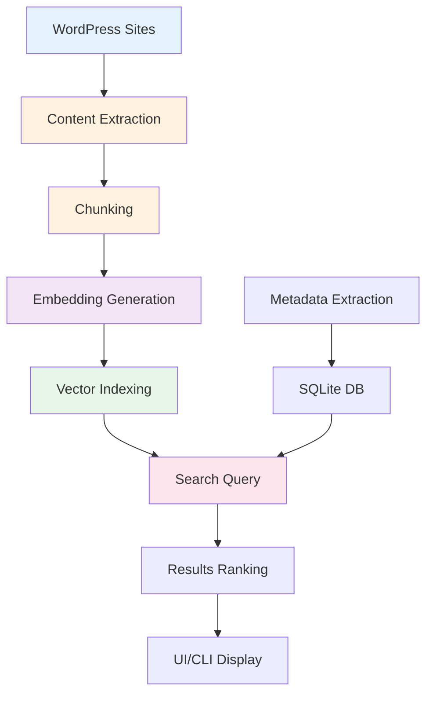
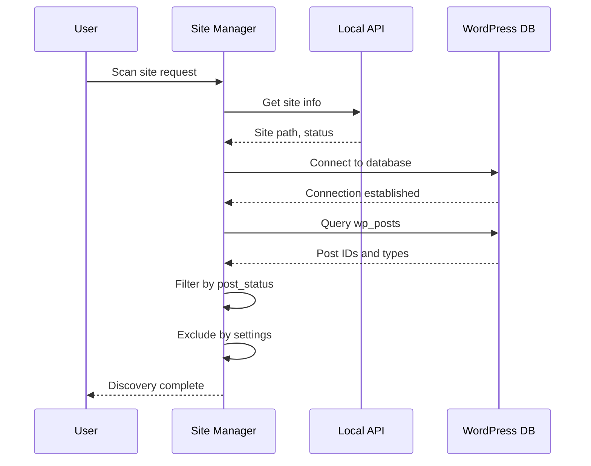
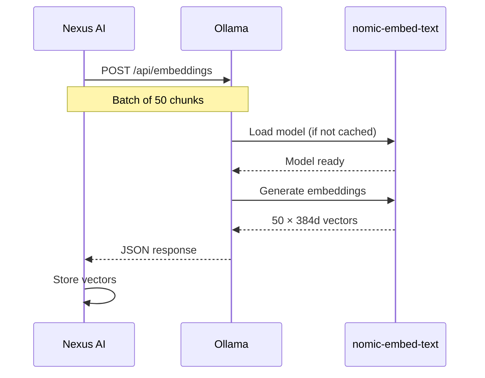
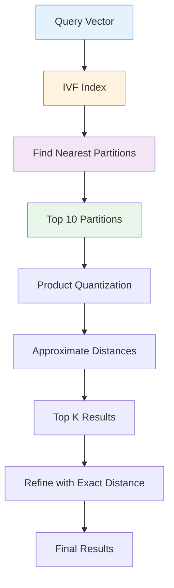
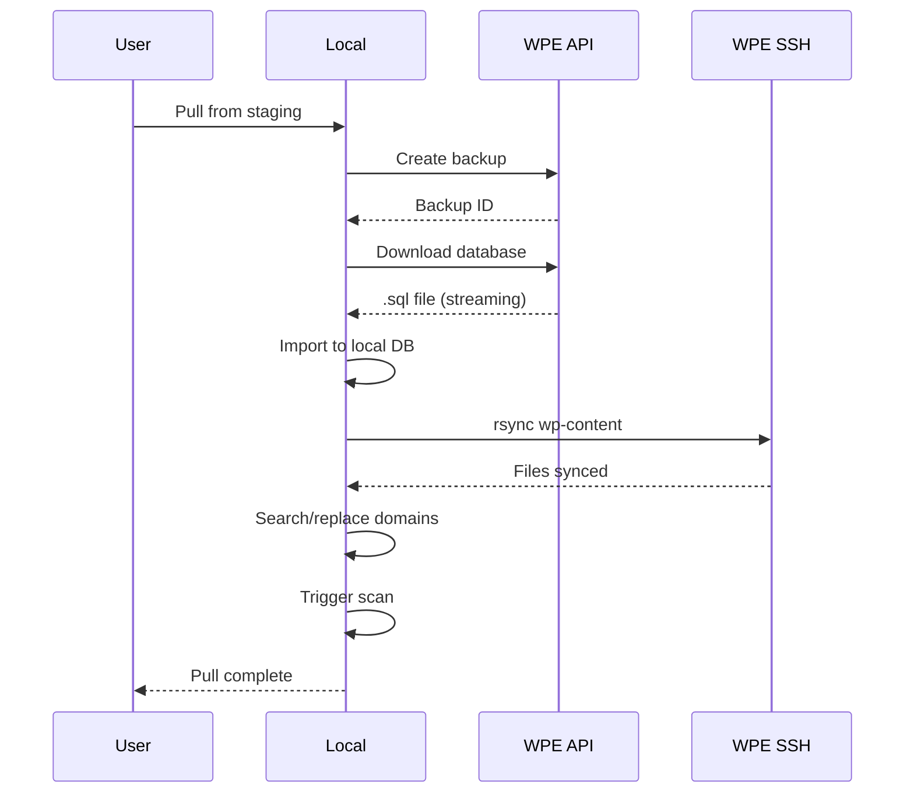
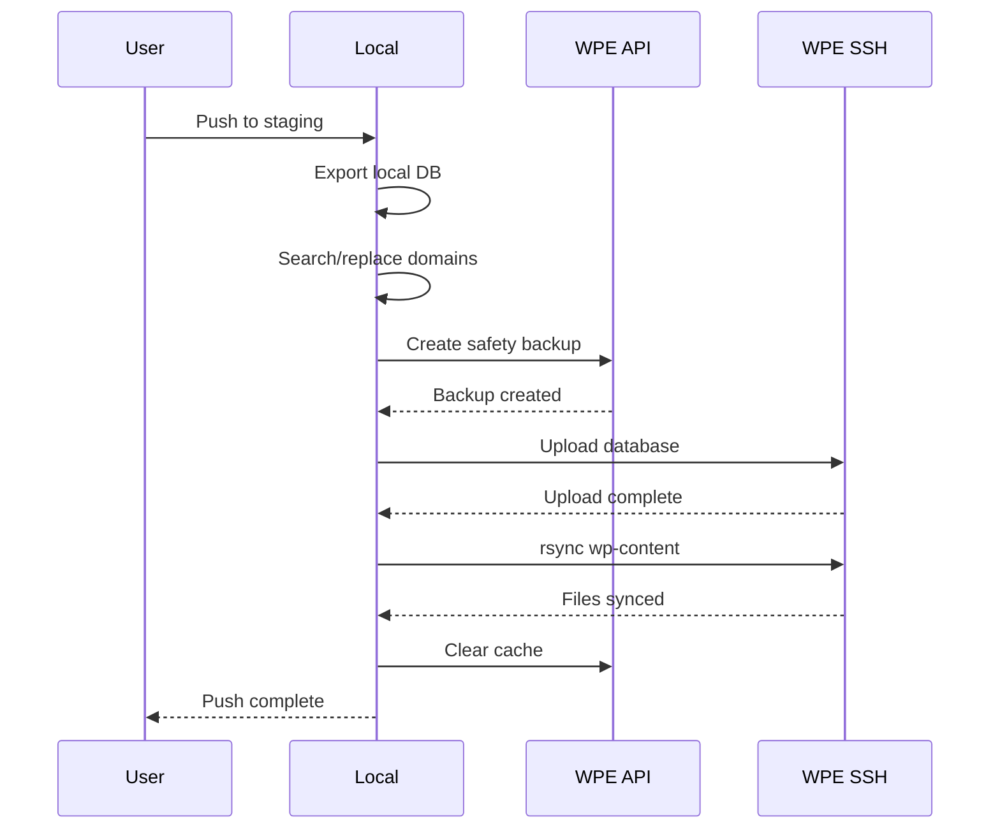
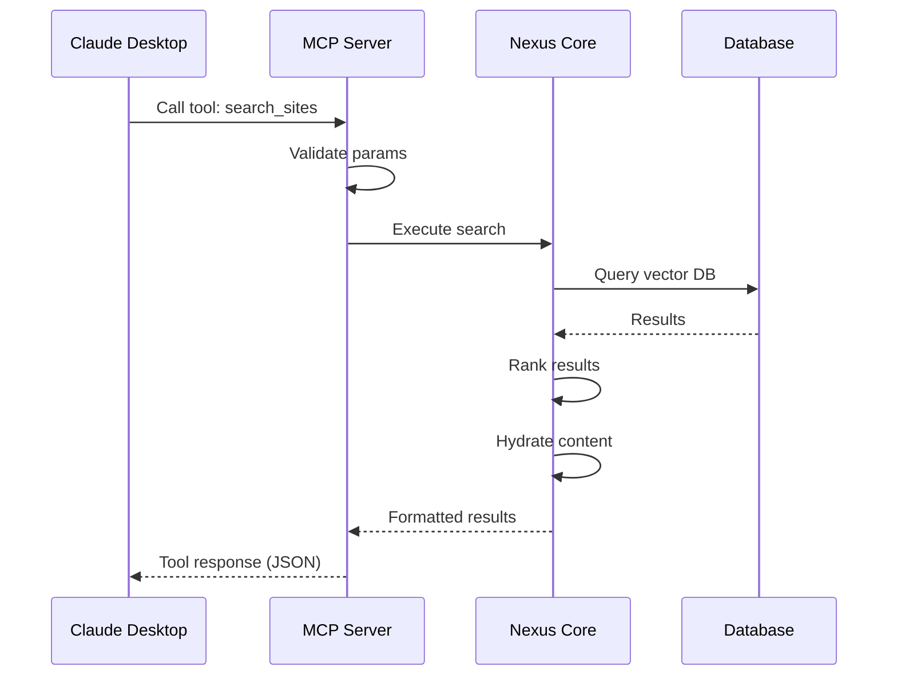

# Data Flow

Understand how data flows through Nexus AI from WordPress sites to search results.

## Overview

Nexus AI processes data through **multiple interconnected pipelines** that extract, transform, index, and serve WordPress content for AI-powered search and management.



**Key Pipelines:**

1. **Scanning Pipeline** - Extract content from WordPress sites
2. **Indexing Pipeline** - Generate embeddings and build vector index
3. **Search Pipeline** - Query vectors and rank results
4. **WPE Sync Pipeline** - Pull/push between Local and WP Engine
5. **MCP Pipeline** - Serve tools to AI clients

## Scanning Pipeline

### Phase 1: Content Discovery

**Identify what to index:**



**SQL queries executed:**

```sql
-- 1. Count total posts
SELECT COUNT(*) FROM wp_posts
WHERE post_status = 'publish'
AND post_type IN ('post', 'page', 'product');

-- 2. Get post IDs in batches
SELECT ID, post_type, post_title, post_date
FROM wp_posts
WHERE post_status = 'publish'
ORDER BY post_date DESC
LIMIT 100 OFFSET 0;

-- 3. Get post meta
SELECT meta_key, meta_value
FROM wp_postmeta
WHERE post_id = ?;

-- 4. Get taxonomies
SELECT t.name, tt.taxonomy
FROM wp_term_relationships tr
JOIN wp_term_taxonomy tt ON tr.term_taxonomy_id = tt.term_taxonomy_id
JOIN wp_terms t ON tt.term_id = t.term_id
WHERE tr.object_id = ?;
```

**Discovery output:**

```typescript
{
  siteId: 'abc123',
  totalPosts: 1247,
  postTypes: {
    post: 842,
    page: 124,
    product: 281
  },
  estimatedChunks: 6235,
  estimatedTime: '45 seconds'
}
```

### Phase 2: Content Extraction

**Read content from database:**

```typescript
// Batch extraction (100 posts at a time)
for (let offset = 0; offset < totalPosts; offset += 100) {
  const posts = await db.query(`
    SELECT
      ID,
      post_title,
      post_content,
      post_excerpt,
      post_type,
      post_date
    FROM wp_posts
    WHERE post_status = 'publish'
    LIMIT 100 OFFSET ${offset}
  `);

  // Extract metadata
  for (const post of posts) {
    const meta = await extractPostMeta(post.ID);
    const taxonomies = await extractTaxonomies(post.ID);
    const acfFields = await extractACFFields(post.ID);

    yield {
      ...post,
      meta,
      taxonomies,
      acf: acfFields
    };
  }
}
```

**WooCommerce product extraction:**

```typescript
async function extractProduct(postId: number) {
  // Base post data
  const post = await getPost(postId);

  // Product-specific meta
  const productMeta = await db.query(`
    SELECT meta_key, meta_value
    FROM wp_postmeta
    WHERE post_id = ${postId}
    AND meta_key IN (
      '_price', '_regular_price', '_sale_price',
      '_sku', '_stock', '_stock_status'
    )
  `);

  // Product categories
  const categories = await db.query(`
    SELECT t.name
    FROM wp_term_relationships tr
    JOIN wp_term_taxonomy tt ON tr.term_taxonomy_id = tt.term_taxonomy_id
    JOIN wp_terms t ON tt.term_id = t.term_id
    WHERE tr.object_id = ${postId}
    AND tt.taxonomy = 'product_cat'
  `);

  return {
    ...post,
    price: productMeta._price,
    sku: productMeta._sku,
    stock: productMeta._stock,
    categories: categories.map(c => c.name)
  };
}
```

**ACF field extraction:**

```typescript
async function extractACFFields(postId: number) {
  const fields = {};

  // Get all ACF fields for post
  const meta = await db.query(`
    SELECT meta_key, meta_value
    FROM wp_postmeta
    WHERE post_id = ${postId}
    AND meta_key NOT LIKE '\\_%'  -- Exclude internal meta
  `);

  // Check if sensitive field (skip if configured)
  for (const { meta_key, meta_value } of meta) {
    if (!isSensitiveField(meta_key)) {
      fields[meta_key] = meta_value;
    }
  }

  return fields;
}

function isSensitiveField(key: string): boolean {
  const sensitivePatterns = [
    /password/i,
    /secret/i,
    /api_key/i,
    /token/i,
    /credit_card/i
  ];
  return sensitivePatterns.some(pattern => pattern.test(key));
}
```

### Phase 3: Content Transformation

**Clean and prepare content:**

```typescript
function transformContent(post: RawPost): CleanContent {
  // 1. Strip HTML tags
  const text = stripHTML(post.post_content);

  // 2. Remove shortcodes
  const noShortcodes = removeShortcodes(text);

  // 3. Normalize whitespace
  const normalized = noShortcodes
    .replace(/\s+/g, ' ')
    .trim();

  // 4. Remove sensitive data patterns
  const cleaned = removeSensitivePatterns(normalized);

  // 5. Build searchable text
  const searchableText = [
    post.post_title,
    post.post_excerpt,
    cleaned,
    post.taxonomies?.map(t => t.name).join(' '),
    Object.values(post.acf || {}).join(' ')
  ].filter(Boolean).join('\n\n');

  return {
    id: post.ID,
    type: post.post_type,
    title: post.post_title,
    content: searchableText,
    metadata: {
      date: post.post_date,
      categories: post.taxonomies,
      acf: post.acf,
      ...extractProductMeta(post)
    }
  };
}
```

## Indexing Pipeline

### Phase 1: Chunking

**Split content into embeddable chunks:**

```typescript
function chunkContent(content: CleanContent): Chunk[] {
  const chunks: Chunk[] = [];
  const maxChunkSize = 500; // characters
  const overlap = 50; // character overlap

  // Split by paragraphs first
  const paragraphs = content.content.split(/\n\n+/);

  let currentChunk = '';
  let chunkIndex = 0;

  for (const paragraph of paragraphs) {
    // If adding paragraph exceeds max size
    if (currentChunk.length + paragraph.length > maxChunkSize) {
      // Save current chunk
      if (currentChunk.length > 0) {
        chunks.push({
          id: `${content.id}-${chunkIndex}`,
          siteId: content.siteId,
          postId: content.id,
          postType: content.type,
          text: currentChunk,
          metadata: content.metadata,
          index: chunkIndex
        });
        chunkIndex++;

        // Start new chunk with overlap
        const words = currentChunk.split(' ');
        const overlapWords = words.slice(-Math.ceil(overlap / 5));
        currentChunk = overlapWords.join(' ') + ' ';
      }
    }

    currentChunk += paragraph + '\n\n';
  }

  // Add final chunk
  if (currentChunk.length > 0) {
    chunks.push({
      id: `${content.id}-${chunkIndex}`,
      siteId: content.siteId,
      postId: content.id,
      postType: content.type,
      text: currentChunk.trim(),
      metadata: content.metadata,
      index: chunkIndex
    });
  }

  return chunks;
}
```

**Chunking strategy visualization:**

```
Original Content (2,400 chars):
┌─────────────────────────────────────────┐
│ Title: WooCommerce Setup Guide         │
│                                         │
│ Paragraph 1 (400 chars)                │
│ Paragraph 2 (500 chars)                │
│ Paragraph 3 (600 chars)                │
│ Paragraph 4 (450 chars)                │
│ Paragraph 5 (450 chars)                │
└─────────────────────────────────────────┘

Chunks (500 char max, 50 char overlap):
┌─────────────────────────────────────────┐
│ Chunk 0:                                │
│ ├─ Title + Paragraph 1 (400 chars)     │
│ └─ Overlap: last 50 chars              │
├─────────────────────────────────────────┤
│ Chunk 1:                                │
│ ├─ Overlap + Paragraph 2 (500 chars)   │
│ └─ Overlap: last 50 chars              │
├─────────────────────────────────────────┤
│ Chunk 2:                                │
│ ├─ Overlap + Paragraph 3 (500 chars)   │
│ └─ Overlap: last 50 chars              │
├─────────────────────────────────────────┤
│ Chunk 3:                                │
│ ├─ Overlap + Paragraph 4 (450 chars)   │
│ └─ Overlap: last 50 chars              │
├─────────────────────────────────────────┤
│ Chunk 4:                                │
│ └─ Overlap + Paragraph 5 (450 chars)   │
└─────────────────────────────────────────┘
```

### Phase 2: Embedding Generation

**Generate vectors via Ollama:**

```typescript
async function generateEmbeddings(chunks: Chunk[]): Promise<Embedding[]> {
  const batchSize = 50; // Ollama batch limit
  const embeddings: Embedding[] = [];

  for (let i = 0; i < chunks.length; i += batchSize) {
    const batch = chunks.slice(i, i + batchSize);

    // Batch request to Ollama
    const response = await fetch('http://localhost:11434/api/embeddings', {
      method: 'POST',
      headers: { 'Content-Type': 'application/json' },
      body: JSON.stringify({
        model: 'nomic-embed-text',
        prompt: batch.map(c => c.text)
      })
    });

    const { embeddings: vectors } = await response.json();

    // Combine chunks with vectors
    for (let j = 0; j < batch.length; j++) {
      embeddings.push({
        chunkId: batch[j].id,
        vector: vectors[j], // 384-dimensional array
        metadata: {
          siteId: batch[j].siteId,
          postId: batch[j].postId,
          postType: batch[j].postType,
          chunkIndex: batch[j].index
        }
      });
    }

    // Progress update
    emitProgress({
      phase: 'embedding',
      current: Math.min(i + batchSize, chunks.length),
      total: chunks.length
    });
  }

  return embeddings;
}
```

**Ollama API flow:**



### Phase 3: Vector Storage

**Insert into LanceDB:**

```typescript
async function indexEmbeddings(embeddings: Embedding[]) {
  const db = await lancedb.connect('~/.nexus-ai/vector-index.db');
  const table = await db.openTable('embeddings');

  // Prepare records for batch insert
  const records = embeddings.map(emb => ({
    chunk_id: emb.chunkId,
    vector: emb.vector, // 384d Float32Array
    site_id: emb.metadata.siteId,
    post_id: emb.metadata.postId,
    post_type: emb.metadata.postType,
    chunk_index: emb.metadata.chunkIndex,
    indexed_at: new Date().toISOString()
  }));

  // Batch insert (1000 at a time)
  const batchSize = 1000;
  for (let i = 0; i < records.length; i += batchSize) {
    const batch = records.slice(i, i + batchSize);
    await table.add(batch);
  }

  // Create ANN index for fast search
  await table.createIndex({
    column: 'vector',
    type: 'IVF_PQ',
    num_partitions: 256,
    num_sub_vectors: 96
  });
}
```

**Database schema:**

```sql
-- LanceDB schema (Arrow format)
CREATE TABLE embeddings (
  chunk_id VARCHAR PRIMARY KEY,
  vector FLOAT[384],            -- Embedding vector
  site_id VARCHAR,
  post_id INTEGER,
  post_type VARCHAR,
  chunk_index INTEGER,
  indexed_at TIMESTAMP,

  -- Indexes
  INDEX idx_site (site_id),
  INDEX idx_post (post_id),
  VECTOR INDEX ivf_pq ON vector  -- ANN index
);
```

### Phase 4: Metadata Storage

**Store in SQLite for fast filtering:**

```typescript
async function storeMetadata(content: CleanContent) {
  await db.run(`
    INSERT INTO indexed_content (
      site_id,
      post_id,
      post_type,
      title,
      excerpt,
      word_count,
      chunk_count,
      indexed_at
    ) VALUES (?, ?, ?, ?, ?, ?, ?, ?)
  `, [
    content.siteId,
    content.id,
    content.type,
    content.title,
    content.excerpt,
    content.content.split(' ').length,
    content.chunks.length,
    new Date().toISOString()
  ]);

  // Store categories
  for (const category of content.metadata.categories || []) {
    await db.run(`
      INSERT INTO content_categories (post_id, category_name)
      VALUES (?, ?)
    `, [content.id, category.name]);
  }

  // Store ACF fields (searchable)
  for (const [key, value] of Object.entries(content.metadata.acf || {})) {
    await db.run(`
      INSERT INTO acf_fields (post_id, field_key, field_value)
      VALUES (?, ?, ?)
    `, [content.id, key, String(value)]);
  }
}
```

## Search Pipeline

### Phase 1: Query Processing

**User query to vector:**

```typescript
async function processSearchQuery(query: string): Promise<SearchRequest> {
  // 1. Clean query
  const cleanQuery = query.trim().toLowerCase();

  // 2. Generate query vector
  const response = await fetch('http://localhost:11434/api/embeddings', {
    method: 'POST',
    headers: { 'Content-Type': 'application/json' },
    body: JSON.stringify({
      model: 'nomic-embed-text',
      prompt: cleanQuery
    })
  });

  const { embedding } = await response.json();

  return {
    query: cleanQuery,
    vector: embedding, // 384d array
    filters: parseFilters(query),
    limit: 50
  };
}
```

### Phase 2: Vector Search

**Query LanceDB with ANN:**

```typescript
async function vectorSearch(request: SearchRequest): Promise<SearchResult[]> {
  const db = await lancedb.connect('~/.nexus-ai/vector-index.db');
  const table = await db.openTable('embeddings');

  // Vector similarity search
  let query = table
    .search(request.vector)
    .limit(request.limit)
    .distanceType('cosine'); // Cosine similarity

  // Apply filters if provided
  if (request.filters.siteId) {
    query = query.where(`site_id = '${request.filters.siteId}'`);
  }
  if (request.filters.postType) {
    query = query.where(`post_type = '${request.filters.postType}'`);
  }

  const results = await query.toArray();

  return results.map(r => ({
    chunkId: r.chunk_id,
    siteId: r.site_id,
    postId: r.post_id,
    score: 1 - r._distance, // Convert distance to similarity
    metadata: {
      postType: r.post_type,
      chunkIndex: r.chunk_index
    }
  }));
}
```

**ANN algorithm:**



### Phase 3: Result Ranking

**Score and rank results:**

```typescript
function rankResults(results: SearchResult[]): RankedResult[] {
  // 1. Group by post
  const byPost = new Map<number, SearchResult[]>();
  for (const result of results) {
    if (!byPost.has(result.postId)) {
      byPost.set(result.postId, []);
    }
    byPost.get(result.postId)!.push(result);
  }

  // 2. Calculate post scores
  const rankedPosts = Array.from(byPost.entries()).map(([postId, chunks]) => {
    // Use best chunk score for post
    const bestScore = Math.max(...chunks.map(c => c.score));

    // Boost if multiple chunks match
    const chunkBoost = Math.log(chunks.length + 1) * 0.1;

    // Final score
    const finalScore = Math.min(bestScore + chunkBoost, 1.0);

    return {
      postId,
      score: finalScore,
      matchingChunks: chunks.length,
      bestChunk: chunks.find(c => c.score === bestScore)!
    };
  });

  // 3. Sort by score descending
  rankedPosts.sort((a, b) => b.score - a.score);

  return rankedPosts;
}
```

### Phase 4: Content Hydration

**Fetch full content from SQLite:**

```typescript
async function hydrateResults(rankedResults: RankedResult[]): Promise<FullResult[]> {
  const fullResults: FullResult[] = [];

  for (const result of rankedResults) {
    // Get post details
    const post = await db.get(`
      SELECT
        site_id,
        post_id,
        post_type,
        title,
        excerpt,
        indexed_at
      FROM indexed_content
      WHERE post_id = ?
    `, [result.postId]);

    // Get matching chunk text
    const chunk = await db.get(`
      SELECT text
      FROM chunks
      WHERE chunk_id = ?
    `, [result.bestChunk.chunkId]);

    // Get site info
    const site = await db.get(`
      SELECT name, domain
      FROM sites
      WHERE site_id = ?
    `, [post.site_id]);

    fullResults.push({
      ...result,
      site: {
        id: site.site_id,
        name: site.name,
        domain: site.domain
      },
      post: {
        id: post.post_id,
        type: post.post_type,
        title: post.title,
        excerpt: post.excerpt
      },
      snippet: generateSnippet(chunk.text, result.score)
    });
  }

  return fullResults;
}
```

## WPE Sync Pipeline

### Pull Flow



**Implementation:**

```typescript
async function pullFromWPE(params: PullParams) {
  const { installName, includeDatabase, includeFiles } = params;

  // 1. Create safety backup on WPE
  const backup = await wpeClient.createBackup(installName);

  // 2. Download database
  if (includeDatabase) {
    const dbStream = await wpeClient.downloadDatabase(installName);
    await importDatabase(dbStream, params.localSiteId);

    // Search/replace domains
    await searchReplace({
      siteId: params.localSiteId,
      from: params.remoteDomain,
      to: params.localDomain
    });
  }

  // 3. Sync files
  if (includeFiles) {
    await syncFiles({
      from: `${installName}:/wp-content`,
      to: params.localSitePath + '/wp-content',
      method: 'rsync'
    });
  }

  // 4. Re-scan site
  await scanSite(params.localSiteId);

  return { success: true };
}
```

### Push Flow



## MCP Pipeline

### Tool Request Flow



**Implementation:**

```typescript
// MCP server tool handler
server.setRequestHandler(CallToolRequestSchema, async (request) => {
  const { name, arguments: args } = request.params;

  switch (name) {
    case 'search_sites':
      const results = await searchSites(args);
      return {
        content: [{
          type: 'text',
          text: formatSearchResults(results)
        }]
      };

    case 'wp_plugin_list':
      const plugins = await wpPluginList(args);
      return {
        content: [{
          type: 'text',
          text: JSON.stringify(plugins, null, 2)
        }]
      };

    default:
      throw new Error(`Unknown tool: ${name}`);
  }
});
```

## Performance Characteristics

### Scanning Performance

| Site Size | Content | Time | Throughput |
|-----------|---------|------|------------|
| Small | 50 posts | 5s | 10 posts/s |
| Medium | 500 posts | 45s | 11 posts/s |
| Large | 2,000 posts | 3m | 11 posts/s |
| Huge | 10,000 posts | 15m | 11 posts/s |

**Bottlenecks:**

- Database queries: 40%
- Embedding generation: 45%
- Vector indexing: 10%
- Metadata storage: 5%

### Search Performance

| Index Size | Query Time | P95 | P99 |
|-----------|-----------|-----|-----|
| 1K chunks | 20ms | 35ms | 50ms |
| 10K chunks | 45ms | 80ms | 120ms |
| 100K chunks | 150ms | 280ms | 450ms |
| 1M chunks | 800ms | 1.2s | 2s |

**Optimizations:**

- ANN index reduces search from O(n) to O(log n)
- Product quantization reduces memory 4×
- IVF partitioning speeds up search 10×

## Next Steps

- **[Vector Database](vector-database.md)** - LanceDB deep dive
- **[MCP Protocol](mcp-protocol.md)** - MCP implementation details
- **[Shared Core](shared-core.md)** - Reusable business logic
- **[UI Architecture](ui-architecture.md)** - Component structure
- **[Performance Benchmarks](../reference/performance-benchmarks.md)** - Detailed metrics
