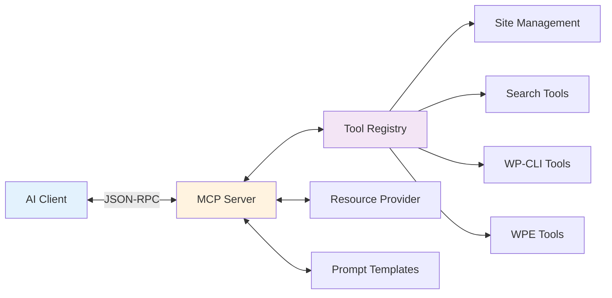

# MCP Protocol Implementation

Deep dive into Nexus AI's Model Context Protocol server implementation.

## Overview

Nexus AI implements the **Model Context Protocol (MCP)** to expose WordPress management capabilities to AI assistants like Claude, Cursor, and other MCP-compatible clients.



**MCP Capabilities:**

- **Tools** - Executable functions AI can call
- **Resources** - Static data AI can read
- **Prompts** - Pre-built prompt templates
- **Sampling** - LLM completion requests (optional)

## Protocol Basics

### Transport Layer

**Nexus AI uses stdio transport:**

```typescript
import { Server } from '@modelcontextprotocol/sdk/server/index.js';
import { StdioServerTransport } from '@modelcontextprotocol/sdk/server/stdio.js';

// Create MCP server
const server = new Server(
  {
    name: 'nexus-ai',
    version: '1.0.0'
  },
  {
    capabilities: {
      tools: {},           // Exposes callable tools
      resources: {},       // Exposes readable resources
      prompts: {}          // Exposes prompt templates
    }
  }
);

// Create stdio transport
const transport = new StdioServerTransport();

// Connect server to transport
await server.connect(transport);

console.error('Nexus AI MCP server running on stdio');
```

**Why stdio?**

- ✅ Simple - No network configuration needed
- ✅ Secure - Process isolation, no exposed ports
- ✅ Standard - Works with all MCP clients
- ✅ Cross-platform - macOS, Windows, Linux

### Message Format

**JSON-RPC 2.0 over stdio:**

```json
// Request (from AI client)
{
  "jsonrpc": "2.0",
  "id": 1,
  "method": "tools/call",
  "params": {
    "name": "search_sites",
    "arguments": {
      "query": "WooCommerce stores",
      "limit": 10
    }
  }
}

// Response (from Nexus AI)
{
  "jsonrpc": "2.0",
  "id": 1,
  "result": {
    "content": [
      {
        "type": "text",
        "text": "Found 7 WooCommerce stores:\n- store1.local\n..."
      }
    ]
  }
}

// Error response
{
  "jsonrpc": "2.0",
  "id": 1,
  "error": {
    "code": -32602,
    "message": "Invalid params: query is required"
  }
}
```

## Tool Definitions

### Tool Schema

**Each tool has a JSON Schema:**

```typescript
const searchSitesTool = {
  name: 'search_sites',
  description: 'Search WordPress sites using semantic or keyword search',
  inputSchema: {
    type: 'object',
    properties: {
      query: {
        type: 'string',
        description: 'Search query (natural language or keywords)'
      },
      limit: {
        type: 'number',
        description: 'Maximum results to return',
        default: 50
      },
      filters: {
        type: 'object',
        properties: {
          siteId: { type: 'string' },
          postType: { type: 'string' },
          minScore: { type: 'number' }
        }
      }
    },
    required: ['query']
  }
};
```

### Tool Categories

**Nexus AI provides 40+ tools in 5 categories:**

```typescript
const tools = [
  // 1. Site Discovery & Search (8 tools)
  'nexus_list_sites',
  'search_sites',
  'get_site_info',
  'find_sites_by_plugin',
  'find_sites_by_theme',
  'get_site_health',
  'get_site_stats',
  'compare_sites',

  // 2. Content Management (12 tools)
  'wp_plugin_list',
  'wp_plugin_install',
  'wp_plugin_activate',
  'wp_plugin_deactivate',
  'wp_plugin_update',
  'wp_theme_list',
  'wp_core_version',
  'wp_user_list',
  'wp_option_get',
  'wp_db_export',
  'wp_search_replace',
  'wp_site_health',

  // 3. WP Engine Operations (10 tools)
  'wpe_list_accounts',
  'wpe_list_sites',
  'wpe_list_installs',
  'wpe_pull_site',
  'wpe_push_site',
  'wpe_create_backup',
  'wpe_list_domains',
  'wpe_get_ssl_status',
  'wpe_get_usage',
  'wpe_promote_to_production',

  // 4. Bulk Operations (5 tools)
  'bulk_scan_sites',
  'bulk_update_plugins',
  'bulk_update_wordpress',
  'bulk_backup_sites',
  'bulk_wp_cli',

  // 5. AI & Analysis (5 tools)
  'ai_site_recommendation',
  'ai_plugin_audit',
  'ai_security_scan',
  'ai_performance_analysis',
  'ai_content_summary'
];
```

### Tool Implementation

**Registering a tool:**

```typescript
import { CallToolRequestSchema } from '@modelcontextprotocol/sdk/types.js';

// List all available tools
server.setRequestHandler(ListToolsRequestSchema, async () => {
  return {
    tools: [
      {
        name: 'search_sites',
        description: 'Search WordPress sites using semantic search',
        inputSchema: {
          type: 'object',
          properties: {
            query: { type: 'string' },
            limit: { type: 'number', default: 50 }
          },
          required: ['query']
        }
      },
      // ... more tools
    ]
  };
});

// Handle tool calls
server.setRequestHandler(CallToolRequestSchema, async (request) => {
  const { name, arguments: args } = request.params;

  switch (name) {
    case 'search_sites':
      return await handleSearchSites(args);

    case 'wp_plugin_list':
      return await handlePluginList(args);

    default:
      throw new Error(`Unknown tool: ${name}`);
  }
});
```

**Tool handler example:**

```typescript
async function handleSearchSites(args: {
  query: string;
  limit?: number;
  filters?: object;
}) {
  // Validate input
  if (!args.query || args.query.trim().length === 0) {
    throw new Error('query parameter is required');
  }

  // Execute search
  const results = await vectorSearch({
    query: args.query,
    limit: args.limit || 50,
    filters: args.filters || {}
  });

  // Format results for AI
  const formattedResults = results.map(r => ({
    site: r.site.name,
    domain: r.site.domain,
    score: Math.round(r.score * 100),
    snippet: r.snippet
  }));

  // Return as text content
  return {
    content: [
      {
        type: 'text',
        text: JSON.stringify(formattedResults, null, 2)
      }
    ]
  };
}
```

## Resource Provider

### Resource Schema

**Resources are read-only data:**

```typescript
const resources = [
  {
    uri: 'nexus://sites/list',
    name: 'All WordPress Sites',
    description: 'Complete list of all Local sites',
    mimeType: 'application/json'
  },
  {
    uri: 'nexus://sites/{siteId}/stats',
    name: 'Site Statistics',
    description: 'Statistics for a specific site',
    mimeType: 'application/json'
  },
  {
    uri: 'nexus://wpe/accounts',
    name: 'WP Engine Accounts',
    description: 'Connected WP Engine accounts',
    mimeType: 'application/json'
  }
];
```

### Resource Implementation

```typescript
import {
  ListResourcesRequestSchema,
  ReadResourceRequestSchema
} from '@modelcontextprotocol/sdk/types.js';

// List available resources
server.setRequestHandler(ListResourcesRequestSchema, async () => {
  return {
    resources: [
      {
        uri: 'nexus://sites/list',
        name: 'WordPress Sites',
        description: 'All Local sites with metadata',
        mimeType: 'application/json'
      },
      {
        uri: 'nexus://wpe/accounts',
        name: 'WP Engine Accounts',
        mimeType: 'application/json'
      }
    ]
  };
});

// Read resource content
server.setRequestHandler(ReadResourceRequestSchema, async (request) => {
  const { uri } = request.params;

  switch (uri) {
    case 'nexus://sites/list':
      const sites = await listAllSites();
      return {
        contents: [
          {
            uri,
            mimeType: 'application/json',
            text: JSON.stringify(sites, null, 2)
          }
        ]
      };

    case 'nexus://wpe/accounts':
      const accounts = await getWPEAccounts();
      return {
        contents: [
          {
            uri,
            mimeType: 'application/json',
            text: JSON.stringify(accounts, null, 2)
          }
        ]
      };

    default:
      throw new Error(`Unknown resource: ${uri}`);
  }
});
```

## Prompt Templates

### Template Definition

**Pre-built prompts AI can use:**

```typescript
const prompts = [
  {
    name: 'site-audit',
    description: 'Audit a WordPress site for issues',
    arguments: [
      {
        name: 'siteId',
        description: 'Site ID to audit',
        required: true
      }
    ]
  },
  {
    name: 'security-check',
    description: 'Security assessment across all sites',
    arguments: []
  }
];
```

### Template Implementation

```typescript
import {
  ListPromptsRequestSchema,
  GetPromptRequestSchema
} from '@modelcontextprotocol/sdk/types.js';

// List prompts
server.setRequestHandler(ListPromptsRequestSchema, async () => {
  return {
    prompts: [
      {
        name: 'site-audit',
        description: 'Comprehensive site audit',
        arguments: [
          {
            name: 'siteId',
            description: 'Site ID',
            required: true
          }
        ]
      }
    ]
  };
});

// Get prompt content
server.setRequestHandler(GetPromptRequestSchema, async (request) => {
  const { name, arguments: args } = request.params;

  switch (name) {
    case 'site-audit':
      const siteId = args?.siteId;
      if (!siteId) throw new Error('siteId is required');

      const site = await getSiteInfo(siteId);
      const plugins = await getPlugins(siteId);
      const health = await getSiteHealth(siteId);

      return {
        messages: [
          {
            role: 'user',
            content: {
              type: 'text',
              text: `Perform a comprehensive audit of ${site.name}:

Site Details:
- WordPress: ${site.wpVersion}
- Plugins: ${plugins.length} installed
- Health Score: ${health.score}/100

Please analyze:
1. Security vulnerabilities
2. Performance issues
3. Update requirements
4. Configuration problems

Provide prioritized recommendations.`
            }
          }
        ]
      };

    default:
      throw new Error(`Unknown prompt: ${name}`);
  }
});
```

## Error Handling

### Standard Error Codes

**JSON-RPC 2.0 error codes:**

| Code | Name | Description |
|------|------|-------------|
| -32700 | Parse error | Invalid JSON |
| -32600 | Invalid Request | Invalid JSON-RPC |
| -32601 | Method not found | Unknown method |
| -32602 | Invalid params | Invalid parameters |
| -32603 | Internal error | Server error |
| -32000 | Server error | Custom errors |

### Error Response Format

```typescript
function createError(code: number, message: string, data?: any) {
  return {
    error: {
      code,
      message,
      data
    }
  };
}

// Usage
try {
  const result = await searchSites(args);
  return { result };
} catch (error) {
  if (error.code === 'SITE_NOT_FOUND') {
    return createError(-32602, 'Invalid params: site not found', {
      siteId: args.siteId,
      availableSites: await listSites()
    });
  }

  return createError(-32603, 'Internal error', {
    message: error.message,
    stack: error.stack
  });
}
```

### Validation

**Input validation with Zod:**

```typescript
import { z } from 'zod';

const SearchSitesSchema = z.object({
  query: z.string().min(1, 'Query cannot be empty'),
  limit: z.number().int().min(1).max(100).default(50),
  filters: z.object({
    siteId: z.string().optional(),
    postType: z.string().optional(),
    minScore: z.number().min(0).max(1).optional()
  }).optional()
});

async function handleSearchSites(args: unknown) {
  // Validate input
  const params = SearchSitesSchema.parse(args);

  // Execute search with validated params
  return await searchSites(params);
}
```

## Lifecycle Management

### Server Startup

```typescript
async function startMCPServer() {
  const server = new Server({
    name: 'nexus-ai',
    version: '1.0.0'
  }, {
    capabilities: {
      tools: {},
      resources: {},
      prompts: {}
    }
  });

  // Register handlers
  registerToolHandlers(server);
  registerResourceHandlers(server);
  registerPromptHandlers(server);

  // Create transport
  const transport = new StdioServerTransport();

  // Connect
  await server.connect(transport);

  // Cleanup on exit
  process.on('SIGINT', async () => {
    await server.close();
    process.exit(0);
  });

  console.error('MCP server started');
}
```

### Graceful Shutdown

```typescript
class MCPServerManager {
  private server: Server;
  private activeRequests = new Set<string>();

  async shutdown() {
    console.error('Shutting down MCP server...');

    // Wait for active requests
    while (this.activeRequests.size > 0) {
      await new Promise(resolve => setTimeout(resolve, 100));
    }

    // Close database connections
    await closeDatabaseConnections();

    // Close server
    await this.server.close();

    console.error('MCP server stopped');
  }

  trackRequest(id: string) {
    this.activeRequests.add(id);
  }

  completeRequest(id: string) {
    this.activeRequests.delete(id);
  }
}
```

## Performance Optimization

### Request Caching

**Cache frequent tool calls:**

```typescript
import NodeCache from 'node-cache';

const toolCache = new NodeCache({
  stdTTL: 60, // 60 seconds
  checkperiod: 120
});

async function handlePluginList(args: { siteId: string }) {
  const cacheKey = `plugins:${args.siteId}`;

  // Check cache
  const cached = toolCache.get(cacheKey);
  if (cached) {
    return {
      content: [{
        type: 'text',
        text: JSON.stringify(cached, null, 2)
      }],
      _cached: true
    };
  }

  // Execute tool
  const plugins = await wpPluginList(args.siteId);

  // Cache result
  toolCache.set(cacheKey, plugins);

  return {
    content: [{
      type: 'text',
      text: JSON.stringify(plugins, null, 2)
    }]
  };
}
```

### Batching

**Batch multiple tool calls:**

```typescript
server.setRequestHandler(CallToolRequestSchema, async (request) => {
  const { name, arguments: args } = request.params;

  // Detect batch operations
  if (name === 'bulk_scan_sites' && Array.isArray(args.siteIds)) {
    // Execute in parallel batches
    const batchSize = 5;
    const results = [];

    for (let i = 0; i < args.siteIds.length; i += batchSize) {
      const batch = args.siteIds.slice(i, i + batchSize);
      const batchResults = await Promise.all(
        batch.map(siteId => scanSite(siteId))
      );
      results.push(...batchResults);
    }

    return {
      content: [{
        type: 'text',
        text: JSON.stringify(results, null, 2)
      }]
    };
  }

  // Single tool call
  return await handleToolCall(name, args);
});
```

### Streaming Responses

**For long-running operations:**

```typescript
import { EventEmitter } from 'events';

async function handleBulkOperation(args: {
  siteIds: string[];
  operation: string;
}) {
  const emitter = new EventEmitter();

  // Start operation in background
  (async () => {
    for (const siteId of args.siteIds) {
      const result = await performOperation(siteId, args.operation);

      // Emit progress
      emitter.emit('progress', {
        siteId,
        status: result.success ? 'complete' : 'failed',
        result
      });
    }

    emitter.emit('done');
  })();

  // Stream results
  const results = [];
  return new Promise((resolve) => {
    emitter.on('progress', (data) => {
      results.push(data);
      // Send notification to client
      server.notification({
        method: 'notifications/progress',
        params: data
      });
    });

    emitter.on('done', () => {
      resolve({
        content: [{
          type: 'text',
          text: JSON.stringify(results, null, 2)
        }]
      });
    });
  });
}
```

## Security

### Input Sanitization

**Prevent injection attacks:**

```typescript
function sanitizeInput(input: string): string {
  // Remove SQL injection patterns
  let safe = input.replace(/[';\"\\]/g, '');

  // Remove shell metacharacters
  safe = safe.replace(/[|&;`$()<>]/g, '');

  // Limit length
  safe = safe.slice(0, 1000);

  return safe.trim();
}

async function handleWPCLI(args: {
  siteId: string;
  command: string;
}) {
  // Sanitize command
  const safeCommand = sanitizeInput(args.command);

  // Whitelist allowed commands
  const allowedCommands = [
    'plugin list',
    'plugin update',
    'core version',
    'user list'
  ];

  if (!allowedCommands.some(cmd => safeCommand.startsWith(cmd))) {
    throw new Error('Command not allowed');
  }

  return await executeWPCLI(args.siteId, safeCommand);
}
```

### Rate Limiting

**Prevent abuse:**

```typescript
import { RateLimiter } from 'limiter';

const limiter = new RateLimiter({
  tokensPerInterval: 60,
  interval: 'minute'
});

server.setRequestHandler(CallToolRequestSchema, async (request) => {
  // Check rate limit
  const allowed = await limiter.removeTokens(1);
  if (!allowed) {
    throw new Error('Rate limit exceeded. Try again later.');
  }

  // Process request
  return await handleToolCall(request);
});
```

## Testing

### Unit Tests

```typescript
import { describe, it, expect } from 'vitest';

describe('MCP Tools', () => {
  it('should search sites', async () => {
    const result = await handleSearchSites({
      query: 'WooCommerce',
      limit: 10
    });

    expect(result.content).toHaveLength(1);
    expect(result.content[0].type).toBe('text');

    const data = JSON.parse(result.content[0].text);
    expect(data).toBeInstanceOf(Array);
    expect(data.length).toBeLessThanOrEqual(10);
  });

  it('should validate input', async () => {
    await expect(
      handleSearchSites({ query: '' })
    ).rejects.toThrow('Query cannot be empty');
  });
});
```

### Integration Tests

```typescript
import { Client } from '@modelcontextprotocol/sdk/client/index.js';

describe('MCP Server Integration', () => {
  let client: Client;

  beforeAll(async () => {
    // Start server
    client = await createTestClient();
  });

  it('should list tools', async () => {
    const { tools } = await client.listTools();

    expect(tools).toContainEqual(
      expect.objectContaining({
        name: 'search_sites'
      })
    );
  });

  it('should call tools', async () => {
    const result = await client.callTool({
      name: 'search_sites',
      arguments: {
        query: 'test',
        limit: 5
      }
    });

    expect(result.content).toBeDefined();
  });
});
```

## Best Practices

### Tool Design

- ✅ Use descriptive tool names (`search_sites` not `search`)
- ✅ Provide detailed descriptions
- ✅ Define clear input schemas
- ✅ Return structured data (JSON)
- ✅ Include examples in description
- ❌ Don't create tools for every function
- ❌ Don't return huge responses (> 100KB)

### Error Handling

- ✅ Use standard error codes
- ✅ Provide helpful error messages
- ✅ Include recovery suggestions
- ✅ Log errors for debugging
- ❌ Don't expose sensitive data in errors
- ❌ Don't crash on invalid input

### Performance

- ✅ Cache frequent requests
- ✅ Batch operations when possible
- ✅ Set reasonable timeouts
- ✅ Stream long-running operations
- ❌ Don't block on slow operations
- ❌ Don't hold connections indefinitely

## Next Steps

- **[Tool Reference](../reference/tool-reference.md)** - Complete tool catalog
- **[Claude Desktop](../integrations/claude-desktop.md)** - Client setup
- **[Data Flow](data-flow.md)** - System data flow
- **[Shared Core](shared-core.md)** - Business logic
- **[UI Architecture](ui-architecture.md)** - Component structure
