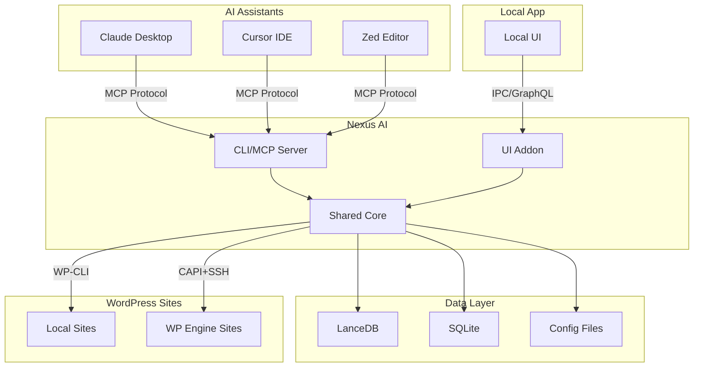
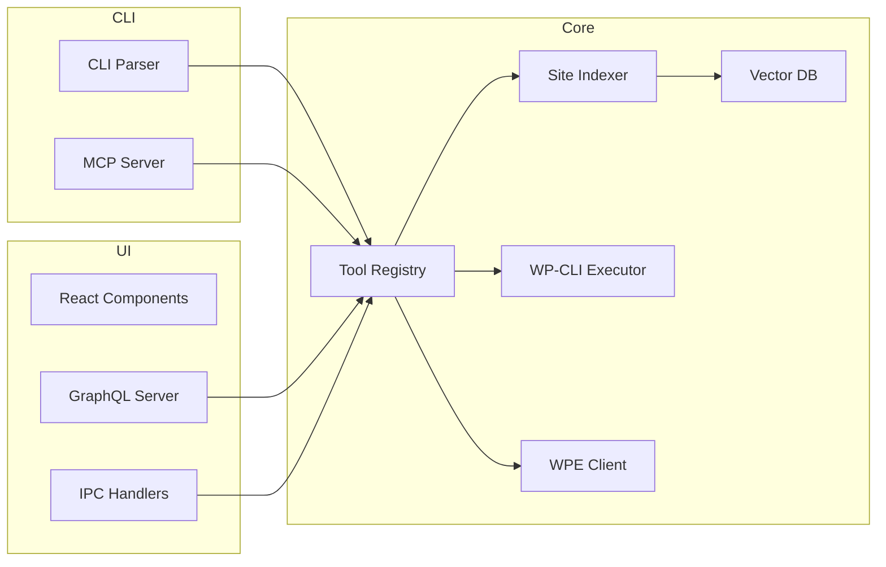
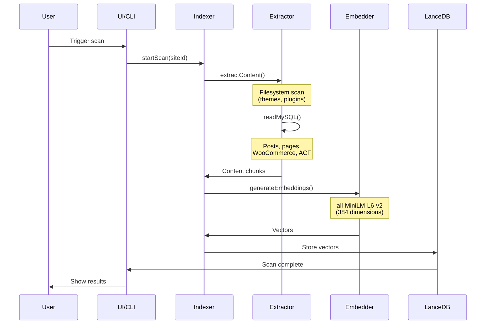
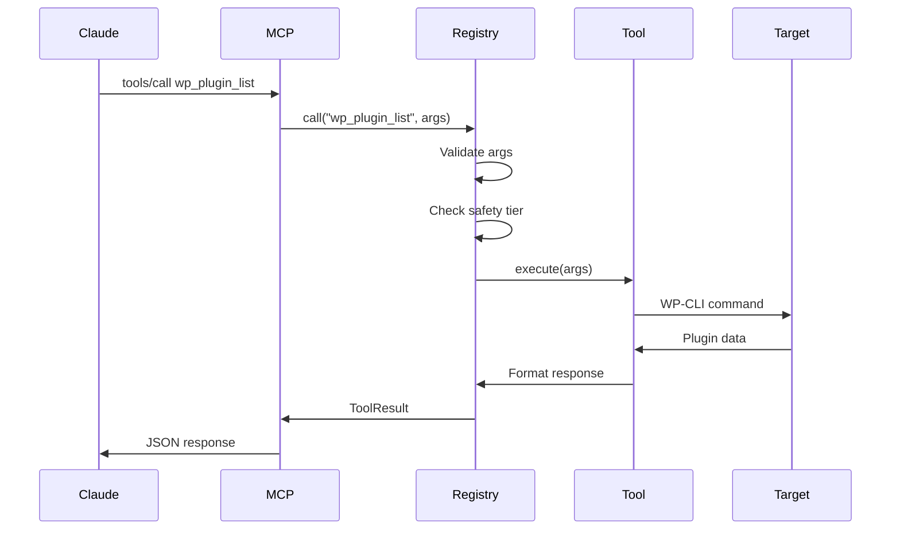
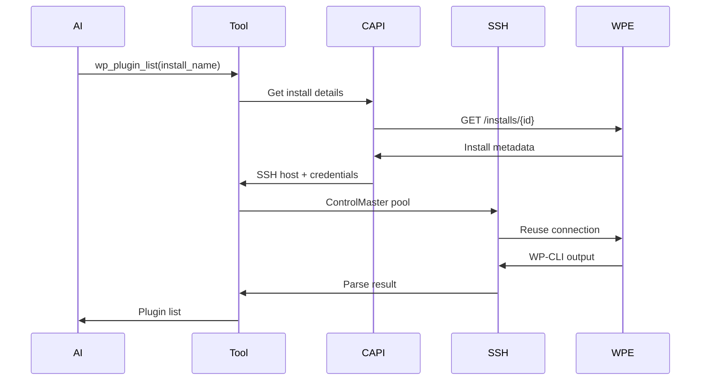
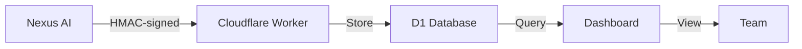

# Architecture Overview

Nexus AI is built as a **dual-interface system** with shared core functionality.

## High-Level Architecture



## Two Interfaces, One Core

### CLI/MCP Server

**Location:** `cli/`

Standalone Node.js application that can run as:
- **Interactive CLI** - Direct command execution
- **MCP Server** - Exposes tools to AI assistants via stdio

**Key Components:**
- MCP protocol handler (stdio transport)
- Tool registry (90+ tools)
- WP-CLI executor
- WPE CAPI client
- SSH connection manager

### UI Addon

**Location:** `src/`

Electron addon for Local app (renderer + main process).

**Key Components:**
- React UI components (class-based, no JSX)
- GraphQL API server
- IPC handlers
- Sidebar integration
- Fleet dashboard

### Shared Core

**Location:** `src/main/` (shared between CLI and UI)

Common functionality used by both interfaces:

- **Vector database** - LanceDB operations
- **Site indexing** - Content extraction and embedding
- **WP-CLI integration** - Command execution
- **WPE integration** - CAPI and SSH
- **Tool implementations** - Business logic
- **Telemetry** - Usage analytics

## Component Architecture



## Data Flow

### Site Indexing Pipeline



### MCP Tool Call Flow



### WPE Remote Operation



## Storage Architecture

### LanceDB (Vector Database)

```
~/Library/Application Support/nexus-ai/lancedb/
├── sites.lance/              # Site metadata table
├── content.lance/            # Indexed content vectors
├── _versions/                # Version history
└── _metadata/               # Schema metadata
```

**Schema:**

```typescript
interface ContentVector {
  // Identity
  site_id: string;           // Site identifier
  post_id: number;           // WordPress post ID
  chunk_index: number;       // Chunk number within post

  // Content
  title: string;             // Post title
  text: string;              // Chunk text
  url: string;               // Post URL

  // Embedding
  vector: number[];          // 384-dim embedding

  // Metadata
  type: string;              // post, page, product
  status: string;            // publish, draft
  date: string;              // ISO 8601
}
```

### SQLite (Index Metadata)

```
~/Library/Application Support/nexus-ai/index.db
```

**Tables:**

- `sites` - Registered sites
- `scan_history` - Indexing history
- `wpe_sites` - Synced WPE sites
- `site_links` - Local ↔ WPE mappings

### Config Files

```
~/Library/Application Support/nexus-ai/
├── config.json              # User preferences
├── telemetry/
│   └── events.jsonl         # Telemetry queue
└── wpe/
    └── auth.json            # WPE credentials
```

## Process Architecture

### CLI Mode

```
┌─────────────────┐
│   Node.js CLI   │
├─────────────────┤
│  MCP Server     │
│  (stdio)        │
├─────────────────┤
│  Tool Registry  │
├─────────────────┤
│  Shared Core    │
└─────────────────┘
```

Single Node.js process, communicates via stdio with parent (Claude Desktop).

### UI Addon Mode

```
┌──────────────────────┐
│  Local (Electron)    │
│  ┌────────────────┐  │
│  │  Main Process  │  │
│  │  - Addon Loaded│  │
│  │  - IPC Server  │  │
│  │  - GraphQL API │  │
│  ├────────────────┤  │
│  │  Renderer      │  │
│  │  - React UI    │  │
│  │  - Sidebar     │  │
│  └────────────────┘  │
└──────────────────────┘
```

Runs inside Local's Electron process. Main process handles business logic, renderer shows UI.

## Communication Patterns

### MCP Protocol (CLI)

```typescript
// Request from Claude
{
  "jsonrpc": "2.0",
  "method": "tools/call",
  "params": {
    "name": "wp_plugin_list",
    "arguments": {"site_id": "abc123"}
  },
  "id": 1
}

// Response to Claude
{
  "jsonrpc": "2.0",
  "result": {
    "content": [{"type": "text", "text": "..."}]
  },
  "id": 1
}
```

### IPC (UI Addon)

```typescript
// Renderer → Main
ipcRenderer.invoke('nexus:scan-site', {siteId: 'abc123'});

// Main → Renderer
ipcMain.handle('nexus:scan-site', async (event, {siteId}) => {
  return await siteIndexer.scan(siteId);
});
```

### GraphQL (UI Addon)

```graphql
mutation ScanSite($siteId: ID!) {
  scanSite(siteId: $siteId) {
    success
    message
    stats {
      postsIndexed
      chunksCreated
      durationMs
    }
  }
}
```

## Technology Stack

### Core Dependencies

| Component | Technology | Version | Purpose |
|-----------|-----------|---------|---------|
| **Runtime** | Node.js | 18+ | JavaScript runtime |
| **Vector DB** | LanceDB | 0.11.x | Vector storage & search |
| **Embeddings** | ONNX Runtime | 1.x | Local embedding generation |
| **Model** | all-MiniLM-L6-v2 | - | Sentence transformer |
| **Protocol** | MCP SDK | 0.5.x | Model Context Protocol |
| **UI Framework** | React | 17.x | User interface (addon) |
| **Process Mgmt** | Electron | 28.x | Desktop app framework |

### Additional Dependencies

- **better-sqlite3** - Fast SQLite access
- **ioredis** - Redis client (optional)
- **ssh2** - SSH connections for WPE
- **@wpengine/wpe-capi** - WP Engine API client
- **axios** - HTTP requests
- **ws** - WebSocket server (GraphQL subscriptions)

## Performance Characteristics

| Operation | Performance | Notes |
|-----------|------------|-------|
| **Site scan** | 2-5s (10k posts) | Parallel extraction |
| **Vector search** | <100ms | LanceDB cosine distance |
| **WP-CLI (local)** | 50-200ms | Direct execution |
| **WP-CLI (remote)** | 200ms-2s | SSH ControlMaster pooling |
| **WPE CAPI call** | 100-500ms | REST API |
| **Bulk operation** | 10x parallel | Configurable concurrency |

## Scalability

### Limits

| Resource | Limit | Notes |
|----------|-------|-------|
| **Vector DB size** | ~10 GB | ~1M posts with 384-dim vectors |
| **Sites indexed** | ~1,000 | Tested with 251 WPE sites |
| **Concurrent scans** | 10 | Configurable via env var |
| **SSH connections** | 100 | ControlMaster pooling |
| **Memory usage** | ~500 MB | Baseline with 100 indexed sites |

### Optimization Strategies

1. **SSH ControlMaster** - Reuse SSH connections for WPE
2. **Parallel execution** - 10x concurrent operations
3. **Chunking** - Split large posts at sentence boundaries
4. **Deduplication** - Post-level vector dedup
5. **Lazy loading** - Load vectors on-demand for search
6. **Connection pooling** - Reuse MySQL connections

## Security

### Authentication

- **WPE** - OAuth flow via Local's saved credentials
- **Local sites** - File system access control
- **MCP** - Stdio transport (no network exposure)

### Data Protection

- **No PII** - Never store user emails, passwords, IP addresses
- **No secrets** - API keys excluded from indexing
- **File permissions** - Config files are 0600 (user-only)
- **Telemetry** - Anonymous UUID, opt-out model

### Safety System

**3-tier protection:**

1. **Tier 1 (Safe)** - Read-only operations, no confirmation
2. **Tier 2 (Caution)** - Modifications, confirmation prompt
3. **Tier 3 (Destructive)** - Irreversible ops, requires token

## Monitoring & Telemetry



**Telemetry data:**
- Installation ID (random UUID)
- Tool usage counts
- Success/error rates
- Access method (MCP vs CLI)
- Performance metrics

**Privacy:** No user identities, site names, or WordPress content.

[Telemetry Details →]

## Next Steps

- [CLI Architecture](cli-architecture.md) - CLI/MCP server internals
- [UI Architecture](ui-architecture.md) - Addon components
- [Data Flow](data-flow.md) - Detailed indexing pipeline
- [MCP Protocol](mcp-protocol.md) - Protocol implementation
- Tool Registry - How tools are registered
