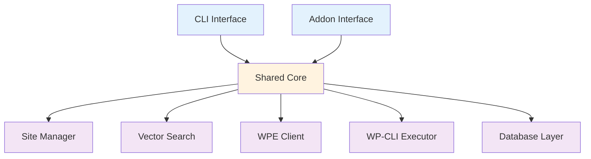

# Shared Core Architecture

How Nexus AI shares business logic between CLI and Local addon without duplication.

## Overview

Nexus AI has **two interfaces** (CLI and addon) but **one core**. All business logic lives in a shared module used by both.



**Benefits:**

- ✅ **DRY** - Write business logic once
- ✅ **Consistency** - Same behavior in CLI and UI
- ✅ **Testing** - Test core logic independently
- ✅ **Maintenance** - Fix bugs in one place

## Directory Structure

```
src/
├─ cli/                    # CLI-specific code
│  ├─ index.ts            # CLI entry point
│  ├─ commands/           # Command implementations
│  └─ formatters/         # Output formatting
│
├─ main/                  # Addon main process
│  ├─ index.ts           # Addon entry point
│  ├─ ipc-handlers.ts    # IPC request handlers
│  └─ lifecycle.ts       # Addon lifecycle hooks
│
├─ renderer/              # Addon renderer process
│  ├─ index.tsx          # Renderer entry point
│  └─ components/        # React components
│
└─ core/                  # Shared business logic ✨
   ├─ site-manager.ts    # Site management
   ├─ scanner.ts         # Content scanning
   ├─ vector-db.ts       # Vector database
   ├─ ollama-client.ts   # Embedding generation
   ├─ wpe-client.ts      # WP Engine API
   ├─ wp-cli.ts          # WP-CLI execution
   ├─ database.ts        # SQLite database
   └─ types.ts           # Shared types
```

## Core Modules

### Site Manager

**Centralized site state management:**

```typescript
// src/core/site-manager.ts
export class SiteManager {
  private db: Database;

  constructor(dbPath: string) {
    this.db = new Database(dbPath);
  }

  async listSites(): Promise<Site[]> {
    return await this.db.query('SELECT * FROM sites');
  }

  async getSite(siteId: string): Promise<Site | null> {
    return await this.db.get('SELECT * FROM sites WHERE id = ?', siteId);
  }

  async updateSite(siteId: string, updates: Partial<Site>): Promise<void> {
    const fields = Object.keys(updates).map(k => `${k} = ?`).join(', ');
    const values = [...Object.values(updates), siteId];
    await this.db.run(
      `UPDATE sites SET ${fields} WHERE id = ?`,
      values
    );
  }

  async deleteSite(siteId: string): Promise<void> {
    await this.db.run('DELETE FROM sites WHERE id = ?', siteId);
  }
}
```

**Usage in CLI:**

```typescript
// src/cli/commands/list.ts
import { SiteManager } from '../../core/site-manager.js';

export async function listCommand() {
  const manager = new SiteManager(config.dbPath);
  const sites = await manager.listSites();

  // CLI-specific formatting
  console.table(sites.map(s => ({
    Name: s.name,
    Domain: s.domain,
    Status: s.status
  })));
}
```

**Usage in addon:**

```typescript
// src/main/ipc-handlers.ts
import { SiteManager } from '../core/site-manager.js';

export async function handleListSites() {
  const manager = new SiteManager(config.dbPath);
  const sites = await manager.listSites();

  // Addon-specific response format
  return {
    success: true,
    data: sites
  };
}
```

### Vector Search

**Semantic search implementation:**

```typescript
// src/core/vector-db.ts
import * as lancedb from '@lancedb/lancedb';
import { OllamaClient } from './ollama-client.js';

export class VectorSearch {
  private db: lancedb.Connection;
  private ollama: OllamaClient;

  async initialize(dbPath: string) {
    this.db = await lancedb.connect(dbPath);
    this.ollama = new OllamaClient();
  }

  async search(query: string, limit: number = 50): Promise<SearchResult[]> {
    // Generate query embedding
    const embedding = await this.ollama.embed(query);

    // Search vector database
    const table = await this.db.openTable('embeddings');
    const results = await table
      .search(embedding)
      .limit(limit)
      .toArray();

    // Hydrate with metadata
    return await this.hydrateResults(results);
  }

  private async hydrateResults(results: any[]): Promise<SearchResult[]> {
    const siteManager = new SiteManager(config.dbPath);

    return await Promise.all(
      results.map(async (r) => {
        const site = await siteManager.getSite(r.site_id);
        return {
          chunkId: r.chunk_id,
          siteId: r.site_id,
          siteName: site?.name,
          score: 1 - r._distance,
          snippet: r.text
        };
      })
    );
  }
}
```

**CLI usage:**

```typescript
// src/cli/commands/search.ts
export async function searchCommand(query: string, options: any) {
  const search = new VectorSearch();
  await search.initialize(config.vectorDbPath);

  const results = await search.search(query, options.limit);

  // CLI output
  for (const result of results) {
    console.log(`\n${result.siteName} (${result.score})`);
    console.log(result.snippet);
  }
}
```

**Addon usage:**

```typescript
// src/main/ipc-handlers.ts
export async function handleSearch({ query, limit }: any) {
  const search = new VectorSearch();
  await search.initialize(config.vectorDbPath);

  const results = await search.search(query, limit);

  return {
    success: true,
    data: results
  };
}
```

### WP-CLI Executor

**Execute WP-CLI commands:**

```typescript
// src/core/wp-cli.ts
import { exec } from 'child_process';
import { promisify } from 'util';

const execAsync = promisify(exec);

export class WPCLIExecutor {
  async execute(siteId: string, command: string): Promise<WPCLIResult> {
    // Get site path
    const siteManager = new SiteManager(config.dbPath);
    const site = await siteManager.getSite(siteId);

    if (!site) {
      throw new Error(`Site not found: ${siteId}`);
    }

    if (site.status !== 'running') {
      throw new Error(`Site must be running: ${site.name}`);
    }

    // Build WP-CLI command
    const wpPath = site.path + '/app/public';
    const cmd = `wp --path="${wpPath}" ${command} --format=json`;

    // Execute
    const { stdout, stderr } = await execAsync(cmd);

    if (stderr && !stderr.includes('Warning')) {
      throw new Error(stderr);
    }

    // Parse JSON output
    return {
      success: true,
      output: JSON.parse(stdout)
    };
  }

  async pluginList(siteId: string): Promise<Plugin[]> {
    const result = await this.execute(siteId, 'plugin list');
    return result.output;
  }

  async pluginUpdate(siteId: string, slug: string): Promise<void> {
    await this.execute(siteId, `plugin update ${slug}`);
  }

  // ... more WP-CLI commands
}
```

**Shared by both interfaces:**

```typescript
// CLI
const wpcli = new WPCLIExecutor();
const plugins = await wpcli.pluginList(siteId);
console.table(plugins);

// Addon
const wpcli = new WPCLIExecutor();
const plugins = await wpcli.pluginList(siteId);
return { success: true, data: plugins };
```

### WP Engine Client

**WPE API interactions:**

```typescript
// src/core/wpe-client.ts
import fetch from 'node-fetch';

export class WPEClient {
  private apiUser: string;
  private apiPassword: string;
  private baseUrl = 'https://api.wpengineapi.com/v1';

  constructor(credentials: WPECredentials) {
    this.apiUser = credentials.apiUser;
    this.apiPassword = credentials.apiPassword;
  }

  private async request(path: string, options: RequestInit = {}) {
    const auth = Buffer.from(`${this.apiUser}:${this.apiPassword}`)
      .toString('base64');

    const response = await fetch(`${this.baseUrl}${path}`, {
      ...options,
      headers: {
        'Authorization': `Basic ${auth}`,
        'Content-Type': 'application/json',
        ...options.headers
      }
    });

    if (!response.ok) {
      throw new Error(`WPE API error: ${response.statusText}`);
    }

    return await response.json();
  }

  async getAccounts(): Promise<WPEAccount[]> {
    const data = await this.request('/accounts');
    return data.results;
  }

  async getSites(accountId: string): Promise<WPESite[]> {
    const data = await this.request(`/accounts/${accountId}/sites`);
    return data.results;
  }

  async getInstalls(accountId: string): Promise<WPEInstall[]> {
    const data = await this.request(`/accounts/${accountId}/installs`);
    return data.results;
  }

  async createBackup(installId: string): Promise<WPEBackup> {
    const data = await this.request(`/installs/${installId}/backups`, {
      method: 'POST'
    });
    return data;
  }

  // ... more WPE operations
}
```

### Database Layer

**SQLite wrapper:**

```typescript
// src/core/database.ts
import Database from 'better-sqlite3';

export class DB {
  private db: Database.Database;

  constructor(path: string) {
    this.db = new Database(path);
    this.db.pragma('journal_mode = WAL');
  }

  query<T = any>(sql: string, params: any[] = []): T[] {
    return this.db.prepare(sql).all(...params) as T[];
  }

  get<T = any>(sql: string, params: any[] = []): T | null {
    return this.db.prepare(sql).get(...params) as T | null;
  }

  run(sql: string, params: any[] = []): void {
    this.db.prepare(sql).run(...params);
  }

  transaction(fn: () => void): void {
    const trx = this.db.transaction(fn);
    trx();
  }

  close(): void {
    this.db.close();
  }
}
```

## Dependency Injection

### Configuration

**Inject dependencies at runtime:**

```typescript
// src/core/config.ts
export interface NexusConfig {
  dbPath: string;
  vectorDbPath: string;
  ollamaHost: string;
  wpeCredentials?: WPECredentials;
}

// Default config
export const defaultConfig: NexusConfig = {
  dbPath: '~/.nexus-ai/metadata.db',
  vectorDbPath: '~/.nexus-ai/vector-index.db',
  ollamaHost: 'http://localhost:11434'
};
```

**CLI config:**

```typescript
// src/cli/index.ts
import { loadConfig } from './config.js';

const config = await loadConfig();

// Pass to core modules
const siteManager = new SiteManager(config.dbPath);
```

**Addon config:**

```typescript
// src/main/index.ts
const config = {
  dbPath: path.join(addonDataPath, 'metadata.db'),
  vectorDbPath: path.join(addonDataPath, 'vector-index.db'),
  ollamaHost: 'http://localhost:11434'
};

// Pass to core modules
const siteManager = new SiteManager(config.dbPath);
```

### Environment-Specific Logic

**Handle environment differences:**

```typescript
// src/core/site-detector.ts
export class SiteDetector {
  async detectSites(): Promise<Site[]> {
    if (this.isAddonEnvironment()) {
      return await this.detectFromLocal();
    } else {
      return await this.detectFromFilesystem();
    }
  }

  private isAddonEnvironment(): boolean {
    return typeof window !== 'undefined' &&
           window.ipcAsync !== undefined;
  }

  private async detectFromLocal(): Promise<Site[]> {
    // Use Local's API (addon only)
    return await window.ipcAsync({
      channel: 'get-local-sites'
    });
  }

  private async detectFromFilesystem(): Promise<Site[]> {
    // Scan filesystem (CLI)
    const sitesDir = path.join(os.homedir(), 'Local Sites');
    const sites = await fs.readdir(sitesDir);
    return sites.map(name => ({
      id: generateId(name),
      name,
      path: path.join(sitesDir, name)
    }));
  }
}
```

## Testing Strategy

### Unit Tests

**Test core logic independently:**

```typescript
// tests/core/site-manager.test.ts
import { describe, it, expect, beforeEach } from 'vitest';
import { SiteManager } from '../../src/core/site-manager.js';
import { Database } from '../../src/core/database.js';

describe('SiteManager', () => {
  let manager: SiteManager;

  beforeEach(() => {
    // Use in-memory database for tests
    manager = new SiteManager(':memory:');
  });

  it('should list sites', async () => {
    const sites = await manager.listSites();
    expect(sites).toBeInstanceOf(Array);
  });

  it('should get site by ID', async () => {
    const site = await manager.getSite('test-site');
    expect(site).toBeDefined();
  });
});
```

### Integration Tests

**Test core modules together:**

```typescript
// tests/integration/search.test.ts
describe('Vector Search Integration', () => {
  let search: VectorSearch;
  let siteManager: SiteManager;

  beforeAll(async () => {
    // Setup test database
    siteManager = new SiteManager(':memory:');
    search = new VectorSearch();
    await search.initialize(':memory:');

    // Seed test data
    await seedTestSites(siteManager);
  });

  it('should search across sites', async () => {
    const results = await search.search('WooCommerce');

    expect(results.length).toBeGreaterThan(0);
    expect(results[0].score).toBeGreaterThan(0.5);
  });
});
```

### Mocking

**Mock external dependencies:**

```typescript
// tests/core/wpe-client.test.ts
import { vi } from 'vitest';

describe('WPEClient', () => {
  it('should fetch accounts', async () => {
    // Mock fetch
    global.fetch = vi.fn().mockResolvedValue({
      ok: true,
      json: async () => ({ results: [{ id: '1', name: 'Test' }] })
    });

    const client = new WPEClient(credentials);
    const accounts = await client.getAccounts();

    expect(accounts).toHaveLength(1);
    expect(accounts[0].name).toBe('Test');
  });
});
```

## Code Organization

### Module Boundaries

**Clear separation of concerns:**

```
Core Layer (src/core/)
├─ No UI dependencies
├─ No CLI dependencies
├─ No addon dependencies
├─ Pure business logic
└─ Testable in isolation

Interface Layer (src/cli/ and src/main/)
├─ Uses core modules
├─ Handles UI/CLI specifics
├─ Formats output
└─ Manages user interaction
```

### Exports

**Controlled public API:**

```typescript
// src/core/index.ts
export { SiteManager } from './site-manager.js';
export { VectorSearch } from './vector-db.js';
export { WPCLIExecutor } from './wp-cli.js';
export { WPEClient } from './wpe-client.js';
export { Database } from './database.js';

// Types
export type {
  Site,
  Plugin,
  SearchResult,
  WPEAccount,
  WPESite
} from './types.js';
```

**Usage:**

```typescript
// CLI
import { SiteManager, VectorSearch } from '../core/index.js';

// Addon
import { SiteManager, VectorSearch } from '../../core/index.js';
```

## Performance Considerations

### Lazy Loading

**Load modules only when needed:**

```typescript
export class NexusCore {
  private _siteManager?: SiteManager;
  private _vectorSearch?: VectorSearch;

  get siteManager(): SiteManager {
    if (!this._siteManager) {
      this._siteManager = new SiteManager(this.config.dbPath);
    }
    return this._siteManager;
  }

  get vectorSearch(): VectorSearch {
    if (!this._vectorSearch) {
      this._vectorSearch = new VectorSearch();
      this._vectorSearch.initialize(this.config.vectorDbPath);
    }
    return this._vectorSearch;
  }
}
```

### Connection Pooling

**Reuse database connections:**

```typescript
class ConnectionPool {
  private static db?: Database;

  static getConnection(path: string): Database {
    if (!this.db) {
      this.db = new Database(path);
    }
    return this.db;
  }

  static closeAll(): void {
    if (this.db) {
      this.db.close();
      this.db = undefined;
    }
  }
}
```

### Caching

**Cache expensive operations:**

```typescript
export class SiteManager {
  private cache = new Map<string, Site>();

  async getSite(siteId: string): Promise<Site | null> {
    // Check cache
    if (this.cache.has(siteId)) {
      return this.cache.get(siteId)!;
    }

    // Fetch from database
    const site = await this.db.get(
      'SELECT * FROM sites WHERE id = ?',
      siteId
    );

    // Cache result
    if (site) {
      this.cache.set(siteId, site);
    }

    return site;
  }

  invalidateCache(siteId?: string): void {
    if (siteId) {
      this.cache.delete(siteId);
    } else {
      this.cache.clear();
    }
  }
}
```

## Best Practices

### Core Module Design

- ✅ Keep core modules framework-agnostic
- ✅ No dependencies on CLI or addon code
- ✅ Use dependency injection for configuration
- ✅ Export clear public APIs
- ✅ Write comprehensive tests
- ❌ Don't import from ../cli or ../main
- ❌ Don't use environment-specific globals
- ❌ Don't tightly couple modules

### Code Sharing

- ✅ Move duplicate code to core immediately
- ✅ Extract business logic from UI/CLI
- ✅ Share types and interfaces
- ✅ Centralize configuration
- ❌ Don't duplicate logic between CLI and addon
- ❌ Don't mix business and presentation logic

### Testing

- ✅ Test core modules independently
- ✅ Mock external dependencies
- ✅ Use in-memory databases for tests
- ✅ Test integration between core modules
- ❌ Don't skip core module tests
- ❌ Don't test through UI/CLI only

## Next Steps

- **[CLI Architecture](cli-architecture.md)** - CLI implementation
- **[UI Architecture](ui-architecture.md)** - Addon implementation
- **[Data Flow](data-flow.md)** - System data flow
- **[Developer Setup](../developer/setup.md)** - Development environment
- **[Testing Guide](../developer/testing.md)** - Testing strategies
