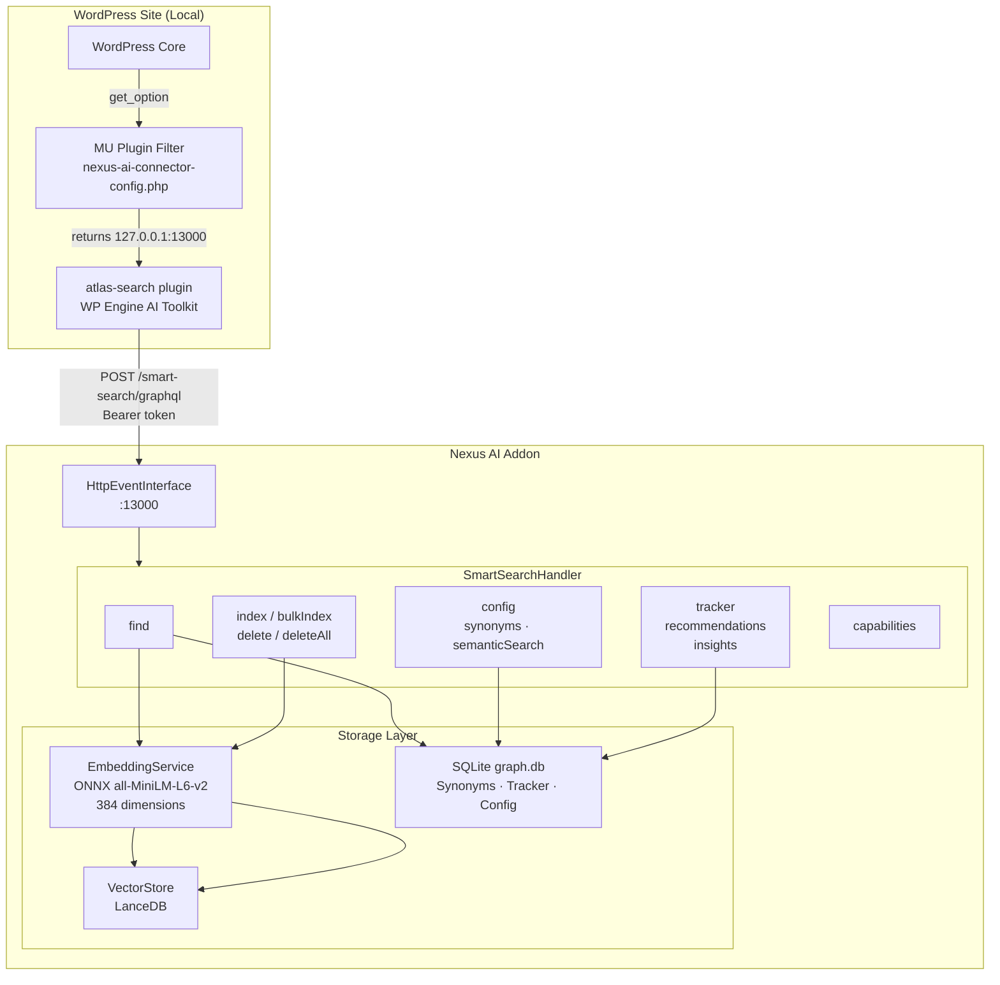
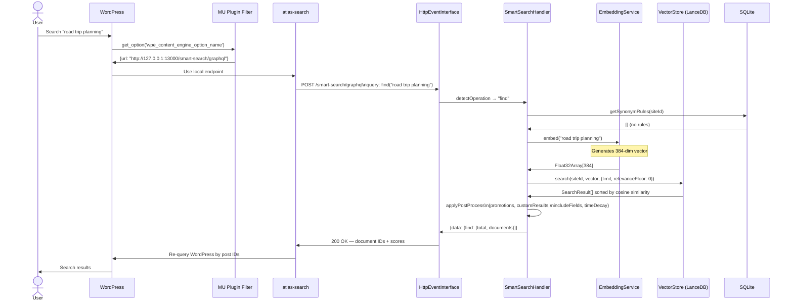
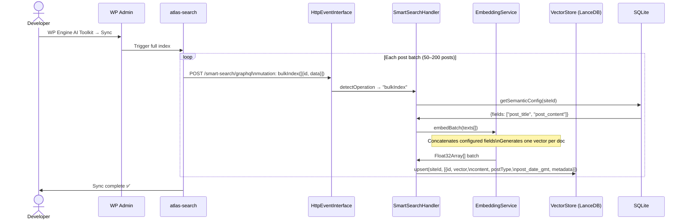
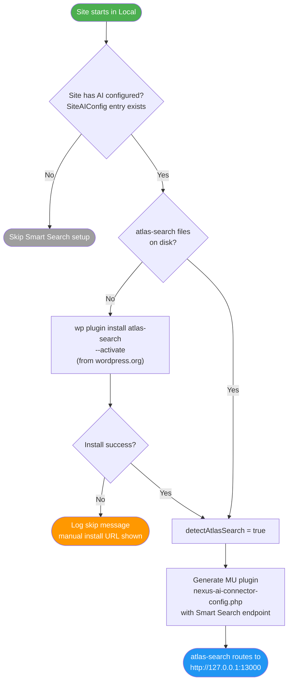
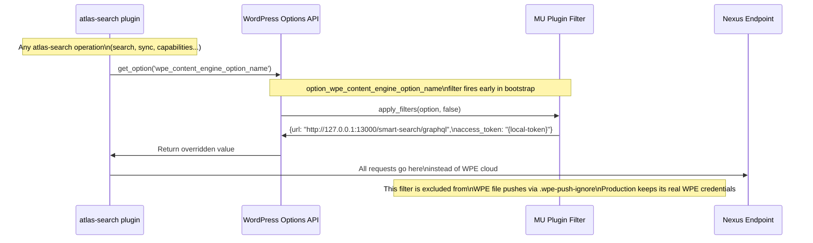
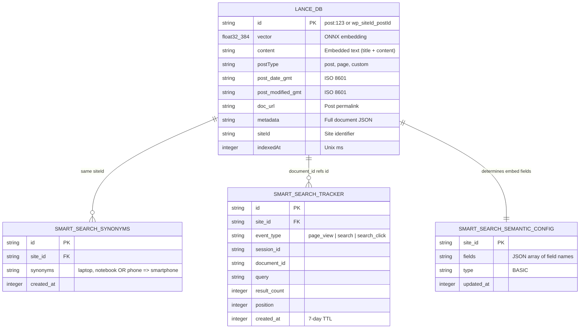
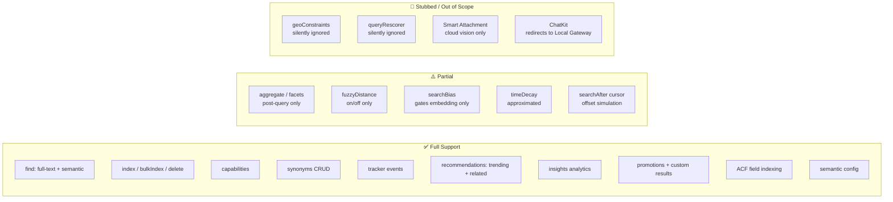

# Smart Search Architecture

Nexus AI acts as a local replacement for WPE's Smart Search cloud backend. The `atlas-search` plugin (WP Engine AI Toolkit) is redirected from WPE's cloud GraphQL endpoint to Nexus's local `HttpEventInterface` server — with no changes to the plugin itself.

## System Overview

Where Smart Search fits in the Nexus architecture:

## Request Flow: Search

End-to-end flow for a WordPress search query:

## Request Flow: Content Indexing

How content gets into the local index:

Real-time indexing uses the same `index` mutation path triggered by WordPress `save_post` hooks.

## Auto-Setup Flow

How Nexus configures a site automatically:

## MU Plugin Intercept

The WordPress option filter is the key to transparent redirection:

## Data Architecture

Where Smart Search data lives:

## Capability Coverage

What the local backend supports vs WPE cloud:

## Related

- [Feature Overview](../features/smart-search/index.md) — what Smart Search is and how the intercept works
- [Getting Started](../features/smart-search/getting-started.md) — step-by-step setup
- [Local vs Cloud](../features/smart-search/limitations.md) — detailed behavior differences
- [Architecture Overview](overview.md) — where Smart Search fits in the full Nexus picture
- [Vector Database](vector-database.md) — LanceDB internals
