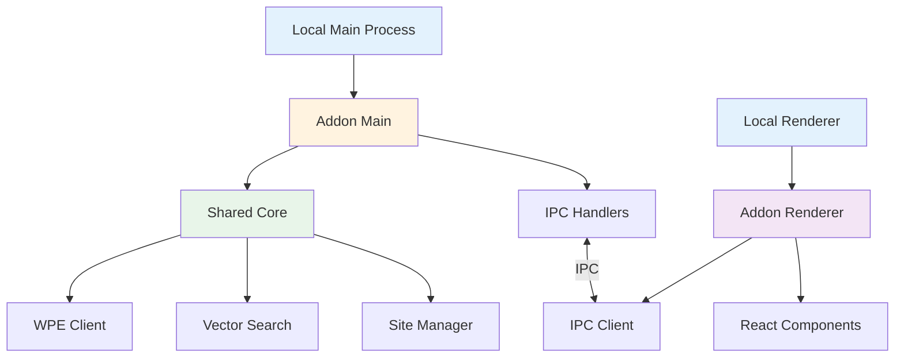

# UI Architecture

Deep dive into Nexus AI's addon component architecture and communication patterns.

## Overview

Nexus AI integrates into Local as a **native addon** using Local's addon API and Electron's IPC (Inter-Process Communication).



**Key Components:**

- **Main Process** - Backend logic (Node.js, Electron main)
- **Renderer Process** - UI components (React, browser)
- **IPC Bridge** - Communication channel between main and renderer
- **Shared Core** - Business logic shared with CLI
- **React Components** - UI panels and views

## Process Architecture

### Electron Multi-Process Model

**Local uses Electron's multi-process architecture:**

```
┌─────────────────────────────────────┐
│ Main Process (Node.js)              │
│ ├─ Local Core                       │
│ ├─ Addon Main (Nexus AI)           │
│ │  ├─ IPC Handlers                 │
│ │  ├─ Site Manager                 │
│ │  ├─ Vector Search                │
│ │  └─ WPE Client                   │
│ └─ File System Access               │
└─────────────────────────────────────┘
          ↕ IPC Communication
┌─────────────────────────────────────┐
│ Renderer Process (Chromium)         │
│ ├─ Local UI                         │
│ ├─ Addon Renderer (Nexus AI)       │
│ │  ├─ React Components             │
│ │  ├─ IPC Client                   │
│ │  └─ State Management             │
│ └─ No File System Access (security) │
└─────────────────────────────────────┘
```

**Why multi-process?**

- **Security** - Renderer process is sandboxed
- **Performance** - Heavy operations in main process
- **Stability** - Renderer crash doesn't affect main
- **Separation** - UI and logic are decoupled

### IPC Communication

**Messages flow through Electron's IPC:**

```typescript
// Renderer → Main (request)
const result = await window.ipcAsync({
  channel: 'nexus-scan-site',
  payload: { siteId: 'abc123' }
});

// Main Process Handler
localAddon.ipcHandle('nexus-scan-site', async ({ siteId }) => {
  const scanner = new SiteScanner();
  const result = await scanner.scan(siteId);
  return { success: true, data: result };
});

// Main → Renderer (event)
localAddon.ipcSend('nexus-scan-progress', {
  siteId: 'abc123',
  progress: 45
});
```

**IPC Patterns:**

| Pattern | Direction | Use Case |
|---------|-----------|----------|
| **Request/Response** | Renderer → Main → Renderer | Tool calls, queries |
| **Events** | Main → Renderer | Progress updates, notifications |
| **Streaming** | Main → Renderer (multiple) | Long-running operations |

## Component Structure

### Directory Layout

```
src/
├─ main/                    # Main process code
│  ├─ index.ts             # Addon entry point
│  ├─ ipc-handlers.ts      # IPC request handlers
│  ├─ site-scanner.ts      # Core scanning logic
│  ├─ vector-search.ts     # Semantic search
│  ├─ wpe-client.ts        # WP Engine API
│  └─ lifecycle.ts         # Addon lifecycle hooks
│
├─ renderer/               # Renderer process code
│  ├─ index.tsx           # Renderer entry point
│  ├─ components/         # React components
│  │  ├─ FleetOverview.tsx
│  │  ├─ SiteFinderPanel.tsx
│  │  ├─ AIChatPanel.tsx
│  │  ├─ WPEManagementPanel.tsx
│  │  └─ ...
│  ├─ hooks/              # Custom React hooks
│  │  ├─ useSites.ts
│  │  ├─ useSearch.ts
│  │  └─ useWPE.ts
│  ├─ utils/              # Renderer utilities
│  └─ types/              # TypeScript types
│
├─ shared/                # Shared between main/renderer
│  ├─ types.ts           # Common types
│  ├─ constants.ts       # Constants
│  └─ utils.ts           # Shared utilities
│
└─ core/                  # Shared with CLI
   ├─ site-manager.ts
   ├─ vector-db.ts
   ├─ ollama-client.ts
   └─ wpe-api.ts
```

### Main Process Structure

**Addon lifecycle hooks:**

```typescript
// src/main/index.ts
import * as LocalMain from '@getflywheel/local/main';

export default function (context: LocalMain.AddonContext) {
  const { hooks, ipcAsync } = context;

  // 1. Addon activation
  hooks.addAction(
    'activate-addon-nexus-ai',
    async () => {
      console.log('Nexus AI activated');
      await initializeDatabase();
      await startMCPServer();
    }
  );

  // 2. Site lifecycle
  hooks.addAction(
    'localSiteStarted',
    async (site: LocalMain.Site) => {
      // Auto-scan on site start (if enabled)
      if (shouldAutoScan()) {
        await scanSite(site.id);
      }
    }
  );

  // 3. IPC handlers
  registerIPCHandlers(ipcAsync);

  // 4. Cleanup
  hooks.addAction(
    'deactivate-addon-nexus-ai',
    async () => {
      await closeDatabaseConnections();
      await stopMCPServer();
    }
  );
}
```

**IPC handler registration:**

```typescript
// src/main/ipc-handlers.ts
export function registerIPCHandlers(ipcAsync: LocalMain.IPCAsync) {
  // Site operations
  ipcAsync.handle('nexus-list-sites', handleListSites);
  ipcAsync.handle('nexus-scan-site', handleScanSite);
  ipcAsync.handle('nexus-search-sites', handleSearchSites);

  // WP-CLI operations
  ipcAsync.handle('nexus-wp-plugin-list', handlePluginList);
  ipcAsync.handle('nexus-wp-plugin-update', handlePluginUpdate);

  // WPE operations
  ipcAsync.handle('nexus-wpe-pull', handleWPEPull);
  ipcAsync.handle('nexus-wpe-push', handleWPEPush);

  // Bulk operations
  ipcAsync.handle('nexus-bulk-scan', handleBulkScan);
  ipcAsync.handle('nexus-bulk-update', handleBulkUpdate);
}

async function handleScanSite({ siteId }: { siteId: string }) {
  const scanner = new SiteScanner();

  // Stream progress to renderer
  scanner.on('progress', (progress) => {
    send('nexus-scan-progress', { siteId, progress });
  });

  const result = await scanner.scan(siteId);
  return { success: true, data: result };
}
```

### Renderer Process Structure

**React component hierarchy:**

```
App
├─ Sidebar
│  ├─ FleetOverview
│  ├─ SiteFinderPanel
│  ├─ AIChatPanel
│  ├─ WPEManagementPanel
│  ├─ SmartFiltersPanel
│  ├─ SiteGroupsPanel
│  └─ NexusPreferences
│
├─ SiteInfoWPE (injected into Local's site panel)
│  ├─ SiteHeaderBadge
│  ├─ WPEEnvironmentCard
│  ├─ PullPushControls
│  └─ SyncStatusIndicator
│
└─ BulkOperationsPanel
   ├─ SiteSelector
   ├─ OperationConfig
   ├─ ProgressMonitor
   └─ ResultsSummary
```

**Example component:**

```typescript
// src/renderer/components/FleetOverview.tsx
import React from 'react';
import { useSites } from '../hooks/useSites';
import { useSearch } from '../hooks/useSearch';

export const FleetOverview: React.FC = () => {
  const { sites, loading, refresh } = useSites();
  const { search, results } = useSearch();

  const handleScanAll = async () => {
    await window.ipcAsync({
      channel: 'nexus-bulk-scan',
      payload: { siteIds: sites.map(s => s.id) }
    });
    await refresh();
  };

  if (loading) {
    return React.createElement('div', null, 'Loading...');
  }

  return React.createElement('div', { className: 'fleet-overview' },
    React.createElement('h2', null, 'Fleet Overview'),
    React.createElement('div', { className: 'stats' },
      React.createElement('span', null, `Total Sites: ${sites.length}`)
    ),
    React.createElement('button', { onClick: handleScanAll }, 'Scan All Sites')
  );
};
```

**Note:** No JSX - Local uses class-based React with `React.createElement()`.

## React Patterns

### Class-Based Components

**Local uses older React without hooks:**

```typescript
// ✅ Correct (class-based)
import React from 'react';

export class FleetOverview extends React.Component {
  state = {
    sites: [],
    loading: true
  };

  componentDidMount() {
    this.loadSites();
  }

  async loadSites() {
    const sites = await window.ipcAsync({
      channel: 'nexus-list-sites'
    });
    this.setState({ sites, loading: false });
  }

  render() {
    const { sites, loading } = this.state;

    if (loading) {
      return React.createElement('div', null, 'Loading...');
    }

    return React.createElement('div', null,
      sites.map(site =>
        React.createElement('div', { key: site.id }, site.name)
      )
    );
  }
}
```

```typescript
// ❌ Wrong (hooks - not supported)
import React, { useState, useEffect } from 'react';

export const FleetOverview = () => {
  const [sites, setSites] = useState([]);  // Won't work!
  const [loading, setLoading] = useState(true);

  useEffect(() => {  // Won't work!
    loadSites();
  }, []);

  // ...
};
```

### createElement Pattern

**No JSX compilation:**

```typescript
// Instead of JSX:
// <div className="panel">
//   <h2>Title</h2>
//   <button onClick={handler}>Click</button>
// </div>

// Use React.createElement:
React.createElement('div', { className: 'panel' },
  React.createElement('h2', null, 'Title'),
  React.createElement('button', { onClick: handler }, 'Click')
);

// Helper for cleaner code:
const e = React.createElement;

e('div', { className: 'panel' },
  e('h2', null, 'Title'),
  e('button', { onClick: handler }, 'Click')
);
```

### Component Registration

**Register components with Local:**

```typescript
// src/renderer/index.tsx
import * as LocalRenderer from '@getflywheel/local/renderer';
import { FleetOverview } from './components/FleetOverview';

export default function (context: LocalRenderer.AddonRendererContext) {
  const { hooks } = context;

  // Add sidebar panel
  hooks.addFilter(
    'stylePaneTabs',
    (tabs) => {
      tabs.push({
        label: 'Nexus AI',
        render: () => React.createElement(FleetOverview)
      });
      return tabs;
    }
  );

  // Inject into site info panel
  hooks.addFilter(
    'SiteInfoOverview_Addon_Section',
    (sections, site, siteStatusText) => {
      sections.push({
        title: 'WP Engine',
        component: React.createElement(SiteInfoWPE, { site })
      });
      return sections;
    }
  );
}
```

## State Management

### No Redux/MobX

**Local doesn't include state management libraries:**

```typescript
// Use component state + IPC
class FleetOverview extends React.Component {
  state = {
    sites: [],
    filters: {},
    selectedSites: []
  };

  updateFilter = (key, value) => {
    this.setState(prevState => ({
      filters: { ...prevState.filters, [key]: value }
    }));
  };

  // Pass to children via props
  render() {
    return React.createElement(SiteList, {
      sites: this.state.sites,
      filters: this.state.filters,
      onFilterChange: this.updateFilter
    });
  }
}
```

### Event-Based Updates

**Listen for IPC events:**

```typescript
class FleetOverview extends React.Component {
  componentDidMount() {
    // Listen for scan progress
    window.addEventListener('nexus-scan-progress', this.handleScanProgress);
  }

  componentWillUnmount() {
    window.removeEventListener('nexus-scan-progress', this.handleScanProgress);
  }

  handleScanProgress = (event) => {
    const { siteId, progress } = event.detail;
    this.setState(prevState => ({
      sites: prevState.sites.map(site =>
        site.id === siteId
          ? { ...site, scanProgress: progress }
          : site
      )
    }));
  };
}
```

## Styling

### Local's Dark Theme

**Use Local's global CSS classes:**

```typescript
// TableList component (dark theme compatible)
React.createElement('ul', { className: 'TableList' },
  React.createElement('li', { className: 'TableListRow' },
    React.createElement('strong', null, 'Label'),
    React.createElement('div', null, 'Value')
  )
);
```

**CSS variables:**

```css
/* Local provides theme variables */
:root {
  --green: #51bb7b;
  --blue: #2196f3;
  --red: #f44336;
  --gray-light: #e0e0e0;
  --gray-dark: #424242;
}

.nexus-panel {
  background: var(--panel-bg);
  color: var(--text-color);
  border: 1px solid var(--border-color);
}
```

### Custom Styles

**Scoped CSS modules:**

```typescript
// Import styles
import styles from './FleetOverview.css';

// Use className
React.createElement('div', {
  className: styles.fleetOverview
}, ...);
```

```css
/* FleetOverview.css */
.fleetOverview {
  padding: 20px;
  background: #fff;
}

/* Dark theme support */
.local-dark-theme .fleetOverview {
  background: #1e1e1e;
  color: #e0e0e0;
}
```

## Performance Optimization

### Debouncing IPC Calls

**Avoid excessive IPC traffic:**

```typescript
class SiteSearch extends React.Component {
  searchTimeout: NodeJS.Timeout | null = null;

  handleSearchChange = (query: string) => {
    // Clear pending search
    if (this.searchTimeout) {
      clearTimeout(this.searchTimeout);
    }

    // Debounce search by 300ms
    this.searchTimeout = setTimeout(async () => {
      const results = await window.ipcAsync({
        channel: 'nexus-search-sites',
        payload: { query }
      });
      this.setState({ results });
    }, 300);
  };
}
```

### Virtualized Lists

**Handle large datasets:**

```typescript
// Use react-window for long lists
import { FixedSizeList } from 'react-window';

class SiteList extends React.Component {
  renderRow = ({ index, style }) => {
    const site = this.props.sites[index];
    return React.createElement('div', { style },
      site.name
    );
  };

  render() {
    return React.createElement(FixedSizeList, {
      height: 600,
      itemCount: this.props.sites.length,
      itemSize: 50,
      width: '100%'
    }, this.renderRow);
  }
}
```

### Memoization

**Cache expensive computations:**

```typescript
class FleetStats extends React.Component {
  memoizedStats = null;
  lastSites = null;

  getStats() {
    // Only recompute if sites changed
    if (this.props.sites !== this.lastSites) {
      this.memoizedStats = {
        total: this.props.sites.length,
        running: this.props.sites.filter(s => s.status === 'running').length,
        // ... expensive calculations
      };
      this.lastSites = this.props.sites;
    }
    return this.memoizedStats;
  }

  render() {
    const stats = this.getStats();
    // render stats...
  }
}
```

## Error Handling

### IPC Error Boundaries

**Catch IPC errors gracefully:**

```typescript
class ErrorBoundary extends React.Component {
  state = { hasError: false, error: null };

  static getDerivedStateFromError(error) {
    return { hasError: true, error };
  }

  componentDidCatch(error, errorInfo) {
    console.error('Component error:', error, errorInfo);
  }

  render() {
    if (this.state.hasError) {
      return React.createElement('div', { className: 'error' },
        React.createElement('h2', null, 'Something went wrong'),
        React.createElement('pre', null, this.state.error.message)
      );
    }
    return this.props.children;
  }
}

// Wrap components
React.createElement(ErrorBoundary, null,
  React.createElement(FleetOverview)
);
```

### Async Error Handling

**Handle IPC call failures:**

```typescript
async loadSites() {
  try {
    const sites = await window.ipcAsync({
      channel: 'nexus-list-sites'
    });
    this.setState({ sites, loading: false, error: null });
  } catch (error) {
    console.error('Failed to load sites:', error);
    this.setState({
      sites: [],
      loading: false,
      error: error.message
    });
  }
}
```

## Testing

### Component Testing

**Test with React Testing Library:**

```typescript
import { render, fireEvent } from '@testing-library/react';
import { FleetOverview } from './FleetOverview';

// Mock IPC
global.window.ipcAsync = jest.fn();

test('renders site list', async () => {
  window.ipcAsync.mockResolvedValue([
    { id: '1', name: 'Site 1' },
    { id: '2', name: 'Site 2' }
  ]);

  const { getByText } = render(
    React.createElement(FleetOverview)
  );

  await waitFor(() => {
    expect(getByText('Site 1')).toBeInTheDocument();
  });
});
```

### IPC Testing

**Test IPC handlers:**

```typescript
import { handleScanSite } from './ipc-handlers';

test('scan site handler', async () => {
  const result = await handleScanSite({ siteId: '123' });

  expect(result.success).toBe(true);
  expect(result.data.chunksIndexed).toBeGreaterThan(0);
});
```

## Best Practices

### Component Design

- ✅ Keep components small and focused
- ✅ Use class-based components (no hooks)
- ✅ Handle loading and error states
- ✅ Debounce IPC calls
- ✅ Clean up event listeners
- ❌ Don't use JSX (use createElement)
- ❌ Don't assume hooks are available
- ❌ Don't mutate state directly

### IPC Communication

- ✅ Use descriptive channel names (`nexus-*`)
- ✅ Include error handling
- ✅ Validate payloads
- ✅ Stream progress for long operations
- ❌ Don't send large data (> 1MB) via IPC
- ❌ Don't block the main process
- ❌ Don't assume IPC is synchronous

### Performance

- ✅ Virtualize long lists (100+ items)
- ✅ Debounce user input
- ✅ Memoize expensive calculations
- ✅ Use CSS for animations (not JS)
- ❌ Don't poll IPC endpoints
- ❌ Don't render all data at once
- ❌ Don't update state on every event

## Next Steps

- **[Data Flow](data-flow.md)** - System data flow diagrams
- **[IPC Communication](mcp-protocol.md)** - IPC patterns in detail
- **[Shared Core](shared-core.md)** - Code shared with CLI
- **[CLI Architecture](cli-architecture.md)** - CLI implementation
- **[Developer Setup](../developer/setup.md)** - Development environment
