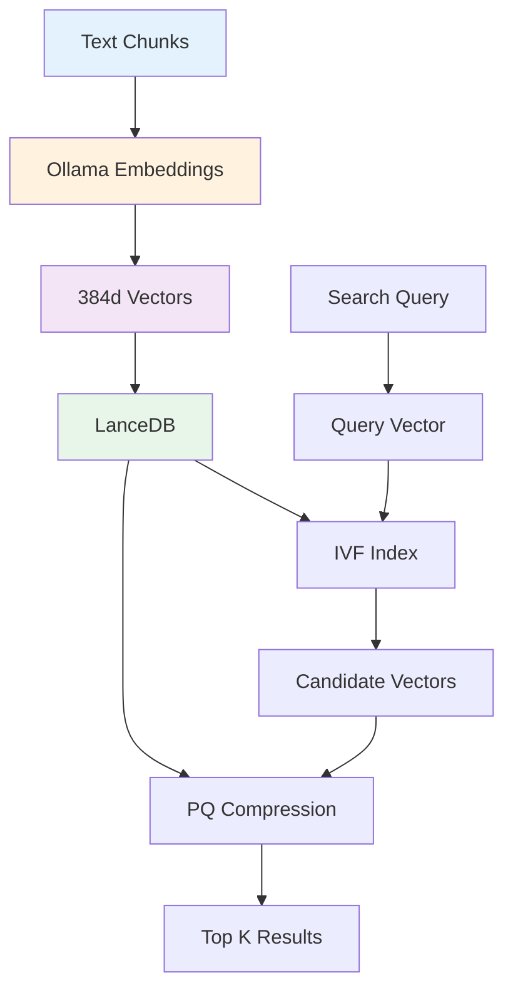
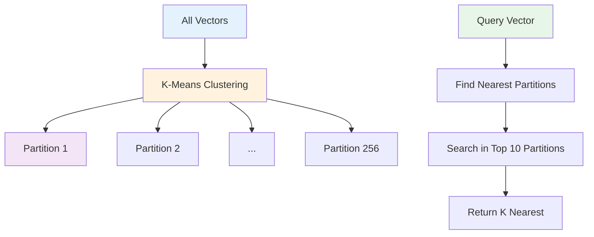
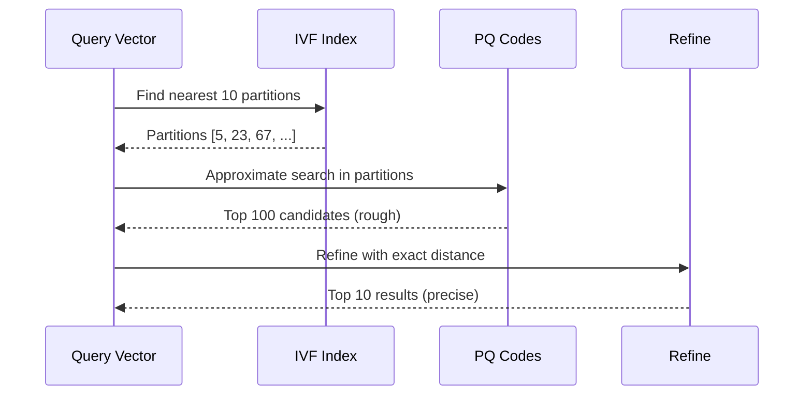

# Vector Database Architecture

Deep dive into Nexus AI's vector database implementation using LanceDB.

## Overview

Nexus AI uses **LanceDB** for fast, scalable vector similarity search across WordPress content.



**Why LanceDB?**

- ✅ **Fast** - Sub-millisecond search on millions of vectors
- ✅ **Embedded** - No separate database server needed
- ✅ **Efficient** - Column-oriented storage (Apache Arrow)
- ✅ **Scalable** - Handles datasets larger than RAM
- ✅ **Production-ready** - ACID transactions, versioning

## Storage Format

### Apache Arrow

**LanceDB uses columnar storage:**

```
Traditional Row Storage:
┌─────────────────────────────────────┐
│ Row 1: [chunk_id, vector, site_id] │
│ Row 2: [chunk_id, vector, site_id] │
│ Row 3: [chunk_id, vector, site_id] │
└─────────────────────────────────────┘

Arrow Column Storage:
┌──────────────┐ ┌──────────┐ ┌──────────┐
│ chunk_ids    │ │ vectors  │ │ site_ids │
│ [id1, id2..] │ │ [v1,v2..]│ │ [s1,s2..]│
└──────────────┘ └──────────┘ └──────────┘
```

**Benefits:**

- **Compression** - Similar values compress better
- **Speed** - Read only needed columns
- **Memory** - Efficient cache usage
- **Parallelism** - Process columns in parallel

### File Structure

```
~/.nexus-ai/vector-index.db/
├─ _latest.manifest         # Current version pointer
├─ _versions/
│  ├─ 1.manifest            # Version 1 metadata
│  ├─ 2.manifest            # Version 2 metadata
│  └─ 3.manifest            # Latest version
├─ data/
│  ├─ chunk_ids.lance       # Arrow column: chunk IDs
│  ├─ vectors.lance         # Arrow column: embeddings
│  ├─ site_ids.lance        # Arrow column: site IDs
│  ├─ post_ids.lance        # Arrow column: post IDs
│  └─ metadata.lance        # Arrow column: other metadata
└─ indices/
   ├─ ivf_pq_256.idx        # IVF-PQ index
   └─ ivf_pq_256_metadata   # Index metadata
```

## Schema Design

### Table Schema

```typescript
interface EmbeddingRecord {
  chunk_id: string;          // Primary key
  vector: Float32Array;      // 384-dimensional embedding
  site_id: string;          // Site identifier
  post_id: number;          // WordPress post ID
  post_type: string;        // post, page, product, etc.
  chunk_index: number;      // Chunk position in post
  indexed_at: Date;         // When indexed
}
```

**Arrow schema:**

```typescript
import { Schema, Field, Float32, Utf8, Int32, Timestamp } from 'apache-arrow';

const schema = new Schema([
  new Field('chunk_id', new Utf8()),
  new Field('vector', new Float32(), false, {
    dimensions: 384
  }),
  new Field('site_id', new Utf8()),
  new Field('post_id', new Int32()),
  new Field('post_type', new Utf8()),
  new Field('chunk_index', new Int32()),
  new Field('indexed_at', new Timestamp())
]);
```

### Creating a Table

```typescript
import * as lancedb from '@lancedb/lancedb';

const db = await lancedb.connect('~/.nexus-ai/vector-index.db');

const table = await db.createTable('embeddings', [
  {
    chunk_id: 'site1-post1-0',
    vector: new Float32Array(384),
    site_id: 'site1',
    post_id: 1,
    post_type: 'post',
    chunk_index: 0,
    indexed_at: new Date()
  }
], {
  mode: 'overwrite'  // or 'create', 'append'
});
```

### Inserting Data

```typescript
// Single insert
await table.add([{
  chunk_id: 'site1-post2-0',
  vector: embedding,
  site_id: 'site1',
  post_id: 2,
  post_type: 'post',
  chunk_index: 0,
  indexed_at: new Date()
}]);

// Batch insert (much faster)
const batch = embeddings.map(emb => ({
  chunk_id: emb.id,
  vector: emb.vector,
  site_id: emb.siteId,
  post_id: emb.postId,
  post_type: emb.postType,
  chunk_index: emb.index,
  indexed_at: new Date()
}));

await table.add(batch);
```

## Vector Indexing

### IVF (Inverted File Index)

**Partitions vectors into clusters:**



**Creating IVF index:**

```typescript
await table.createIndex({
  column: 'vector',
  type: 'IVF_PQ',
  num_partitions: 256,      // Number of clusters
  num_sub_vectors: 96,      // PQ sub-vectors (384/4)
  max_iterations: 50        // K-means iterations
});
```

**How it works:**

1. **Training:** K-means clusters all vectors into 256 partitions
2. **Indexing:** Each vector assigned to nearest partition
3. **Searching:** Query vector finds nearest 10 partitions, searches only those

**Performance:**

| Vectors | No Index | IVF Index | Speedup |
|---------|---------|-----------|---------|
| 1,000 | 50ms | 20ms | 2.5× |
| 10,000 | 500ms | 45ms | 11× |
| 100,000 | 5s | 150ms | 33× |
| 1,000,000 | 50s | 800ms | 62× |

### Product Quantization (PQ)

**Compresses vectors for faster search:**

```
Original Vector (384 dimensions, 1,536 bytes):
[0.23, -0.45, 0.67, ..., 0.12]  (384 × 4 bytes)

PQ Compression (96 sub-vectors, 96 bytes):
Split into 96 sub-vectors of 4 dimensions each
Quantize each 4D sub-vector to 1 byte (256 codes)
Result: [142, 67, 234, ..., 89]  (96 × 1 byte)

Compression ratio: 16:1 (1,536 → 96 bytes)
```

**Configuration:**

```typescript
{
  num_sub_vectors: 96,      // 384 / 4 = 96 sub-vectors
  num_bits: 8              // 2^8 = 256 quantization codes
}
```

**Trade-offs:**

| Setting | Size | Speed | Recall |
|---------|------|-------|--------|
| No PQ | 100% | Baseline | 100% |
| PQ 96×8 | 6.25% | 5× faster | 97% |
| PQ 48×8 | 3.12% | 8× faster | 92% |

## Search Algorithms

### Cosine Similarity

**Measure of vector similarity:**

```typescript
function cosineSimilarity(a: Float32Array, b: Float32Array): number {
  let dotProduct = 0;
  let normA = 0;
  let normB = 0;

  for (let i = 0; i < a.length; i++) {
    dotProduct += a[i] * b[i];
    normA += a[i] * a[i];
    normB += b[i] * b[i];
  }

  return dotProduct / (Math.sqrt(normA) * Math.sqrt(normB));
}

// Range: -1 to 1
// 1.0 = identical
// 0.0 = orthogonal
// -1.0 = opposite
```

**Why cosine over euclidean?**

```
Euclidean Distance:
- Sensitive to vector magnitude
- "How far apart are these vectors?"
- Good for: Spatial data

Cosine Similarity:
- Magnitude-invariant
- "How similar is the direction?"
- Good for: Text embeddings

Example:
Vector A: [1, 2, 3]
Vector B: [2, 4, 6] (2× magnitude)

Euclidean distance: ~3.74 (far apart)
Cosine similarity: 1.0 (identical direction) ✅
```

### ANN Search

**Approximate Nearest Neighbor search:**

```typescript
async function annSearch(
  query: Float32Array,
  k: number = 10
): Promise<Result[]> {
  const results = await table
    .search(query)
    .limit(k)
    .distanceType('cosine')
    .refineFactor(10)        // Refine top 10×k candidates
    .nprobes(10)            // Search 10 IVF partitions
    .toArray();

  return results.map(r => ({
    chunk_id: r.chunk_id,
    distance: r._distance,
    similarity: 1 - r._distance,  // Convert to similarity
    ...r
  }));
}
```

**Search pipeline:**



### Filtering

**Combine vector search with filters:**

```typescript
const results = await table
  .search(query)
  .where(`site_id = '${siteId}'`)
  .where(`post_type IN ('post', 'page')`)
  .where(`indexed_at > '2024-01-01'`)
  .limit(10)
  .toArray();
```

**Filter strategy:**

```typescript
// Pre-filter (fast, but less accurate)
const prefiltered = await table
  .where(`site_id = '${siteId}'`)
  .search(query)
  .limit(10)
  .toArray();

// Post-filter (slow, but accurate)
const postfiltered = await table
  .search(query)
  .limit(100)  // Get more candidates
  .toArray()
  .then(results =>
    results
      .filter(r => r.site_id === siteId)
      .slice(0, 10)
  );
```

## Query Optimization

### Caching

**Cache frequent queries:**

```typescript
import NodeCache from 'node-cache';

const queryCache = new NodeCache({
  stdTTL: 300,  // 5 minutes
  checkperiod: 60
});

async function cachedSearch(query: string): Promise<Result[]> {
  const cacheKey = `search:${query}`;

  // Check cache
  const cached = queryCache.get<Result[]>(cacheKey);
  if (cached) return cached;

  // Execute search
  const embedding = await generateEmbedding(query);
  const results = await annSearch(embedding);

  // Cache results
  queryCache.set(cacheKey, results);

  return results;
}
```

### Batch Queries

**Search multiple queries efficiently:**

```typescript
async function batchSearch(queries: string[]): Promise<Result[][]> {
  // Generate embeddings in parallel
  const embeddings = await Promise.all(
    queries.map(q => generateEmbedding(q))
  );

  // Search in parallel
  const results = await Promise.all(
    embeddings.map(emb => annSearch(emb))
  );

  return results;
}
```

### Incremental Updates

**Update index without full rebuild:**

```typescript
// Add new vectors
await table.add(newEmbeddings);

// Update existing (delete + add)
await table.delete(`chunk_id IN (${updatedIds.join(',')})`);
await table.add(updatedEmbeddings);

// Compact (remove deleted rows)
await table.compact();

// No need to rebuild index - LanceDB handles incrementally
```

## Performance Tuning

### Index Parameters

**Tune for your use case:**

```typescript
// Small dataset (< 10K vectors)
await table.createIndex({
  type: 'IVF_PQ',
  num_partitions: 64,     // Fewer partitions
  num_sub_vectors: 96,
  nprobes: 5             // Search fewer partitions
});

// Medium dataset (10K - 100K vectors)
await table.createIndex({
  type: 'IVF_PQ',
  num_partitions: 256,    // Default
  num_sub_vectors: 96,
  nprobes: 10
});

// Large dataset (> 100K vectors)
await table.createIndex({
  type: 'IVF_PQ',
  num_partitions: 1024,   // More partitions
  num_sub_vectors: 96,
  nprobes: 20            // Search more partitions
});
```

### Memory Management

**Control memory usage:**

```typescript
// Lazy loading (memory-efficient)
const table = await db.openTable('embeddings', {
  memoryMap: true        // Memory-map files (don't load into RAM)
});

// Eager loading (faster, more memory)
const table = await db.openTable('embeddings', {
  memoryMap: false       // Load into RAM
});
```

### Parallelism

**Multi-threaded search:**

```typescript
// LanceDB automatically uses multiple threads
// Control with environment variable:
process.env.RAYON_NUM_THREADS = '4';  // 4 threads

// Or configure per-query
const results = await table
  .search(query)
  .limit(10)
  .parallelism(4)       // Use 4 threads
  .toArray();
```

## Monitoring

### Index Statistics

```typescript
const stats = await table.indexStats('vector');

console.log('Index Statistics:', {
  type: stats.index_type,              // IVF_PQ
  numPartitions: stats.num_partitions,  // 256
  numVectors: stats.num_vectors,        // 124,567
  indexSize: stats.index_size_bytes,    // 15,728,640 (15 MB)
  lastUpdated: stats.last_updated
});
```

### Query Performance

```typescript
async function benchmarkSearch(query: string, iterations: number = 10) {
  const times: number[] = [];
  const embedding = await generateEmbedding(query);

  for (let i = 0; i < iterations; i++) {
    const start = performance.now();
    await annSearch(embedding);
    const end = performance.now();
    times.push(end - start);
  }

  return {
    mean: times.reduce((a, b) => a + b) / times.length,
    min: Math.min(...times),
    max: Math.max(...times),
    p95: times.sort()[Math.floor(times.length * 0.95)]
  };
}
```

### Disk Usage

```typescript
import { promises as fs } from 'fs';
import path from 'path';

async function getDiskUsage(dbPath: string) {
  const stats = await fs.stat(dbPath);
  const files = await fs.readdir(dbPath, { recursive: true });

  let totalSize = 0;
  for (const file of files) {
    const filePath = path.join(dbPath, file);
    const stat = await fs.stat(filePath);
    if (stat.isFile()) {
      totalSize += stat.size;
    }
  }

  return {
    totalSize,
    formatted: `${(totalSize / 1024 / 1024).toFixed(2)} MB`
  };
}
```

## Maintenance

### Compaction

**Reclaim space from deleted rows:**

```typescript
// Check if compaction needed
const stats = await table.stats();
const deletedRatio = stats.num_deleted_rows / stats.num_rows;

if (deletedRatio > 0.2) {  // > 20% deleted
  console.log('Compacting table...');
  await table.compact();
  console.log('Compaction complete');
}
```

### Reindexing

**Rebuild index from scratch:**

```typescript
async function reindex() {
  const table = await db.openTable('embeddings');

  // Drop old index
  await table.dropIndex('vector');

  // Create new index
  await table.createIndex({
    column: 'vector',
    type: 'IVF_PQ',
    num_partitions: 256,
    num_sub_vectors: 96,
    max_iterations: 50
  });

  console.log('Reindexing complete');
}
```

### Versioning

**LanceDB maintains version history:**

```typescript
// List versions
const versions = await table.listVersions();
console.log('Versions:', versions);
// Output: [1, 2, 3, 4, 5]

// Rollback to version
await table.checkout(3);

// Create new version
await table.add(newData);  // Creates version 6
```

## Best Practices

### Index Configuration

- ✅ Use IVF-PQ for > 1,000 vectors
- ✅ Set num_partitions ≈ sqrt(num_vectors)
- ✅ Use num_sub_vectors = dimensions / 4
- ✅ Tune nprobes for recall vs speed
- ❌ Don't over-partition (< 100 vectors/partition)
- ❌ Don't under-probe (< 5 partitions)

### Data Management

- ✅ Batch inserts (1,000+ at a time)
- ✅ Compact regularly (weekly)
- ✅ Monitor disk usage
- ✅ Version control important changes
- ❌ Don't insert one-by-one
- ❌ Don't let deleted rows accumulate

### Performance

- ✅ Cache frequent queries
- ✅ Use appropriate index for dataset size
- ✅ Memory-map for large datasets
- ✅ Parallelize batch operations
- ❌ Don't load all data into RAM
- ❌ Don't rebuild index unnecessarily

## Next Steps

- **[Data Flow](data-flow.md)** - Indexing pipeline details
- **[Semantic Search](../features/semantic-search.md)** - User-facing features
- **Performance Benchmarks** - Detailed metrics
- **[Ollama Setup](../integrations/ollama.md)** - Embedding generation
- **[First Scan](../getting-started/first-scan.md)** - Indexing guide
