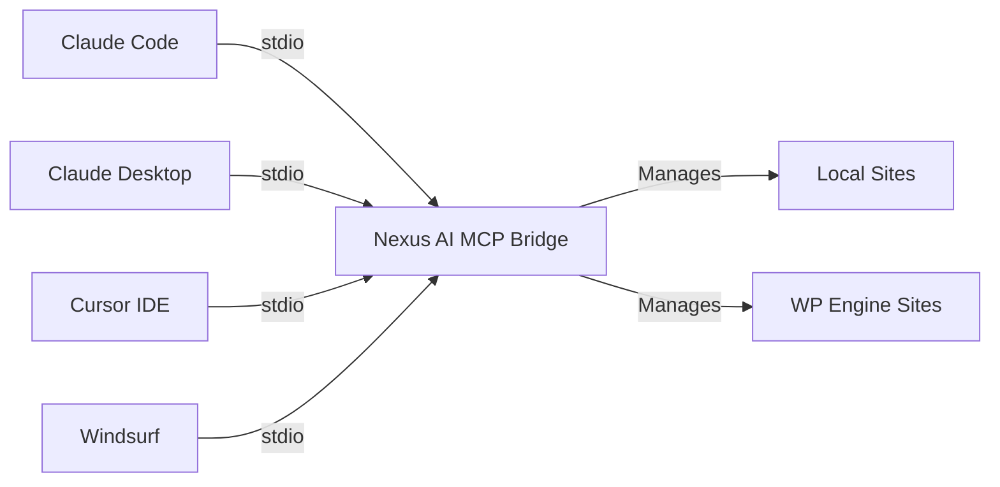

# MCP Setup

Configure the Nexus AI MCP server to work with AI assistants via the Model Context Protocol.

## What is MCP?

The **Model Context Protocol (MCP)** is a standard for connecting AI assistants to external tools and data sources.

When configured as an MCP server, Nexus AI exposes tools that AI assistants can use to:

- Manage WordPress sites (local and WP Engine)
- Execute WP-CLI commands
- Search content with vector search
- Perform bulk operations
- And much more

## Overview



**How it works:**

1. AI assistant launches the Nexus AI stdio bridge as a subprocess
2. Communicates via stdio (standard input/output)
3. Discovers available tools via MCP protocol
4. Calls tools to perform WordPress operations
5. Receives structured responses

All agents use a **stdio bridge** (`bin/mcp-stdio.js`) — not an HTTP URL. The bridge connects to the Local addon's GraphQL server, so Local must be running when tools are invoked.

## Automated Setup with `nexus mcp setup`

The easiest way to configure any supported agent is the `nexus mcp setup` command. It works without Local running.

```bash
# Show the correct config for your agent (print only)
nexus mcp setup --agent claude-desktop

# Write the config to disk automatically
nexus mcp setup --agent cursor --write

# Claude Code: register with the claude CLI directly
nexus mcp setup --agent claude-code --write
```

**Supported agents:**

| Agent | `--agent` value |
|-------|----------------|
| Claude Code (CLI) | `claude-code` |
| Claude Desktop | `claude-desktop` |
| Cursor | `cursor` |
| Windsurf | `windsurf` |
| Cline (VS Code) | `cline` |
| Gemini CLI | `gemini` |

Check MCP server status at any time:

```bash
nexus mcp status
```

Output example:

```
MCP server: running
Port:       50123
Tools:      88
```

## Claude Code

Claude Code is Anthropic's official CLI. It manages MCP servers via the `claude mcp` command.

### Automated setup (recommended)

```bash
nexus mcp setup --agent claude-code --write
```

This runs `claude mcp add local-nexus-ai -- node "/path/to/bin/mcp-stdio.js"` for you.

### Manual setup

```bash
# Find the bridge path
nexus mcp setup --agent claude-code

# Register with claude CLI (use the path shown above)
claude mcp add local-nexus-ai -- node "/usr/local/lib/node_modules/@local-labs-jpollock/local-addon-nexus-ai/bin/mcp-stdio.js"
```

### Verify

```bash
claude mcp list
```

`local-nexus-ai` should appear in the list.

## Claude Desktop

Claude Desktop is Anthropic's official desktop app with native MCP support.

### Automated setup (recommended)

```bash
nexus mcp setup --agent claude-desktop --write
```

### Manual configuration

Config file location:

=== "macOS"

    ```
    ~/Library/Application Support/Claude/claude_desktop_config.json
    ```

=== "Windows"

    ```powershell
    %APPDATA%\Claude\claude_desktop_config.json
    ```

=== "Linux"

    ```bash
    ~/.config/Claude/claude_desktop_config.json
    ```

Add Nexus AI to the `mcpServers` section:

```json
{
  "mcpServers": {
    "local-nexus-ai": {
      "command": "node",
      "args": ["/usr/local/lib/node_modules/@local-labs-jpollock/local-addon-nexus-ai/bin/mcp-stdio.js"]
    }
  }
}
```

!!! note "Path may differ"
    Replace the path with the output of `nexus mcp setup --agent claude-desktop` which shows the correct absolute path for your system.

### Restart Claude Desktop

After editing the config:

1. Quit Claude Desktop completely
2. Relaunch Claude Desktop
3. Tools will appear automatically in conversation

### Verify Setup

Start a new conversation in Claude and ask:

> "What MCP tools are available?"

Claude should respond with a list of Nexus AI tools including `local_list_sites`, `wpe_get_installs`, `wp_plugin_list`, and many more.

### Example Usage

> "List all my WordPress sites"

> "Show me plugins that need updates on my production site"

> "Search all sites for content about 'WooCommerce setup'"

## Cursor IDE

Cursor is a code editor with built-in AI and MCP support.

### Automated setup (recommended)

```bash
nexus mcp setup --agent cursor --write
```

### Manual configuration

**Config file location:**

```
~/.cursor/mcp.json
```

```json
{
  "mcpServers": {
    "local-nexus-ai": {
      "command": "node",
      "args": ["/usr/local/lib/node_modules/@local-labs-jpollock/local-addon-nexus-ai/bin/mcp-stdio.js"]
    }
  }
}
```

### Restart Cursor

1. Quit Cursor completely
2. Relaunch Cursor
3. Tools available in AI chat

### Usage in Cursor

Use Cursor's AI chat (Cmd+L) to interact with WordPress sites:

> "Show me the structure of my site's theme files"

> "List all active plugins and check for updates"

> "Search my sites for posts about React"

## Windsurf

Windsurf is Codeium's AI-native code editor with MCP support.

### Automated setup (recommended)

```bash
nexus mcp setup --agent windsurf --write
```

### Manual configuration

**Config file location:**

```
~/.codeium/windsurf/mcp_config.json
```

```json
{
  "mcpServers": {
    "local-nexus-ai": {
      "command": "node",
      "args": ["/usr/local/lib/node_modules/@local-labs-jpollock/local-addon-nexus-ai/bin/mcp-stdio.js"]
    }
  }
}
```

Restart Windsurf after saving the config.

## Cline (VS Code)

Cline is an autonomous coding agent extension for VS Code.

### Automated setup (recommended)

```bash
nexus mcp setup --agent cline --write
```

### Manual configuration

**Config file location (macOS):**

```
~/Library/Application Support/Code/User/globalStorage/saoudrizwan.claude-dev/settings/cline_mcp_settings.json
```

```json
{
  "mcpServers": {
    "local-nexus-ai": {
      "command": "node",
      "args": ["/usr/local/lib/node_modules/@local-labs-jpollock/local-addon-nexus-ai/bin/mcp-stdio.js"]
    }
  }
}
```

Reload VS Code after saving the config.

## Gemini CLI

Google's Gemini CLI supports MCP servers via `~/.gemini/settings.json`.

### Automated setup (recommended)

```bash
nexus mcp setup --agent gemini --write
```

### Manual configuration

**Config file location:**

```
~/.gemini/settings.json
```

```json
{
  "mcpServers": {
    "local-nexus-ai": {
      "command": "node",
      "args": ["/usr/local/lib/node_modules/@local-labs-jpollock/local-addon-nexus-ai/bin/mcp-stdio.js"]
    }
  }
}
```

## Other MCP Clients

Any tool that supports the Model Context Protocol can use Nexus AI via stdio.

### Generic MCP Configuration

Most MCP clients use this pattern:

```json
{
  "command": "node",
  "args": ["/path/to/bin/mcp-stdio.js"]
}
```

Use `nexus mcp setup --agent claude-desktop` (or any supported agent) to see the correct absolute path for your system.

### Testing MCP Directly

You can test the MCP bridge directly via command line:

```bash
# Check server status
nexus mcp status

# Print config for an agent
nexus mcp setup --agent cursor
```

**Send test message to the bridge:**

```bash
echo '{"jsonrpc":"2.0","method":"tools/list","id":1}' | node /path/to/bin/mcp-stdio.js
```

Expected response:

```json
{
  "jsonrpc": "2.0",
  "result": {
    "tools": [
      {
        "name": "local_list_sites",
        "description": "List all Local WordPress sites",
        "inputSchema": {...}
      },
      ...
    ]
  },
  "id": 1
}
```

## Environment Variables

Pass environment variables to the stdio bridge via your agent's config:

| Variable | Description | Default |
|----------|-------------|---------|
| `DEBUG` | Enable debug logging | None |
| `NEXUS_TELEMETRY` | `0` to disable telemetry | `1` |

**Example with telemetry disabled:**

```json
{
  "mcpServers": {
    "local-nexus-ai": {
      "command": "node",
      "args": ["/path/to/bin/mcp-stdio.js"],
      "env": {
        "NEXUS_TELEMETRY": "0"
      }
    }
  }
}
```

## Troubleshooting

### Tools Not Appearing

**Problem:** AI assistant doesn't show Nexus AI tools

**Solutions:**

1. **Verify config file syntax:**

   ```bash
   # Validate JSON
   cat ~/.config/Claude/claude_desktop_config.json | jq .
   # Should show parsed JSON (no errors)
   ```

2. **Check bridge is accessible:**

   ```bash
   nexus mcp setup --agent claude-desktop
   # Shows the correct absolute path to bin/mcp-stdio.js
   ```

3. **Test MCP bridge directly:**

   ```bash
   echo '{"jsonrpc":"2.0","method":"tools/list","id":1}' | node /path/to/bin/mcp-stdio.js
   # Should return JSON with tools list
   ```

4. **Check server status:**

   ```bash
   nexus mcp status
   # Shows port, tool count, and whether the server is live
   ```

5. **Restart AI assistant completely:**

   Quit and relaunch (not just close window).

### Server Start Failed

**Problem:** MCP server won't start

**Solutions:**

1. **Check Local is running:**

   ```bash
   # macOS
   ps aux | grep "Local.app"

   # Start Local if not running
   open -a Local
   ```

2. **Check for port conflicts:**

   ```bash
   # Check if addon's GraphQL server is running
   lsof -i :50123
   ```

3. **Check addon is loaded:**

   Open Local → Preferences → Addons → Nexus AI should be "Active"

4. **Reinstall addon:**

   ```bash
   # Uninstall and reinstall CLI (will reinstall addon)
   npm uninstall -g local-addon-nexus-ai
   npm install -g @local-labs-jpollock/local-addon-nexus-ai

   # Run once to trigger addon install
   nexus sites
   ```

### Slow Response Times

**Problem:** MCP tools take too long to respond

**Solutions:**

1. **Increase timeout in MCP client config:**

   ```json
   {
     "timeout": 120000  // 2 minutes
   }
   ```

2. **Reduce concurrency for slower operations:**

   ```bash
   export NEXUS_CONCURRENCY=5
   ```

3. **Check Local site status:**

   Stopped sites are slower to query. Start sites you're actively using.

### Permission Errors

**Problem:** MCP server can't access Local or sites

**Solutions:**

1. **Check file permissions:**

   ```bash
   # Verify Local data directory is accessible
   ls -la ~/Library/Application\ Support/Local/
   ```

2. **Run with correct user:**

   Ensure the AI assistant runs as the same user who installed Local.

3. **Check addon permissions:**

   Local → Preferences → Addons → Nexus AI → ensure not disabled

### Connection Refused

**Problem:** `ECONNREFUSED` errors in logs

**Solutions:**

1. **Verify Local is running:**

   ```bash
   open -a Local
   ```

2. **Check addon GraphQL server:**

   ```bash
   # Should show addon server running on port 50123
   lsof -i :50123
   ```

3. **Restart Local:**

   Quit Local completely and restart.

## Logs and Debugging

### Enable Debug Logging

Pass `DEBUG` via your agent config's `env` block:

```json
{
  "mcpServers": {
    "local-nexus-ai": {
      "command": "node",
      "args": ["/path/to/bin/mcp-stdio.js"],
      "env": {
        "DEBUG": "nexus:*"
      }
    }
  }
}
```

Or test the bridge directly from the terminal:

```bash
DEBUG=nexus:* node /path/to/bin/mcp-stdio.js
```

### View Logs

Logs are written to:

- **macOS:** `~/Library/Logs/Claude/mcp-nexus-ai.log`
- **Windows:** `%APPDATA%\Claude\Logs\mcp-nexus-ai.log`
- **Linux:** `~/.cache/Claude/logs/mcp-nexus-ai.log`

**Tail logs in real-time:**

```bash
tail -f ~/Library/Logs/Claude/mcp-nexus-ai.log
```

### Debug Levels

```bash
# All debug output
DEBUG=nexus:*

# Specific modules
DEBUG=nexus:mcp,nexus:tools

# Exclude modules
DEBUG=nexus:*,-nexus:metrics
```

## Next Steps

<div class="grid cards" markdown>

- **Available Tools**

    Browse all 88 MCP tools available to AI assistants.

    [→ Tool Reference](../mcp-tools/index.md)

- **Usage Examples**

    See real-world examples of using Nexus AI with AI assistants.

    [→ Examples](examples.md)

- **Claude Desktop Guide**

    Complete guide for using Nexus AI with Claude Desktop.

    [→ Claude Desktop](../integrations/claude-desktop.md)

- **Troubleshooting**

    Common issues and solutions.

    [→ Troubleshooting](troubleshooting.md)

</div>

## Additional Resources

- **MCP Specification:** [modelcontextprotocol.io](https://modelcontextprotocol.io)
- **Claude Desktop:** [claude.ai/download](https://claude.ai/download)
- **Cursor:** [cursor.sh](https://cursor.sh)
- **Zed:** [zed.dev](https://zed.dev)

---

**MCP server configured!** Your AI assistant can now manage WordPress sites.
