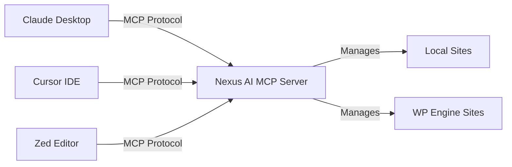

# MCP Setup

Configure the Nexus AI MCP server to work with AI assistants via the Model Context Protocol.

## What is MCP?

The **Model Context Protocol (MCP)** is a standard for connecting AI assistants to external tools and data sources.

When configured as an MCP server, Nexus AI exposes **88 tools** that AI assistants can use to:

- Manage WordPress sites (local and WP Engine)
- Execute WP-CLI commands
- Search content with vector search
- Perform bulk operations
- And much more

## Overview



**How it works:**

1. AI assistant starts Nexus AI as a subprocess
2. Communicates via stdio (standard input/output)
3. Discovers available tools via MCP protocol
4. Calls tools to perform WordPress operations
5. Receives structured responses

## Claude Desktop

Claude Desktop is Anthropic's official desktop app with native MCP support.

### Configuration

Edit the Claude Desktop config file:

=== "macOS"

    ```bash
    # Edit config file
    nano ~/.config/Claude/claude_desktop_config.json
    ```

=== "Windows"

    ```powershell
    # Edit config file
    notepad %APPDATA%\Claude\claude_desktop_config.json
    ```

=== "Linux"

    ```bash
    # Edit config file
    nano ~/.config/Claude/claude_desktop_config.json
    ```

### Config File

Add Nexus AI to the `mcpServers` section:

```json
{
  "mcpServers": {
    "nexus-ai": {
      "command": "nexus",
      "args": ["mcp"]
    }
  }
}
```

**Complete example with multiple servers:**

```json
{
  "mcpServers": {
    "nexus-ai": {
      "command": "nexus",
      "args": ["mcp"]
    },
    "filesystem": {
      "command": "npx",
      "args": ["-y", "@modelcontextprotocol/server-filesystem", "/Users/username/Documents"]
    }
  }
}
```

### Restart Claude Desktop

After editing the config:

1. Quit Claude Desktop completely
2. Relaunch Claude Desktop
3. Tools will appear automatically in conversation

### Verify Setup

Start a new conversation in Claude and ask:

> "What MCP tools are available?"

Claude should respond with a list of Nexus AI tools:

```
I have access to 88 Nexus AI tools:

Local Site Management:
- local_list_sites
- local_create_site
- local_start_site
- local_stop_site
...

WP Engine Operations:
- wpe_get_installs
- wpe_get_accounts
- wpe_diagnose_site
...

WordPress Management:
- wp_plugin_list
- wp_plugin_activate
- wp_core_version
...
```

### Example Usage

> "List all my WordPress sites"

> "Show me plugins that need updates on my production site"

> "Search all sites for content about 'WooCommerce setup'"

## Cursor IDE

Cursor is a code editor with built-in AI and MCP support.

### Configuration

1. Open Cursor Settings (Cmd+, on macOS)
2. Search for "MCP"
3. Or edit config directly:

**Config file location:**

=== "macOS"

    ```bash
    ~/.cursor/mcp_config.json
    ```

=== "Windows"

    ```powershell
    %APPDATA%\Cursor\mcp_config.json
    ```

=== "Linux"

    ```bash
    ~/.cursor/mcp_config.json
    ```

### Config File

```json
{
  "mcpServers": {
    "nexus-ai": {
      "command": "nexus",
      "args": ["mcp"]
    }
  }
}
```

### Restart Cursor

1. Quit Cursor completely
2. Relaunch Cursor
3. Tools available in AI chat

### Usage in Cursor

Use Cursor's AI chat (Cmd+L) to interact with WordPress sites:

> "Show me the structure of my site's theme files"

> "List all active plugins and check for updates"

> "Search my sites for posts about React"

## Zed Editor

Zed is a high-performance code editor with MCP support.

### Configuration

Edit Zed's MCP config:

=== "macOS/Linux"

    ```bash
    ~/.config/zed/mcp.json
    ```

=== "Windows"

    ```powershell
    %APPDATA%\Zed\mcp.json
    ```

### Config File

```json
{
  "servers": {
    "nexus-ai": {
      "command": "nexus",
      "args": ["mcp"]
    }
  }
}
```

### Restart Zed

1. Quit Zed
2. Relaunch Zed
3. MCP tools available in assistant

## Continue.dev

Continue is an AI coding assistant plugin for VS Code and JetBrains IDEs.

### Configuration

Edit Continue config:

**VS Code:**
```
~/.continue/config.json
```

**JetBrains:**
```
~/.continue/config.json
```

### Config File

```json
{
  "mcpServers": [
    {
      "name": "nexus-ai",
      "command": "nexus",
      "args": ["mcp"]
    }
  ]
}
```

### Restart Extension

Reload VS Code or JetBrains IDE window after editing config.

## Other MCP Clients

Any tool that supports the Model Context Protocol can use Nexus AI.

### Generic MCP Configuration

Most MCP clients use this pattern:

```json
{
  "command": "nexus",
  "args": ["mcp"],
  "env": {
    "DEBUG": "nexus:*"  // Optional: enable debug logging
  }
}
```

### Testing MCP Directly

You can test the MCP server directly via command line:

```bash
# Start MCP server
nexus mcp

# Server starts and waits for JSON-RPC messages on stdin
# Press Ctrl+C to exit
```

**Send test message:**

```bash
echo '{"jsonrpc":"2.0","method":"tools/list","id":1}' | nexus mcp
```

Expected response:

```json
{
  "jsonrpc": "2.0",
  "result": {
    "tools": [
      {
        "name": "local_list_sites",
        "description": "List all Local WordPress sites",
        "inputSchema": {...}
      },
      ...
    ]
  },
  "id": 1
}
```

## Environment Variables

Configure MCP server behavior via environment variables:

| Variable | Description | Default |
|----------|-------------|---------|
| `DEBUG` | Enable debug logging | None |
| `NEXUS_TELEMETRY` | `0` to disable telemetry | `1` |
| `NEXUS_CONCURRENCY` | Max parallel operations | `10` |

**Example with debug logging:**

```json
{
  "mcpServers": {
    "nexus-ai": {
      "command": "nexus",
      "args": ["mcp"],
      "env": {
        "DEBUG": "nexus:*",
        "NEXUS_TELEMETRY": "0"
      }
    }
  }
}
```

## Advanced Configuration

### Custom Working Directory

Specify a custom working directory:

```json
{
  "mcpServers": {
    "nexus-ai": {
      "command": "nexus",
      "args": ["mcp"],
      "cwd": "/path/to/custom/directory"
    }
  }
}
```

### Timeout Configuration

Some MCP clients support timeout settings:

```json
{
  "mcpServers": {
    "nexus-ai": {
      "command": "nexus",
      "args": ["mcp"],
      "timeout": 60000  // 60 seconds
    }
  }
}
```

### Multiple Profiles

Run multiple Nexus AI instances with different configs:

```json
{
  "mcpServers": {
    "nexus-production": {
      "command": "nexus",
      "args": ["mcp"],
      "env": {
        "NEXUS_PROFILE": "production"
      }
    },
    "nexus-staging": {
      "command": "nexus",
      "args": ["mcp"],
      "env": {
        "NEXUS_PROFILE": "staging"
      }
    }
  }
}
```

## Troubleshooting

### Tools Not Appearing

**Problem:** AI assistant doesn't show Nexus AI tools

**Solutions:**

1. **Verify config file syntax:**

   ```bash
   # Validate JSON
   cat ~/.config/Claude/claude_desktop_config.json | jq .
   # Should show parsed JSON (no errors)
   ```

2. **Check command is accessible:**

   ```bash
   which nexus
   # Should show: /usr/local/bin/nexus or similar
   ```

3. **Test MCP server directly:**

   ```bash
   echo '{"jsonrpc":"2.0","method":"tools/list","id":1}' | nexus mcp
   # Should return JSON with tools list
   ```

4. **Check logs:**

   ```bash
   # Enable debug logging
   DEBUG=nexus:* nexus mcp
   ```

5. **Restart AI assistant completely:**

   Quit and relaunch (not just close window).

### Server Start Failed

**Problem:** MCP server won't start

**Solutions:**

1. **Check Local is running:**

   ```bash
   # macOS
   ps aux | grep "Local.app"

   # Start Local if not running
   open -a Local
   ```

2. **Check for port conflicts:**

   ```bash
   # Check if addon's GraphQL server is running
   lsof -i :50123
   ```

3. **Check addon is loaded:**

   Open Local → Preferences → Addons → Nexus AI should be "Active"

4. **Reinstall addon:**

   ```bash
   # Uninstall and reinstall CLI (will reinstall addon)
   npm uninstall -g local-addon-nexus-ai
   npm install -g @local-labs-jpollock/local-addon-nexus-ai

   # Run once to trigger addon install
   nexus sites
   ```

### Slow Response Times

**Problem:** MCP tools take too long to respond

**Solutions:**

1. **Increase timeout in MCP client config:**

   ```json
   {
     "timeout": 120000  // 2 minutes
   }
   ```

2. **Reduce concurrency for slower operations:**

   ```bash
   export NEXUS_CONCURRENCY=5
   ```

3. **Check Local site status:**

   Stopped sites are slower to query. Start sites you're actively using.

### Permission Errors

**Problem:** MCP server can't access Local or sites

**Solutions:**

1. **Check file permissions:**

   ```bash
   # Verify Local data directory is accessible
   ls -la ~/Library/Application\ Support/Local/
   ```

2. **Run with correct user:**

   Ensure the AI assistant runs as the same user who installed Local.

3. **Check addon permissions:**

   Local → Preferences → Addons → Nexus AI → ensure not disabled

### Connection Refused

**Problem:** `ECONNREFUSED` errors in logs

**Solutions:**

1. **Verify Local is running:**

   ```bash
   open -a Local
   ```

2. **Check addon GraphQL server:**

   ```bash
   # Should show addon server running on port 50123
   lsof -i :50123
   ```

3. **Restart Local:**

   Quit Local completely and restart.

## Logs and Debugging

### Enable Debug Logging

=== "Claude Desktop"

    ```json
    {
      "mcpServers": {
        "nexus-ai": {
          "command": "nexus",
          "args": ["mcp"],
          "env": {
            "DEBUG": "nexus:*"
          }
        }
      }
    }
    ```

=== "Command Line"

    ```bash
    DEBUG=nexus:* nexus mcp
    ```

### View Logs

Logs are written to:

- **macOS:** `~/Library/Logs/Claude/mcp-nexus-ai.log`
- **Windows:** `%APPDATA%\Claude\Logs\mcp-nexus-ai.log`
- **Linux:** `~/.cache/Claude/logs/mcp-nexus-ai.log`

**Tail logs in real-time:**

```bash
tail -f ~/Library/Logs/Claude/mcp-nexus-ai.log
```

### Debug Levels

```bash
# All debug output
DEBUG=nexus:*

# Specific modules
DEBUG=nexus:mcp,nexus:tools

# Exclude modules
DEBUG=nexus:*,-nexus:metrics
```

## Next Steps

<div class="grid cards" markdown>

- **Available Tools**

    Browse all 88 MCP tools available to AI assistants.

    [→ Tool Reference](../mcp-tools/index.md)

- **Usage Examples**

    See real-world examples of using Nexus AI with AI assistants.

    [→ Examples](examples.md)

- **Claude Desktop Guide**

    Complete guide for using Nexus AI with Claude Desktop.

    [→ Claude Desktop](../integrations/claude-desktop.md)

- **Troubleshooting**

    Common issues and solutions.

    [→ Troubleshooting](troubleshooting.md)

</div>

## Additional Resources

- **MCP Specification:** [modelcontextprotocol.io](https://modelcontextprotocol.io)
- **Claude Desktop:** [claude.ai/download](https://claude.ai/download)
- **Cursor:** [cursor.sh](https://cursor.sh)
- **Zed:** [zed.dev](https://zed.dev)

---

**MCP server configured!** Your AI assistant can now manage WordPress sites.
