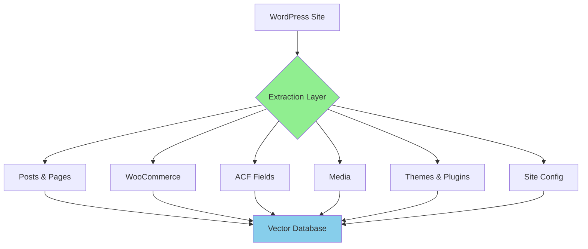

# Content Extraction

Deep dive into what Nexus AI extracts and indexes from your WordPress sites.

## Overview

Nexus AI scans WordPress sites to extract content for semantic search. Understanding what gets indexed—and what doesn't—is crucial for privacy and search effectiveness.



## Extraction Methods

### Filesystem Scanning

**What:** Theme and plugin metadata

**How:**
1. Read `~/Local Sites/sitename/app/public/wp-content/`
2. Parse plugin headers from `.php` files
3. Parse theme `style.css` headers

**Example:**

```php
// Extracted from wp-content/plugins/akismet/akismet.php
/**
 * Plugin Name: Akismet Anti-Spam
 * Plugin URI: https://akismet.com/
 * Description: Used by millions...
 * Version: 5.3.1
 * Author: Automattic
 */
```

**Indexed:**
- Plugin name
- Plugin version
- Plugin description
- Plugin author
- Active/inactive status

### Database Scanning

**What:** Posts, pages, products, custom fields, users

**How:**
1. Connect to MySQL directly via socket
2. Execute optimized SELECT queries
3. Parse and structure results

**Connection:**

```typescript
// Nexus reads database credentials from wp-config.php
const config = parseWPConfig(sitePath);

// Connect via socket (faster than TCP)
const db = mysql.createConnection({
  socketPath: '/path/to/mysql.sock',
  user: config.DB_USER,
  password: config.DB_PASSWORD,
  database: config.DB_NAME
});
```

**Queries executed:**

```sql
-- Posts and pages
SELECT ID, post_title, post_content, post_excerpt, post_status,
       post_type, post_author, post_date, post_modified
FROM wp_posts
WHERE post_status = 'publish'
AND post_type IN ('post', 'page', 'product');

-- Post meta (ACF, Yoast, etc.)
SELECT post_id, meta_key, meta_value
FROM wp_postmeta
WHERE meta_key NOT LIKE '\_%' -- Skip internal meta
OR meta_key LIKE 'field_%';    -- Include ACF fields

-- WooCommerce product data
SELECT post_id, meta_key, meta_value
FROM wp_postmeta
WHERE meta_key IN (
  '_price', '_regular_price', '_sale_price',
  '_sku', '_stock', '_stock_status',
  '_product_attributes'
);

-- Users (no PII)
SELECT ID, user_login, display_name
FROM wp_users;

-- User meta (roles only)
SELECT user_id, meta_value
FROM wp_usermeta
WHERE meta_key = 'wp_capabilities';
```

## What Gets Indexed

### Posts and Pages ✅

**Full content indexed:**

```json
{
  "post_id": 123,
  "post_type": "post",
  "title": "WordPress Performance Guide",
  "content": "Full post content with HTML stripped...",
  "excerpt": "Short excerpt...",
  "author": "admin",
  "published_at": "2026-03-15T10:30:00Z",
  "modified_at": "2026-03-16T14:15:00Z",
  "status": "publish"
}
```

**Processing:**

1. **HTML stripping:**
   ```typescript
   const plainText = content
     .replace(/<script[^>]*>.*?<\/script>/gi, '')
     .replace(/<style[^>]*>.*?<\/style>/gi, '')
     .replace(/<[^>]+>/g, ' ')
     .replace(/\s+/g, ' ')
     .trim();
   ```

2. **Excerpt generation (if missing):**
   ```typescript
   const excerpt = plainText.substring(0, 250) + '...';
   ```

3. **Chunking:**
   ```typescript
   const chunks = splitIntoChunks(plainText, {
     maxTokens: 256,
     overlap: 0.2,
     boundary: 'sentence'
   });
   ```

**Why full content?**

- ✅ Enables semantic search across entire posts
- ✅ Finds relevant paragraphs, not just titles
- ✅ Understands context and relationships

**Post types supported:**

- `post` - Blog posts
- `page` - Pages
- Any custom post type (automatic detection)

### WooCommerce Products ✅

**Product data indexed:**

```json
{
  "post_id": 456,
  "post_type": "product",
  "title": "Blue Widget Pro",
  "content": "Product description...",
  "price": "99.99",
  "regular_price": "129.99",
  "sale_price": "99.99",
  "sku": "BWP-001",
  "stock_status": "instock",
  "stock_quantity": "50",
  "attributes": {
    "color": "Blue",
    "size": "Large",
    "material": "Plastic"
  },
  "categories": ["Widgets", "Featured"],
  "tags": ["blue", "pro", "bestseller"]
}
```

**Extraction logic:**

```typescript
async function extractProduct(postId: number) {
  // Get basic product info
  const product = await getPost(postId);

  // Get product meta
  const meta = await getPostMeta(postId, [
    '_price',
    '_regular_price',
    '_sale_price',
    '_sku',
    '_stock',
    '_stock_status',
    '_product_attributes'
  ]);

  // Parse attributes
  const attributes = unserialize(meta._product_attributes);

  // Get taxonomy terms
  const categories = await getTerms(postId, 'product_cat');
  const tags = await getTerms(postId, 'product_tag');

  return {
    ...product,
    ...meta,
    attributes,
    categories,
    tags
  };
}
```

**Use cases:**

- Search products by description
- Find products by attributes (color, size)
- Filter by price range
- Search by SKU or stock status

### Advanced Custom Fields ✅

**Supported field types:**

| Field Type | Indexed | Format |
|------------|---------|--------|
| Text | ✅ | Plain text |
| Textarea | ✅ | Plain text |
| WYSIWYG | ✅ | HTML → plain text |
| Number | ✅ | Numeric value |
| Email | ✅ | Email address |
| URL | ✅ | URL string |
| Select | ✅ | Selected value(s) |
| Radio | ✅ | Selected value |
| Checkbox | ✅ | Array of values |
| Repeater | ✅ | Nested structure |
| Group | ✅ | Nested structure |
| Flexible Content | ✅ | Nested structure |
| Gallery | ❌ | Not indexed |
| File | ❌ | Not indexed |
| Relationship | ❌ | Not indexed |

**Example extraction:**

```typescript
// Simple field
{
  "field_name": "hero_title",
  "value": "Welcome to Our Site"
}

// Repeater field
{
  "field_name": "team_members",
  "value": [
    {
      "name": "John Doe",
      "title": "CEO",
      "bio": "John has 15 years of experience..."
    },
    {
      "name": "Jane Smith",
      "title": "CTO",
      "bio": "Jane leads our technology team..."
    }
  ]
}

// Group field
{
  "field_name": "contact_info",
  "value": {
    "email": "hello@example.com",
    "phone": "555-1234",
    "address": "123 Main St"
  }
}

// Flexible content
{
  "field_name": "page_builder",
  "value": [
    {
      "acf_fc_layout": "text_block",
      "title": "About Us",
      "content": "We are a company..."
    },
    {
      "acf_fc_layout": "image_text",
      "heading": "Our Services",
      "text": "We provide...",
      "image_id": 789
    }
  ]
}
```

**Flattening for search:**

```typescript
function flattenACF(fields: any): string {
  let text = '';

  for (const [key, value] of Object.entries(fields)) {
    if (typeof value === 'string') {
      text += value + ' ';
    } else if (Array.isArray(value)) {
      value.forEach(item => {
        text += flattenACF(item) + ' ';
      });
    } else if (typeof value === 'object') {
      text += flattenACF(value) + ' ';
    }
  }

  return text;
}
```

**Why ACF?**

- ✅ Custom fields contain critical content
- ✅ Often missed by traditional search
- ✅ Enables finding posts by custom criteria

### Media Attachments ✅

**Metadata indexed:**

```json
{
  "post_id": 789,
  "post_type": "attachment",
  "title": "hero-image.jpg",
  "caption": "Beautiful sunset over mountains",
  "description": "Landscape photo from vacation in Colorado",
  "alt_text": "Sunset over mountain peaks with orange sky",
  "file_name": "hero-image.jpg",
  "mime_type": "image/jpeg",
  "file_size": 245678,
  "dimensions": "1920x1080"
}
```

**EXIF data (if present):**

```json
{
  "camera": "Canon EOS R5",
  "lens": "RF 24-105mm f/4L",
  "iso": "100",
  "aperture": "f/8",
  "shutter_speed": "1/125",
  "focal_length": "35mm",
  "date_taken": "2026-03-15T17:30:00Z",
  "gps_latitude": "39.7392",
  "gps_longitude": "-104.9903"
}
```

**File content NOT indexed:**

- ❌ Image pixels/visual content
- ❌ Video/audio data
- ❌ PDF text (future feature)

**Use cases:**

- Find images by alt text
- Search photos by EXIF data
- Locate attachments by description

### Themes and Plugins ✅

**Plugin info:**

```json
{
  "type": "plugin",
  "slug": "akismet",
  "name": "Akismet Anti-Spam",
  "version": "5.3.1",
  "description": "Used by millions, Akismet is the best way to protect your blog from spam.",
  "author": "Automattic",
  "author_uri": "https://automattic.com/",
  "plugin_uri": "https://akismet.com/",
  "network": false,
  "active": true,
  "update_available": false
}
```

**Theme info:**

```json
{
  "type": "theme",
  "slug": "twentytwentyfour",
  "name": "Twenty Twenty-Four",
  "version": "1.0",
  "description": "The default WordPress theme for 2024",
  "author": "WordPress.org",
  "template": "",
  "status": "active"
}
```

**Use cases:**

- Find sites using specific plugins
- Check plugin versions across fleet
- Identify sites needing updates

### Site Configuration ✅

**System info:**

```json
{
  "site_name": "mysite",
  "site_url": "https://mysite.local",
  "site_title": "My Awesome Site",
  "site_tagline": "Just another WordPress site",
  "admin_email": "admin@mysite.local",
  "wp_version": "6.4.3",
  "php_version": "8.2.0",
  "mysql_version": "8.0.35",
  "language": "en_US",
  "timezone": "America/Los_Angeles",
  "permalink_structure": "/%postname%/",
  "https_enabled": true,
  "multisite": false
}
```

**Use cases:**

- Find sites running old WordPress
- Identify PHP version compatibility
- Group sites by configuration

### Users ✅ (Limited)

**What IS indexed:**

```json
{
  "user_id": 1,
  "user_login": "admin",
  "display_name": "John Doe",
  "roles": ["administrator"],
  "registered_at": "2025-01-01T00:00:00Z",
  "post_count": 42
}
```

**What is NOT indexed:**

- ❌ Email addresses
- ❌ Passwords or hashes
- ❌ IP addresses
- ❌ Session data
- ❌ Personal information

**Why limited?**

Privacy protection - user PII is never indexed.

## What Does NOT Get Indexed

For security and privacy, these items are **never** indexed:

### Sensitive Data ❌

```typescript
const EXCLUDED_META_KEYS = [
  /password/i,
  /api[_-]?key/i,
  /secret/i,
  /token/i,
  /credential/i,
  /private[_-]?key/i,
  /access[_-]?token/i
];

function shouldIndexMeta(key: string): boolean {
  return !EXCLUDED_META_KEYS.some(pattern => pattern.test(key));
}
```

**Never indexed:**

- Passwords (plain or hashed)
- API keys and tokens
- OAuth credentials
- Database passwords
- FTP/SSH credentials
- License keys
- Payment information

### Personal Information ❌

**GDPR/Privacy compliance:**

```typescript
const PII_FIELDS = [
  'user_email',
  'user_pass',
  'user_activation_key',
  'billing_email',
  'billing_phone',
  'billing_address_1',
  'billing_address_2',
  'shipping_email',
  'shipping_phone',
  'customer_ip_address'
];

function isPII(key: string): boolean {
  return PII_FIELDS.includes(key);
}
```

**Never indexed:**

- User email addresses
- Phone numbers
- Physical addresses
- IP addresses
- Payment information
- Order details with customer info

### System Data ❌

**WordPress internals:**

- Transient caches (`_transient_*`)
- Session data
- Nonces
- Auto-save revisions (configurable)
- Trash/spam content
- Password reset keys

### Binary Content ❌

**File types not indexed:**

- Images (pixels/visual content)
- Videos (audio/visual data)
- Audio files
- ZIP/Archive files
- Executables
- Fonts

**Note:** Metadata (alt text, captions) IS indexed.

## Performance Optimization

### Selective Indexing

**Skip large posts:**

```typescript
const MAX_CONTENT_LENGTH = 1_000_000; // 1MB

if (content.length > MAX_CONTENT_LENGTH) {
  console.warn(`Post ${postId} exceeds max length, truncating`);
  content = content.substring(0, MAX_CONTENT_LENGTH);
}
```

**Ignore meta keys:**

```typescript
const IGNORED_META_PATTERNS = [
  /^_transient_/,
  /^_site_transient_/,
  /^_wp_/,
  /^_edit_/
];
```

### Batch Processing

**Efficient queries:**

```typescript
// Bad: N+1 queries
for (const post of posts) {
  const meta = await getPostMeta(post.ID);
}

// Good: Batch query
const postIds = posts.map(p => p.ID);
const allMeta = await getPostMetaBatch(postIds);
```

### Caching

**Avoid re-scanning unchanged content:**

```typescript
async function needsRescan(postId: number): Promise<boolean> {
  const lastScan = await getLastScanTime(postId);
  const lastModified = await getPostModifiedTime(postId);

  return lastModified > lastScan;
}
```

## Privacy Controls

### Opt-Out Configuration

**Exclude post types:**

```typescript
// .nexus/config.json
{
  "scan": {
    "excludePostTypes": ["acf-field", "acf-field-group"],
    "excludeMetaKeys": ["_sensitive_data", "_private_notes"],
    "excludeUsers": true  // Don't index user data
  }
}
```

### Data Retention

**Automatic cleanup:**

```typescript
async function cleanupOldData() {
  // Remove indexed content from deleted posts
  await db.execute(`
    DELETE FROM documents
    WHERE post_id NOT IN (
      SELECT ID FROM wp_posts WHERE post_status = 'publish'
    )
  `);

  // Remove orphaned embeddings
  await db.execute(`
    DELETE FROM embeddings
    WHERE document_id NOT IN (SELECT id FROM documents)
  `);
}
```

### Viewing Indexed Data

**Check what's indexed:**

```bash
# List indexed documents
nexus db query "SELECT post_id, title, post_type FROM documents WHERE site_id = 'mysite' LIMIT 10"

# Check specific post
nexus db query "SELECT * FROM documents WHERE post_id = 123"

# Count by type
nexus db query "SELECT post_type, COUNT(*) FROM documents GROUP BY post_type"
```

## Troubleshooting

### Missing Content

**Problem:** Expected content not in search results

**Debug:**

```bash
# Check if post was indexed
nexus db query "SELECT * FROM documents WHERE post_id = 123"

# Check post status
nexus wp mysite post get 123 --field=post_status

# Check scan logs
tail -f ~/.nexus/logs/scan.log
```

**Common causes:**

- Post status is not "publish"
- Post type excluded from indexing
- Content is too short (<100 words)
- Scan hasn't run since post published

### Too Much Indexed

**Problem:** Database too large

**Solutions:**

```bash
# Check database size
nexus db info

# Optimize (remove orphaned data)
nexus db optimize

# Exclude post types
# Edit ~/.nexus/config.json
{
  "scan": {
    "excludePostTypes": ["revision", "nav_menu_item", "acf-field"]
  }
}

# Re-scan
nexus db reset
nexus scan
```

### Privacy Concerns

**Problem:** Worried about sensitive data

**Verify:**

```bash
# Check for email addresses (should be 0)
nexus db query "SELECT COUNT(*) FROM documents WHERE content LIKE '%@%'"

# Check for passwords (should be 0)
nexus db query "SELECT COUNT(*) FROM documents WHERE content LIKE '%password%'"

# Export and review
nexus db export /tmp/nexus-export.db
sqlite3 /tmp/nexus-export.db "SELECT * FROM documents LIMIT 10"
```

## Next Steps

- [First Scan](../getting-started/first-scan.md) - Understanding the scan process
- [Semantic Search](semantic-search.md) - How indexed content is searched
- [Privacy & Telemetry](../index.md#privacy--telemetry) - What data is collected
- [Vector Database](../architecture/vector-database.md) - How data is stored
