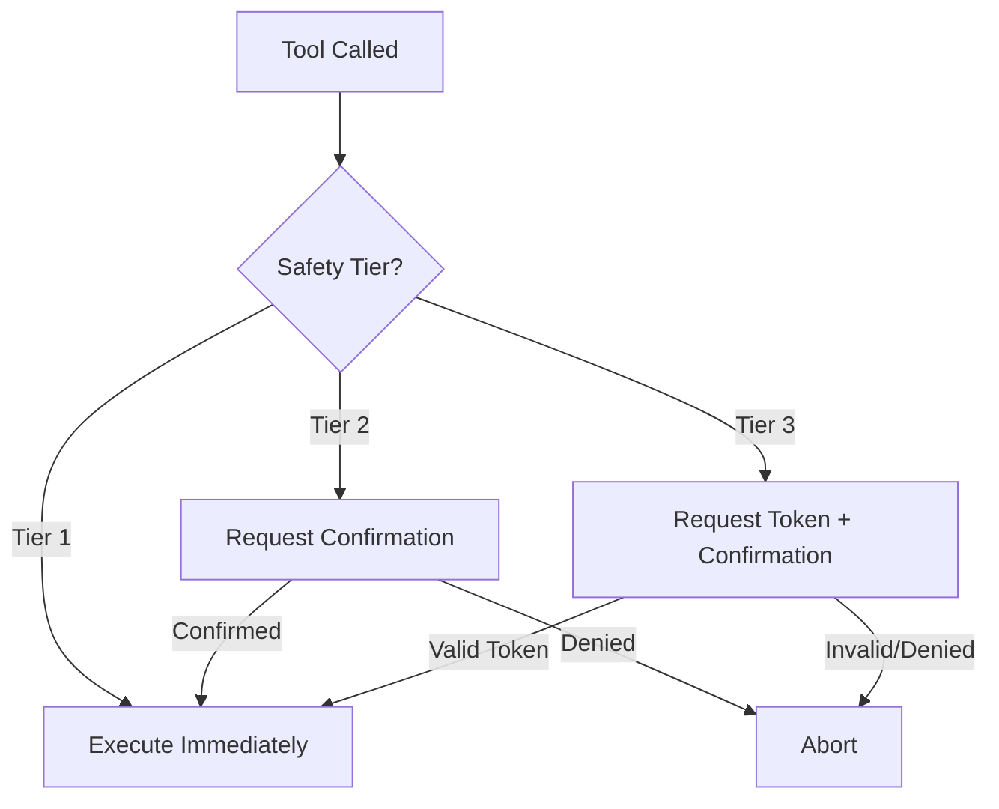
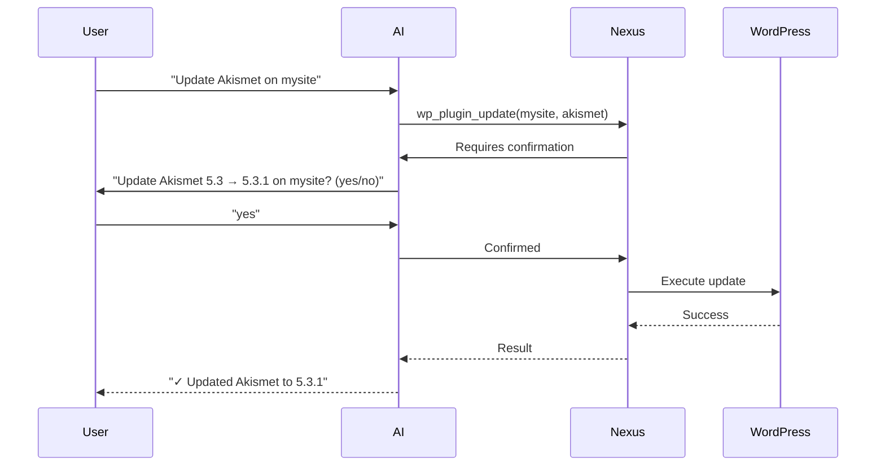
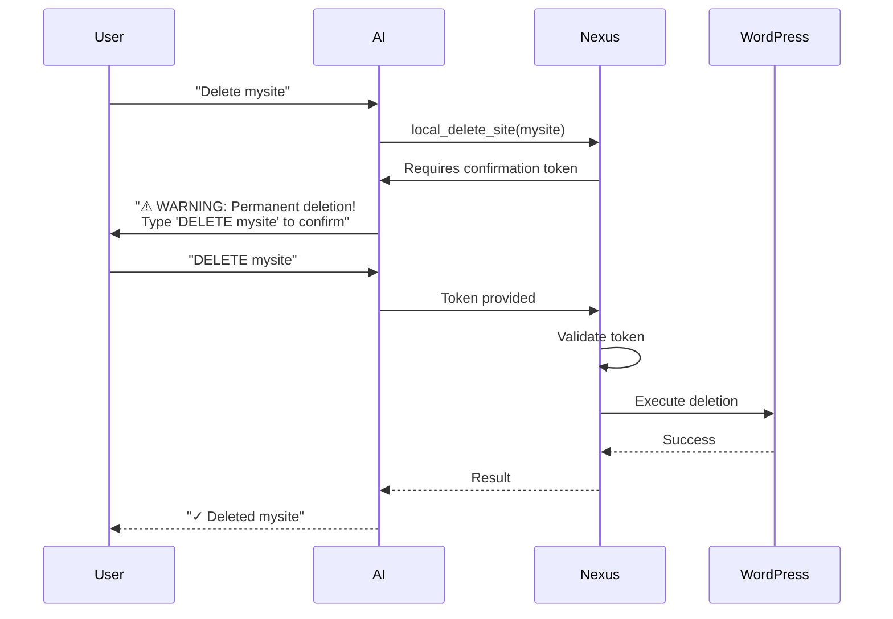

# Safety System

Nexus AI implements a 3-tier safety system to protect your WordPress sites from accidental or destructive operations.

## Overview

Every tool in Nexus AI is classified into one of three safety tiers based on risk level:

| Tier | Risk Level | Operations | Protection |
|------|-----------|-----------|------------|
| **Tier 1** | Safe | Read-only, list, search | None required |
| **Tier 2** | Caution | Updates, installs, config changes | Confirmation prompt |
| **Tier 3** | Destructive | Delete, reset, force operations | Token + confirmation |



## Tier 1: Safe Operations

**Risk:** None — Read-only operations that cannot modify site state.

**Protection:** Execute immediately without confirmation.

**Examples:**

```bash
# List sites
nexus list

# Search content
nexus search "query"

# List plugins
nexus plugin list mysite

# Get WordPress version
nexus wp mysite core version

# Diagnose WPE site
nexus wpe diagnose mysite-production
```

**Complete list of Tier 1 tools:**

| Category | Tools |
|----------|-------|
| **Site Discovery** | `nexus_list_sites`, `nexus_get_site_info` |
| **Search** | `search_site_content`, `search_posts`, `search_products`, `semantic_search` |
| **WordPress Read** | `wp_plugin_list`, `wp_theme_list`, `wp_user_list`, `wp_core_version`, `wp_option_get`, `wp_site_health` |
| **WPE Read** | `wpe_get_accounts`, `wpe_get_installs`, `wpe_get_sites`, `wpe_diagnose_site`, `wpe_environment_diff`, `wpe_get_domain`, `wpe_get_backup` |
| **Fleet** | `nexus_fleet_health` |
| **Telemetry** | `get_telemetry_status` |
| **Database** | `nexus_db_info`, `scan_database_health`, `get_database_recommendations`, `fleet_database_health` |

**Why no protection?**

These operations are inherently safe:

- ✅ Cannot modify data
- ✅ Cannot delete content
- ✅ Cannot change configuration
- ✅ Cannot affect site availability
- ✅ Read-only database queries

## Tier 2: Caution Operations

**Risk:** Medium — Operations that modify site state but are reversible.

**Protection:** Confirmation prompt before execution.

**Examples:**

```bash
# Update plugins
nexus plugin update mysite akismet
# → Prompt: "Update Akismet to 5.3.1 on mysite? (yes/no)"

# Activate plugin
nexus plugin activate mysite yoast-seo
# → Prompt: "Activate Yoast SEO on mysite? (yes/no)"

# Create backup
nexus wpe backup mysite-production
# → Prompt: "Create backup of mysite-production? (yes/no)"

# Update WordPress core
nexus wp mysite core update
# → Prompt: "Update WordPress to 6.4.3 on mysite? (yes/no)"
```

**Confirmation flow:**



**Complete list of Tier 2 tools:**

| Category | Tools |
|----------|-------|
| **WordPress Modify** | `wp_plugin_update`, `wp_plugin_install`, `wp_plugin_activate`, `wp_plugin_deactivate`, `wp_core_update` |
| **WPE Modify** | `wpe_create_backup`, `wpe_create_domain`, `wpe_update_domain`, `wpe_request_ssl_certificate`, `wpe_update_install`, `wpe_update_site`, `wpe_purge_cache` |
| **WPE Deploy** | `wpe_promote_to_production`, `wpe_copy_install` |
| **Local** | `local_start_site`, `local_stop_site`, `local_wpe_pull`, `local_wpe_push`, `local_create_backup` |
| **Database** | `nexus_db_optimize`, `nexus_db_export` |
| **Telemetry** | `set_telemetry_enabled`, `clear_telemetry_events` |

**Why confirmation required?**

These operations modify state but are generally safe:

- ⚠️ Change site configuration
- ⚠️ Update software versions
- ⚠️ Modify plugin states
- ⚠️ Create backups (uses resources)
- ⚠️ Deploy code changes

**Reversibility:**

Most Tier 2 operations can be reversed:

- ✅ Plugin updates can be rolled back
- ✅ Plugins can be reactivated/deactivated
- ✅ WordPress updates can be rolled back (with backup)
- ✅ Domains can be removed
- ✅ Caches rebuild automatically

## Tier 3: Destructive Operations

**Risk:** High — Irreversible operations that can result in data loss.

**Protection:** Confirmation token + explicit confirmation.

**Examples:**

```bash
# Delete site
nexus local delete-site mysite
# → Prompt: "⚠️ WARNING: This will permanently delete mysite including all data!"
# → "Type 'DELETE mysite' to confirm:"
# → Requires: DELETE mysite

# Delete WPE install
nexus wpe delete-install mysite-staging
# → Prompt: "⚠️ WARNING: This will permanently delete mysite-staging!"
# → "Recent backup: 2 hours ago"
# → "Type 'DELETE mysite-staging' to confirm:"
# → Requires: DELETE mysite-staging

# Reset database
nexus db reset
# → Prompt: "⚠️ WARNING: This will delete ALL indexed data!"
# → "Sites: 25, Documents: 45,678, Size: 233MB"
# → "Type 'DELETE' to confirm:"
# → Requires: DELETE

# Force plugin deactivation
nexus wp mysite plugin deactivate akismet --force
# → Prompt: "⚠️ WARNING: Force deactivation may break the site!"
# → "Type 'FORCE' to confirm:"
# → Requires: FORCE
```

**Confirmation flow:**



**Complete list of Tier 3 tools:**

| Category | Tools |
|----------|-------|
| **Deletion** | `local_delete_site`, `wpe_delete_install`, `wpe_delete_site`, `wpe_delete_domain`, `wpe_delete_ssh_key`, `wpe_delete_account_user` |
| **Database** | `nexus_db_reset`, `nexus_db_import` (overwrites existing), `clean_database_items` (requires confirmation token; `dry_run` defaults to `true`) |
| **WordPress** | `wp_plugin_deactivate --force`, `wp_search_replace` (without dry-run) |
| **WPE Deploy** | `wpe_promote_to_production --force` (skips safety checks) |
| **Telemetry** | `reset_telemetry` (generates new installation ID) |

**Why token required?**

These operations are **irreversible** and can cause **data loss**:

- ❌ Deleted sites cannot be recovered
- ❌ Deleted installs lose all data
- ❌ Database resets lose all indexed content
- ❌ Search/replace modifies database directly
- ❌ Force operations bypass safety checks

**Token format:**

The required confirmation token varies by operation:

| Operation | Token Format |
|-----------|-------------|
| Delete site | `DELETE <site-name>` |
| Delete install | `DELETE <install-name>` |
| Delete domain | `DELETE <domain>` |
| Reset database | `DELETE` |
| Force operation | `FORCE` |

## Pre-Flight Safety Checks

Before executing Tier 2 and Tier 3 operations, Nexus performs pre-flight checks:

### 1. Site Status Check

```typescript
async function checkSiteStatus(siteId: string) {
  const site = await getSite(siteId);

  // Check if site is running
  if (site.status !== 'running') {
    throw new SafetyError(
      `Site ${site.name} is not running`,
      'Start the site before performing operations'
    );
  }

  return true;
}
```

### 2. Backup Verification

For production deployments:

```typescript
async function checkBackupExists(installId: string) {
  const backups = await getBackups(installId);

  // Check for recent backup (within 24 hours)
  const recentBackup = backups.find(b =>
    Date.now() - b.created_at < 24 * 60 * 60 * 1000
  );

  if (!recentBackup) {
    return {
      warning: true,
      message: 'No recent backup found. Create backup first?'
    };
  }

  return { warning: false };
}
```

### 3. Environment Validation

For WPE operations:

```typescript
async function checkEnvironment(installId: string) {
  const install = await getInstall(installId);

  // Check install is active
  if (install.status !== 'active') {
    throw new SafetyError(
      `Install ${install.name} is not active`,
      'Wait for provisioning to complete'
    );
  }

  // Check for ongoing operations
  if (install.is_busy) {
    throw new SafetyError(
      `Install ${install.name} is busy`,
      'Wait for current operation to complete'
    );
  }

  return true;
}
```

### 4. Data Validation

For database operations:

```typescript
async function checkDatabaseSize(operation: string) {
  const info = await getDatabaseInfo();

  if (operation === 'reset' && info.documents > 10000) {
    return {
      warning: true,
      message: `This will delete ${info.documents} documents (${info.size}). Are you sure?`
    };
  }

  return { warning: false };
}
```

## Safety Best Practices

### 1. Always Create Backups First

Before any destructive operation:

```bash
# Create backup
nexus wpe backup mysite-production --description "Pre-deployment backup"

# Note the backup ID
# Backup ID: backup_abc123

# Now safe to proceed with changes
nexus wpe promote mysite

# Rollback if needed
nexus wpe rollback mysite backup_abc123
```

### 2. Test on Staging First

Never test destructive operations on production:

```bash
# ✅ Good: Test on staging
nexus wp mysite-staging plugin update --all
# Verify it works
nexus wpe diagnose mysite-staging

# Then apply to production
nexus wp mysite-production plugin update --all
```

### 3. Use Dry-Run Mode

Many commands support `--dry-run`:

```bash
# Check what would be updated (doesn't actually update)
nexus plugin update mysite --all --dry-run

# Check search/replace results before applying
nexus wp mysite search-replace 'old-domain.com' 'new-domain.com' --dry-run

# Check what would be deleted
nexus db reset --dry-run
```

### 4. Review Before Confirming

When AI assistants request confirmation, **read carefully**:

```
AI: I'll update WordPress on mysite-production to 6.4.3.

This will:
1. Download WordPress 6.4.3
2. Put site in maintenance mode
3. Update core files
4. Run database migrations
5. Remove maintenance mode

Current version: 6.4.2
Target version: 6.4.3

Recent backup: 2 hours ago (backup_xyz789)

Ready to proceed? (yes/no)

You: [READ EVERYTHING FIRST, then respond]
```

### 5. Understand Rollback Options

Know how to undo operations before performing them:

| Operation | Rollback Method |
|-----------|----------------|
| Plugin update | Reinstall previous version |
| WordPress update | Restore from backup |
| Plugin deactivate | Reactivate plugin |
| Domain change | Update domain back |
| WPE promotion | Restore from backup |
| Database reset | Restore from backup (if exists) |
| Site deletion | **NO ROLLBACK** (data loss) |

### 6. Verify After Operations

Always verify site health after modifications:

```bash
# After update
nexus wp mysite core version
nexus wp mysite plugin list
nexus wp mysite site health

# After deployment
nexus wpe diagnose mysite-production

# After changes
curl -I https://mysite.com  # Check HTTP response
```

## Disabling Safety Checks

!!! danger "Experts Only"
    Disabling safety checks can result in data loss. Only disable for automation scripts where you've implemented your own safety measures.

### Environment Variable

```bash
# Disable all safety checks (DANGEROUS!)
export NEXUS_SKIP_SAFETY=true
nexus db reset  # No confirmation required
```

### Command Flag

```bash
# Skip confirmation for specific command
nexus db reset --yes

# Force operation without checks
nexus wpe promote mysite --force
```

### Configuration

```json
{
  "safety": {
    "tier2_confirmation": false,  // Skip Tier 2 confirmations
    "tier3_confirmation": false,  // Skip Tier 3 confirmations (DANGEROUS!)
    "pre_flight_checks": false    // Skip pre-flight checks (DANGEROUS!)
  }
}
```

**Recommended for automation:**

```json
{
  "safety": {
    "tier2_confirmation": false,  // Auto-confirm updates
    "tier3_confirmation": true,   // Still require Tier 3 tokens
    "pre_flight_checks": true     // Keep safety checks enabled
  }
}
```

## Safety in AI Conversations

When using Nexus with AI assistants like Claude:

### Good Safety Practices

**1. AI explains before acting:**

```
You: Update all plugins on production

Claude: I'll update plugins on mysite-production. Let me first check what needs updating...

Found 3 updates:
- Akismet 5.3 → 5.3.1
- Yoast 21.8 → 21.9
- WooCommerce 8.5.1 → 8.5.2

This is a production site. Before proceeding, I recommend:
1. Verify recent backup exists (I can check)
2. Test these updates on staging first (if available)
3. Schedule during low-traffic hours

Would you like me to proceed, or check staging/backups first?
```

**2. User confirms explicitly:**

```
You: Yes, proceed with the updates

Claude: Proceeding with plugin updates on mysite-production...

[Executes updates]

✓ All updates completed successfully
✓ Site health check passed
✓ Verified site is responding

Production is now running the latest plugin versions.
```

**3. AI provides rollback info:**

```
Claude: Updates complete!

If any issues arise, you can roll back using:
- Backup ID: backup_abc123 (created 2 hours ago)
- Rollback command: nexus wpe rollback mysite backup_abc123

I'll monitor the site for the next few minutes. Let me know if you notice any issues.
```

### Poor Safety Practices

**❌ Acting without confirmation:**

```
You: Update production

AI: [immediately executes updates]
✓ Updated 15 plugins
```

**❌ Not explaining risks:**

```
You: Delete mysite

AI: Deleted mysite
```

**❌ Not providing rollback options:**

```
You: Deploy to production

AI: Deployed
```

## Safety Audit Log

All operations are logged for audit purposes:

**Log location:** `~/.nexus/logs/audit.log`

**Log format:**

```json
{
  "timestamp": "2026-03-20T10:30:00Z",
  "tool": "wp_plugin_update",
  "tier": 2,
  "params": {
    "site_id": "abc123",
    "plugin": "akismet"
  },
  "confirmed": true,
  "result": "success",
  "user": "claude-desktop",
  "duration_ms": 1234
}
```

**View recent operations:**

```bash
# Last 10 operations
tail -n 10 ~/.nexus/logs/audit.log | jq

# Destructive operations only (Tier 3)
cat ~/.nexus/logs/audit.log | jq 'select(.tier == 3)'

# Failed operations
cat ~/.nexus/logs/audit.log | jq 'select(.result == "error")'

# Operations by user
cat ~/.nexus/logs/audit.log | jq 'select(.user == "claude-desktop")'
```

## Error Recovery

If a destructive operation fails midway:

### 1. Check Site Status

```bash
# Is site responding?
curl -I https://mysite.com

# Is database accessible?
nexus wp mysite db check

# Any PHP errors?
nexus wp mysite site health
```

### 2. Review Audit Log

```bash
# What was the last operation?
tail -n 1 ~/.nexus/logs/audit.log | jq

# Did it complete?
cat ~/.nexus/logs/audit.log | jq 'select(.result == "error")' | tail -n 1
```

### 3. Restore from Backup

```bash
# List available backups
nexus wpe get-backups mysite-production

# Restore most recent
nexus wpe restore-backup mysite-production backup_xyz789
```

### 4. Manual Recovery

If backups aren't available:

```bash
# Deactivate all plugins
nexus wp mysite plugin deactivate --all

# Switch to default theme
nexus wp mysite theme activate twentytwentyfour

# Check for database corruption
nexus wp mysite db repair

# Verify checksums
nexus wp mysite core verify-checksums
nexus wp mysite plugin verify-checksums --all
```

## Next Steps

- [WP-CLI Integration](wp-cli-integration.md) - Remote command execution
- [CLI Examples](../cli/examples.md) - Safe operation patterns
- Error Codes - Error handling
- [Troubleshooting](../cli/troubleshooting.md) - Common issues
