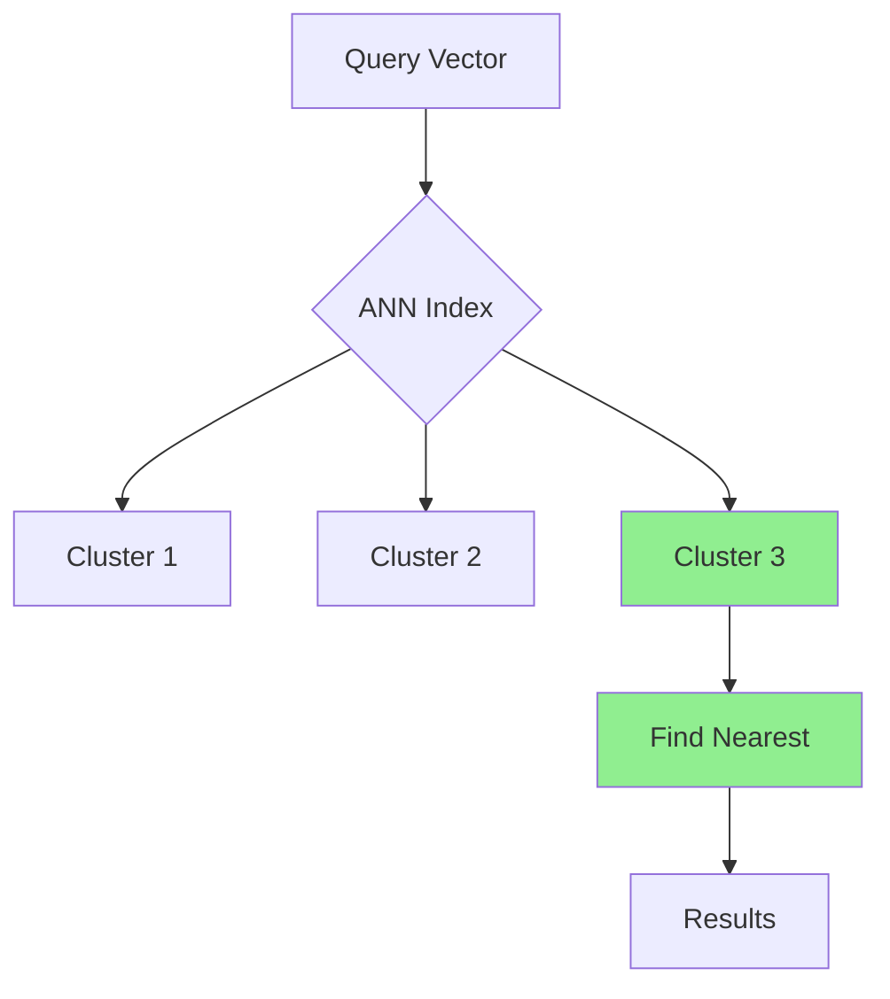
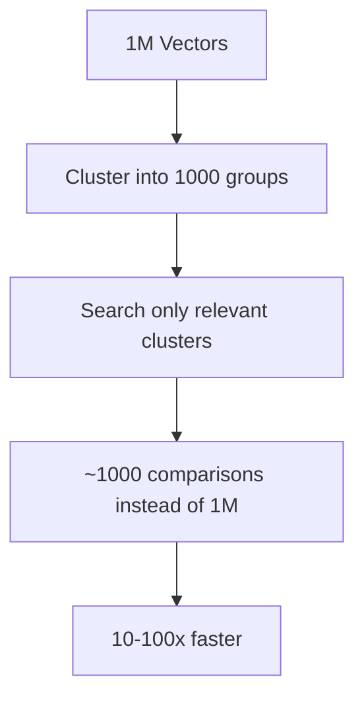
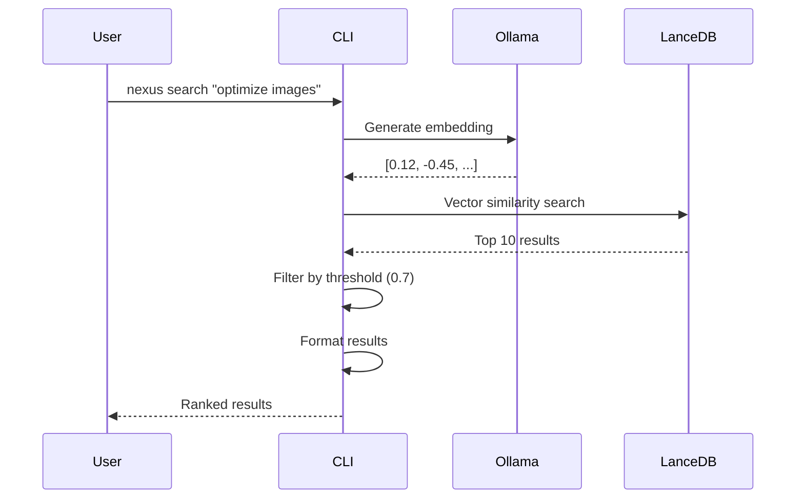

# Semantic Search

Deep dive into how Nexus AI uses vector embeddings for intelligent content search.

## What is Semantic Search?

**Semantic search** understands the **meaning** and **intent** behind search queries, not just keywords.

### Traditional Keyword Search

```
Query: "optimize images"

Keyword matching:
✓ Posts containing "optimize" AND "images"
✗ Posts about "compress photos"
✗ Posts about "reduce file sizes"
✗ Posts about "lazy loading pictures"
```

**Limitations:**

- Only finds exact word matches
- Misses synonyms and related concepts
- No understanding of context or intent
- Poor recall (misses relevant results)

### Semantic Search

```
Query: "optimize images"

Meaning-based matching:
✓ Posts containing "optimize images"
✓ Posts about "compress photos" (synonym)
✓ Posts about "reduce file sizes" (related concept)
✓ Posts about "lazy loading pictures" (implementation technique)
✓ Posts about "WebP conversion" (solution)
✓ Posts about "CDN for media" (optimization method)
```

**Advantages:**

- Understands meaning and intent
- Finds synonyms and related terms
- Recognizes context
- High recall (finds all relevant results)
- Works across languages (to an extent)

## How It Works

Semantic search in Nexus AI uses **vector embeddings** to represent text as points in high-dimensional space.


### Step 1: Text to Vectors

Text is converted into vectors (arrays of numbers) that capture semantic meaning.

**Example:**

```python
# Input text
"WordPress performance optimization"

# Output vector (384 dimensions)
[0.123, -0.456, 0.789, 0.234, -0.567, ..., 0.123]
```

**Why 384 dimensions?**

- Each dimension captures a different aspect of meaning
- More dimensions = more nuanced understanding
- 384 is the output size of `nomic-embed-text` model
- Balances accuracy vs computational cost

### Step 2: Semantic Similarity

Similar meanings produce similar vectors. Distance between vectors = semantic similarity.

```python
# Query
"optimize images"
→ [0.12, -0.45, 0.78, ...]

# Result 1: "compress pictures"
→ [0.13, -0.44, 0.79, ...]
Distance: 0.02 ← Very similar! ✓

# Result 2: "install WordPress"
→ [-0.23, 0.67, -0.12, ...]
Distance: 1.45 ← Not similar ✗
```

**Distance metric:** Cosine similarity (0 = identical, 1 = orthogonal, 2 = opposite)

### Step 3: Fast Search

LanceDB uses **Approximate Nearest Neighbors (ANN)** for fast vector search.

**Without ANN (brute force):**
- Compare query to every vector in database
- 1 million vectors = 1 million comparisons
- Slow: ~10 seconds

**With ANN (LanceDB):**
- Build hierarchical index
- Only search relevant clusters
- 1 million vectors = ~1,000 comparisons
- Fast: ~50-100ms



## The Embedding Model

Nexus AI uses **nomic-embed-text** via Ollama for generating embeddings.

### Model Specifications

| Property | Value |
|----------|-------|
| **Model** | nomic-embed-text |
| **Parameters** | 62M |
| **Dimensions** | 384 |
| **Context Length** | 8,192 tokens |
| **Speed** | ~100 embeddings/second (M1 Mac) |
| **Size** | 274MB |
| **License** | Apache 2.0 (open source) |

### Why nomic-embed-text?

**Advantages:**

- ✅ **Runs locally** — No API calls, no external dependencies
- ✅ **Fast** — Optimized for CPU inference
- ✅ **Small** — 274MB model size
- ✅ **High quality** — Competitive with larger models
- ✅ **Open source** — Apache 2.0 license
- ✅ **Privacy** — Content never leaves your machine

**Comparison to alternatives:**

| Model | Dimensions | Size | Speed | Quality |
|-------|-----------|------|-------|---------|
| nomic-embed-text | 384 | 274MB | ⚡⚡⚡ | ⭐⭐⭐⭐ |
| text-embedding-ada-002 (OpenAI) | 1536 | Cloud API | ⚡⚡ | ⭐⭐⭐⭐⭐ |
| all-MiniLM-L6-v2 | 384 | 80MB | ⚡⚡⚡⚡ | ⭐⭐⭐ |
| BAAI/bge-large-en-v1.5 | 1024 | 1.3GB | ⚡ | ⭐⭐⭐⭐⭐ |

**Trade-offs:**

- **Smaller models** (MiniLM) are faster but less accurate
- **Larger models** (BGE-large) are more accurate but slower
- **Cloud APIs** (OpenAI) are highest quality but require internet + costs
- **nomic-embed-text** balances all factors for local WordPress use

### Installation

Embeddings require Ollama with nomic-embed-text:

```bash
# Install Ollama (if not installed)
# macOS
brew install ollama

# Linux
curl -fsSL https://ollama.com/install.sh | sh

# Start Ollama service
ollama serve

# Pull nomic-embed-text model
ollama pull nomic-embed-text
```

**Verify installation:**

```bash
ollama list
```

You should see:
```
NAME                 ID              SIZE    MODIFIED
nomic-embed-text     latest          274MB   2 hours ago
```

## Vector Database: LanceDB

Nexus AI uses **LanceDB** for storing and searching vectors.

### Why LanceDB?

**Advantages:**

- ✅ **Embedded** — No separate server required
- ✅ **Fast** — Native Rust implementation
- ✅ **Scalable** — Handles millions of vectors
- ✅ **Columnar** — Efficient storage format
- ✅ **ACID** — Transactional guarantees
- ✅ **Open source** — Apache 2.0 license

**Comparison to alternatives:**

| Database | Type | Performance | Ease of Use |
|----------|------|-------------|-------------|
| **LanceDB** | Embedded | ⚡⚡⚡ | ⭐⭐⭐⭐⭐ |
| ChromaDB | Embedded | ⚡⚡ | ⭐⭐⭐⭐ |
| Pinecone | Cloud | ⚡⚡⚡⚡ | ⭐⭐⭐ |
| Weaviate | Server | ⚡⚡⚡⚡ | ⭐⭐ |
| Milvus | Server | ⚡⚡⚡⚡⚡ | ⭐⭐ |

### Storage Format

LanceDB uses a columnar format optimized for vectors:

```
~/.nexus/vectors.lance/
├── data/
│   ├── 0.lance          ← Vector data (binary)
│   ├── 1.lance
│   └── 2.lance
├── index/
│   └── ivf_pq.idx       ← ANN index
└── metadata.json        ← Schema and stats
```

**File sizes:**

| Vectors | Data Size | Index Size | Total |
|---------|-----------|------------|-------|
| 1,000 | ~2MB | ~100KB | ~2MB |
| 10,000 | ~20MB | ~1MB | ~21MB |
| 100,000 | ~200MB | ~10MB | ~210MB |
| 1,000,000 | ~2GB | ~100MB | ~2.1GB |

**Performance characteristics:**

| Vectors | Search Time | Insert Time (batch of 100) |
|---------|-------------|---------------------------|
| 1,000 | ~5ms | ~50ms |
| 10,000 | ~15ms | ~100ms |
| 100,000 | ~50ms | ~200ms |
| 1,000,000 | ~100ms | ~500ms |

## Search Algorithms

### Cosine Similarity

Measures the cosine of the angle between two vectors.

**Formula:**

```
similarity = (A · B) / (||A|| × ||B||)
```

Where:
- `A · B` = dot product of vectors A and B
- `||A||` = magnitude (length) of vector A
- `||B||` = magnitude of vector B

**Range:** -1 (opposite) to 1 (identical)

**Example:**

```python
import numpy as np

# Query vector
query = np.array([0.12, -0.45, 0.78])

# Result vector
result = np.array([0.13, -0.44, 0.79])

# Calculate cosine similarity
dot_product = np.dot(query, result)
magnitude_query = np.linalg.norm(query)
magnitude_result = np.linalg.norm(result)

similarity = dot_product / (magnitude_query * magnitude_result)
# similarity = 0.999 (very similar!)
```

**Why cosine?**

- ✅ Invariant to vector magnitude (only considers direction)
- ✅ Normalized to -1 to 1 range
- ✅ Efficient to compute
- ✅ Works well for text embeddings

### Approximate Nearest Neighbors (ANN)

For large datasets, exact nearest neighbor search is too slow. ANN trades a small amount of accuracy for massive speed gains.

**LanceDB uses IVF-PQ:**

1. **IVF (Inverted File Index)**
   - Cluster vectors into groups
   - Only search relevant clusters
   - Reduces search space by 10-100x

2. **PQ (Product Quantization)**
   - Compress vectors using clustering
   - Reduces memory usage by 8-16x
   - Slight accuracy loss (~1-2%)



**Configuration:**

```typescript
// Build ANN index
await table.createIndex('vector', {
  type: 'ivf_pq',
  num_partitions: 256,  // Number of clusters
  num_sub_vectors: 16   // PQ compression factor
});
```

**Trade-offs:**

| Index Type | Speed | Accuracy | Memory |
|------------|-------|----------|--------|
| Exact (brute force) | Slow | 100% | High |
| IVF | Fast | ~98% | Medium |
| IVF-PQ | Very fast | ~96% | Low |

## Search Pipeline

### Complete Search Flow



### Detailed Steps

**1. Query Preprocessing**

```typescript
function preprocessQuery(query: string): string {
  // Normalize whitespace
  query = query.trim().replace(/\s+/g, ' ');

  // Remove special characters (optional)
  // query = query.replace(/[^\w\s]/g, '');

  // Convert to lowercase (model-specific)
  // nomic-embed-text is case-sensitive, so we DON'T lowercase

  return query;
}
```

**2. Embedding Generation**

```typescript
async function embed(text: string): Promise<number[]> {
  const response = await ollama.embeddings({
    model: 'nomic-embed-text',
    prompt: text
  });

  return response.embedding; // 384 dimensions
}
```

**3. Vector Search**

```typescript
async function search(
  queryVector: number[],
  options: SearchOptions
): Promise<SearchResult[]> {
  const results = await table
    .search(queryVector)
    .limit(options.limit || 10)
    .where(buildFilter(options))
    .execute();

  return results.map(formatResult);
}
```

**4. Filtering**

```typescript
function buildFilter(options: SearchOptions): string {
  const conditions: string[] = [];

  // Filter by site
  if (options.site) {
    conditions.push(`site = '${options.site}'`);
  }

  // Filter by content type
  if (options.type && options.type !== 'all') {
    conditions.push(`post_type = '${options.type}'`);
  }

  // Filter by date (optional)
  if (options.after) {
    conditions.push(`published_at > '${options.after}'`);
  }

  return conditions.join(' AND ');
}
```

**5. Threshold Filtering**

```typescript
function filterByThreshold(
  results: SearchResult[],
  threshold: number
): SearchResult[] {
  return results.filter(r => r.score >= threshold);
}
```

**6. Result Formatting**

```typescript
function formatResult(row: any): SearchResult {
  return {
    site: row.site,
    post_id: row.post_id,
    post_type: row.post_type,
    title: row.title,
    excerpt: row.chunk_text,
    score: row._distance, // Cosine similarity
    url: buildURL(row),
    published_at: row.published_at
  };
}
```

## Optimizing Search Quality

### 1. Adjust Similarity Threshold

Control result precision vs recall:

```bash
# High threshold = precise (few, highly relevant)
nexus search "query" --threshold 0.9

# Medium threshold = balanced (default)
nexus search "query" --threshold 0.7

# Low threshold = broad (many, loosely related)
nexus search "query" --threshold 0.5
```

**Recommendation:**

| Use Case | Threshold |
|----------|-----------|
| Find exact duplicates | 0.95+ |
| Highly relevant results only | 0.8-0.9 |
| General search (default) | 0.7-0.8 |
| Exploratory research | 0.6-0.7 |
| Cast wide net | 0.5-0.6 |

### 2. Result Limits

Control number of results:

```bash
# Top 5 only
nexus search "query" --limit 5

# Top 20
nexus search "query" --limit 20

# Top 100 (may be slow)
nexus search "query" --limit 100
```

**Performance:**

| Limit | Search Time (100K vectors) |
|-------|---------------------------|
| 5 | ~50ms |
| 10 | ~60ms |
| 20 | ~80ms |
| 50 | ~120ms |
| 100 | ~200ms |

### 3. Query Formulation

**Be specific:**

❌ **Too broad:**
> "WordPress"

✅ **Specific:**
> "WordPress multisite configuration for large networks"

**Use complete sentences:**

❌ **Keywords:**
> "image lazy load cdn"

✅ **Natural language:**
> "How to implement lazy loading for images with a CDN"

**Provide context:**

❌ **Vague:**
> "performance"

✅ **Contextual:**
> "WordPress page load performance optimization techniques"

### 4. Multi-Query Refinement

Combine multiple searches for better coverage:

```bash
# Search multiple related queries
nexus search "WordPress performance" --limit 10
nexus search "page speed optimization" --limit 10
nexus search "caching strategies" --limit 10

# Merge and deduplicate results
```

## Real-World Examples

### Example 1: Content Discovery

**Goal:** Find all content about e-commerce.

```bash
# Single query
nexus search "e-commerce online store shopping cart" --limit 20

# Results:
# - WooCommerce setup guides
# - Payment gateway tutorials
# - Shipping configuration
# - Product page optimization
# - Checkout best practices
# - Security for online stores
```

**Why it works:**

- Model understands "e-commerce" = "online store" = "shopping cart"
- Finds related concepts (payments, shipping, products)
- No need to search for each term separately

### Example 2: Troubleshooting

**Goal:** Find solutions to a specific error.

```bash
nexus search "WordPress white screen of death after plugin update"

# Results:
# - "Debugging WordPress Crashes"
# - "Plugin Conflicts and How to Fix Them"
# - "Recovering from Fatal Errors"
# - "PHP Memory Limit Issues"
# - "How to Disable Plugins via FTP"
```

**Why it works:**

- "White screen of death" → "fatal error" → "crash" (synonyms)
- "After plugin update" → context about the cause
- Finds solutions, not just posts mentioning the error

### Example 3: Cross-Site Search

**Goal:** Find products across all WooCommerce sites.

```bash
nexus search "blue widgets under $50" --type product

# Results across multiple sites:
# shop: Blue Widget Pro ($49.99)
# store: Royal Blue Gadget ($45.00)
# test-shop: Navy Blue Widget ($39.99)
```

**Why it works:**

- "blue" matches color variants (royal blue, navy blue)
- "$50" understood as price constraint
- Searches across all sites simultaneously

### Example 4: Content Gaps

**Goal:** Find what content is missing.

```bash
# Search for a topic
nexus search "WordPress REST API" --limit 20

# If few results (< 3), it's a content gap!
# Create content to fill the gap
```

**Automated gap analysis:**

```bash
#!/bin/bash
TOPICS="REST-API Gutenberg WP-CLI Multisite Custom-Post-Types"

for topic in $TOPICS; do
  count=$(nexus search "$topic" --format json | jq 'length')
  if [ $count -lt 3 ]; then
    echo "Content gap: $topic ($count posts)"
  fi
done
```

### Example 5: Multilingual Search

**Goal:** Find content in multiple languages.

```bash
# English query
nexus search "WordPress performance optimization"

# Can find:
# - English posts about performance
# - Spanish posts about "optimización de rendimiento"
# - French posts about "optimisation des performances"
# (if model is multilingual)
```

!!! note "Language Support"
    `nomic-embed-text` has some multilingual capability but works best in English. For strong multilingual support, consider switching to `multilingual-e5-large` via Ollama.

## Performance Tuning

### Database Optimization

**Periodic optimization:**

```bash
# Compact database
nexus db optimize

# Rebuilds indices, runs VACUUM, analyzes query plans
```

**Results:**

- Frees unused space (10-20% reduction)
- Faster queries (5-10% improvement)
- Better query plans

### Index Tuning

**Rebuild ANN index:**

```typescript
// Rebuild with optimal parameters
await table.createIndex('vector', {
  type: 'ivf_pq',
  num_partitions: Math.sqrt(totalVectors), // Rule of thumb
  num_sub_vectors: 16
});
```

**When to rebuild:**

- After large bulk imports
- If search performance degrades
- When changing search patterns

### Chunking Strategy

**Current strategy:**

- 256 tokens per chunk
- 20% overlap between chunks
- Sentence boundary splitting

**Tuning:**

```typescript
// Smaller chunks = more precise, more vectors
const chunkSize = 128; // tokens

// Larger chunks = less precise, fewer vectors
const chunkSize = 512; // tokens

// More overlap = better context preservation
const overlap = 0.3; // 30%

// Less overlap = fewer vectors, less redundancy
const overlap = 0.1; // 10%
```

**Trade-offs:**

| Chunk Size | Precision | Index Size | Search Time |
|------------|-----------|------------|-------------|
| 128 tokens | ⚡⚡⚡⚡ | 2x | 1.5x |
| 256 tokens | ⚡⚡⚡ | 1x (default) | 1x |
| 512 tokens | ⚡⚡ | 0.5x | 0.7x |

## Troubleshooting

### No Results Found

**Possible causes:**

1. **Sites not scanned:**
   ```bash
   nexus db info  # Check document count
   nexus scan --force  # Re-scan
   ```

2. **Threshold too high:**
   ```bash
   nexus search "query" --threshold 0.5
   ```

3. **Content doesn't exist:**
   ```bash
   # Try broader query
   nexus search "WordPress" --limit 50
   ```

### Irrelevant Results

**Solutions:**

1. **Increase threshold:**
   ```bash
   nexus search "query" --threshold 0.85
   ```

2. **Be more specific:**
   ```bash
   # Too broad
   nexus search "WordPress"

   # More specific
   nexus search "WordPress REST API authentication with JWT"
   ```

3. **Filter by type:**
   ```bash
   nexus search "query" --type post
   ```

### Slow Search

**Solutions:**

1. **Optimize database:**
   ```bash
   nexus db optimize
   ```

2. **Reduce limit:**
   ```bash
   nexus search "query" --limit 10
   ```

3. **Filter by site:**
   ```bash
   nexus search "query" --site mysite
   ```

4. **Rebuild index:**
   ```bash
   nexus db reset
   nexus scan --force
   ```

## Next Steps

- [Content Extraction](content-extraction.md) - What gets indexed
- [Vector Database](../architecture/vector-database.md) - LanceDB internals
- [First Scan](../getting-started/first-scan.md) - Indexing process
- [First AI Query](../getting-started/first-ai-query.md) - Search examples
