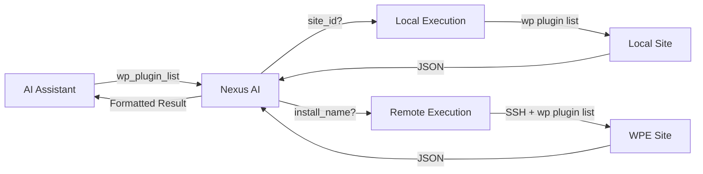
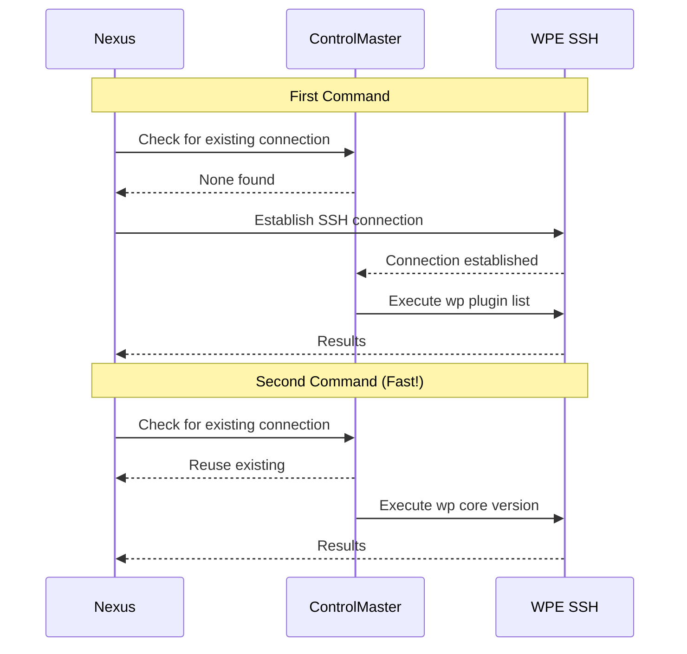

# WP-CLI Integration

Execute WP-CLI commands on both local and remote WordPress sites through a unified interface.

## Overview

Nexus AI provides seamless WP-CLI execution across your entire WordPress fleet:

- ✅ **Local sites** - Direct filesystem and database access
- ✅ **WP Engine sites** - Remote execution via SSH
- ✅ **Unified API** - Same interface for local and remote
- ✅ **SSH pooling** - Fast repeated commands on WPE
- ✅ **Safety checks** - Automatic validation before execution
- ✅ **Output parsing** - Structured JSON responses



## Local vs Remote Execution

### Local Execution

**How it works:**

1. Detect site path from Local Sites directory
2. Execute WP-CLI binary directly
3. Parse output and return results

**Advantages:**

- ⚡ Fast (~200-500ms per command)
- 🔒 No network latency
- 📝 Full command support
- 🎯 Direct database access

**Example:**

```bash
# Via CLI
nexus wp mysite plugin list

# Via MCP (AI assistant)
wp_plugin_list({ site_id: "abc123" })
```

**Behind the scenes:**

```bash
# Nexus executes:
cd /Users/me/Local\ Sites/mysite/app/public
wp plugin list --format=json
```

### Remote Execution (WP Engine)

**How it works:**

1. Look up WPE install SSH credentials
2. Establish SSH connection (or reuse existing)
3. Execute WP-CLI command via SSH
4. Parse remote output and return results

**Advantages:**

- 🌐 Access production sites remotely
- 🔄 No need to pull sites locally
- ⚡ Connection pooling (fast repeated calls)
- 🔒 Secure SSH authentication

**Example:**

```bash
# Via CLI
nexus wp mysite-production plugin list

# Via MCP (AI assistant)
wp_plugin_list({ install_name: "mysite-production" })
```

**Behind the scenes:**

```bash
# Nexus executes:
ssh -o ControlMaster=auto \
    -o ControlPath=~/.ssh/wpe-%r@%h:%p \
    -o ControlPersist=10m \
    user@mysite.ssh.wpengine.net \
    wp plugin list --format=json
```

## Supported Commands

### Plugin Management

#### List Plugins

```bash
# Local
nexus wp mysite plugin list

# Remote
nexus wp mysite-production plugin list

# Filter by status
nexus wp mysite plugin list --status=active

# Get specific fields
nexus wp mysite plugin list --field=name,version,update
```

**Output:**

```json
[
  {
    "name": "akismet",
    "status": "active",
    "update": "available",
    "version": "5.3",
    "update_version": "5.3.1"
  },
  {
    "name": "yoast-seo",
    "status": "active",
    "update": "none",
    "version": "21.9"
  }
]
```

#### Update Plugins

```bash
# Update specific plugin
nexus wp mysite plugin update akismet

# Update all plugins
nexus wp mysite plugin update --all

# Dry run (check what would be updated)
nexus wp mysite plugin update --all --dry-run
```

#### Activate/Deactivate

```bash
# Activate plugin
nexus wp mysite plugin activate akismet

# Deactivate plugin
nexus wp mysite plugin deactivate akismet

# Activate multiple
nexus wp mysite plugin activate akismet yoast-seo
```

#### Install Plugins

```bash
# Install from WordPress.org
nexus wp mysite plugin install akismet

# Install and activate
nexus wp mysite plugin install akismet --activate

# Install specific version
nexus wp mysite plugin install akismet --version=5.3
```

### Core Management

#### WordPress Version

```bash
# Get version
nexus wp mysite core version

# Output: 6.4.3
```

#### Update WordPress

```bash
# Update to latest
nexus wp mysite core update

# Update to specific version
nexus wp mysite core update --version=6.4.3

# Dry run
nexus wp mysite core update --dry-run
```

#### Verify Checksums

```bash
# Verify core files
nexus wp mysite core verify-checksums

# Verify specific version
nexus wp mysite core verify-checksums --version=6.4.3
```

### User Management

#### List Users

```bash
# All users
nexus wp mysite user list

# Filter by role
nexus wp mysite user list --role=administrator

# Specific fields
nexus wp mysite user list --field=ID,user_login,user_email
```

**Output:**

```json
[
  {
    "ID": "1",
    "user_login": "admin",
    "user_email": "admin@mysite.com",
    "roles": "administrator"
  }
]
```

#### Create Users

```bash
# Create user
nexus wp mysite user create johndoe john@example.com \
  --role=editor \
  --user_pass=changeme \
  --first_name=John \
  --last_name=Doe
```

#### Update Users

```bash
# Change email
nexus wp mysite user update admin --user_email=newemail@example.com

# Change role
nexus wp mysite user update 2 --role=administrator

# Reset password
nexus wp mysite user reset-password admin
```

### Database Operations

#### Export Database

```bash
# Export to file
nexus wp mysite db export /tmp/backup.sql

# Export and compress
nexus wp mysite db export - | gzip > /tmp/backup.sql.gz

# Export specific tables
nexus wp mysite db export --tables=wp_posts,wp_postmeta
```

#### Optimize Database

```bash
# Optimize all tables
nexus wp mysite db optimize

# Repair tables
nexus wp mysite db repair

# Check database
nexus wp mysite db check
```

#### Search and Replace

```bash
# Dry run (see what would change)
nexus wp mysite search-replace 'http://old-domain.com' 'https://new-domain.com' --dry-run

# Perform replacement
nexus wp mysite search-replace 'http://old-domain.com' 'https://new-domain.com'

# Skip GUIDs
nexus wp mysite search-replace 'old.com' 'new.com' --skip-columns=guid
```

### Site Health

#### Health Check

```bash
# Get site health status
nexus wp mysite site health

# Detailed report
nexus wp mysite site health --format=json
```

**Output:**

```json
{
  "status": "good",
  "tests": {
    "wordpress_version": "pass",
    "plugin_version": "pass",
    "theme_version": "pass",
    "php_version": "pass",
    "sql_server": "pass",
    "https_status": "pass"
  }
}
```

### Options

#### Get Options

```bash
# Get single option
nexus wp mysite option get siteurl

# Get multiple options
nexus wp mysite option get siteurl home admin_email
```

#### Set Options

```bash
# Set option
nexus wp mysite option set blogname "My New Site Name"

# Set with auto-load
nexus wp mysite option update timezone_string "America/Los_Angeles" --autoload=yes
```

### Theme Management

#### List Themes

```bash
# List all themes
nexus wp mysite theme list

# Active theme only
nexus wp mysite theme list --status=active
```

#### Activate Theme

```bash
# Activate theme
nexus wp mysite theme activate twentytwentyfour
```

## SSH Connection Pooling

For WP Engine sites, Nexus uses **SSH ControlMaster** for connection pooling.

### How It Works



### Configuration

SSH ControlMaster is configured automatically:

```bash
# Control socket path
~/.ssh/wpe-%r@%h:%p

# Connection persistence
10 minutes (configurable)

# Auto-cleanup
Connections close after 10 minutes of inactivity
```

### Performance

| Command | First Call | Subsequent Calls |
|---------|-----------|------------------|
| **Without ControlMaster** | ~2-3 seconds | ~2-3 seconds |
| **With ControlMaster** | ~2-3 seconds | ~100-200ms |

**Example:**

```bash
# First call: Establishes connection (~2.5s)
nexus wp mysite-prod plugin list

# Subsequent calls: Reuse connection (~150ms)
nexus wp mysite-prod core version
nexus wp mysite-prod user list
nexus wp mysite-prod option get siteurl
```

### Managing Connections

```bash
# List active connections
ssh -O check mysite.ssh.wpengine.net 2>&1

# Close specific connection
ssh -O exit mysite.ssh.wpengine.net

# Close all WPE connections
for socket in ~/.ssh/wpe-*; do
  ssh -o ControlPath=$socket -O exit dummy
done
```

## Security and Safety

### Blocked Commands (Remote Only)

For security, these WP-CLI commands are **blocked on remote WP Engine sites**:

| Command | Reason |
|---------|--------|
| `db query` | SQL injection risk |
| `eval` | Arbitrary code execution |
| `eval-file` | Arbitrary code execution |
| `shell` | Shell access |

**Workaround:** Pull site to local first:

```bash
# Pull WPE site to local
nexus local wpe-pull mysite --remote-install-id=abc123

# Run commands locally
nexus wp mysite db query "SELECT * FROM wp_posts"

# Push changes back if needed
nexus local wpe-push mysite --remote-install-id=abc123
```

### Pre-Flight Checks

Before executing commands, Nexus performs safety checks:

**1. Site Status**
```typescript
if (site.status !== 'running') {
  throw new Error('Site must be running');
}
```

**2. WP-CLI Availability**
```bash
# Check WP-CLI is installed
wp --info
```

**3. WordPress Detection**
```bash
# Verify WordPress installation
wp core is-installed
```

**4. Command Validation**
```typescript
// Block dangerous commands on remote
if (isRemote && BLOCKED_COMMANDS.includes(command)) {
  throw new Error(`Command '${command}' is not allowed on remote sites`);
}
```

## Error Handling

### Common Errors

#### Site Not Found

```json
{
  "error": "Site not found: mysite",
  "code": "SITE_NOT_FOUND",
  "suggestion": "Use nexus_list_sites to find available sites"
}
```

#### Site Not Running

```json
{
  "error": "Site mysite is not running",
  "code": "SITE_NOT_RUNNING",
  "suggestion": "Start the site in Local before running WP-CLI commands"
}
```

#### WP-CLI Not Found

```json
{
  "error": "WP-CLI not found",
  "code": "WP_CLI_NOT_FOUND",
  "suggestion": "Install WP-CLI: https://wp-cli.org"
}
```

#### SSH Connection Failed

```json
{
  "error": "SSH connection failed to mysite.ssh.wpengine.net",
  "code": "SSH_ERROR",
  "details": "Connection timeout after 30 seconds",
  "suggestion": "Check internet connection and WPE credentials"
}
```

#### Command Failed

```json
{
  "error": "WP-CLI command failed: Plugin not found",
  "code": "WP_CLI_ERROR",
  "command": "plugin activate nonexistent",
  "stderr": "Error: The plugin 'nonexistent' could not be found."
}
```

### Error Recovery

```typescript
// Automatic retry for transient errors
async function executeWPCLI(params) {
  const maxRetries = 3;
  let attempt = 0;

  while (attempt < maxRetries) {
    try {
      return await exec(params);
    } catch (error) {
      if (isTransient(error) && attempt < maxRetries - 1) {
        attempt++;
        await sleep(1000 * attempt); // Exponential backoff
        continue;
      }
      throw error;
    }
  }
}
```

## Advanced Usage

### Custom Commands

Execute any WP-CLI command:

```bash
# Get theme info
nexus wp mysite eval "echo wp_get_theme()->get('Version');"

# Custom query
nexus wp mysite post list --post_type=product --field=ID,post_title

# Export specific data
nexus wp mysite export --dir=/tmp/export --post_type=page

# Import content
nexus wp mysite import /tmp/export.xml --authors=create
```

### Piping Commands

Chain WP-CLI commands together:

```bash
# Get IDs and delete
nexus wp mysite post list --post_status=draft --format=ids | \
  xargs nexus wp mysite post delete

# Export and compress
nexus wp mysite db export - | gzip > backup.sql.gz

# Search and replace with backup
nexus wp mysite db export - > backup.sql && \
nexus wp mysite search-replace old.com new.com
```

### Batch Operations

Execute commands across multiple sites:

```bash
# Update WordPress on all production sites
for install in $(nexus wpe installs --environment production --format json | jq -r '.[].name'); do
  echo "Updating $install..."
  nexus wp $install core update
done

# Check health across all sites
for site in $(nexus list --local --running --format json | jq -r '.[].name'); do
  echo "Health check: $site"
  nexus wp $site site health
done
```

### Output Formatting

WP-CLI supports multiple output formats:

```bash
# JSON (default for Nexus)
nexus wp mysite plugin list --format=json

# CSV
nexus wp mysite plugin list --format=csv

# Table
nexus wp mysite plugin list --format=table

# YAML
nexus wp mysite plugin list --format=yaml

# Count only
nexus wp mysite plugin list --format=count

# IDs only
nexus wp mysite post list --format=ids
```

## Performance Optimization

### Local Execution

**Fast by default:**
- Direct filesystem access
- No network overhead
- Subprocess execution ~200-500ms

**Tips:**
- Use `--format=json` for structured data
- Limit fields with `--field=` to reduce output
- Use `--quiet` to suppress warnings

### Remote Execution

**SSH ControlMaster provides:**
- Connection reuse (10min persistence)
- ~10x speedup for repeated commands
- Automatic cleanup

**Tips:**
- Group related commands together
- Use bulk operations when possible
- Keep connections alive during batch operations

### Parallel Execution

Execute commands in parallel for multiple sites:

```typescript
// Execute on 10 sites in parallel
const sites = ['site1', 'site2', ..., 'site10'];

const results = await Promise.all(
  sites.map(site => nexus.wp(site, 'plugin list'))
);
```

**Performance:**

| Sites | Sequential | Parallel (5) | Parallel (10) |
|-------|-----------|-------------|---------------|
| 10 | ~30 seconds | ~12 seconds | ~6 seconds |
| 50 | ~2.5 minutes | ~1 minute | ~30 seconds |

## Troubleshooting

### Command Hangs

**Cause:** SSH connection timeout or unresponsive site

**Solution:**
```bash
# Kill hung SSH connections
pkill -f "ssh.*wpengine"

# Close ControlMaster sockets
rm ~/.ssh/wpe-*

# Try again
nexus wp mysite-prod plugin list
```

### "WP-CLI not found" on Local Site

**Cause:** WP-CLI not in PATH or not installed

**Solution:**
```bash
# Check WP-CLI location
which wp

# Install WP-CLI
brew install wp-cli  # macOS
# Or download: https://wp-cli.org

# Verify
wp --version
```

### "Permission denied" Errors

**Cause:** File permissions on site files

**Solution:**
```bash
# Fix permissions on Local site
chmod -R 755 ~/Local\ Sites/mysite/app/public

# Fix ownership
chown -R $(whoami) ~/Local\ Sites/mysite/app/public
```

### Remote Commands Fail

**Cause:** WPE SSH credentials or network issues

**Solution:**
```bash
# Test SSH connection
ssh user@mysite.ssh.wpengine.net 'wp --info'

# Check WPE credentials in Local
# Local → Connect → WP Engine
# Verify signed in

# Check internet connection
ping wpengine.com
```

## Next Steps

- [Safety System](safety-system.md) - Understanding command safety tiers
- [CLI Examples](../cli/examples.md) - Real-world WP-CLI usage patterns
- [WPE Integration](../architecture/wpe-integration.md) - SSH and CAPI details
- [Bulk Operations](../cli/bulk-operations.md) - Fleet-wide operations
