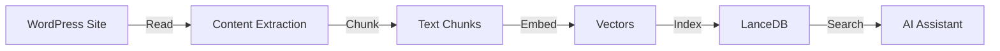

# Your First Scan

Learn what happens when Nexus AI scans and indexes your WordPress sites.

## What is a Scan?

A **scan** is the process of:

1. **Reading** your WordPress site's content and structure
2. **Chunking** content into searchable segments
3. **Embedding** text into 384-dimensional vectors
4. **Indexing** vectors into the LanceDB database

After scanning, you can use semantic search, AI chat, and other intelligent features across all your WordPress content.



## Running Your First Scan

### Via UI

1. Open **Nexus AI** sidebar (toolbar icon)
2. Click **Fleet Overview**
3. Click **Scan All Sites** button
4. Watch progress in real-time


### Via CLI

```bash
# Scan all sites
nexus scan

# Scan specific site
nexus scan mysite

# Force re-scan (even if recently scanned)
nexus scan --force
```

## What Happens During a Scan

### Phase 1: Content Extraction (2-3 seconds)

Nexus reads your WordPress site's content directly from the filesystem and MySQL database.

**What gets read:**

```
/Users/you/Local Sites/mysite/
├── app/
│   └── public/
│       ├── wp-content/
│       │   ├── themes/        ← Theme info
│       │   ├── plugins/       ← Plugin info
│       │   └── uploads/       ← Media metadata
│       └── wp-config.php      ← DB credentials
└── conf/
    └── mysql/
        └── data/              ← Direct DB access
            └── local/
                ├── wp_posts   ← Posts & pages
                ├── wp_postmeta ← Custom fields
                ├── wp_users   ← User info
                └── ...
```

**Database queries executed:**

```sql
-- Posts and pages
SELECT * FROM wp_posts WHERE post_status = 'publish' AND post_type IN ('post', 'page');

-- WooCommerce products
SELECT * FROM wp_posts WHERE post_type = 'product';

-- ACF fields
SELECT * FROM wp_postmeta WHERE meta_key LIKE 'field_%';

-- Media
SELECT * FROM wp_posts WHERE post_type = 'attachment';

-- Users (no PII)
SELECT ID, user_login, display_name FROM wp_users;
```

**Output:**

```
✓ Found 5,432 posts
✓ Found 342 pages
✓ Found 1,234 products
✓ Found 890 media files
✓ Found 234 ACF fields
✓ Found 15 themes
✓ Found 28 plugins
```

### Phase 2: Chunking (1-2 seconds)

Content is split into chunks at sentence boundaries for better search granularity.

**Why chunk?**

- ✅ Better search precision (find specific paragraphs, not whole posts)
- ✅ Larger posts stay within context windows
- ✅ More relevant results (match exact sentences)

**Example chunking:**

```markdown
<!-- Original post (2,000 words) -->
# How to Optimize WordPress Performance

WordPress performance is crucial for user experience. Studies show...
[30 more sentences]

<!-- Chunked into 15 segments -->
Chunk 1: "WordPress performance is crucial for user experience. Studies show that a 1-second delay reduces conversions by 7%."

Chunk 2: "Caching is the most effective performance optimization. WordPress generates pages dynamically, which is slow."

Chunk 3: "Image optimization reduces bandwidth usage. Use WebP format and lazy loading for best results."
...
```

**Chunking strategy:**

- **Max tokens per chunk:** 256 tokens (~192 words)
- **Boundary detection:** Sentence endings (`.`, `!`, `?`)
- **Overlap:** 20% overlap between chunks (preserves context)

### Phase 3: Embedding (2-4 seconds)

Text chunks are converted into 384-dimensional vectors using the `nomic-embed-text` model (via Ollama).

**What is an embedding?**

An embedding is a numerical representation of text meaning:

```python
# Text
"WordPress performance optimization"

# Embedding (384 dimensions)
[0.123, -0.456, 0.789, ..., -0.234]  # 384 numbers
```

**Why vectors?**

- ✅ **Semantic similarity** — Texts with similar meaning have similar vectors
- ✅ **Fast search** — Vector similarity is mathematically efficient
- ✅ **Language understanding** — Captures synonyms, context, intent

**Example similarity:**

```
Query:    "optimize images"     → [0.12, -0.45, 0.78, ...]
Result 1: "compress pictures"   → [0.13, -0.44, 0.79, ...]  ✅ Similar!
Result 2: "install WordPress"   → [-0.23, 0.67, -0.12, ...] ✗ Not similar
```

**Performance:**

- **Speed:** ~100 chunks/second (on M1 Mac)
- **Model:** `nomic-embed-text` (62M parameters)
- **Output:** 384-dimensional vectors
- **Precision:** float32 (4 bytes × 384 = 1.5KB per vector)

### Phase 4: Indexing (1-2 seconds)

Vectors are stored in LanceDB with metadata for fast retrieval.

**What gets stored:**

```json
{
  "chunk_id": "abc123",
  "site": "mysite",
  "post_id": 123,
  "post_type": "post",
  "title": "WordPress Performance Guide",
  "chunk_text": "Caching is the most effective...",
  "chunk_index": 2,
  "vector": [0.123, -0.456, ...],  // 384 dimensions
  "created_at": "2026-03-20T10:30:00Z"
}
```

**Database structure:**

```
nexus.db (SQLite + Lance files)
├── sites                 ← Site metadata (25 rows)
├── scans                 ← Scan history (157 rows)
├── documents             ← Document metadata (45,678 rows)
└── embeddings.lance/     ← Vector index (LanceDB)
    ├── data/             ← Vector data files
    └── index/            ← ANN index for fast search
```

**Index size:**

| Site Size | Documents | Vectors | Index Size |
|-----------|-----------|---------|------------|
| Small (100 posts) | 500 | 1,200 | ~2MB |
| Medium (1,000 posts) | 5,000 | 12,000 | ~20MB |
| Large (10,000 posts) | 50,000 | 120,000 | ~200MB |
| E-commerce (5,000 products) | 25,000 | 60,000 | ~100MB |

## What Gets Indexed

### Posts and Pages ✅

```json
{
  "post_id": 123,
  "post_type": "post",
  "title": "WordPress Performance Guide",
  "content": "Full post content...",
  "excerpt": "Short excerpt...",
  "meta": {
    "yoast_title": "SEO-optimized title",
    "yoast_description": "Meta description",
    "custom_field": "Custom value"
  },
  "author": "admin",
  "published_at": "2026-01-15T10:30:00Z",
  "modified_at": "2026-02-20T14:15:00Z"
}
```

**Indexed fields:**

- Title
- Content (full text, including HTML stripped)
- Excerpt
- Post meta (Yoast SEO, custom fields)
- Author display name
- Publication date
- Last modified date

### WooCommerce Products ✅

```json
{
  "post_id": 456,
  "post_type": "product",
  "title": "Blue Widget Pro",
  "content": "Product description...",
  "meta": {
    "_price": "99.99",
    "_regular_price": "129.99",
    "_sale_price": "99.99",
    "_sku": "BWP-001",
    "_stock_status": "instock",
    "_stock": "50",
    "attribute_color": "Blue",
    "attribute_size": "Large"
  }
}
```

**Indexed product data:**

- Product name and description
- Price (regular, sale, current)
- SKU
- Stock status and quantity
- Product attributes (color, size, etc.)
- Product categories and tags
- Product variations

### ACF Fields ✅

```json
{
  "post_id": 789,
  "post_type": "post",
  "acf": {
    "hero_title": "Welcome to Our Site",
    "hero_subtitle": "We build amazing things",
    "features": [
      {"title": "Fast", "description": "Lightning quick"},
      {"title": "Secure", "description": "Bank-level security"}
    ],
    "testimonials": [
      {"name": "John Doe", "quote": "Best service ever!"}
    ]
  }
}
```

**Supported ACF field types:**

- Text
- Textarea
- WYSIWYG
- Repeater (nested)
- Group (nested)
- Flexible Content (nested)
- Select, Radio, Checkbox (labels)

### Media Attachments ✅

```json
{
  "post_id": 234,
  "post_type": "attachment",
  "title": "hero-image.jpg",
  "meta": {
    "_wp_attachment_image_alt": "Hero image of mountain sunset",
    "caption": "Beautiful sunset over mountains",
    "description": "Landscape photo from vacation"
  }
}
```

**Indexed media data:**

- Filename
- Alt text
- Caption
- Description
- EXIF data (camera, location — if present)

### Themes and Plugins ✅

```json
{
  "type": "plugin",
  "slug": "akismet",
  "name": "Akismet Anti-Spam",
  "version": "5.3.1",
  "description": "Used by millions, Akismet is the best way...",
  "author": "Automattic",
  "active": true
}
```

**Indexed software:**

- Plugin/theme name
- Version number
- Description
- Author
- Active status
- Update available

### Users ✅ (No PII)

```json
{
  "user_id": 1,
  "user_login": "admin",
  "display_name": "John Doe",
  "roles": ["administrator"],
  "registered_at": "2025-01-01T00:00:00Z"
}
```

**Indexed user data:**

- User ID
- Username
- Display name
- Roles
- Registration date

**NOT indexed (privacy):**

- ❌ Email addresses
- ❌ Passwords or hashes
- ❌ IP addresses
- ❌ Session data
- ❌ Personal information

### Site Configuration ✅

```json
{
  "site_name": "mysite",
  "site_url": "https://mysite.local",
  "wp_version": "6.4.3",
  "php_version": "8.2.0",
  "mysql_version": "8.0.35",
  "permalink_structure": "/%postname%/",
  "timezone": "America/Los_Angeles"
}
```

**Indexed configuration:**

- Site URL and domain
- WordPress version
- PHP version
- MySQL version
- Permalink structure
- Timezone
- Language

## What Does NOT Get Indexed

For privacy and security, these items are **never** indexed:

### Sensitive Data ❌

- Passwords or password hashes
- API keys and tokens
- OAuth credentials
- Database passwords
- FTP/SSH credentials
- License keys

### Personal Information ❌

- User email addresses
- IP addresses
- Physical addresses
- Phone numbers
- Payment information
- Order details (customer names, addresses)

### System Data ❌

- PHP session data
- Transient caches
- Database backup files
- Log files
- wp-config.php contents (except DB connection info)

### Spam and Trash ❌

- Spam comments
- Trashed posts
- Draft posts (unless you specifically scan drafts)
- Auto-save revisions
- Post revisions (configurable)

## Understanding Scan Results

### Success Output

```
Scanning 3 sites...

✓ mysite (5,432 posts, 342 pages, 1,234 products) - 12.3s
  - Indexed 45,678 documents
  - Generated 123,456 vectors
  - Database size: 89MB

✓ blog (1,234 posts, 89 pages) - 4.2s
  - Indexed 8,901 documents
  - Generated 21,234 vectors
  - Database size: 15MB

✓ shop (8,901 products) - 18.7s
  - Indexed 35,678 documents
  - Generated 89,123 vectors
  - Database size: 67MB

Completed 3 sites in 35.2s
Total indexed: 90,257 documents (171MB)
```

**What the numbers mean:**

- **Posts/pages/products** — Count of content items found
- **Documents** — Total indexable items (posts + chunks + plugins + etc.)
- **Vectors** — Number of embeddings generated (1-3 per document)
- **Database size** — Total LanceDB index size
- **Time** — Scanning time (includes reading, chunking, embedding, indexing)

### Partial Success

```
Scanning 3 sites...

✓ mysite (5,432 posts) - 12.3s
⚠ blog (0 posts) - 0.5s
  Warning: Site appears empty or is halted
✓ shop (8,901 products) - 18.7s

Completed 3 sites in 31.5s
Success: 2 sites, Warnings: 1 site
```

**Common warnings:**

- **Site is halted** — Can't scan stopped sites
- **Database connection failed** — Check site health
- **No content found** — Fresh site with no posts
- **Partial scan** — Some content types skipped due to errors

### Error Output

```
Scanning 1 site...

✗ mysite - FAILED
  Error: MySQL connection refused
  Details: Can't connect to local MySQL server
  Suggestion: Check that site is running and database is accessible

Scan failed for 1 site.
```

**Common errors:**

- **MySQL connection refused** — Site not running, database down
- **WordPress not found** — Path incorrect, files missing
- **Permission denied** — File permissions issue
- **Out of memory** — Huge site, increase Node.js memory

## After Your First Scan

### Test Semantic Search

Now that content is indexed, try searching:

```bash
# Via CLI
nexus search "optimize images"

# Via UI
Open Site Finder → Type "image optimization"
```

**Expected results:**

```json
{
  "query": "optimize images",
  "results": [
    {
      "site": "blog",
      "type": "post",
      "title": "WordPress Image Optimization Guide",
      "score": 0.92
    },
    {
      "site": "blog",
      "type": "post",
      "title": "WebP Conversion Tutorial",
      "score": 0.88
    }
  ]
}
```

### Ask AI Questions

Connect to an AI assistant and ask questions:

```
You: Which sites are running WooCommerce?

AI: Found 2 sites with WooCommerce:
  1. shop (version 8.5.2)
  2. store (version 8.4.1)

You: Find all posts about SEO on blog

AI: Found 12 posts about SEO:
  1. "Yoast SEO Complete Guide" (2026-03-15)
  2. "Meta Descriptions Best Practices" (2026-03-10)
  3. "Schema Markup for WordPress" (2026-03-05)
  ...
```

### Check Database Size

```bash
# Via CLI
nexus db info
```

**Output:**

```
Database: /Users/me/.nexus/nexus.db
Size: 245MB
Documents: 45,678
Vectors: 123,456
Tables:
  - documents (45,678 rows)
  - embeddings (123,456 rows)
  - sites (25 rows)
  - scans (157 rows)
Last optimized: 3 days ago
```

## Scan Performance

### Typical Scan Times

| Site Size | Content | Scan Time | Index Size |
|-----------|---------|-----------|------------|
| **Micro** | 10 posts | ~1 second | ~200KB |
| **Small** | 100 posts | ~2 seconds | ~2MB |
| **Medium** | 1,000 posts | ~5 seconds | ~20MB |
| **Large** | 10,000 posts | ~20 seconds | ~200MB |
| **E-commerce** | 5,000 products | ~15 seconds | ~100MB |
| **Huge** | 50,000 posts | ~90 seconds | ~1GB |

**Variables that affect speed:**

- ✅ **Content volume** — More posts = longer scan
- ✅ **Content length** — Longer posts = more chunks
- ✅ **CPU speed** — Faster CPU = faster embeddings
- ✅ **Disk speed** — SSD vs HDD affects DB writes
- ✅ **Parallel scans** — Multiple sites scan simultaneously

### Optimization Tips

**Scan faster:**

```bash
# Increase parallelization (default: 10)
nexus scan --parallel 20

# Skip recently scanned sites (default behavior)
nexus scan  # Auto-skips sites scanned in last 24h

# Force re-scan only specific site
nexus scan mysite --force
```

**Reduce index size:**

```bash
# Optimize database (VACUUM, rebuild indices)
nexus db optimize

# Export and re-import (defragments)
nexus db export backup.db.gz --compress
nexus db reset
nexus db import backup.db.gz
nexus scan --force
```

## Keeping Scans Fresh

### Auto-Scan

Set up automatic scanning:

**Via UI:**

1. **Preferences → General**
2. **Auto-scan on startup:** Enabled
3. **Scan interval:** Daily

**Via cron:**

```bash
# Add to crontab
# Scan all sites at 2 AM daily
0 2 * * * /usr/local/bin/nexus scan --quiet
```

### When to Re-Scan

**Scan immediately after:**

- Publishing new content (posts, pages, products)
- Updating plugin versions
- Changing themes
- Modifying ACF field values
- Importing content

**Scan periodically:**

- **Daily:** High-traffic content sites
- **Weekly:** Low-traffic or static sites
- **On-demand:** Development/testing sites

### Force Re-Scan

If search results seem stale:

```bash
# Force re-scan all sites
nexus scan --force

# Force re-scan specific site
nexus scan mysite --force
```

## Troubleshooting

### Scan Taking Too Long

If scan time is excessive:

1. **Check site size:**
   ```bash
   nexus wp mysite post list --format=count
   ```

2. **Check CPU usage:**
   - Embeddings are CPU-intensive
   - Close other apps during scan

3. **Reduce parallelization:**
   ```bash
   nexus scan --parallel 5  # Default: 10
   ```

### Scan Fails Immediately

If scan fails without starting:

1. **Check site is running:**
   ```bash
   nexus list --running
   ```

2. **Check site health:**
   ```bash
   nexus wp mysite core verify-checksums
   ```

3. **Check database:**
   ```bash
   nexus wp mysite db check
   ```

### Partial Results

If scan completes but some content is missing:

1. **Check post status:**
   ```sql
   -- Only "publish" posts are indexed by default
   SELECT post_status, COUNT(*) FROM wp_posts GROUP BY post_status;
   ```

2. **Check post type:**
   ```sql
   -- Custom post types should auto-detect
   SELECT post_type, COUNT(*) FROM wp_posts GROUP BY post_type;
   ```

3. **Re-scan with debug:**
   ```bash
   NEXUS_DEBUG=true nexus scan mysite
   ```

## Next Steps

Now that you've scanned your first site:

- **[First AI Query](first-ai-query.md)** - Ask your first question
- **[Semantic Search](../features/semantic-search.md)** - Deep dive into vector search
- **[Content Extraction](../features/content-extraction.md)** - What gets indexed and why
- **[CLI Examples](../cli/examples.md)** - Real-world usage patterns

## Technical Details

For developers and power users:

- **[Vector Database](../architecture/vector-database.md)** - LanceDB internals
- **[Data Flow](../architecture/data-flow.md)** - Scanning pipeline
- **[Performance](../reference/performance-benchmarks.md)** - Benchmarks and optimization
