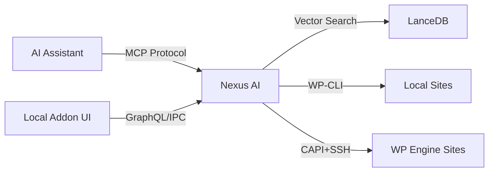
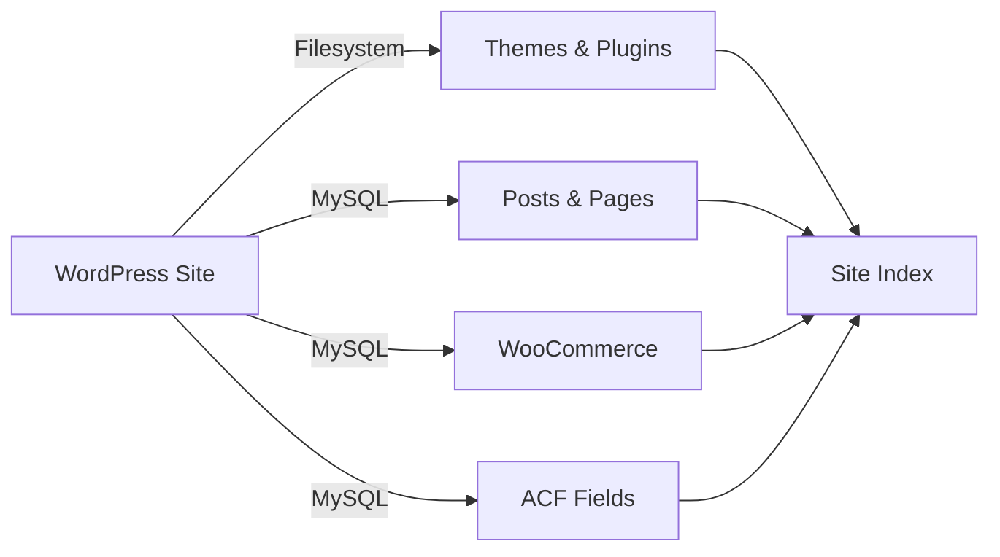
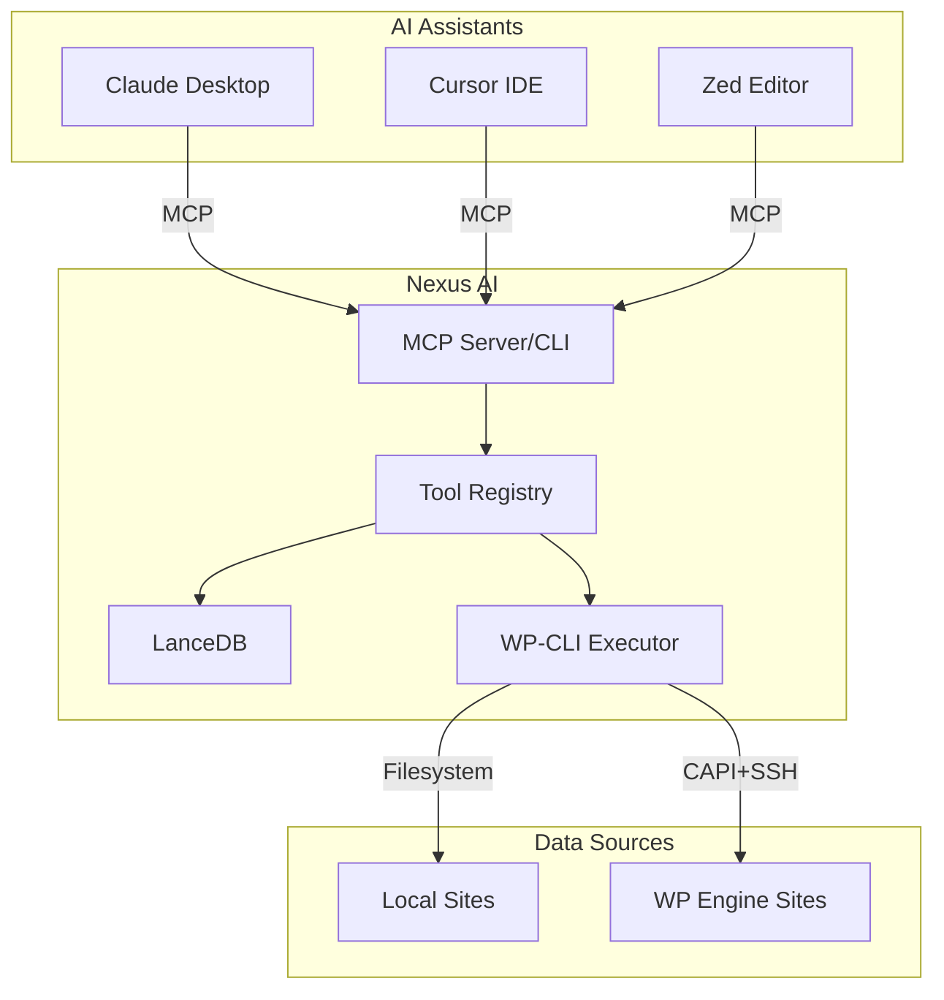

# Nexus AI for Local — WordPress and AI Development, Effortlessly Local

**For developers managing multiple WordPress sites:** Stop checking each site manually. Nexus AI for Local indexes your entire portfolio (running in Local and/or WP Engine) and gives AI assistants real tools to search, audit, and manage your fleet.

## The Problem

You manage 20, 50, 100+ WordPress sites. Every day you ask questions like:

- "Which sites have the Stripe plugin?"
- "Where did I write that SMTP setup guide?"
- "Do all my WooCommerce sites use the same shipping plugin?"
- "Which sites are running WordPress < 6.0?"

The answer? Check each site manually. Open 50 admin panels. Run the same WP-CLI command 50 times. Or worse — guess.

## The Solution

One MCP connection for your entire WordPress fleet:

1. **Semantic search** — AI assistants search ALL your sites at once, understanding meaning (not just keywords)
2. **Real control** — Execute WP-CLI commands on local or remote sites, bulk updates, health checks
3. **Local + WPE unified** — Sync WP Engine production sites alongside local dev sites
4. **Safety guardrails** — 3-tier confirmation system prevents accidental destruction

**Result:** Ask Claude "which of my sites need WooCommerce updates?" → Real answer from your actual sites, not generic advice.



## Two Interfaces, One System

### CLI/MCP Server
**For AI assistants** — Claude Desktop, Cursor, Zed, Continue, etc.

```bash
# Install
npm install -g @local-labs-jpollock/local-addon-nexus-ai

# Use with Claude Desktop
# Add to claude_desktop_config.json
```

**Key capabilities:**
- 🤖 **90+ MCP tools** for WordPress operations
- 🔍 **Semantic search** across all sites
- ⚡ **Bulk operations** with parallel execution
- 🌐 **Local + WPE** unified management
- 🛡️ **3-tier safety** system

[Get Started with CLI →](cli/index.md){ .md-button .md-button--primary }

### UI Addon
**For visual workflows** — Built into Local app.

**Key features:**
- 📊 **Fleet Overview** dashboard
- 🔎 **Site Finder** with AI-powered search
- 💬 **AI Chat** interface with streaming
- 🔄 **WPE Sync** for remote sites
- ⚙️ **Bulk Operations** panel


## How It Works

### 1. Scan & Extract
Reads site structure and content from filesystem and MySQL.



### 2. Chunk & Embed
Splits content at sentence boundaries and generates 384-dimensional vectors.

```typescript
// Example: Blog post chunked for indexing
{
  "post_id": 123,
  "title": "How to Speed Up WordPress",
  "chunks": [
    {
      "text": "WordPress performance optimization...",
      "embedding": [0.123, -0.456, ...], // 384 dimensions
      "tokens": 45
    }
  ]
}
```

### 3. Index & Search
Stores vectors in LanceDB with cosine distance search.

```bash
# AI assistant queries indexed content
nexus search "how to optimize images"

# Returns relevant content from ALL sites
```

## What Gets Indexed?

- ✅ **Posts & Pages** — Title, content, excerpt, meta
- ✅ **WooCommerce** — Products (price, SKU, stock, attributes)
- ✅ **ACF Fields** — Text, textarea, repeater, group, flexible content
- ✅ **Media** — Attachments with alt text and captions
- ✅ **Themes & Plugins** — Names, versions, descriptions
- ✅ **Users** — Usernames, roles (no PII)
- ✅ **Site Config** — WP version, PHP version, permalink structure

❌ **Not indexed:** Passwords, API keys, user emails, IP addresses, session data

## Key Features

### Semantic Search
Vector-based search understands **meaning**, not just keywords.

```bash
# Traditional search: exact keyword match
"optimize images" → finds posts with those exact words

# Semantic search: understands intent
"optimize images" → finds posts about:
  - Image compression
  - Lazy loading
  - WebP conversion
  - CDN usage
```

### WP-CLI Integration
Execute WP-CLI commands on **local and remote** sites.

```typescript
// List plugins on local site
{
  "tool": "wp_plugin_list",
  "site_id": "abc123"
}

// List plugins on WP Engine site (via SSH)
{
  "tool": "wp_plugin_list",
  "install_name": "mysite-production"
}
```

### WP Engine Remote Management
Sync and manage WP Engine sites alongside local sites.

- **251 sites in ~25 minutes** with full indexing
- **SSH ControlMaster** for fast remote operations
- **Automatic linking** detection (local ↔ WPE)
- **Pull to local** with one click

### Safety System
3-tier protection for destructive operations.

| Tier | Operations | Protection |
|------|-----------|-----------|
| **1 - Safe** | Read-only, list, search | None required |
| **2 - Caution** | Updates, installs, config changes | Confirmation prompt |
| **3 - Destructive** | Delete, reset, force push | Token + confirmation |

## Quick Start

=== "CLI/MCP"

    ```bash
    # 1. Install
    npm install -g @local-labs-jpollock/local-addon-nexus-ai

    # 2. Add to Claude Desktop config
    # ~/.config/Claude/claude_desktop_config.json
    {
      "mcpServers": {
        "nexus-ai": {
          "command": "nexus",
          "args": ["mcp"]
        }
      }
    }

    # 3. Restart Claude Desktop
    # Tools will appear in Claude's tool list
    ```

    [Full CLI Setup →](cli/installation.md)

=== "UI Addon"

    ```bash
    # 1. Download addon from releases
    # 2. Open Local → Preferences → Addons
    # 3. Install addon ZIP
    # 4. Restart Local
    # 5. Click "Nexus AI" in toolbar
    ```

    [Full UI Setup →](ui-addon/installation.md)

## Use Cases

### For AI Assistants
- **Content research** — "Find all posts about WooCommerce"
- **Site audits** — "List all plugins with available updates"
- **Bulk updates** — "Update WordPress on all staging sites"
- **Debugging** — "Show recent errors on production"
- **Development** — "Pull mysite-prod to local for testing"

### For Developers
- **Fleet overview** — See all sites at a glance
- **Smart filters** — Group sites by WP version, plugin status
- **Bulk operations** — Update plugins across 50 sites
- **WPE sync** — Keep local copies of production sites
- **AI chat** — Ask questions about site configurations

## Architecture



[Full Architecture →](architecture/overview.md)

## Performance

| Metric | Value |
|--------|-------|
| **Site scan** | ~2-5 seconds (10k posts) |
| **Vector search** | <100ms (1M vectors) |
| **WPE site sync** | ~6 seconds per site |
| **Bulk operations** | 10x parallel execution |
| **Remote WP-CLI** | SSH ControlMaster pooling |

*Performance benchmarks coming soon*

## Next Steps

<div class="grid cards" markdown>

- :material-console: **Try the CLI**

    ---

    Install the MCP server and connect to Claude Desktop.

    [CLI Quick Start →](getting-started/cli-quick-start.md)

- :material-view-dashboard: **Try the UI**

    ---

    Install the Local addon and explore the fleet dashboard.

    [UI Quick Start →](getting-started/ui-quick-start.md)

- :material-tools: **Browse Tools**

    ---

    Explore 90+ MCP tools for WordPress operations.

    [Tool Reference →](mcp-tools/index.md)

- :material-book-open: **Read Architecture**

    ---

    Understand how Nexus AI works under the hood.

    [Architecture →](architecture/overview.md)

</div>

## Privacy & Telemetry

Nexus AI collects **anonymous usage analytics** to improve the product.

**What's collected:**
- Installation ID (random UUID)
- Tool usage counts
- Success/error rates
- System info (OS, Node version)

**What's NOT collected:**
- User identities
- Site names or domains
- WordPress content
- Command arguments

*Telemetry documentation coming soon*

## Support & Contributing

- **Issues:** [GitHub Issues](https://github.com/jpollock/local-addon-nexus-ai/issues)
- **Discussions:** [GitHub Discussions](https://github.com/jpollock/local-addon-nexus-ai/discussions)

---

**Built by WP Engine** • [GitHub](https://github.com/jpollock/local-addon-nexus-ai) • [Local](https://localwp.com)
