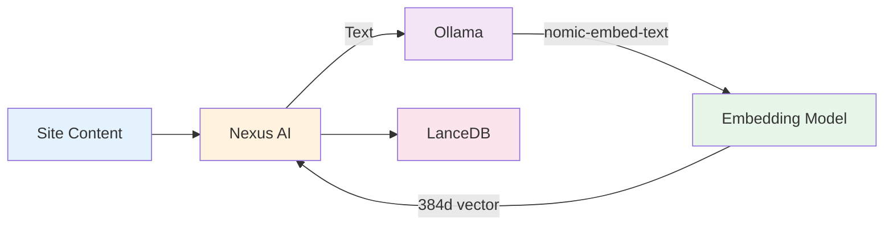

# Ollama Setup

Run AI models locally for privacy, speed, and offline capability.

## Overview

**Ollama** provides local AI model execution for:

- **Text Embeddings** - Vector generation for semantic search
- **Chat Models** - Optional local AI chat (alternative to Claude)
- **Privacy** - All processing stays on your machine
- **Performance** - No API latency or rate limits



**Why Ollama?**

- ✅ **Privacy** - Site content never leaves your machine
- ✅ **Speed** - ~50-100ms per embedding (vs 200-500ms API)
- ✅ **Offline** - Works without internet
- ✅ **Free** - No API costs
- ✅ **Control** - Choose any model

## Installation

### macOS

**1. Download Ollama:**

```bash
# Via Homebrew (recommended)
brew install ollama

# Or download from ollama.com
curl -fsSL https://ollama.com/install.sh | sh
```

**2. Start Ollama:**

```bash
# Starts background service
ollama serve
```

**3. Verify installation:**

```bash
ollama --version
# Output: ollama version 0.1.32
```

**4. Pull the embedding model:**

```bash
ollama pull nomic-embed-text
```

### Windows

**1. Download installer:**

Visit [ollama.com](https://ollama.com) and download `OllamaSetup.exe`.

**2. Run installer:**

```
OllamaSetup.exe
→ Follow installation wizard
→ Ollama starts automatically
```

**3. Verify in Command Prompt:**

```cmd
ollama --version
```

**4. Pull embedding model:**

```cmd
ollama pull nomic-embed-text
```

### Linux

**1. Install Ollama:**

```bash
curl -fsSL https://ollama.com/install.sh | sh
```

**2. Start service:**

```bash
sudo systemctl start ollama
sudo systemctl enable ollama  # Auto-start on boot
```

**3. Verify:**

```bash
ollama --version
curl http://localhost:11434/api/version
```

**4. Pull model:**

```bash
ollama pull nomic-embed-text
```

## Model Setup

### Embedding Model (Required)

**nomic-embed-text** - Fast, high-quality embeddings

```bash
# Pull the model
ollama pull nomic-embed-text

# Verify it's available
ollama list
# NAME                  ID              SIZE      MODIFIED
# nomic-embed-text:latest  f45abcd...    274 MB    2 minutes ago
```

**Model Details:**

- **Dimensions:** 384
- **Size:** 274 MB
- **Speed:** ~50ms per chunk (M1 Mac)
- **Quality:** State-of-the-art for its size
- **Context:** 8,192 tokens

**Test the model:**

```bash
# Generate embeddings for test text
curl http://localhost:11434/api/embeddings -d '{
  "model": "nomic-embed-text",
  "prompt": "WordPress site with WooCommerce"
}'

# Should return 384-dimensional vector
```

### Chat Models (Optional)

**For local AI chat alternative to Claude:**

```bash
# Small, fast model (4GB RAM)
ollama pull llama3.2

# Medium model (8GB RAM)
ollama pull llama3.1:8b

# Large model (16GB+ RAM)
ollama pull llama3.1:70b
```

**Model Comparison:**

| Model | Size | RAM | Speed | Quality |
|-------|------|-----|-------|---------|
| llama3.2 | 2B | 4GB | Fast | Good |
| llama3.1:8b | 8B | 8GB | Medium | Better |
| llama3.1:70b | 70B | 40GB | Slow | Best |
| mistral | 7B | 8GB | Fast | Good |
| codellama | 7B | 8GB | Fast | Code-focused |

**Recommendation:**

- **Embeddings only:** Just `nomic-embed-text`
- **Chat too:** Add `llama3.1:8b`

## Nexus AI Configuration

### Automatic Detection

Nexus AI auto-detects Ollama on first scan:

```
Scanning site...

✓ Ollama detected at http://localhost:11434
✓ Model: nomic-embed-text
✓ Status: Ready

Generating embeddings...
✓ 124 chunks embedded in 6.2s
```

### Manual Configuration

**If auto-detection fails:**

```
Preferences → Search → Indexing

Embedding Provider: Ollama ▼

Ollama Settings:
├─ Host: http://localhost:11434
├─ Model: nomic-embed-text
├─ Timeout: 30 seconds
└─ Auto-pull model if missing: ☑

[Test Connection] [Save]
```

**Test connection:**

```
[Test Connection]

✓ Ollama reachable
✓ Model available
✓ Test embedding successful
  (384 dimensions, 45ms)

Status: Ready
```

### Environment Variables

**Advanced configuration:**

```bash
# Custom Ollama host
export OLLAMA_HOST=http://localhost:11434

# Enable debug logging
export OLLAMA_DEBUG=1

# GPU acceleration
export OLLAMA_GPU_LAYERS=35
```

**In Nexus AI CLI:**

```bash
# Use custom Ollama host
OLLAMA_HOST=http://192.168.1.100:11434 nexus scan mysite
```

## Performance Tuning

### GPU Acceleration

**Check GPU usage:**

```bash
# macOS (Metal)
ollama run llama3.2 --gpu

# Linux (CUDA)
nvidia-smi
```

**Enable GPU layers:**

```bash
# ~/.ollama/config
{
  "num_gpu": 1,
  "gpu_layers": 35
}
```

**Verify GPU is used:**

```
Scanning site...

✓ Ollama using GPU (Metal)
  GPU Layers: 35/35
  Speed: ~25ms per embedding (2× faster)
```

### Memory Management

**Ollama memory usage:**

```bash
# Check current models loaded
curl http://localhost:11434/api/ps

# Unload model to free memory
curl http://localhost:11434/api/delete -d '{
  "name": "llama3.1:70b"
}'
```

**Auto-unload:**

```
Preferences → Advanced → Ollama

Auto-unload models after: [15] minutes
Keep embedding model loaded: ☑
```

### Batch Processing

**Optimize bulk scans:**

```
Preferences → Scanning → Performance

Embedding batch size: [50] chunks
(Higher = faster, more memory)

Ollama concurrent requests: [2]
(1-4, depends on CPU/GPU)
```

**Performance by batch size:**

| Batch Size | Speed | Memory | Recommended |
|------------|-------|--------|-------------|
| 10 | 8s/100 chunks | 2 GB | Low RAM |
| 25 | 5s/100 chunks | 3 GB | Default |
| 50 | 3s/100 chunks | 4 GB | Fast scan |
| 100 | 2s/100 chunks | 6 GB | High-end |

## Troubleshooting

### Ollama Not Running

**Error:**

```
Error: Failed to connect to Ollama
Connection refused: http://localhost:11434
```

**Solutions:**

```bash
# 1. Start Ollama
ollama serve

# 2. Check if running
curl http://localhost:11434/api/version

# 3. Check firewall
sudo lsof -i :11434

# 4. Restart service (Linux)
sudo systemctl restart ollama
```

### Model Not Found

**Error:**

```
Error: Model nomic-embed-text not found
```

**Solutions:**

```bash
# 1. Pull the model
ollama pull nomic-embed-text

# 2. Verify it downloaded
ollama list

# 3. Check storage space
df -h

# 4. Re-pull if corrupted
ollama rm nomic-embed-text
ollama pull nomic-embed-text
```

### Slow Embeddings

**Diagnosis:**

```bash
# Test embedding speed
time curl http://localhost:11434/api/embeddings -d '{
  "model": "nomic-embed-text",
  "prompt": "test"
}'

# Should be < 100ms on modern hardware
```

**Optimizations:**

```
1. Enable GPU acceleration
   → See "GPU Acceleration" above

2. Reduce batch size if memory-limited
   → Preferences → Scanning → Batch size: 25

3. Close other apps
   → Free up CPU/GPU resources

4. Use SSD for model storage
   → Move ~/.ollama to SSD

5. Update Ollama
   → brew upgrade ollama
```

### Out of Memory

**Error:**

```
Error: Failed to generate embeddings
OOM (Out of Memory)
```

**Solutions:**

```
1. Reduce batch size:
   Preferences → Scanning → Batch size: 10

2. Unload unused models:
   ollama rm llama3.1:70b

3. Use smaller model:
   ollama pull nomic-embed-text:latest

4. Increase system RAM
   (Or use cloud API instead)
```

### Port Conflict

**Error:**

```
Error: Address already in use: :11434
```

**Solutions:**

```bash
# 1. Check what's using port 11434
lsof -i :11434

# 2. Kill conflicting process
kill -9 <PID>

# 3. Use different port
export OLLAMA_HOST=http://localhost:11435
ollama serve
```

## Advanced Configuration

### Custom Models

**Use alternative embedding models:**

```bash
# Install other models
ollama pull mxbai-embed-large  # 1024 dimensions
ollama pull nomic-embed-text:v1.5  # Newer version
```

**Configure in Nexus AI:**

```
Preferences → Search → Indexing

Model: mxbai-embed-large ▼
Dimensions: 1024
```

**Pros/Cons:**

| Model | Dimensions | Speed | Quality | Size |
|-------|-----------|-------|---------|------|
| nomic-embed-text | 384 | Fast | Good | 274 MB |
| mxbai-embed-large | 1024 | Medium | Better | 670 MB |
| gte-large | 1024 | Slow | Best | 1.3 GB |

### Multi-Server Setup

**Run Ollama on dedicated server:**

```bash
# On server
OLLAMA_HOST=0.0.0.0:11434 ollama serve

# On Nexus AI machine
Preferences → Indexing → Ollama Host:
http://192.168.1.100:11434
```

**Benefits:**

- Offload GPU/CPU work
- Share models across team
- Centralized model management

### Model Quantization

**Reduce model size/memory:**

```bash
# Use quantized model (smaller, slightly lower quality)
ollama pull nomic-embed-text:q4_0  # 4-bit quantization

# vs default
ollama pull nomic-embed-text:latest  # Full precision
```

**Comparison:**

| Quantization | Size | RAM | Speed | Quality |
|--------------|------|-----|-------|---------|
| Full (fp16) | 274 MB | 600 MB | Baseline | 100% |
| Q8 | 147 MB | 320 MB | +10% faster | 99% |
| Q4 | 77 MB | 180 MB | +20% faster | 97% |

## API Reference

### Embedding Endpoint

```bash
curl http://localhost:11434/api/embeddings -d '{
  "model": "nomic-embed-text",
  "prompt": "WordPress WooCommerce store"
}'
```

**Response:**

```json
{
  "embedding": [0.23, -0.45, 0.67, ...],  // 384 values
  "model": "nomic-embed-text",
  "created_at": "2024-03-20T10:30:00Z"
}
```

### Chat Endpoint

```bash
curl http://localhost:11434/api/chat -d '{
  "model": "llama3.1:8b",
  "messages": [
    {
      "role": "user",
      "content": "List all WooCommerce sites"
    }
  ],
  "stream": false
}'
```

### Model Management

```bash
# List installed models
curl http://localhost:11434/api/tags

# Pull model
curl http://localhost:11434/api/pull -d '{"name": "llama3.2"}'

# Delete model
curl http://localhost:11434/api/delete -d '{"name": "llama3.1:70b"}'

# Show model info
curl http://localhost:11434/api/show -d '{"name": "nomic-embed-text"}'
```

## Best Practices

### Model Selection

**For embeddings (required):**

- ✅ **Start with:** `nomic-embed-text`
- ✅ **If need better quality:** `mxbai-embed-large`
- ✅ **If memory-limited:** `nomic-embed-text:q4_0`

**For chat (optional):**

- ✅ **Most users:** `llama3.1:8b`
- ✅ **Low RAM:** `llama3.2`
- ✅ **Best quality:** `llama3.1:70b` (if 40GB+ RAM)

### Resource Management

```
Daily workflow:

Morning:
1. Start Ollama: ollama serve
2. Verify model loaded: ollama list

During work:
3. Scan sites as needed
4. Monitor memory usage

Evening:
5. Unload large models:
   ollama rm llama3.1:70b
6. Keep nomic-embed-text loaded
```

### Backup Strategy

**Preserve models across reinstalls:**

```bash
# Backup models directory
tar -czf ollama-models.tar.gz ~/.ollama/models

# Restore after reinstall
tar -xzf ollama-models.tar.gz -C ~/
```

## Migration to Ollama

### From Cloud API

**If currently using OpenAI/Anthropic for embeddings:**

```
1. Install Ollama (see above)
2. Pull nomic-embed-text
3. Preferences → Indexing → Provider: Ollama
4. Re-scan all sites to generate new embeddings
   (Old cloud embeddings are incompatible)
```

**Benefits:**

- 💰 Save API costs (~$0.10 per 100k tokens)
- 🔒 Enhanced privacy
- ⚡ Faster (no network latency)
- 📶 Offline capability

### From Other Local Models

**If using sentence-transformers or similar:**

```
1. Export existing embeddings:
   nexus db export-embeddings > embeddings.json

2. Install Ollama + nomic-embed-text

3. Re-scan sites:
   nexus scan --all

4. Compare search quality:
   nexus search "test query" > new-results.txt
```

## Updates & Maintenance

### Updating Ollama

```bash
# macOS
brew upgrade ollama

# Linux
curl -fsSL https://ollama.com/install.sh | sh

# Windows
Download new installer from ollama.com
```

### Updating Models

```bash
# Check for model updates
ollama list

# Pull latest version
ollama pull nomic-embed-text:latest

# Remove old version
ollama rm nomic-embed-text:v1.0
```

### Cleaning Up

```bash
# Remove unused models
ollama rm llama3.1:13b
ollama rm mistral:latest

# Clear model cache
rm -rf ~/.ollama/cache

# Optimize storage
ollama prune
```

## Next Steps

- **[First Scan](../getting-started/first-scan.md)** - Scan sites with Ollama
- **[Semantic Search](../features/semantic-search.md)** - How embeddings work
- **[Vector Database](../architecture/vector-database.md)** - Technical deep dive
- **[Preferences](../ui-addon/preferences.md)** - Configure Ollama settings
- **Custom AI Providers** - Use other embedding models
