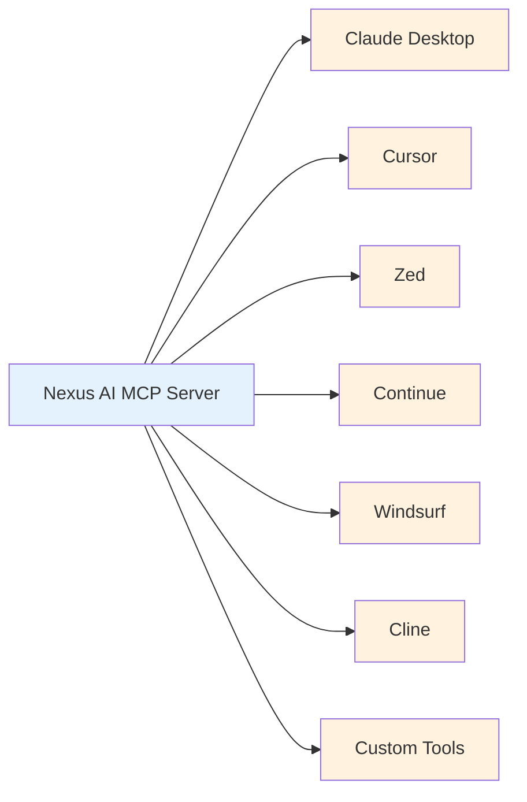

# Other MCP Clients

Use Nexus AI MCP server with any MCP-compatible editor or tool.

## Overview

The **Model Context Protocol (MCP)** is an open standard for connecting AI assistants to external tools and data sources. Nexus AI implements MCP, making it compatible with many editors and tools.



**Supported Clients:**

| Client | Platform | Status | Setup Difficulty |
|--------|----------|--------|------------------|
| **Claude Desktop** | macOS, Windows | ✅ Fully supported | Easy |
| **Cursor** | macOS, Windows, Linux | ✅ Fully supported | Easy |
| **Zed** | macOS, Linux | ✅ Fully supported | Easy |
| **Continue** | VSCode | ✅ Fully supported | Medium |
| **Windsurf** | VSCode | ✅ Experimental | Medium |
| **Cline** | VSCode | ⚠️ Limited | Medium |
| **Aider** | Terminal | ⚠️ Limited | Hard |

## Zed Editor

**AI-powered code editor with native MCP support.**

### Installation

```bash
# Install Zed
brew install --cask zed

# Or download from zed.dev
```

### Configuration

**1. Locate Zed config:**

```bash
# macOS
~/.config/zed/settings.json

# Linux
~/.config/zed/settings.json
```

**2. Add Nexus AI MCP server:**

```json
{
  "language_models": {
    "mcp_servers": {
      "nexus-ai": {
        "command": "npx",
        "args": [
          "-y",
          "@local-labs-jpollock/local-addon-nexus-ai"
        ],
        "env": {
          "PATH": "/usr/local/bin:/usr/bin:/bin"
        }
      }
    }
  }
}
```

**3. Restart Zed.**

**4. Verify in Zed:**

```
Zed → Settings → Language Models → MCP Servers
✓ nexus-ai (connected)
```

### Usage

**Ask AI about WordPress sites:**

```
In Zed chat (Cmd+Shift+L):

You: Show me all sites running WordPress 6.4.3

AI: I found 12 sites running WordPress 6.4.3:
    - site1.local
    - site2.local
    ...

You: Scan site1.local

AI: Scanning site1.local...
    ✓ Complete! Indexed 142 posts, 24 products
```

**Code generation with site context:**

```
You: Create a WP-CLI command to export all WooCommerce products
     from site1.local

AI: [Uses wp_plugin_list to check WooCommerce is installed]
    [Generates custom export script]
```

### Zed-Specific Features

**Inline AI:**

```php
// Type comment, then Cmd+.
// Export WooCommerce products to CSV

// AI generates:
<?php
// AI checks site1.local has WooCommerce via MCP
// Then generates appropriate export code
```

**Multi-file context:**

```
Select multiple PHP files → Zed chat
"Refactor these with WordPress coding standards"

AI uses Nexus AI MCP to:
1. Check WordPress version on target site
2. Verify installed plugins
3. Generate compatible code
```

## Continue (VSCode Extension)

**Open-source AI coding assistant for VSCode.**

### Installation

```
1. Open VSCode
2. Extensions → Search "Continue"
3. Install "Continue - AI Code Assistant"
4. Reload VSCode
```

### Configuration

**1. Open Continue settings:**

```
VSCode → Continue sidebar → ⚙️ Settings → config.json
```

**2. Add Nexus AI MCP:**

```json
{
  "models": [
    {
      "title": "Claude 3.5 Sonnet",
      "provider": "anthropic",
      "model": "claude-3-5-sonnet-20241022",
      "apiKey": "YOUR_ANTHROPIC_API_KEY"
    }
  ],
  "mcpServers": [
    {
      "name": "nexus-ai",
      "command": "npx",
      "args": [
        "-y",
        "@local-labs-jpollock/local-addon-nexus-ai"
      ]
    }
  ]
}
```

**3. Restart VSCode.**

**4. Verify:**

```
Continue sidebar → Settings → MCP Servers
✓ nexus-ai (running)
```

### Usage

**Chat with WordPress context:**

```
Continue sidebar (Cmd+L):

You: List all WooCommerce sites

AI: [Calls nexus_list_sites tool]
    Found 7 WooCommerce sites:
    - store1.local (142 products)
    - store2.local (38 products)
    ...
```

**Code completion:**

```python
# In Python file
import subprocess

# Get all WordPress sites from Nexus AI
sites =

# AI autocompletes with:
subprocess.run(["nexus", "list", "--format", "json"])
```

**Inline edits:**

```php
// Highlight code block → Cmd+I
"Optimize this WordPress query for site1.local"

// AI checks site1.local WP version and plugins
// Suggests optimized query
```

### Continue-Specific Features

**Context providers:**

```json
{
  "contextProviders": [
    {
      "name": "nexus-sites",
      "type": "mcp",
      "server": "nexus-ai",
      "tool": "nexus_list_sites"
    }
  ]
}
```

**Custom slash commands:**

```json
{
  "slashCommands": [
    {
      "name": "scan-site",
      "description": "Scan a WordPress site",
      "prompt": "Scan the site {site} using nexus_scan_site tool"
    }
  ]
}
```

## Windsurf (Codeium IDE)

**AI-native IDE with MCP support (experimental).**

### Installation

```bash
# Download from codeium.com/windsurf
# Or via Homebrew
brew install --cask windsurf
```

### Configuration

**1. Open Windsurf settings:**

```
Windsurf → Settings → Cascade → MCP Servers
```

**2. Add server configuration:**

```json
{
  "mcp": {
    "servers": {
      "nexus-ai": {
        "command": "npx",
        "args": [
          "-y",
          "@local-labs-jpollock/local-addon-nexus-ai"
        ]
      }
    }
  }
}
```

**3. Restart Windsurf.**

### Usage

**Cascade chat:**

```
Open Cascade (Cmd+L)

You: Show me sites needing WordPress updates

AI: [Queries via MCP]
    3 sites need WordPress updates:
    - site1.local (6.3.1 → 6.4.3)
    - site2.local (6.4.0 → 6.4.3)
    ...

You: Update site1.local

AI: [Calls wp_core_update tool]
    Updating WordPress on site1.local...
    ✓ Updated to 6.4.3
```

**Flow mode:**

```
Cmd+K (Flow mode)

"Create a migration script for all WooCommerce stores"

AI:
1. Lists WooCommerce sites via MCP
2. Generates migration script
3. Includes site-specific details
4. Suggests testing order (dev → staging → prod)
```

## Cline (VSCode Extension)

**Autonomous coding agent with MCP support.**

### Installation

```
VSCode Extensions → Search "Cline"
Install → Reload VSCode
```

### Configuration

**1. Cline settings:**

```json
{
  "cline.mcpServers": [
    {
      "name": "nexus-ai",
      "command": "npx",
      "args": [
        "-y",
        "@local-labs-jpollock/local-addon-nexus-ai"
      ]
    }
  ]
}
```

**2. Verify in Cline UI:**

```
Cline sidebar → Settings → MCP Servers
✓ nexus-ai (connected)
```

### Usage

**Autonomous WordPress workflows:**

```
Cline chat:

You: Audit all sites for outdated plugins, then create
     a priority update list

Cline:
1. [Calls nexus_list_sites]
2. [For each site, calls wp_plugin_list]
3. [Identifies updates available]
4. [Generates priority list by severity]
5. [Creates markdown report]

Generated: plugin-audit-report.md
```

**Limited support:**

⚠️ Cline's MCP implementation is still experimental. Some Nexus AI tools may not work correctly.

## Aider (Terminal)

**AI pair programming in the terminal.**

### Installation

```bash
# Via pip
pip install aider-chat

# Or via pipx
pipx install aider-chat
```

### Configuration

**Aider doesn't natively support MCP, but you can use it via wrapper:**

```bash
# Create wrapper script: ~/bin/aider-nexus

#!/bin/bash
export MCP_SERVER="npx -y @local-labs-jpollock/local-addon-nexus-ai"
aider "$@"
```

**Make executable:**

```bash
chmod +x ~/bin/aider-nexus
```

### Usage

**Limited integration:**

```bash
# Start aider
aider-nexus

# Manual tool calls
> /run nexus list

# AI can't directly call MCP tools
# You must manually run nexus CLI commands
```

**Better alternative:**

Use Nexus AI CLI directly instead:

```bash
# Instead of aider wrapper
nexus ai "Audit all sites for security issues"
```

## Custom MCP Clients

### Building Your Own

**Minimal MCP client example:**

```typescript
import { Client } from "@modelcontextprotocol/sdk/client/index.js";
import { StdioClientTransport } from "@modelcontextprotocol/sdk/client/stdio.js";

// Create transport
const transport = new StdioClientTransport({
  command: "npx",
  args: ["-y", "@local-labs-jpollock/local-addon-nexus-ai"]
});

// Create client
const client = new Client({
  name: "my-mcp-client",
  version: "1.0.0"
}, {
  capabilities: {
    tools: {}
  }
});

// Connect
await client.connect(transport);

// List available tools
const tools = await client.listTools();
console.log("Available tools:", tools);

// Call a tool
const result = await client.callTool({
  name: "nexus_list_sites",
  arguments: {}
});
console.log("Sites:", result);
```

**Full example:**

See [MCP SDK documentation](https://github.com/modelcontextprotocol/sdk) for more details.

### API Documentation

**Available MCP tools:**

See [Tool Reference](../reference/tool-reference.md) for complete list.

**Example tool call:**

```json
{
  "name": "search_sites",
  "arguments": {
    "query": "WooCommerce sites with Stripe",
    "limit": 10
  }
}
```

**Response:**

```json
{
  "content": [
    {
      "type": "text",
      "text": "Found 5 sites:\n- store1.local\n- store2.local\n..."
    }
  ]
}
```

## Comparison Matrix

### Feature Support

| Feature | Claude Desktop | Cursor | Zed | Continue | Windsurf | Cline |
|---------|---------------|--------|-----|----------|----------|-------|
| **MCP Tools** | ✅ | ✅ | ✅ | ✅ | ⚠️ | ⚠️ |
| **Streaming** | ✅ | ✅ | ✅ | ✅ | ✅ | ❌ |
| **Resources** | ✅ | ✅ | ✅ | ❌ | ⚠️ | ❌ |
| **Prompts** | ✅ | ✅ | ✅ | ❌ | ⚠️ | ❌ |
| **File Context** | ✅ | ✅ | ✅ | ✅ | ✅ | ✅ |
| **Auto-reconnect** | ✅ | ✅ | ✅ | ⚠️ | ⚠️ | ❌ |

**Legend:**
- ✅ Fully supported
- ⚠️ Partial/experimental
- ❌ Not supported

### Performance

| Client | Startup Time | Tool Call Latency | Memory Usage |
|--------|-------------|------------------|--------------|
| **Claude Desktop** | ~1s | 50-100ms | 200 MB |
| **Cursor** | ~2s | 100-200ms | 300 MB |
| **Zed** | ~500ms | 50-100ms | 150 MB |
| **Continue** | ~1s | 100-200ms | 200 MB |
| **Windsurf** | ~3s | 200-300ms | 400 MB |

### Recommendations

**Best for different use cases:**

| Use Case | Recommended Client | Why |
|----------|-------------------|-----|
| **General chat** | Claude Desktop | Best MCP support, native UI |
| **Code editing** | Cursor or Zed | IDE integration, inline AI |
| **VSCode users** | Continue | Open-source, customizable |
| **Lightweight** | Zed | Fast, minimal resource usage |
| **Experimental** | Windsurf | Cutting-edge features |

## Troubleshooting

### MCP Server Won't Start

**Error in client:**

```
MCP Server Error: nexus-ai failed to start
```

**Solutions:**

```bash
# 1. Test MCP server directly
npx -y @local-labs-jpollock/local-addon-nexus-ai

# Should start and show "MCP server running"
# If not, check:

# 2. Verify Node.js version
node --version  # Should be 18+

# 3. Clear npm cache
npm cache clean --force

# 4. Reinstall globally
npm uninstall -g @local-labs-jpollock/local-addon-nexus-ai
npm install -g @local-labs-jpollock/local-addon-nexus-ai

# 5. Check Local is running
# Nexus AI MCP requires Local to be running
```

### Tools Not Appearing

**Client shows no tools available:**

```
MCP Tools: 0
```

**Solutions:**

```
1. Restart the client

2. Check MCP server logs:
   Client settings → MCP → nexus-ai → View Logs

3. Verify configuration:
   Ensure command and args are correct

4. Test tool listing:
   curl http://localhost:PORT/list-tools
   (If server exposes HTTP endpoint)
```

### Permission Errors

**Error:**

```
Error: EACCES: permission denied
```

**Solutions:**

```bash
# Fix npm global permissions
sudo chown -R $(whoami) ~/.npm
sudo chown -R $(whoami) /usr/local/lib/node_modules

# Or use nvm instead of system Node.js
curl -o- https://raw.githubusercontent.com/nvm-sh/nvm/v0.39.0/install.sh | bash
nvm install 22
nvm use 22
```

## Best Practices

### Configuration Management

**Store configs in version control:**

```bash
# dotfiles repo
~/.config/
├─ cursor/
│  └─ mcp_settings.json
├─ zed/
│  └─ settings.json
└─ continue/
   └─ config.json
```

**Use environment variables:**

```bash
# ~/.zshrc or ~/.bashrc
export NEXUS_MCP_PORT=3000
export NEXUS_LOG_LEVEL=info
```

### Multiple Clients

**Use same MCP server across clients:**

```json
// Shared config for all clients
{
  "command": "npx",
  "args": ["-y", "@local-labs-jpollock/local-addon-nexus-ai"],
  "env": {
    "PATH": "/usr/local/bin:/usr/bin:/bin",
    "NEXUS_LOG_LEVEL": "info"
  }
}
```

### Performance

**Optimize for speed:**

- ✅ Keep Local running (faster MCP startup)
- ✅ Use SSD for npm cache
- ✅ Limit concurrent MCP tool calls
- ✅ Close unused clients

## Next Steps

- **[Claude Desktop](claude-desktop.md)** - Full Claude Desktop setup
- **[Cursor](cursor.md)** - Detailed Cursor integration
- **[MCP Protocol](../architecture/mcp-protocol.md)** - Technical deep dive
- **[Tool Reference](../reference/tool-reference.md)** - Complete tool catalog
- **[Custom AI Providers](custom-ai-providers.md)** - Build custom integrations
