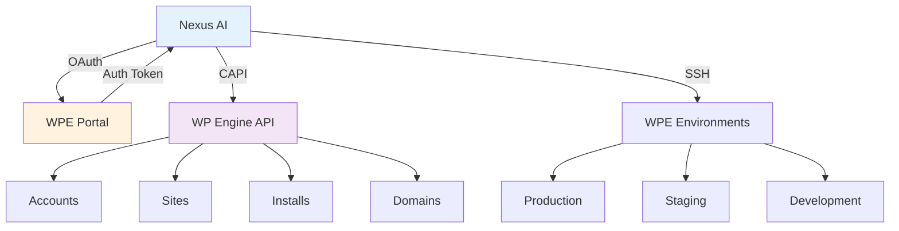
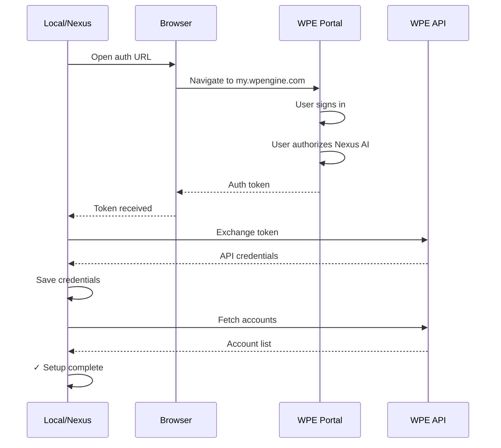

# WP Engine Account Setup

Connect your WP Engine account to enable seamless local ↔ cloud workflows.

## Overview

Linking your **WP Engine account** enables:

- 🔄 **Pull/Push** - Sync sites between Local and WPE
- 🌐 **Remote WP-CLI** - Run commands on production sites
- 📊 **Fleet Monitoring** - View all WPE sites in one dashboard
- 🚀 **Deployments** - Promote staging to production
- 💾 **Backups** - Create and restore WPE backups
- 🔒 **SSL Management** - Request and monitor certificates
- 📈 **Usage Analytics** - Track bandwidth and disk usage



## Prerequisites

### WP Engine Account

**You need:**

- ✅ Active WP Engine account
- ✅ User Portal access (my.wpengine.com)
- ✅ API access enabled (default for all users)
- ✅ SSH key uploaded (for remote WP-CLI)

**Account types supported:**

- Personal accounts
- Agency/Partner accounts
- Enterprise accounts
- Multiple accounts

### SSH Keys

**Required for remote WP-CLI and pull/push:**

```bash
# 1. Generate SSH key (if you don't have one)
ssh-keygen -t ed25519 -C "your_email@example.com"

# 2. Copy public key
cat ~/.ssh/id_ed25519.pub | pbcopy  # macOS
cat ~/.ssh/id_ed25519.pub | xclip   # Linux

# 3. Add to WP Engine User Portal
# Go to: my.wpengine.com → SSH Keys → Add Key
```

**Key requirements:**

- Type: RSA (2048+ bit) or Ed25519
- Format: OpenSSH public key
- Must be added to your WPE user profile

## Initial Setup

### Method 1: Through Local (Recommended)

**Step-by-step:**

```
1. Open Local
2. Nexus AI → WPE Management
3. Click "Connect WP Engine Account"
4. Browser opens to WPE Portal
5. Sign in to WP Engine
6. Authorize Nexus AI
7. Select accounts to connect
8. Click "Authorize"
9. Return to Local
```

**Visual flow:**



**Success confirmation:**

```
✓ WP Engine Account Connected

Account: your-account-name
Sites: 24
Installs: 68
Access: Full

[View Sites] [Manage Account]
```

### Method 2: Through CLI

**For headless or automated setup:**

```bash
# 1. Get WPE API credentials from User Portal
# my.wpengine.com → API Access → Generate Credentials

# 2. Configure Nexus AI
nexus config set wpe.api_user "your-api-user"
nexus config set wpe.api_password "your-api-password"

# 3. Test connection
nexus wpe accounts

# Output:
# ✓ Connected to WP Engine
# Account: your-account-name (12 sites)
```

**Using environment variables:**

```bash
# Set in ~/.bashrc or ~/.zshrc
export WPE_API_USER="your-api-user"
export WPE_API_PASSWORD="your-api-password"
export WPE_SSH_KEY="~/.ssh/id_ed25519"

# Test
nexus wpe accounts
```

## Multiple Accounts

### Adding Additional Accounts

**If you have multiple WPE accounts:**

```
WPE Management → Accounts → [+ Add Account]

1. Click "Add Another Account"
2. Sign in with different credentials
3. Authorize access
4. Account appears in list
```

**Account list:**

```
Connected Accounts (3)

┌─────────────────────────────────────────┐
│ ● Personal Account (default)            │
│   Sites: 5 | Installs: 12               │
│   Last sync: 2 hours ago                │
│   [View] [Refresh] [Disconnect]         │
├─────────────────────────────────────────┤
│ ○ Agency Account                        │
│   Sites: 24 | Installs: 68              │
│   Last sync: 1 day ago                  │
│   [View] [Refresh] [Set Default]        │
├─────────────────────────────────────────┤
│ ○ Client Account                        │
│   Sites: 3 | Installs: 9                │
│   Last sync: 3 days ago                 │
│   [View] [Refresh] [Disconnect]         │
└─────────────────────────────────────────┘

[+ Add Another Account]
```

### Switching Between Accounts

**UI:**

```
WPE Management → Accounts → Select account
```

**CLI:**

```bash
# List accounts
nexus wpe accounts

# Use specific account
nexus wpe sites --account "agency-account"

# Set default account
nexus config set wpe.default_account "personal-account"
```

### Account-Specific Operations

**Pull from specific account:**

```bash
nexus wpe pull mysite \
  --account "agency-account" \
  --environment production
```

**View account details:**

```bash
nexus wpe account-info --account "personal-account"

# Output:
# Account: personal-account
# Owner: you@example.com
# Sites: 5
# Installs: 12
# Plan: Growth
# Disk quota: 50 GB (12 GB used)
# Bandwidth: 200 GB/mo (45 GB used)
```

## SSH Configuration

### Upload SSH Key to WPE

**Required for remote operations:**

```
1. Generate key (if needed):
   ssh-keygen -t ed25519 -C "nexus-ai"

2. Copy public key:
   cat ~/.ssh/id_ed25519.pub

3. Add to WP Engine:
   my.wpengine.com → SSH Keys → [Add Key]

   Name: Nexus AI
   Key: [paste public key]
   [Add Key]

4. Verify in Nexus AI:
   Preferences → WPE → SSH Key
   Path: ~/.ssh/id_ed25519
   [Test Connection]
```

### Test SSH Connection

```bash
# Test SSH directly
ssh user@mysite.ssh.wpengine.net

# Test through Nexus AI
nexus wpe ssh-test mysite-production

# Output:
# ✓ SSH connection successful
# ✓ WP-CLI available
# ✓ WordPress detected
# Site: My Site (6.4.3)
```

### Custom SSH Keys

**Use different key per account:**

```
Preferences → WPE → Advanced

SSH Keys:
┌─────────────────────────────────────────┐
│ Personal Account                        │
│ Key: ~/.ssh/wpe_personal                │
│ [Browse...]                             │
├─────────────────────────────────────────┤
│ Agency Account                          │
│ Key: ~/.ssh/wpe_agency                  │
│ [Browse...]                             │
└─────────────────────────────────────────┘

[Save Settings]
```

**CLI configuration:**

```bash
# Per-account SSH keys
nexus config set wpe.accounts.personal.ssh_key "~/.ssh/wpe_personal"
nexus config set wpe.accounts.agency.ssh_key "~/.ssh/wpe_agency"
```

## Permissions & Access Levels

### User Roles

**WP Engine user roles and Nexus AI capabilities:**

| Role | View Sites | Pull | Push | SSH | Domains | Backups | Delete |
|------|-----------|------|------|-----|---------|---------|--------|
| **Owner** | ✅ | ✅ | ✅ | ✅ | ✅ | ✅ | ✅ |
| **Full** | ✅ | ✅ | ✅ | ✅ | ✅ | ✅ | ❌ |
| **Partial** | ✅ | ✅ | ⚠️ Staging only | ✅ | ❌ | ✅ | ❌ |
| **Developer** | ✅ | ✅ | ⚠️ Dev only | ✅ | ❌ | ❌ | ❌ |
| **Support** | ✅ | ✅ | ❌ | ⚠️ View only | ❌ | ❌ | ❌ |

**Check your access level:**

```bash
nexus wpe whoami

# Output:
# User: you@example.com
# Account: personal-account
# Role: Owner
# Permissions:
#   ✓ View sites
#   ✓ Pull/Push
#   ✓ SSH access
#   ✓ Manage domains
#   ✓ Create backups
#   ✓ Delete installs
```

### Environment-Specific Access

**Some users have environment restrictions:**

```
Your Access:

Production: ❌ No access (contact owner)
Staging: ✅ Full access
Development: ✅ Full access

Operations Allowed:
✓ Pull from staging/dev
✓ Push to staging/dev
✗ Push to production (restricted)
✓ Remote WP-CLI on staging/dev
```

**Requesting access:**

```
Contact account owner to request production access:
owner@example.com

Or upgrade your user role in WPE Portal:
my.wpengine.com → Users → [Your User] → Edit Role
```

## API Rate Limits

### Understanding Limits

**WP Engine API limits:**

| Endpoint | Rate Limit | Per |
|----------|-----------|-----|
| Read (GET) | 60 requests | minute |
| Write (POST/PUT) | 30 requests | minute |
| Delete | 10 requests | minute |
| Bulk operations | 100 requests | hour |

**Nexus AI handles rate limiting automatically:**

```
Scanning 50 WPE sites...

✓ Batch 1 (20 sites) - 45s
⏳ Rate limit reached, waiting 15s...
✓ Batch 2 (20 sites) - 45s
⏳ Rate limit reached, waiting 15s...
✓ Batch 3 (10 sites) - 25s

Complete! 50 sites scanned in 2m 10s
```

### Monitoring Usage

**Check current rate limit status:**

```bash
nexus wpe rate-limit

# Output:
# Rate Limit Status:
#
# GET requests: 42 / 60 (70%)
# POST requests: 8 / 30 (27%)
# DELETE requests: 0 / 10 (0%)
#
# Resets in: 23 seconds
```

**Avoiding rate limits:**

```
Preferences → WPE → API

Rate Limiting:
☑ Enable automatic throttling
☑ Batch operations
☑ Wait for limit reset

Max concurrent requests: [5]
Delay between requests: [500] ms

[Save Settings]
```

## Data Sync

### Initial Sync

**First connection syncs all account data:**

```
Syncing WP Engine Account...

✓ Fetching accounts (1s)
✓ Fetching sites (3s)
✓ Fetching installs (8s)
✓ Fetching domains (2s)
✓ Fetching backups (5s)

Complete! Synced:
├─ 24 sites
├─ 68 installs
├─ 142 domains
└─ 245 backups

[View Sites] [Manage Account]
```

### Auto-Refresh

**Keep data fresh:**

```
Preferences → WPE → Sync

Auto-Refresh:
☑ Enabled

Schedule:
● Every hour
○ Every 6 hours
○ Daily
○ Manual only

Last sync: 45 minutes ago
Next sync: in 15 minutes

[Sync Now]
```

### Manual Refresh

**UI:**

```
WPE Management → [Refresh] button
```

**CLI:**

```bash
# Refresh all accounts
nexus wpe sync

# Refresh specific account
nexus wpe sync --account "personal-account"

# Force full re-sync
nexus wpe sync --full
```

## Security

### Credential Storage

**Where credentials are stored:**

```
~/Library/Application Support/Local/nexus-ai/
└─ wpe-credentials.json (encrypted)
```

**Security measures:**

- 🔒 **Encrypted at rest** - AES-256 encryption
- 🔒 **OAuth tokens** - Not passwords (can be revoked)
- 🔒 **Local only** - Never sent to cloud
- 🔒 **File permissions** - 600 (owner read/write only)

### Revoking Access

**Disconnect account in Nexus AI:**

```
WPE Management → Accounts → Select account → [Disconnect]

⚠️ This will:
- Remove API credentials
- Clear cached data
- Prevent pull/push operations
- Preserve local sites

[Cancel] [Disconnect]
```

**Revoke OAuth token in WPE Portal:**

```
1. Visit my.wpengine.com
2. Profile → Connected Applications
3. Find "Nexus AI"
4. Click [Revoke Access]
```

**Delete SSH keys:**

```
1. Visit my.wpengine.com
2. SSH Keys
3. Find "Nexus AI" key
4. Click [Delete]
```

## Troubleshooting

### Connection Failed

**Error:**

```
Error: Failed to connect to WP Engine
Invalid credentials
```

**Solutions:**

```
1. Re-authenticate:
   WPE Management → Accounts → [Reconnect]

2. Check WPE Portal access:
   Visit my.wpengine.com
   Ensure you can sign in

3. Verify API access:
   my.wpengine.com → API Access
   Ensure API is enabled

4. Check network:
   curl https://api.wpengineapi.com/v1/accounts
```

### SSH Connection Failed

**Error:**

```
Error: SSH connection failed
Permission denied (publickey)
```

**Solutions:**

```
1. Verify SSH key uploaded:
   my.wpengine.com → SSH Keys
   Ensure your key is listed

2. Test SSH manually:
   ssh -i ~/.ssh/id_ed25519 user@mysite.ssh.wpengine.net

3. Check key permissions:
   chmod 600 ~/.ssh/id_ed25519
   chmod 644 ~/.ssh/id_ed25519.pub

4. Regenerate key if needed:
   ssh-keygen -t ed25519 -C "nexus-ai"
   Re-upload to WPE Portal
```

### Rate Limit Exceeded

**Error:**

```
Error: Rate limit exceeded
Too many requests to WP Engine API
```

**Solutions:**

```
1. Wait for limit reset (shown in error message)
   Example: "Reset in 42 seconds"

2. Reduce concurrent operations:
   Preferences → WPE → Max concurrent: 3

3. Enable auto-throttling:
   Preferences → WPE → Auto-throttle: ☑

4. Batch operations:
   Instead of 50 individual operations,
   use bulk operations where available
```

### Access Denied

**Error:**

```
Error: Access denied
User does not have permission for this operation
```

**Solutions:**

```
1. Check your user role:
   nexus wpe whoami

2. Request elevated access:
   Contact account owner

3. Use accessible environment:
   Try staging instead of production

4. Verify account selection:
   Ensure you're using correct account
```

## Best Practices

### Security

- ✅ Use separate SSH keys for each account
- ✅ Rotate SSH keys quarterly
- ✅ Revoke access when changing teams
- ✅ Never share credentials
- ✅ Use OAuth (not username/password)

### Performance

- ✅ Enable auto-refresh during off-hours
- ✅ Use batch operations for bulk tasks
- ✅ Cache locally (enabled by default)
- ✅ Limit concurrent requests to 3-5

### Organization

- ✅ Use descriptive account names
- ✅ Set default account for daily work
- ✅ Group sites by client/project
- ✅ Tag WPE sites appropriately

## Migration

### From WPE DevKit

**If previously using WP Engine DevKit:**

```
1. Export DevKit sites:
   wp wpe sites export > sites.json

2. Connect WPE account in Nexus AI
   (See "Initial Setup" above)

3. Sites auto-discovered
   No manual import needed

4. Verify in Nexus AI:
   WPE Management → Sites
   All DevKit sites should appear
```

### From Manual SSH

**If manually SSHing to WPE:**

```
Before: ssh user@mysite.ssh.wpengine.net
        wp plugin list

After:  nexus wp mysite-production plugin list

Benefits:
- No manual SSH connection
- Connection pooling (faster)
- Works in UI and CLI
- Integrated with fleet management
```

## Next Steps

- **[WPE Management UI](../ui-addon/wpe-management.md)** - Visual management panel
- **[Pull/Push Guide](../getting-started/wpe-sync.md)** - Sync workflows
- **[Remote WP-CLI](../features/wp-cli-integration.md)** - Run commands remotely
- **[WPE Integration Architecture](../architecture/wpe-integration.md)** - Technical details
- **[SSH ControlMaster](../features/ssh-controlmaster.md)** - Connection pooling
