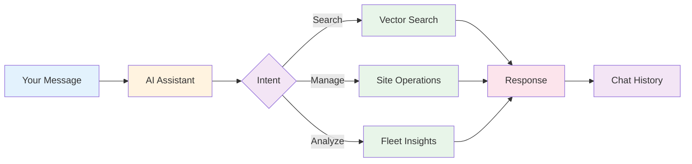

# AI Chat Interface

Have natural conversations with an AI assistant that understands your entire WordPress fleet.

## Overview

The AI Chat panel provides a **conversational interface** to manage, search, and analyze your sites using natural language.



**Key Features:**

- 💬 **Natural Conversations** - Ask questions in plain English
- 🧠 **Context Aware** - AI remembers conversation history
- 🔍 **Semantic Search** - Find sites by describing what you need
- ⚡ **Direct Actions** - Execute operations via chat
- 📊 **Fleet Insights** - Get summaries and analytics
- 🔒 **Safety First** - Confirms destructive operations
- 📝 **Chat History** - Review previous conversations

## Opening AI Chat

**Three ways to access:**

### 1. Sidebar Button

Click the **AI Chat** tab in the left sidebar.

```
┌─────────────────┐
│ Fleet Overview  │
│   Site Finder   │
│ ▶ AI Chat       │ ← Click here
│   WPE Mgmt      │
└─────────────────┘
```

### 2. Keyboard Shortcut

Press `Cmd+Shift+C` (macOS) or `Ctrl+Shift+C` (Windows/Linux).

### 3. Quick Access Button

Click the **AI** button in the top toolbar.

## How to Use

### Starting a Conversation

Simply type your question or request:

```
You: Show me all WooCommerce sites with Stripe integration

AI: I found 5 sites with WooCommerce and Stripe:

1. MyStore (mystore.local)
   - 142 products
   - Stripe payment gateway active
   - Last scan: 2 hours ago

2. ClientShop (clientshop.local)
   - 38 products
   - Stripe + PayPal configured
   - Last scan: 1 day ago

...

Would you like me to scan these sites for updates?
```

### Example Conversations

**Finding Sites:**

```
You: Which sites are running old WordPress versions?

AI: I found 3 sites running WordPress < 6.0:

- OldSite (5.9.3) - security risk, should update
- TestSite (5.8.1) - very outdated
- ClientA (5.7.2) - critical updates needed

I can update these for you. Should I proceed?
```

**Plugin Management:**

```
You: Do any of my sites have the Akismet plugin deactivated?

AI: Yes, 4 sites have Akismet installed but inactive:

- Site1, Site2, Site3, Site4

Would you like me to activate Akismet on these sites?

You: Yes, activate on all

AI: Activating Akismet on 4 sites...

✓ Site1: Activated
✓ Site2: Activated
✓ Site3: Activated
✓ Site4: Activated

All done! Akismet is now active across these sites.
```

**Fleet Analysis:**

```
You: Give me a summary of my WordPress fleet

AI: Here's your fleet overview:

📊 Total Sites: 24
   ├─ Running: 18
   └─ Halted: 6

🔌 Plugins:
   ├─ Average per site: 22
   └─ Most common: Yoast SEO (18 sites)

🎨 Themes:
   └─ Most popular: Astra (12 sites)

⚠️ Health Issues:
   ├─ 3 sites need WordPress updates
   ├─ 8 sites have plugin updates available
   └─ 1 site has SSL certificate expiring soon

Would you like details on any of these?
```

**Site Operations:**

```
You: Scan all my e-commerce sites

AI: Found 7 e-commerce sites (WooCommerce/Easy Digital Downloads).

Starting scan...

✓ Store1: Complete (142 products indexed)
✓ Store2: Complete (38 products indexed)
✓ Store3: Complete (224 products indexed)
...

Scan complete! All 7 sites are now indexed.
```

## Conversation Capabilities

### What AI Can Do

**Search & Discovery:**

- Find sites by content, plugins, themes, or features
- Search across post titles, product descriptions, page content
- Filter by site health, status, or configuration
- Identify sites with specific technical characteristics

**Site Management:**

- Scan sites to index content
- Update WordPress core and plugins
- Activate/deactivate plugins
- Check site health status
- View site details and statistics

**Fleet Analysis:**

- Summarize fleet statistics
- Identify common patterns
- Spot security issues
- Track plugin/theme usage
- Compare sites

**Recommendations:**

- Suggest optimizations
- Identify security risks
- Recommend updates
- Highlight best practices

### What AI Cannot Do

**Limitations:**

- ❌ Cannot access live site admin panels
- ❌ Cannot modify database directly (uses WP-CLI)
- ❌ Cannot install custom code or themes
- ❌ Cannot access external APIs without credentials
- ❌ Cannot perform operations on halted sites
- ❌ Cannot execute arbitrary shell commands

**Safety Restrictions:**

- 🔒 Requires confirmation for destructive operations
- 🔒 Cannot delete sites without explicit approval
- 🔒 Cannot modify production WPE sites without warning
- 🔒 Cannot bypass safety checks

## Chat Features

### Multi-Turn Conversations

AI maintains context across multiple messages:

```
You: Show me all my WooCommerce sites

AI: I found 7 WooCommerce sites...

You: Which ones have subscriptions?

AI: Of those 7 sites, 3 have WooCommerce Subscriptions:
    - Store1, Store2, Store3

You: Scan Store1

AI: Scanning Store1...
    ✓ Complete! Indexed 142 products, 24 active subscriptions
```

### Follow-Up Questions

Ask clarifying questions naturally:

```
You: How many sites do I have?

AI: You have 24 total sites (18 running, 6 halted).

You: How many are e-commerce?

AI: 7 of your 24 sites are e-commerce (WooCommerce or EDD).

You: Show me the WooCommerce ones

AI: Here are the 5 WooCommerce sites:
    1. Store1...
    2. Store2...
```

### Suggested Actions

AI proactively suggests next steps:

```
AI: I found 3 sites with outdated WordPress versions.

   Suggested Actions:
   [ Update all 3 sites ]
   [ Show me details first ]
   [ Scan for other issues ]
```

Click a suggestion to execute instantly.

### Quick Commands

Type special commands for instant actions:

| Command | Action |
|---------|--------|
| `/scan all` | Scan all running sites |
| `/health` | Fleet health summary |
| `/updates` | Show available updates |
| `/woocommerce` | List all WooCommerce sites |
| `/plugins` | Most common plugins |
| `/help` | Show available commands |

**Example:**

```
You: /health

AI: 🏥 Fleet Health Report:

   ✅ Healthy: 18 sites
   ⚠️ Needs Attention: 4 sites
   ❌ Issues: 2 sites

   Top Issues:
   - 3 sites: WordPress outdated
   - 2 sites: Plugin updates available
   - 1 site: SSL certificate expiring
```

## Advanced Usage

### Site-Specific Context

Reference specific sites:

```
You: Tell me about mystore.local

AI: MyStore (mystore.local):

   📊 Statistics:
   - WordPress: 6.4.3
   - Posts: 24
   - Products: 142
   - Active Plugins: 28
   - Theme: Astra Pro

   🔌 Key Plugins:
   - WooCommerce 8.5.2
   - WooCommerce Subscriptions 5.8.0
   - Stripe Gateway 7.9.0

   ⚠️ Issues:
   - 3 plugin updates available
   - Last scan: 2 hours ago

   Would you like me to update the plugins?
```

### Bulk Operations

Request operations across multiple sites:

```
You: Update all plugins on my WooCommerce sites

AI: Found 7 WooCommerce sites with available plugin updates.

   Preparing to update:
   - Store1: 3 plugins
   - Store2: 1 plugin
   - Store3: 5 plugins
   ...

   This will update 14 plugins across 7 sites.
   Proceed?

You: Yes

AI: Updating plugins...

   ✓ Store1: Updated WooCommerce, Stripe, Yoast SEO
   ✓ Store2: Updated WooCommerce
   ✓ Store3: Updated WooCommerce, Stripe, ACF, Yoast, Jetpack
   ...

   All updates complete!
```

### Complex Queries

Combine multiple criteria:

```
You: Show me sites with WooCommerce, running WordPress 6.4+,
     that have Stripe but not PayPal, and have been scanned
     in the last 24 hours

AI: I found 2 sites matching those criteria:

   1. Store1 (store1.local)
      - WordPress 6.4.3
      - WooCommerce 8.5.2
      - Stripe Gateway active
      - PayPal not installed
      - Last scan: 2 hours ago

   2. Store3 (store3.local)
      - WordPress 6.4.2
      - WooCommerce 8.4.0
      - Stripe Gateway active
      - PayPal inactive
      - Last scan: 6 hours ago

   Would you like details on either site?
```

### Data Export

Request formatted exports:

```
You: Export a list of all my sites with their plugin counts to CSV

AI: I've prepared a CSV export of all 24 sites:

   [Download: sites-export-2024-03-20.csv]

   Preview:
   Site Name,Domain,WordPress,Plugins,Status
   Site1,site1.local,6.4.3,24,running
   Site2,site2.local,6.3.1,18,running
   ...

   Would you like me to include more details?
```

## Chat History

### Accessing History

View previous conversations:

```
AI Chat → 🕐 History

Recent Conversations:
─────────────────────────────────────
Today
├─ "Show me WooCommerce sites" (3:45 PM)
├─ "Update plugins on Store1" (2:20 PM)
└─ "Fleet health summary" (10:15 AM)

Yesterday
├─ "Find sites with contact forms" (4:30 PM)
└─ "Scan all sites" (9:00 AM)
```

### Resuming Conversations

Click any conversation to resume:

```
You: (Selected: "Show me WooCommerce sites" from 3:45 PM)

AI: Resuming conversation from 3:45 PM...

    Previous context:
    - Found 7 WooCommerce sites
    - You asked about subscriptions
    - Scanned Store1

    How can I help you further with these sites?
```

### Exporting Conversations

Save conversations for reference:

```
History → Select conversation → Export

Formats:
- Markdown (.md)
- Plain text (.txt)
- JSON (.json)
- PDF (.pdf)
```

**Example Markdown Export:**

```markdown
# Conversation: WooCommerce Site Analysis
Date: 2024-03-20 3:45 PM

**You:** Show me all WooCommerce sites

**AI:** I found 7 WooCommerce sites:
1. Store1 (store1.local) - 142 products
2. Store2 (store2.local) - 38 products
...

**You:** Which ones have subscriptions?

**AI:** Of those 7 sites, 3 have WooCommerce Subscriptions...
```

### Clearing History

Delete old conversations:

```
Settings → Privacy → Chat History

Options:
☐ Clear history older than 30 days
☐ Clear all history
☐ Export before clearing

[Clear History]
```

## Privacy & Security

### What Data is Stored

**Stored Locally:**

- ✅ Chat history (messages and responses)
- ✅ Conversation timestamps
- ✅ Operation results
- ✅ User preferences

**NOT Stored:**

- ❌ Sensitive credentials
- ❌ Database passwords
- ❌ API keys
- ❌ User passwords from sites

### Data Location

```
~/Library/Application Support/Local/nexus-ai/
├─ chat-history.db      (Conversation log)
├─ preferences.json     (Chat settings)
└─ cache/               (Temporary context)
```

### AI Provider

**Current Provider:** Anthropic Claude (via MCP)

**Data Flow:**

1. Your message → Local addon
2. Local addon → Adds site context
3. Context + message → Claude API (encrypted)
4. Claude response → Local addon
5. Response displayed in chat

**Privacy:**

- 🔒 All communication encrypted (HTTPS)
- 🔒 Site data only sent when relevant to query
- 🔒 No conversation data sold or shared
- 🔒 Anthropic privacy policy applies

### Disabling Chat

Opt out if you prefer not to use AI:

```
Settings → Features → AI Chat

☐ Enable AI Chat interface

When disabled:
- Chat panel hidden
- No data sent to Claude API
- Site Finder and CLI still work
- MCP tools still available
```

## Customization

### Chat Settings

```
Settings → AI Chat

┌─────────────────────────────────────┐
│ Response Style:                     │
│ ○ Concise                          │
│ ● Detailed                         │
│ ○ Technical                        │
├─────────────────────────────────────┤
│ Confirmation Level:                 │
│ ○ Always ask                       │
│ ● Ask for destructive only         │
│ ○ Never ask (not recommended)     │
├─────────────────────────────────────┤
│ Auto-Suggestions:                   │
│ ☑ Show suggested actions           │
│ ☑ Enable quick commands            │
│ ☑ Offer to execute operations      │
└─────────────────────────────────────┘
```

### Custom Prompts

Create reusable prompt templates:

```
Settings → AI Chat → Custom Prompts

┌─────────────────────────────────────┐
│ Name: Weekly Health Check          │
│                                     │
│ Prompt:                             │
│ Analyze my fleet health and show:  │
│ - Sites needing updates            │
│ - Security issues                  │
│ - Performance concerns             │
│ - Recommended actions              │
│                                     │
│ [Save Template]                    │
└─────────────────────────────────────┘

Usage:
AI Chat → 📋 Templates → "Weekly Health Check"
```

### Keyboard Shortcuts

| Shortcut | Action |
|----------|--------|
| `Cmd/Ctrl+Shift+C` | Open AI Chat |
| `Cmd/Ctrl+K` | Focus input |
| `↑` | Previous message (edit/resend) |
| `Cmd/Ctrl+Enter` | Send message |
| `Esc` | Cancel current operation |
| `Cmd/Ctrl+L` | Clear conversation |
| `Cmd/Ctrl+H` | View history |

## Troubleshooting

### AI Not Responding

**Cause:** API connection issue or rate limit

**Solutions:**

1. **Check internet connection:**

```
Settings → Status → API Connection: ✗ Offline

Fix: Check your network connection
```

2. **Check API status:**

```
Visit: https://status.anthropic.com
```

3. **Wait for rate limit:**

```
AI: Rate limit exceeded. Try again in 1 minute.
```

4. **Restart Local:**

```
File → Quit Local → Relaunch
```

### Wrong or Irrelevant Answers

**Cause:** AI misunderstood query or lacks context

**Solutions:**

1. **Be more specific:**

```
Instead of: "Update sites"
Try: "Update WordPress core on all my WooCommerce sites"
```

2. **Provide context:**

```
"I'm looking for e-commerce sites specifically using Stripe,
 not PayPal or other gateways"
```

3. **Break down complex requests:**

```
Instead of: "Show me sites with old WordPress, WooCommerce,
            Stripe, but not running SSL"
Try:
  Step 1: "Show me all WooCommerce sites"
  Step 2: "Which of those use Stripe?"
  Step 3: "Do any lack SSL?"
```

4. **Start a new conversation:**

```
AI Chat → 🔄 New Conversation
Previous context cleared
```

### Operations Failing

**Cause:** Site not running, permissions, or WP-CLI errors

**Solutions:**

1. **Check site status:**

```
AI: Cannot execute on Site1 - site is halted

Fix: Start site in Local first
```

2. **Check permissions:**

```
AI: Permission denied when updating plugins on Site2

Fix: Check file permissions on Local site
```

3. **View detailed error:**

```
AI: Operation failed. [View Error Log]

Click "View Error Log" for WP-CLI output
```

### Slow Responses

**Cause:** Large fleet, complex query, or API latency

**Solutions:**

1. **Simplify query:**

```
Instead of: "Analyze all 50 sites for security issues"
Try: "Show me sites with WordPress < 6.0"
```

2. **Limit scope:**

```
"Show me WooCommerce sites" (7 sites)
vs.
"Analyze all my sites" (50 sites)
```

3. **Use filters first:**

```
Filter to "WooCommerce only" → Then ask AI to analyze
```

## Best Practices

### Effective Prompting

**✅ Do:**

- Be specific: "WooCommerce sites using Stripe" not "e-commerce sites"
- Use natural language: "Which sites need updates?" not "show sites update=true"
- Break down complex tasks: Multiple simple questions > one complex question
- Provide context when needed: "I want to launch Store1 to production"
- Confirm understanding: If AI seems confused, rephrase

**❌ Don't:**

- Don't use technical jargon unnecessarily
- Don't assume AI knows your intentions
- Don't request operations on halted sites
- Don't expect AI to read your mind
- Don't ignore confirmation prompts

### Safety First

**Always:**

- ✅ Review AI suggestions before confirming
- ✅ Verify site names in bulk operations
- ✅ Test on one site before bulk operations
- ✅ Backup before destructive operations
- ✅ Read error messages carefully

**Never:**

- ❌ Skip confirmation on delete operations
- ❌ Execute bulk operations without review
- ❌ Ignore warning messages
- ❌ Run operations on production without backups

### Organizing Conversations

**Create separate conversations for:**

- Different projects or clients
- Exploratory vs. operational tasks
- Routine maintenance vs. troubleshooting
- Analysis vs. execution

**Example Structure:**

```
History:
├─ Client A - Maintenance (weekly check-ins)
├─ Client B - Migration (project work)
├─ E-commerce Analysis (research)
└─ Plugin Audits (monthly routine)
```

## Next Steps

- **[Site Finder](site-finder.md)** - Search-focused interface
- **[Fleet Overview](fleet-overview.md)** - Dashboard for fleet monitoring
- **[Bulk Operations](bulk-operations.md)** - Multi-site operations
- **[MCP Integration](../integrations/claude-desktop.md)** - Use AI outside Local
- **[Safety System](../features/safety-system.md)** - Understanding operation safety
