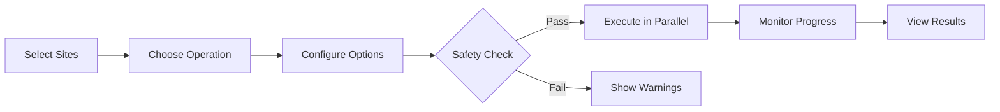

# Bulk Operations

Execute operations across multiple WordPress sites simultaneously with intelligent parallelization and progress tracking.

## Overview

Bulk Operations enable you to:

- ⚡ **Update plugins** across your entire fleet
- 🔄 **Sync sites** to WP Engine in parallel
- 📊 **Scan multiple sites** for content indexing
- 🔧 **Run WP-CLI commands** on selected sites
- 🎯 **Target specific sites** with smart filters
- 📈 **Monitor progress** in real-time
- 🛡️ **Safety checks** before destructive operations



## Opening Bulk Operations

### Via Sidebar

1. Open **Nexus AI** sidebar
2. Click **Bulk Operations** panel
3. The bulk operations interface opens

### Via Keyboard

Press `Cmd/Ctrl + Shift + B` to toggle Bulk Operations

### From Fleet Overview

1. Select multiple sites (checkboxes)
2. Click **Actions** dropdown
3. Choose **Bulk Operations**

## Operation Types

### 1. Scan Sites

**What it does:** Indexes content across multiple sites for semantic search

**Use cases:**

- Initial setup (scan all sites)
- After content changes (scan specific sites)
- Nightly jobs (automated scanning)

**Configuration:**

```
┌─────────────────────────────────────────┐
│ Bulk Scan Sites                         │
│                                         │
│ Sites Selected: 15                      │
│                                         │
│ Options:                                │
│ ☑ Force re-scan (even if recent)       │
│ ☐ Include drafts and private posts     │
│ ☑ Generate embeddings                   │
│ ☐ Skip if scanned in last 24 hours     │
│                                         │
│ Parallelization: [10  ▼]               │
│   (Run 10 scans simultaneously)         │
│                                         │
│ Estimated time: ~2 minutes              │
│                                         │
│        [Cancel]  [Start Scan]           │
└─────────────────────────────────────────┘
```

**Progress tracking:**

```
Scanning 15 sites...

✓ mysite (5,432 posts) - 12.3s
✓ blog (1,234 posts) - 4.2s
→ shop (scanning... 45% complete)
  [████████░░░░░░░░] 8,901 / 19,780 products
⏳ store (queued)
⏳ news (queued)

Progress: 3/15 sites complete (20%)
Elapsed: 42s | Remaining: ~2m 18s
```

### 2. Update Plugins

**What it does:** Updates plugins to latest versions across multiple sites

**Use cases:**

- Security updates
- Feature updates
- Regular maintenance

**Configuration:**

```
┌─────────────────────────────────────────┐
│ Bulk Update Plugins                     │
│                                         │
│ Sites Selected: 8                       │
│                                         │
│ Update Mode:                            │
│ ● Update specific plugin on all sites   │
│   Plugin: [Akismet        ▼]           │
│ ○ Update all plugins on selected sites │
│                                         │
│ Safety:                                 │
│ ☑ Create backup before updating         │
│ ☑ Stop on first error                   │
│ ☐ Skip sites with custom/modified code │
│                                         │
│ Parallelization: [5   ▼]               │
│   (Update 5 sites simultaneously)       │
│                                         │
│ Affected Sites:                         │
│ • mysite (Akismet 5.3 → 5.3.1)         │
│ • blog (Akismet 5.3 → 5.3.1)           │
│ • shop (Akismet 5.2.1 → 5.3.1)         │
│ ... (5 more)                            │
│                                         │
│        [Cancel]  [Update Plugins]       │
└─────────────────────────────────────────┘
```

**Progress tracking:**

```
Updating plugins on 8 sites...

✓ mysite - Akismet updated (2.3s)
✓ blog - Akismet updated (1.9s)
✓ shop - Akismet updated (3.1s)
→ store - Updating...
  [████████████████░░] 80%
⏳ news (queued)
⏳ test (queued)

Progress: 4/8 sites complete (50%)
Success: 3 | Failures: 0 | In Progress: 1
```

### 3. Update WordPress Core

**What it does:** Updates WordPress to latest version across sites

**Use cases:**

- Security updates (urgent)
- Major version upgrades
- Staying current

**Configuration:**

```
┌─────────────────────────────────────────┐
│ Bulk Update WordPress Core              │
│                                         │
│ Sites Selected: 12                      │
│                                         │
│ Target Version:                         │
│ ● Latest stable (6.4.3)                 │
│ ○ Specific version: [____   ▼]         │
│                                         │
│ Update Path:                            │
│ • 6 sites: 6.4.2 → 6.4.3 (minor)       │
│ • 4 sites: 6.4.1 → 6.4.3 (minor)       │
│ • 2 sites: 6.3.2 → 6.4.3 (major) ⚠️    │
│                                         │
│ Safety:                                 │
│ ☑ Create backup before updating         │
│ ☑ Verify checksums after update         │
│ ☑ Run database migrations               │
│ ☑ Stop on first error                   │
│                                         │
│ ⚠️ Warning: 2 sites require major       │
│    version upgrade. Test on staging!    │
│                                         │
│        [Cancel]  [Update WordPress]     │
└─────────────────────────────────────────┘
```

**Safety checks:**

- ✅ Backups created automatically
- ✅ Checksums verified
- ✅ Database migrations run
- ✅ Plugin compatibility checked
- ⚠️ Major version upgrades flagged

### 4. Activate/Deactivate Plugins

**What it does:** Changes plugin status across multiple sites

**Use cases:**

- Emergency deactivation (broken plugin)
- Rollout new plugin
- Testing plugin behavior

**Configuration:**

```
┌─────────────────────────────────────────┐
│ Bulk Plugin Activation                  │
│                                         │
│ Sites Selected: 10                      │
│                                         │
│ Plugin: [Wordfence         ▼]          │
│                                         │
│ Action:                                 │
│ ● Activate                              │
│ ○ Deactivate                            │
│                                         │
│ Status:                                 │
│ • 6 sites: Plugin installed, inactive   │
│ • 4 sites: Plugin not installed ⚠️      │
│                                         │
│ Options:                                │
│ ☑ Install on missing sites              │
│ ☑ Skip sites where already active       │
│ ☐ Network activate (multisite)          │
│                                         │
│        [Cancel]  [Activate Plugin]      │
└─────────────────────────────────────────┘
```

### 5. WP-CLI Commands

**What it does:** Runs custom WP-CLI commands across sites

**Use cases:**

- Advanced operations
- Custom scripts
- Debugging

**Configuration:**

```
┌─────────────────────────────────────────┐
│ Bulk WP-CLI Commands                    │
│                                         │
│ Sites Selected: 5                       │
│                                         │
│ Command:                                │
│ [cache flush                     ]      │
│                                         │
│ Common Commands:                        │
│ • cache flush                           │
│ • transient delete --all                │
│ • post list --format=count              │
│ • user list --role=administrator        │
│ • option get siteurl                    │
│                                         │
│ Safety:                                 │
│ ☑ Dry run first (preview results)       │
│ ☑ Stop on first error                   │
│ ☐ Collect output for review             │
│                                         │
│ ⚠️ Warning: Command will modify data    │
│                                         │
│        [Cancel]  [Run Command]          │
└─────────────────────────────────────────┘
```

**Dangerous commands blocked:**

- `db query` (SQL injection risk)
- `eval` (code execution)
- `shell` (shell access)
- `user create` with `--role=administrator` (requires confirmation)

### 6. WPE Operations

**What it does:** WP Engine-specific bulk operations

**Operations:**

- **Pull from WPE** - Download multiple sites from WP Engine
- **Push to WPE** - Upload multiple sites to WP Engine
- **Create Backups** - Backup multiple WPE installs
- **Promote to Production** - Batch staging → production

**Configuration (Pull from WPE):**

```
┌─────────────────────────────────────────┐
│ Bulk Pull from WP Engine                │
│                                         │
│ Sites Selected: 3                       │
│                                         │
│ • mysite → mysite-production            │
│ • blog → blog-production                │
│ • shop → shop-production                │
│                                         │
│ Options:                                │
│ ☑ Include database                      │
│ ☑ Include files                         │
│ ☐ Overwrite local changes ⚠️            │
│ ☑ Create local backup first             │
│                                         │
│ Estimated download: ~2.4 GB             │
│ Estimated time: ~15 minutes             │
│                                         │
│        [Cancel]  [Pull Sites]           │
└─────────────────────────────────────────┘
```

## Site Selection

### Manual Selection

**In Fleet Overview:**

1. Check boxes next to sites
2. Or press `Cmd/Ctrl + A` to select all
3. Or press `Cmd/Ctrl + Click` for multi-select

### Smart Filters

**Pre-built filters:**

```
Select Sites By:
┌─────────────────────────────────────────┐
│ ○ All Sites (25)                        │
│ ● Running Sites Only (18)               │
│ ○ Halted Sites Only (7)                 │
│ ○ Needs Updates (5)                     │
│ ○ WPE Linked (8)                        │
│ ○ WordPress 6.4.3 (12)                  │
│ ○ WordPress < 6.4 (8)                   │
│ ○ PHP 8.2 (15)                          │
│ ○ Has WooCommerce (6)                   │
│ ○ Custom Filter...                      │
└─────────────────────────────────────────┘
```

### Site Groups

**Use saved groups:**

```
Select from Groups:
┌─────────────────────────────────────────┐
│ □ Client Sites (12)                     │
│   ☑ Client A Sites (4)                  │
│   ☑ Client B Sites (3)                  │
│   ☐ Client C Sites (5)                  │
│ □ Personal Projects (8)                 │
│ □ Production Sites (6)                  │
└─────────────────────────────────────────┘

Total Selected: 7 sites
```

[Site Groups →](site-groups.md)

### Advanced Selection

**Complex queries:**

```
┌─────────────────────────────────────────┐
│ Advanced Site Selection                 │
│                                         │
│ Match: ● ALL of the following           │
│        ○ ANY of the following           │
│                                         │
│ Conditions:                             │
│ 1. WordPress Version [is] [6.4.3  ▼]   │
│    [+ AND] [+ OR] [Remove]              │
│                                         │
│ 2. Status [is] [running ▼]             │
│    [+ AND] [+ OR] [Remove]              │
│                                         │
│ 3. Has Plugin [Yoast SEO ▼]            │
│    [+ AND] [+ OR] [Remove]              │
│                                         │
│ [+ Add Condition]                       │
│                                         │
│ Preview: 4 sites match                  │
│ • mysite                                │
│ • blog                                  │
│ • news                                  │
│ • docs                                  │
│                                         │
│        [Cancel]  [Select These Sites]   │
└─────────────────────────────────────────┘
```

## Progress Monitoring

### Real-Time Progress

**Live updates:**

```
Operation: Update Plugins (Akismet)
Sites: 15 | Parallel: 5

[████████████████░░░░] 80% Complete

Currently Processing:
┌──────────┬────────────┬──────────┬──────────┐
│ Site     │ Status     │ Progress │ Time     │
├──────────┼────────────┼──────────┼──────────┤
│ shop     │ Updating   │ 85%      │ 3.2s     │
│ store    │ Updating   │ 72%      │ 2.8s     │
│ news     │ Updating   │ 45%      │ 1.5s     │
│ docs     │ Waiting    │ -        │ -        │
│ test     │ Waiting    │ -        │ -        │
└──────────┴────────────┴──────────┴──────────┘

Completed: 12 | Failed: 0 | In Progress: 3
Elapsed: 45s | Remaining: ~12s
```

### Detailed Logs

**Click "View Logs" for details:**

```
[10:30:15] Starting bulk update operation
[10:30:15] Selected 15 sites for Akismet update
[10:30:16] Creating backups...
[10:30:22] ✓ Backups created for 15 sites
[10:30:22] Starting parallel updates (max 5)

[10:30:23] mysite: Starting Akismet update
[10:30:23] blog: Starting Akismet update
[10:30:23] shop: Starting Akismet update
[10:30:25] ✓ mysite: Akismet 5.3 → 5.3.1 (2.3s)
[10:30:25] ✓ blog: Akismet 5.3 → 5.3.1 (1.9s)
[10:30:26] ✓ shop: Akismet 5.2.1 → 5.3.1 (3.1s)

[10:30:26] store: Starting Akismet update
[10:30:27] news: Starting Akismet update
...

[10:31:08] ✓ All updates complete
[10:31:08] Success: 15 | Failures: 0
[10:31:08] Total time: 45 seconds
```

### Error Handling

**When errors occur:**

```
✗ Error on site "test"

Site: test
Operation: Update Plugin (Akismet)
Error: Plugin update failed

Details:
The plugin 'akismet' is active and cannot be
updated because it conflicts with another plugin.

Stack Trace:
  wp plugin update akismet
  Error: Plugin update blocked by Wordfence

Options:
┌─────────────────────────────────────────┐
│ ○ Skip this site and continue            │
│ ● Stop all operations                    │
│ ○ Retry this site                        │
│ ○ View site details                      │
│                                         │
│        [Choose Action]                  │
└─────────────────────────────────────────┘
```

**Error summary:**

```
Operation Complete (with errors)

Success: 14 sites
Failures: 1 site

Failed Sites:
• test - Plugin conflict (Wordfence)

[View Error Log] [Retry Failed] [Export Report]
```

## Safety Features

### Pre-Flight Checks

**Before executing, Nexus checks:**

| Check | Description |
|-------|-------------|
| **Site Status** | All sites running and accessible |
| **Disk Space** | Sufficient space for operations |
| **Backups** | Recent backups exist (if enabled) |
| **Permissions** | User has necessary permissions |
| **Conflicts** | No conflicting operations running |

**Example warning:**

```
⚠️ Pre-Flight Check Warnings

2 issues detected:

1. Low Disk Space (shop)
   Available: 450 MB | Required: 1.2 GB
   Recommendation: Free up space or skip this site

2. No Recent Backup (test)
   Last backup: 14 days ago
   Recommendation: Create backup before update

Options:
☐ Skip sites with warnings
☑ Create backups for sites missing them
☐ Proceed anyway (not recommended)

        [Cancel]  [Fix Issues]  [Proceed]
```

### Rollback Support

**If operations fail, rollback is available:**

```
✗ Update Failed - Rollback Available

Operation: Update WordPress Core
Site: mysite
Error: Database migration failed

Rollback Options:
┌─────────────────────────────────────────┐
│ ● Rollback this site only               │
│   Restores from pre-update backup       │
│                                         │
│ ○ Rollback all updated sites            │
│   Restores all sites to previous state  │
│                                         │
│ ○ Continue without rollback             │
│   Site may be unstable                  │
│                                         │
│        [Cancel]  [Rollback]             │
└─────────────────────────────────────────┘
```

**Rollback process:**

1. Stop all ongoing operations
2. Restore from automatic backup
3. Verify site health
4. Report status

### Dry Run Mode

**Preview changes before applying:**

```
Dry Run Results

Operation: Update Plugins (All)
Sites: 5

Changes to be made:
┌──────────┬─────────────┬────────────┬────────────┐
│ Site     │ Plugin      │ Current    │ New        │
├──────────┼─────────────┼────────────┼────────────┤
│ mysite   │ Akismet     │ 5.3        │ 5.3.1      │
│ mysite   │ Yoast SEO   │ 21.8       │ 21.9       │
│ blog     │ Akismet     │ 5.3        │ 5.3.1      │
│ shop     │ Akismet     │ 5.2.1      │ 5.3.1      │
│ shop     │ WooCommerce │ 8.5.1      │ 8.5.2      │
└──────────┴─────────────┴────────────┴────────────┘

Total updates: 5 plugins across 3 sites

        [Cancel]  [Proceed with Updates]
```

## Performance Optimization

### Parallelization

**Configure concurrent operations:**

```
Parallelization Settings:

Simultaneous Operations: [10  ▼]

Conservative (5):  ████░░░░░░░░░░░░░
  Slower, safer, less resource usage

Balanced (10):     ████████░░░░░░░░
  Default, good for most cases

Aggressive (20):   ████████████████
  Faster, higher CPU/network usage

Auto: Let Nexus decide based on system resources
```

**System impact:**

| Level | Operations | CPU Usage | Time |
|-------|-----------|-----------|------|
| Conservative | 5 parallel | ~30% | Longer |
| Balanced | 10 parallel | ~50% | Medium |
| Aggressive | 20 parallel | ~80% | Faster |

### Operation Queue

**Operations are queued and scheduled:**

```
Operation Queue

Currently Running:
→ Update Plugins (Akismet) on 15 sites
  [████████░░░░░░░░] 50% | 2m 15s remaining

Queued:
1. Scan Sites (8 sites) - Waiting
2. Update WordPress Core (3 sites) - Waiting

Completed:
✓ Bulk Backup (12 sites) - 5 minutes ago

[Pause Queue] [Clear Queue]
```

### Resource Monitoring

**Real-time system monitoring:**

```
System Resources

CPU:  [████████░░] 45%
RAM:  [██████░░░░] 32% (2.1 GB / 6.5 GB)
Disk: [███░░░░░░░] 18% (Write: 45 MB/s)
Net:  [████░░░░░░] 25% (Down: 12 Mbps)

⚠️ High CPU usage detected
   Consider reducing parallelization
```

## Scheduling

### Scheduled Operations

**Run operations on a schedule:**

```
┌─────────────────────────────────────────┐
│ Schedule Bulk Operation                 │
│                                         │
│ Operation: [Scan Sites    ▼]           │
│ Sites: [All Running Sites ▼]           │
│                                         │
│ Schedule:                               │
│ ● Daily at [2:00 AM ▼]                 │
│ ○ Weekly on [Sunday  ▼] at [2:00 AM]  │
│ ○ Monthly on [1st    ▼] at [2:00 AM]  │
│ ○ Custom: [______________________]     │
│                                         │
│ Options:                                │
│ ☑ Only if sites have changed            │
│ ☑ Send notification when complete       │
│ ☐ Run even if Local is closed           │
│                                         │
│        [Cancel]  [Schedule]             │
└─────────────────────────────────────────┘
```

**Scheduled operations list:**

```
Scheduled Operations (3)

1. Daily Site Scan
   Every day at 2:00 AM
   Sites: All running sites
   Last run: Today at 2:00 AM (Success)
   Next run: Tomorrow at 2:00 AM

2. Weekly Plugin Updates
   Every Sunday at 3:00 AM
   Sites: Production sites group
   Last run: Last Sunday (Success - 12 sites)
   Next run: This Sunday at 3:00 AM

3. Monthly WPE Backup
   1st of month at 1:00 AM
   Sites: WPE-linked sites
   Last run: March 1 (Success - 8 sites)
   Next run: April 1 at 1:00 AM

[+ Add Schedule] [Edit] [Delete]
```

## Best Practices

### 1. Start Small

Test on a subset first:

```
Workflow:
1. Select 2-3 test sites
2. Run operation
3. Verify success
4. Expand to full fleet
```

### 2. Use Dry Run

Always preview changes:

```
Recommended for:
• First-time operations
• Destructive operations
• Operations on production sites
• Complex WP-CLI commands
```

### 3. Schedule Maintenance

Automate routine tasks:

```
Good candidates for scheduling:
✓ Nightly content scans
✓ Weekly plugin updates (staging)
✓ Monthly backups
✗ WordPress core updates (manual review)
✗ Database changes (too risky)
```

### 4. Monitor Progress

Don't walk away:

```
Stay engaged:
• Watch for errors
• Check logs periodically
• Verify first few completions
• Be ready to intervene
```

### 5. Document Changes

Keep track of bulk operations:

```
After each operation:
1. Export operation report
2. Note any errors/warnings
3. Verify sites are healthy
4. Update documentation
```

## Troubleshooting

### Operation Stuck

**Problem:** Progress bar not moving

**Solutions:**

1. **Check individual site logs:**
   - Click site in progress list
   - View detailed log

2. **Cancel and retry:**
   - Click "Cancel Operation"
   - Review what completed
   - Retry failed sites

3. **Check system resources:**
   - High CPU/disk usage may slow operations
   - Reduce parallelization

### Operations Failing

**Problem:** Multiple sites failing

**Common causes:**

1. **Network issues:**
   - Check internet connection
   - WPE operations require connectivity

2. **Permission issues:**
   - Verify file permissions
   - Check user has admin access

3. **Resource constraints:**
   - Low disk space
   - Insufficient memory
   - Reduce parallel operations

4. **Plugin conflicts:**
   - Check error logs
   - Disable conflicting plugins first

## Next Steps

- **[Fleet Overview](fleet-overview.md)** - Select sites for bulk operations
- **[Smart Filters](smart-filters.md)** - Advanced site filtering
- **[Site Groups](site-groups.md)** - Organize sites for bulk ops
- **[Safety System](../features/safety-system.md)** - Understanding safety tiers
- **[CLI Examples](../cli/examples.md)** - Bulk operations via CLI

---

**Pro tip:** Create site groups for common bulk operation targets (e.g., "Production Sites", "Client A Sites") to speed up your workflow!
