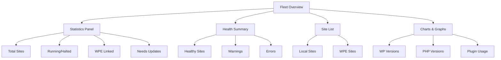

# Fleet Overview

The Fleet Overview provides a comprehensive dashboard for managing all your WordPress sites at a glance.

## Overview

The Fleet Overview is your command center for WordPress site management:

- 📊 **Real-time statistics** across all sites
- 🎯 **Health indicators** for quick status checks
- 📈 **Visual charts** for version distribution
- ⚡ **Quick actions** for common tasks
- 🔍 **Smart filtering** to find sites quickly
- 📱 **Responsive layout** that works on any screen



## Opening Fleet Overview

### Via Toolbar

1. Open Local
2. Click the **Nexus AI** icon in the toolbar
3. The sidebar opens with Fleet Overview as the default view

### Via Keyboard

Press `Cmd/Ctrl + Shift + F` to toggle Fleet Overview

### Auto-Open on Startup

Enable in **Preferences → General**:

- ☑️ Open Fleet Overview on Local startup
- ☑️ Auto-refresh every 5 minutes

## Dashboard Tabs

The Fleet Overview includes multiple tabs for organizing different types of operations:

- **Overview** - Statistics, health summary, and site list (default)
- **Operations** - Credential sync and WPE site synchronization
- **Analytics** - Charts and usage reports (if enabled)

### Overview Tab

The default view showing real-time fleet statistics and site management.

#### 1. Statistics Panel

**Real-time metrics:**

```
┌─────────────────────────────────────────┐
│  Total Sites: 25                        │
│  Running: 18  |  Halted: 7              │
│  WPE Linked: 8                          │
│  Needs Updates: 5                       │
└─────────────────────────────────────────┘
```

**What it shows:**

- **Total Sites** - Count of all Local sites
- **Running/Halted** - Active vs stopped sites
- **WPE Linked** - Sites connected to WP Engine
- **Needs Updates** - Sites with available plugin/core updates

**Click behavior:**

- Click **Needs Updates** → Filters to show only sites needing updates
- Click **WPE Linked** → Shows only WPE-connected sites
- Click **Halted** → Shows only stopped sites

### 2. Health Summary

**Visual health indicators:**

```
✓ Healthy (18)        ⚠ Warnings (5)        ✗ Errors (2)
━━━━━━━━━━━━━━━      ━━━━━━━━━━━━━━━      ━━━━━━━━━━━━━━━
72%                   20%                   8%
```

**Health criteria:**

| Status | Criteria |
|--------|----------|
| **Healthy** ✓ | WordPress latest, plugins current, no PHP errors |
| **Warning** ⚠ | Outdated WP/plugins, disk space >80%, minor issues |
| **Error** ✗ | Critical errors, security issues, site unreachable |

**Click behavior:**

- Click **Healthy** → Shows only healthy sites
- Click **Warnings** → Shows sites with warnings + details
- Click **Errors** → Shows sites with errors + remediation steps

### 3. WordPress Version Distribution

**Visual breakdown:**

```
WordPress Versions
┌────────────────────────────┐
│ 6.4.3 ████████████ 12     │
│ 6.4.2 ██████ 6             │
│ 6.4.1 ███ 3                │
│ 6.3.2 ██ 2                 │
│ 6.3.1 █ 1                  │
│ Other █ 1                  │
└────────────────────────────┘
```

**Insights:**

- Identify sites running outdated versions
- Plan bulk update operations
- Track upgrade progress

**Click behavior:**

- Click version bar → Filters to sites with that version
- Hover → Shows site names in tooltip

### 4. PHP Version Distribution

**Visual breakdown:**

```
PHP Versions
┌────────────────────────────┐
│ 8.2 ███████████████ 15     │
│ 8.1 ██████ 6               │
│ 8.0 ███ 3                  │
│ 7.4 █ 1 ⚠️                 │
└────────────────────────────┘
```

**⚠️ Warnings:**

- PHP 7.4 and below show warnings (end of life)
- Hover for upgrade recommendations

**Click behavior:**

- Click version bar → Filters to sites with that PHP version
- Right-click → Options to upgrade PHP version

### 5. Top Plugins

**Most used plugins across fleet:**

```
Top Plugins
┌────────────────────────────┐
│ 1. Akismet        (22/25)  │
│ 2. Yoast SEO      (18/25)  │
│ 3. WooCommerce    (12/25)  │
│ 4. Contact Form 7 (15/25)  │
│ 5. Wordfence      (14/25)  │
└────────────────────────────┘
```

**Click behavior:**

- Click plugin name → Shows sites using that plugin
- Click count → Plugin details across all sites

### 6. Site List

**Sortable, filterable table:**

```
┌──────────┬──────────────┬─────────┬────────────┬─────────┬────────┐
│ Name     │ Domain       │ Status  │ WP Version │ Health  │ Actions│
├──────────┼──────────────┼─────────┼────────────┼─────────┼────────┤
│ mysite   │ mysite.local │ ✓ Run   │ 6.4.3      │ ✓       │ ...    │
│ blog     │ blog.local   │ ✓ Run   │ 6.4.2      │ ⚠       │ ...    │
│ shop     │ shop.local   │ ○ Halt  │ 6.3.1      │ ✗       │ ...    │
└──────────┴──────────────┴─────────┴────────────┴─────────┴────────┘
```

**Columns:**

- **Name** - Site name (click to view details)
- **Domain** - Site URL (click to open in browser)
- **Status** - Running/Halted with indicator
- **WP Version** - WordPress version (color-coded: green=latest, yellow=outdated, red=old)
- **Health** - Quick health indicator
- **Actions** - Quick action menu

**Sorting:**

- Click any column header to sort
- Click again to reverse sort
- Multi-column sort: Hold Shift + click

**Actions menu:**

- **Open Site** - Launch in browser
- **Open Admin** - Launch WP admin
- **Site Shell** - Open terminal
- **Scan Site** - Re-index content
- **View Details** - Open site info panel
- **Start/Stop** - Toggle site status

### Operations Tab

**Fleet-wide operations and synchronization:**

Access via the **Operations** tab in Fleet Overview.

#### Credential Sync

Synchronize AI credentials (API keys, provider settings) across all running WordPress sites.

```
┌─────────────────────────────────────────┐
│ AI Credential Sync                      │
│                                         │
│ Sync credentials to running sites for:  │
│ • AI-powered features                   │
│ • Ollama integration                    │
│ • OpenAI/Anthropic API access           │
│                                         │
│ Last sync: 2 hours ago                  │
│ Status: ✓ 18/18 sites synced            │
│                                         │
│ [Sync All Running Sites]                │
└─────────────────────────────────────────┘
```

**What it syncs:**
- AI provider credentials (Ollama, OpenAI, Anthropic)
- Model selections
- API endpoint configurations
- WordPress AI options

**Progress tracking:**
- Real-time sync status with loading indicators
- Per-site success/failure reporting
- Toast notifications for completion
- Automatic retry on transient failures

**Click "Sync All Running Sites":**
1. Loading spinner appears
2. Sites are synced sequentially
3. Progress shown per-site
4. Success toast: "Successfully synced credentials to X sites"
5. Error toast if any sites fail with details

#### WP Engine Site Sync

Sync WP Engine remote sites into the local fleet view for unified search and management.

```
┌─────────────────────────────────────────┐
│ WP Engine Sites                         │
│                                         │
│ Sync remote WPE sites into fleet:       │
│ • Full content indexing                 │
│ • Plugin/theme metadata extraction      │
│ • Unified search with local sites       │
│                                         │
│ Last sync: 1 day ago                    │
│ Status: ✓ 251 sites indexed             │
│ Time: ~25 minutes for full sync         │
│                                         │
│ [Sync Now]                              │
└─────────────────────────────────────────┘
```

**What gets synced:**
- Site metadata (WordPress version, URL, status)
- Plugin and theme lists with versions
- User accounts and roles
- Content for semantic search (via SSH WP-CLI)
- Site health indicators

**Performance:**
- ~6 seconds per site (SSH ControlMaster + 10× concurrency)
- Live progress in Fleet Overview header
- Background indexing after metadata sync
- Re-sync anytime to refresh data

**After sync completes:**
- WPE sites appear in Site Finder search results
- Can view site details and metadata
- One-click "Pull to Local" for development
- Automatic link detection between local and WPE sites

See [WPE Remote Management User Guide](../integrations/wpe-management.md) for full documentation.

### 7. WP Engine Sites

**Separate section for remote sites:**

```
WP Engine Sites (8)
┌──────────────────┬─────────────┬────────────────────────────┬────────┐
│ Name             │ Environment │ Domain                     │ Actions│
├──────────────────┼─────────────┼────────────────────────────┼────────┤
│ mysite-prod      │ production  │ mysite.wpengine.com        │ ...    │
│ mysite-staging   │ staging     │ mysite.wpenginepowered.com │ ...    │
│ blog-prod        │ production  │ blog.com                   │ ...    │
└──────────────────┴─────────────┴────────────────────────────┴────────┘
```

**Indicators:**

- 🟢 Production (green)
- 🟡 Staging (yellow)
- 🔵 Development (blue)

**Actions menu:**

- **Diagnose** - Run health check
- **Compare Environments** - Staging vs production
- **Create Backup** - Instant backup
- **Pull to Local** - Download to local site
- **Open Site** - Launch in browser

## Quick Actions

### Scan All Sites

**Button:** Top-right "Scan All Sites"

**What it does:**

1. Scans all running Local sites
2. Indexes new/modified content
3. Updates vector database
4. Refreshes health indicators

**Progress:**

```
Scanning 18 sites...

✓ mysite (5,432 posts) - 12.3s
✓ blog (1,234 posts) - 4.2s
→ shop (scanning...)
  ...

Progress: 3/18 sites (16%)
Estimated time remaining: 2m 15s
```

**Click behavior:**

- Click "Scan All Sites" → Starts scan
- Click "Cancel" during scan → Stops gracefully
- Click site row → Shows detailed scan log

### Bulk Update

**Button:** "Update All" (when updates available)

**What it shows:**

```
┌─────────────────────────────────────────┐
│ Updates Available (5 sites)             │
│                                         │
│ ☑ mysite - 3 plugin updates             │
│ ☑ blog - 1 plugin update                │
│ ☑ shop - WordPress 6.4.3 + 5 plugins   │
│ ☐ test - 2 plugin updates               │
│ ☐ demo - WordPress 6.4.3                │
│                                         │
│ ☑ Create backups first                  │
│ ☐ Update WordPress core                 │
│ ☑ Update plugins                         │
│                                         │
│        [Cancel]  [Update Selected]      │
└─────────────────────────────────────────┘
```

**Safety:**

- ✅ Backups created automatically
- ✅ Updates run sequentially (not parallel)
- ✅ Stop on first error
- ✅ Rollback available

### Filter Sites

**Dropdown:** Quick filter menu

**Presets:**

- All Sites (default)
- Running Sites Only
- Halted Sites Only
- Needs Updates
- WPE Linked
- Healthy Sites
- Sites with Warnings
- Sites with Errors
- WordPress 6.4.3
- WordPress < 6.4
- PHP 8.2
- PHP < 8.0

**Custom filters:**

Click "Custom Filter" to build advanced queries:

```
┌─────────────────────────────────────────┐
│ Filter Sites                            │
│                                         │
│ WordPress Version:                      │
│   [is] [6.4.3            ▼]            │
│                                         │
│ Status:                                 │
│   [is] [running          ▼]            │
│                                         │
│ Has Plugin:                             │
│   [WooCommerce           ▼]            │
│                                         │
│          [Reset]  [Apply Filter]        │
└─────────────────────────────────────────┘
```

## Site Details Panel

**Click any site** to open the detail panel:

```
┌─────────────────────────────────────────┐
│ mysite                             [×]  │
├─────────────────────────────────────────┤
│                                         │
│ Status: ✓ Running                       │
│ Domain: https://mysite.local            │
│ WordPress: 6.4.3                        │
│ PHP: 8.2.0                              │
│ MySQL: 8.0.35                           │
│                                         │
│ ──────────────────────────────────────  │
│                                         │
│ Quick Stats:                            │
│   Posts: 5,432                          │
│   Pages: 342                            │
│   Plugins: 15 (12 active)               │
│   Themes: 3 (1 active)                  │
│   Users: 8                              │
│                                         │
│ ──────────────────────────────────────  │
│                                         │
│ Last Scan: 2 hours ago                  │
│ Last Modified: 30 minutes ago           │
│                                         │
│ ──────────────────────────────────────  │
│                                         │
│ [Open Site]  [Open Admin]  [Scan]      │
│                                         │
│ Linked to WPE:                          │
│   mysite-production (wpengine.com)      │
│   [Compare]  [Pull]  [Push]             │
│                                         │
└─────────────────────────────────────────┘
```

**Tabs:**

- **Overview** - Site stats and quick actions
- **Plugins** - Installed plugins list
- **Themes** - Installed themes
- **Content** - Post/page breakdown
- **Health** - Detailed health report
- **WPE** - WP Engine integration (if linked)

#### Database Health Row

The site card includes a **Database Health** row that summarizes bloat detected by the AI Database Scanner:

```
Database Health:  29 MB savings available  ⚠ WooCommerce bloat
                  [Scan]  [Clean (dry run)]
```

**What it shows:**

- **No scan yet** — "Not scanned" with a **Scan** button
- **Clean** — "Database looks healthy" (< 1 MB savings detected)
- **Savings available** — estimated MB that can be reclaimed, with a **Clean (dry run)** button
- **WooCommerce bloat** badge — shown when stale sessions or orphaned order data are the primary contributor

**How to use it:**

1. Click **Scan** to run a database health check (read-only, safe at any time)
2. Review the summary — click the row to expand the full report
3. Click **Clean (dry run)** to preview what would be removed
4. If the preview looks correct, click **Apply Cleanup** to delete the flagged rows

The scanner runs through the MCP `scan_database_health` and `clean_database_items` tools; you can also trigger it directly from the AI chat or CLI (`nexus wp db scan <site>`).

## Charts and Visualizations

### Version Timeline

**Shows upgrade progress over time:**

```
WordPress Versions Over Time
    6.4.3 ████████████████████████
    6.4.2 ████████
    6.4.1 ███
    6.4.0 █
    6.3.2
         ┴────┴────┴────┴────┴────
        Jan  Feb  Mar  Apr  May
```

**Insights:**

- Track fleet upgrade velocity
- Identify sites falling behind
- Plan upgrade schedules

### Plugin Usage Trends

**Most installed plugins:**

```
Plugin Usage
Akismet      ████████████████████ 88%
Yoast SEO    ██████████████ 72%
WooCommerce  ████████ 48%
Contact F... ██████ 60%
Wordfence    █████ 56%
```

**Click behavior:**

- Click bar → List of sites using that plugin
- Hover → Version distribution

### Storage Usage

**Disk space across sites:**

```
Storage Usage
┌────────────────────────────┐
│ Total: 45.2 GB             │
│ ███████████░░░░░░░░░ 58%   │
│                            │
│ Largest Sites:             │
│ 1. shop       8.9 GB       │
│ 2. media      6.2 GB       │
│ 3. blog       4.1 GB       │
└────────────────────────────┘
```

**Alerts:**

- ⚠️ Warning at 80% capacity
- ✗ Error at 90% capacity

## Customization

### Layout Options

**Preferences → Fleet Overview**

- **Compact view** - Smaller cards, more sites visible
- **Detailed view** - Larger cards with more info
- **List view** - Table format only
- **Grid view** - Card-based layout

### Widget Configuration

**Drag and drop widgets:**

1. Click **Customize Dashboard**
2. Drag widgets to reorder
3. Click ✕ to hide widgets
4. Click ＋ to add widgets
5. Click **Save Layout**

**Available widgets:**

- Statistics Panel
- Health Summary
- WordPress Versions
- PHP Versions
- Top Plugins
- Recent Scans
- WPE Sites
- Storage Usage
- Quick Actions

### Auto-Refresh

**Configure refresh interval:**

- Manual only
- Every 1 minute
- Every 5 minutes (default)
- Every 15 minutes
- Every 30 minutes

**Smart refresh:**

- Only refreshes visible data
- Pauses when Local is in background
- Resumes on focus

## Keyboard Shortcuts

| Shortcut | Action |
|----------|--------|
| `Cmd/Ctrl + Shift + F` | Toggle Fleet Overview |
| `Cmd/Ctrl + R` | Refresh data |
| `Cmd/Ctrl + S` | Scan all sites |
| `Cmd/Ctrl + F` | Focus search box |
| `↑ ↓` | Navigate site list |
| `Enter` | Open selected site details |
| `Space` | Toggle site selection |
| `Cmd/Ctrl + A` | Select all sites |
| `Escape` | Close detail panel |

## Best Practices

### 1. Regular Scans

Keep your index fresh:

```
Recommended scan frequency:
- High-traffic sites: Daily
- Medium-traffic sites: Weekly
- Low-traffic sites: Monthly
- Development sites: On-demand
```

Enable **Auto-scan on startup** in Preferences.

### 2. Monitor Health

Check health indicators daily:

```
Daily workflow:
1. Open Fleet Overview
2. Check health summary
3. Address errors first
4. Review warnings
5. Plan updates
```

### 3. Batch Updates

Use bulk operations for efficiency:

```
Update workflow:
1. Filter to sites needing updates
2. Select all (Cmd/Ctrl + A)
3. Click "Update Selected"
4. Monitor progress
5. Verify health after completion
```

### 4. Organize with Groups

Group related sites:

```
Example groups:
- Client Sites
- Personal Projects
- Staging Environments
- Production Sites
- E-commerce Sites
```

### 5. Use Smart Filters

Save frequently used filters:

```
Useful saved filters:
- "Production WooCommerce"
- "Outdated WordPress"
- "Sites Needing Attention"
- "Development Environments"
```

## Troubleshooting

### Sites Not Showing

**Problem:** Fleet Overview is empty

**Solutions:**

1. **Verify Local sites exist:**
   - Check Local main sidebar
   - Sites must be visible in Local

2. **Refresh Fleet Overview:**
   - Press `Cmd/Ctrl + R`
   - Or click Refresh button

3. **Check addon is loaded:**
   - Preferences → Addons
   - "Nexus AI" should be checked

4. **Restart Local:**
   - Quit Local completely
   - Reopen

### Health Indicators Wrong

**Problem:** Health status doesn't match reality

**Solutions:**

1. **Re-scan affected sites:**
   - Click site → "Scan Site"

2. **Clear cache:**
   - Preferences → Advanced → Clear Cache

3. **Rebuild index:**
   ```bash
   nexus db reset
   nexus scan --force
   ```

### Charts Not Updating

**Problem:** Statistics are stale

**Solutions:**

1. **Force refresh:**
   - `Cmd/Ctrl + Shift + R`

2. **Check auto-refresh:**
   - Preferences → Fleet Overview → Auto-refresh

3. **Manual data sync:**
   - Click "Sync Now" button

### Slow Performance

**Problem:** Fleet Overview is sluggish

**Solutions:**

1. **Reduce visible sites:**
   - Use filters to show fewer sites
   - Enable "Show running only"

2. **Disable heavy widgets:**
   - Hide charts/graphs if not needed
   - Use compact view

3. **Optimize database:**
   ```bash
   nexus db optimize
   ```

4. **Increase refresh interval:**
   - Change from 1 minute to 5 minutes

## Next Steps

- **[Site Finder](site-finder.md)** - AI-powered site search
- **[Bulk Operations](bulk-operations.md)** - Fleet-wide operations
- **[WPE Management](wpe-management.md)** - WP Engine integration
