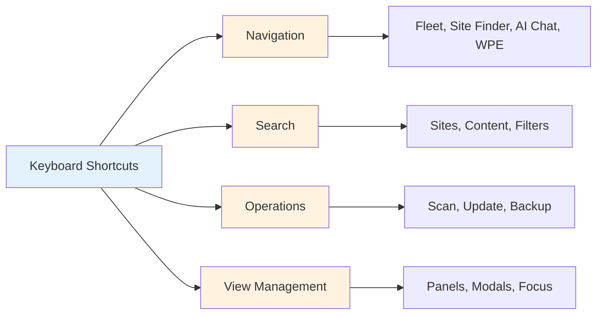

# Keyboard Shortcuts

Master Nexus AI with keyboard shortcuts for blazing-fast workflow.

## Overview

Keyboard shortcuts provide **instant access** to all major features without touching the mouse.



**Platform Differences:**

| Key | macOS | Windows/Linux |
|-----|-------|---------------|
| Modifier | `Cmd` | `Ctrl` |
| Secondary | `Option` | `Alt` |
| Examples | `Cmd+F` | `Ctrl+F` |

**Notation:**

- `Cmd+K` = Press Command and K together
- `Cmd+Shift+F` = Press Command, Shift, and F together
- `↑` `↓` `←` `→` = Arrow keys
- `Enter` = Return key
- `Esc` = Escape key

## Global Shortcuts

### Navigation

| Shortcut | Action | Context |
|----------|--------|---------|
| `Cmd/Ctrl+1` | Fleet Overview | Anywhere |
| `Cmd/Ctrl+2` | Site Finder | Anywhere |
| `Cmd/Ctrl+3` | AI Chat | Anywhere |
| `Cmd/Ctrl+4` | WPE Management | Anywhere |
| `Cmd/Ctrl+5` | Smart Filters | Anywhere |
| `Cmd/Ctrl+6` | Site Groups | Anywhere |
| `Cmd/Ctrl+0` | Preferences | Anywhere |
| `Cmd/Ctrl+,` | Settings | Anywhere |
| `Cmd/Ctrl+\` | Toggle Sidebar | Anywhere |

**Example:**

```
Cmd+2 → Opens Site Finder
Cmd+3 → Switches to AI Chat
Cmd+1 → Back to Fleet Overview
```

### Search & Find

| Shortcut | Action | Context |
|----------|--------|---------|
| `Cmd/Ctrl+F` | Open Site Finder | Anywhere |
| `Cmd/Ctrl+K` | Quick Search | Anywhere |
| `Cmd/Ctrl+P` | Command Palette | Anywhere |
| `Cmd/Ctrl+Shift+F` | Advanced Search | Anywhere |
| `Cmd/Ctrl+G` | Find Next | Search results |
| `Cmd/Ctrl+Shift+G` | Find Previous | Search results |

**Quick Search:**

```
Cmd+K → Type "woo" → Select "WooCommerce sites"
```

### Common Actions

| Shortcut | Action | Context |
|----------|--------|---------|
| `Cmd/Ctrl+N` | New... (context-dependent) | Anywhere |
| `Cmd/Ctrl+S` | Save | When editing |
| `Cmd/Ctrl+R` | Refresh / Reload | List views |
| `Cmd/Ctrl+W` | Close Panel | Panel focused |
| `Cmd/Ctrl+Q` | Quit Nexus AI | Anywhere |
| `F5` | Refresh Data | Anywhere |
| `Esc` | Cancel / Close | Modals, inputs |

## Fleet Overview

### Site List Navigation

| Shortcut | Action | Context |
|----------|--------|---------|
| `↓` / `↑` | Navigate sites | Site list |
| `Enter` | Open selected site | Site selected |
| `Space` | Toggle selection | Site list |
| `Cmd/Ctrl+A` | Select all sites | Site list |
| `Cmd/Ctrl+D` | Deselect all | Site list |
| `Cmd/Ctrl+I` | Invert selection | Site list |

**Example Flow:**

```
1. Cmd+1 (Fleet Overview)
2. ↓ ↓ ↓ (Navigate to site)
3. Enter (Open site details)
```

### Site Operations

| Shortcut | Action | Context |
|----------|--------|---------|
| `Cmd/Ctrl+Shift+S` | Scan selected sites | Site(s) selected |
| `Cmd/Ctrl+Shift+U` | Update selected sites | Site(s) selected |
| `Cmd/Ctrl+Shift+B` | Backup selected sites | Site(s) selected |
| `Cmd/Ctrl+O` | Open in browser | Site selected |
| `Cmd/Ctrl+E` | Edit site settings | Site selected |
| `Delete` | Delete selected sites | Site(s) selected |

### Filtering & Sorting

| Shortcut | Action | Context |
|----------|--------|---------|
| `Cmd/Ctrl+Shift+F` | Open filter panel | Fleet view |
| `Cmd/Ctrl+L` | Clear filters | Fleet view |
| `Cmd/Ctrl+Shift+1` | Sort by name | Fleet view |
| `Cmd/Ctrl+Shift+2` | Sort by status | Fleet view |
| `Cmd/Ctrl+Shift+3` | Sort by last scan | Fleet view |
| `Cmd/Ctrl+Shift+4` | Sort by health | Fleet view |

## Site Finder

### Search Operations

| Shortcut | Action | Context |
|----------|--------|---------|
| `Cmd/Ctrl+F` | Focus search input | Site Finder |
| `Enter` | Execute search | Search input |
| `Cmd/Ctrl+Enter` | Search in new tab | Search input |
| `Esc` | Clear search | Search input |
| `↓` / `↑` | Navigate results | Results list |
| `Cmd/Ctrl+↓` | Jump to first result | Results list |
| `Cmd/Ctrl+↑` | Jump to last result | Results list |

### Result Actions

| Shortcut | Action | Context |
|----------|--------|---------|
| `Enter` | Open selected result | Result selected |
| `Cmd/Ctrl+Enter` | View site details | Result selected |
| `Space` | Preview content | Result selected |
| `Cmd/Ctrl+O` | Open in browser | Result selected |
| `Cmd/Ctrl+Shift+S` | Scan selected site | Result selected |

### Search History

| Shortcut | Action | Context |
|----------|--------|---------|
| `Cmd/Ctrl+H` | View search history | Site Finder |
| `Cmd/Ctrl+Shift+H` | Clear search history | Site Finder |
| `Cmd/Ctrl+S` | Save current query | After search |
| `Cmd/Ctrl+Y` | Open saved queries | Site Finder |

## AI Chat

### Chat Operations

| Shortcut | Action | Context |
|----------|--------|---------|
| `Cmd/Ctrl+Shift+C` | Open AI Chat | Anywhere |
| `Cmd/Ctrl+L` | Clear conversation | AI Chat |
| `Cmd/Ctrl+N` | New conversation | AI Chat |
| `Cmd/Ctrl+Enter` | Send message | Chat input |
| `Shift+Enter` | New line | Chat input |
| `Esc` | Cancel operation | AI Chat |
| `↑` | Edit last message | Chat input |
| `↓` | Restore original | After edit |

### Message Navigation

| Shortcut | Action | Context |
|----------|--------|---------|
| `Cmd/Ctrl+↑` | Scroll to top | Chat history |
| `Cmd/Ctrl+↓` | Scroll to bottom | Chat history |
| `PageUp` | Scroll up | Chat history |
| `PageDown` | Scroll down | Chat history |
| `Home` | Jump to first message | Chat history |
| `End` | Jump to last message | Chat history |

### Chat History

| Shortcut | Action | Context |
|----------|--------|---------|
| `Cmd/Ctrl+H` | View conversation history | AI Chat |
| `Cmd/Ctrl+E` | Export conversation | AI Chat |
| `Cmd/Ctrl+D` | Delete conversation | AI Chat |
| `Cmd/Ctrl+F` | Search in conversation | AI Chat |

### Quick Commands

| Shortcut | Command | Description |
|----------|---------|-------------|
| `/scan` | Scan all sites | Type in chat |
| `/health` | Health summary | Type in chat |
| `/updates` | Available updates | Type in chat |
| `/help` | Show help | Type in chat |

## WPE Management

### Environment Navigation

| Shortcut | Action | Context |
|----------|--------|---------|
| `Cmd/Ctrl+4` | Open WPE Management | Anywhere |
| `Tab` | Next environment | Environment list |
| `Shift+Tab` | Previous environment | Environment list |
| `Enter` | View environment details | Environment selected |
| `Cmd/Ctrl+R` | Refresh environments | WPE Management |

### Pull & Push

| Shortcut | Action | Context |
|----------|--------|---------|
| `Cmd/Ctrl+Shift+P` | Pull from WPE | Environment selected |
| `Cmd/Ctrl+Shift+U` | Push to WPE | Local site selected |
| `Cmd/Ctrl+D` | View diff | Before sync |
| `Cmd/Ctrl+B` | Create backup first | Before sync |
| `Esc` | Cancel sync | During sync |

### Domain Management

| Shortcut | Action | Context |
|----------|--------|---------|
| `Cmd/Ctrl+N` | Add domain | Domains panel |
| `Cmd/Ctrl+E` | Edit domain | Domain selected |
| `Delete` | Remove domain | Domain selected |
| `Cmd/Ctrl+Shift+S` | Request SSL | Domain selected |

## Smart Filters

### Filter Builder

| Shortcut | Action | Context |
|----------|--------|---------|
| `Cmd/Ctrl+N` | New filter | Smart Filters |
| `Cmd/Ctrl+E` | Edit filter | Filter selected |
| `Cmd/Ctrl+D` | Duplicate filter | Filter selected |
| `Delete` | Delete filter | Filter selected |
| `Enter` | Apply filter | Filter selected |
| `Space` | Preview results | Filter builder |

### Condition Editing

| Shortcut | Action | Context |
|----------|--------|---------|
| `Cmd/Ctrl+Enter` | Add condition | Filter builder |
| `Cmd/Ctrl+Delete` | Remove condition | Condition focused |
| `Tab` | Next field | Filter builder |
| `Shift+Tab` | Previous field | Filter builder |
| `Cmd/Ctrl+]` | Indent (nest) | Condition selected |
| `Cmd/Ctrl+[` | Outdent | Condition selected |

## Site Groups

### Group Management

| Shortcut | Action | Context |
|----------|--------|---------|
| `Cmd/Ctrl+Shift+G` | Open Site Groups | Anywhere |
| `Cmd/Ctrl+N` | Create group | Site Groups |
| `Cmd/Ctrl+E` | Edit group | Group selected |
| `Delete` | Delete group | Group selected |
| `Enter` | View group sites | Group selected |
| `Space` | Toggle group | Group list |

### Group Operations

| Shortcut | Action | Context |
|----------|--------|---------|
| `Cmd/Ctrl+Shift+S` | Scan group | Group selected |
| `Cmd/Ctrl+Shift+U` | Update group | Group selected |
| `Cmd/Ctrl+Shift+B` | Backup group | Group selected |
| `Cmd/Ctrl+A` | Add sites to group | Group focused |
| `Cmd/Ctrl+R` | Remove sites from group | Sites selected |

## Bulk Operations

### Operation Control

| Shortcut | Action | Context |
|----------|--------|---------|
| `Cmd/Ctrl+Shift+O` | Open bulk operations | Sites selected |
| `Enter` | Start operation | Operation configured |
| `Esc` | Cancel operation | During operation |
| `Space` | Pause operation | During operation |
| `Cmd/Ctrl+R` | Resume operation | Paused |
| `Cmd/Ctrl+L` | View logs | Operation complete |

### Progress & Monitoring

| Shortcut | Action | Context |
|----------|--------|---------|
| `Cmd/Ctrl+D` | Show details | Operation running |
| `Cmd/Ctrl+E` | Expand all | Progress view |
| `Cmd/Ctrl+Shift+E` | Collapse all | Progress view |
| `F5` | Refresh status | Progress view |

## Preferences

### Settings Navigation

| Shortcut | Action | Context |
|----------|--------|---------|
| `Cmd/Ctrl+,` | Open Preferences | Anywhere |
| `Cmd/Ctrl+1` | General settings | Preferences |
| `Cmd/Ctrl+2` | Scanning settings | Preferences |
| `Cmd/Ctrl+3` | Search settings | Preferences |
| `Cmd/Ctrl+4` | AI Chat settings | Preferences |
| `Cmd/Ctrl+5` | WPE settings | Preferences |
| `Tab` | Next setting | Preferences |
| `Shift+Tab` | Previous setting | Preferences |

### Settings Actions

| Shortcut | Action | Context |
|----------|--------|---------|
| `Cmd/Ctrl+S` | Save settings | Preferences |
| `Cmd/Ctrl+R` | Reset to defaults | Preferences |
| `Cmd/Ctrl+E` | Export settings | Preferences |
| `Cmd/Ctrl+I` | Import settings | Preferences |
| `Esc` | Cancel changes | Preferences |

## Text Editing

### Input Fields

| Shortcut | Action | Context |
|----------|--------|---------|
| `Cmd/Ctrl+A` | Select all | Text input |
| `Cmd/Ctrl+C` | Copy | Text selected |
| `Cmd/Ctrl+X` | Cut | Text selected |
| `Cmd/Ctrl+V` | Paste | Text input |
| `Cmd/Ctrl+Z` | Undo | Text input |
| `Cmd/Ctrl+Shift+Z` | Redo | Text input |
| `Cmd/Ctrl+B` | Bold | Rich text editor |
| `Cmd/Ctrl+I` | Italic | Rich text editor |

### Navigation

| Shortcut | Action | Context |
|----------|--------|---------|
| `Cmd/Ctrl+←` | Move to line start | Text input |
| `Cmd/Ctrl+→` | Move to line end | Text input |
| `Option/Alt+←` | Move word left | Text input |
| `Option/Alt+→` | Move word right | Text input |
| `Cmd/Ctrl+Backspace` | Delete to line start | Text input |
| `Option/Alt+Backspace` | Delete word | Text input |

## Developer Shortcuts

### Debug Mode

| Shortcut | Action | Context |
|----------|--------|---------|
| `Cmd/Ctrl+Shift+D` | Toggle debug mode | Anywhere |
| `Cmd/Ctrl+Option/Alt+I` | Open DevTools | Anywhere |
| `Cmd/Ctrl+Shift+R` | Hard refresh | Anywhere |
| `Cmd/Ctrl+Shift+C` | Inspect element | Debug mode |

### Logging

| Shortcut | Action | Context |
|----------|--------|---------|
| `Cmd/Ctrl+Shift+L` | Open log viewer | Anywhere |
| `Cmd/Ctrl+Shift+E` | Export logs | Log viewer |
| `Cmd/Ctrl+Shift+X` | Clear logs | Log viewer |

## Custom Shortcuts

### Customization

```
Preferences → Keyboard Shortcuts

┌─────────────────────────────────────────┐
│ Action: Open Site Finder               │
│                                         │
│ Current: Cmd+F                          │
│                                         │
│ New Shortcut:                           │
│ Press keys: [Recording...]             │
│                                         │
│ Conflict: None                          │
│                                         │
│ [Save] [Reset] [Cancel]                 │
└─────────────────────────────────────────┘
```

### Shortcut Profiles

```
Keyboard Shortcut Profiles

Active Profile: Default ▼

Profiles:
● Default (Nexus AI defaults)
○ VSCode Style (IDE-like shortcuts)
○ macOS Native (System shortcuts)
○ Windows Native (System shortcuts)
○ Custom Profile 1

[Create Profile] [Import] [Export]
```

## Cheat Sheet

### Quick Reference

**Most Used:**

```
Cmd/Ctrl+F       Site Finder
Cmd/Ctrl+Shift+C AI Chat
Cmd/Ctrl+K       Quick Search
Cmd/Ctrl+Shift+S Scan Sites
Enter            Open/Execute
Esc              Cancel/Close
```

**Navigation:**

```
Cmd/Ctrl+1-6     Switch panels
Cmd/Ctrl+\       Toggle sidebar
↓ ↑              Navigate lists
Tab              Next field
```

**Operations:**

```
Cmd/Ctrl+N       New
Cmd/Ctrl+E       Edit
Cmd/Ctrl+S       Save
Delete           Delete
Space            Select/Toggle
```

### Printable Cheat Sheet

**Export reference card:**

```
Preferences → Keyboard Shortcuts → [Export Cheat Sheet]

Formats:
- PDF (printable, 1 page)
- PNG (wallpaper)
- HTML (interactive)
```

## Accessibility

### Screen Reader Support

| Shortcut | Action | Context |
|----------|--------|---------|
| `Tab` | Next element | Anywhere |
| `Shift+Tab` | Previous element | Anywhere |
| `Space` | Activate button | Button focused |
| `Enter` | Submit form | Form |
| `Cmd/Ctrl+Shift+A` | Toggle screen reader hints | Anywhere |

### Keyboard-Only Mode

```
Preferences → Accessibility

☑ Enable keyboard-only mode
☑ Show focus indicators
☑ Announce actions
☑ Verbose shortcuts

[Enable] [Configure]
```

## Tips & Tricks

### Combining Shortcuts

**Multi-step workflows:**

```
1. Cmd+F (Site Finder)
2. Type "woocommerce"
3. Cmd+A (Select all results)
4. Cmd+Shift+S (Scan selected)
```

**Quick site operations:**

```
1. Cmd+1 (Fleet Overview)
2. ↓ ↓ ↓ (Navigate to site)
3. Space (Select)
4. Cmd+Shift+U (Update)
```

### Creating Macros

**Custom action sequences:**

```
Preferences → Keyboard Shortcuts → Macros

Create Macro: "Scan & Update WooCommerce"

Steps:
1. Open Site Finder (Cmd+F)
2. Search "woocommerce"
3. Select all (Cmd+A)
4. Scan (Cmd+Shift+S)
5. Wait for scan complete
6. Update all (Cmd+Shift+U)

Shortcut: Cmd+Shift+Option+W

[Save Macro]
```

## Troubleshooting

### Shortcut Not Working

**Conflict with system shortcuts:**

```
Issue: Cmd+H doesn't open history

Cause: macOS uses Cmd+H for Hide Window

Solution:
1. Preferences → Keyboard Shortcuts
2. Find "View History"
3. Change to Cmd+Shift+H
4. Save
```

**Shortcut disabled:**

```
Preferences → Keyboard Shortcuts

Find shortcut → Check if enabled:
☐ Enabled (disabled!)

Check the box to enable
```

### Reset Shortcuts

```
⚠️ Reset All Keyboard Shortcuts

This will restore default shortcuts.
Any customizations will be lost.

[Cancel] [Reset to Defaults]
```

## Platform-Specific

### macOS Only

| Shortcut | Action |
|----------|--------|
| `Cmd+Option+H` | Hide others |
| `Cmd+M` | Minimize window |
| `Cmd+Q` | Quit app |
| `Cmd+,` | Preferences |

### Windows/Linux Only

| Shortcut | Action |
|----------|--------|
| `Alt+F4` | Close window |
| `Ctrl+Q` | Quit app |
| `F11` | Fullscreen |
| `Ctrl+,` | Settings |

## Next Steps

- **[Preferences](preferences.md)** - Customize shortcuts
- **[Fleet Overview](fleet-overview.md)** - Learn the UI
- **[CLI Quick Start](../getting-started/cli-quick-start.md)** - Command-line shortcuts
- **[Accessibility](../getting-started/accessibility.md)** - Screen reader support
