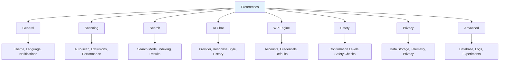

# Preferences & Settings

Customize Nexus AI to match your workflow and requirements.

## Overview

The Preferences panel provides **centralized configuration** for all addon features and integrations.



**Access Preferences:**

```
Local → Preferences → Add-ons → Nexus AI

Or click ⚙️ gear icon in Nexus AI sidebar
```

## General Settings

### Appearance

```
┌─────────────────────────────────────────┐
│ Theme                                   │
│ ● Auto (match Local)                   │
│ ○ Light                                │
│ ○ Dark                                 │
│                                         │
│ UI Density                              │
│ ○ Comfortable                          │
│ ● Compact                              │
│ ○ Spacious                             │
│                                         │
│ Font Size                               │
│ [█████──────] 14px                      │
│                                         │
│ Show:                                   │
│ ☑ Status badges                        │
│ ☑ Site thumbnails                      │
│ ☑ Quick action buttons                 │
│ ☐ Advanced controls                    │
└─────────────────────────────────────────┘
```

**Theme Options:**

- **Auto:** Matches Local's current theme
- **Light:** Always light mode
- **Dark:** Always dark mode

### Language & Localization

```
┌─────────────────────────────────────────┐
│ Language: English (US) ▼                │
│                                         │
│ Date Format: MM/DD/YYYY ▼               │
│ Time Format: 12-hour ▼                  │
│ Timezone: America/Los_Angeles ▼         │
│                                         │
│ Number Format:                          │
│ ○ 1,234.56 (US)                        │
│ ● 1.234,56 (EU)                        │
│                                         │
│ File Size Units:                        │
│ ● Binary (MB = 1024 KB)                │
│ ○ Decimal (MB = 1000 KB)               │
└─────────────────────────────────────────┘
```

### Notifications

```
┌─────────────────────────────────────────┐
│ Desktop Notifications                   │
│ ☑ Enable notifications                 │
│                                         │
│ Notify on:                              │
│ ☑ Scan complete                        │
│ ☑ Bulk operation finished              │
│ ☑ Updates available                    │
│ ☑ Errors or warnings                   │
│ ☐ Every WP-CLI command                 │
│                                         │
│ Sound Effects                           │
│ ☑ Play sound on completion             │
│ Volume: [████████──] 80%                │
│                                         │
│ Badge Counter                           │
│ ● Show pending tasks count             │
│ ○ Show unread notifications            │
│ ○ Disabled                             │
└─────────────────────────────────────────┘
```

## Scanning Settings

### Auto-Scan

```
┌─────────────────────────────────────────┐
│ Automatic Scanning                      │
│ ☑ Enable auto-scan                     │
│                                         │
│ Trigger:                                │
│ ☑ On site start                        │
│ ☑ After site creation                  │
│ ☑ On content change (if detectable)    │
│ ☐ On plugin activation                 │
│                                         │
│ Schedule:                               │
│ ☑ Daily at [02:00] AM                  │
│ ☐ Every [6] hours                      │
│ ☐ Weekly on [Sunday]                   │
│                                         │
│ Scan Only:                              │
│ ● Running sites                        │
│ ○ All sites                            │
│                                         │
│ Delay after trigger: [5] seconds        │
└─────────────────────────────────────────┘
```

### Content Extraction

```
┌─────────────────────────────────────────┐
│ What to Index                           │
│                                         │
│ Post Types:                             │
│ ☑ Posts                                │
│ ☑ Pages                                │
│ ☑ Products (WooCommerce)               │
│ ☑ Custom Post Types                    │
│ ☐ Media (attachments)                  │
│ ☐ Revisions                            │
│                                         │
│ Post Status:                            │
│ ☑ Published                            │
│ ☑ Draft                                │
│ ☐ Pending                              │
│ ☐ Private                              │
│ ☐ Trash                                │
│                                         │
│ Additional Content:                     │
│ ☑ Post excerpts                        │
│ ☑ Post metadata                        │
│ ☑ Categories & tags                    │
│ ☑ ACF fields                           │
│ ☑ Comments                             │
│ ☐ User profiles                        │
│                                         │
│ ACF Field Handling:                     │
│ ● Index all fields                     │
│ ○ Exclude sensitive fields             │
│ ○ Manual field selection               │
└─────────────────────────────────────────┘
```

### Exclusions

```
┌─────────────────────────────────────────┐
│ Content Exclusions                      │
│                                         │
│ Exclude by Pattern:                     │
│ ┌─────────────────────────────────────┐ │
│ │ *password*                          │ │
│ │ *secret*                            │ │
│ │ *api_key*                           │ │
│ │ *credit_card*                       │ │
│ │ [+ Add Pattern]                     │ │
│ └─────────────────────────────────────┘ │
│                                         │
│ Exclude by Post ID:                     │
│ ┌─────────────────────────────────────┐ │
│ │ 1, 42, 123                          │ │
│ └─────────────────────────────────────┘ │
│                                         │
│ Exclude Categories:                     │
│ ☑ Private                              │
│ ☑ Internal                             │
│ ☐ Archive                              │
│                                         │
│ Size Limits:                            │
│ Skip posts larger than: [1] MB          │
│ Skip images larger than: [10] MB        │
└─────────────────────────────────────────┘
```

### Performance

```
┌─────────────────────────────────────────┐
│ Scan Performance                        │
│                                         │
│ Concurrency:                            │
│ Parallel scans: [3] sites               │
│ (1-10, higher = faster but more CPU)    │
│                                         │
│ Chunk Size:                             │
│ Content chunking: [500] characters      │
│ (smaller = more vectors, better search) │
│                                         │
│ Batch Size:                             │
│ Database queries: [100] rows            │
│ Embeddings: [50] chunks                 │
│                                         │
│ Resource Limits:                        │
│ ☑ Pause scan if CPU > 80%              │
│ ☑ Pause scan if memory > 90%           │
│ Max scan duration: [30] minutes         │
│                                         │
│ Optimization:                           │
│ ☑ Skip unchanged content               │
│ ☑ Incremental indexing                 │
│ ☑ Compress stored vectors              │
└─────────────────────────────────────────┘
```

## Search Settings

### Search Mode

```
┌─────────────────────────────────────────┐
│ Default Search Mode                     │
│ ● Semantic (AI-powered)                │
│ ○ Keyword (exact match)                │
│ ○ Hybrid (both)                        │
│                                         │
│ Semantic Search:                        │
│ Model: nomic-embed-text ▼               │
│ Dimensions: 384                         │
│ Similarity threshold: [0.5]             │
│                                         │
│ Keyword Search:                         │
│ ☑ Enable fuzzy matching                │
│ ☑ Ignore case                          │
│ ☑ Stemming (find word variations)      │
│                                         │
│ Hybrid Search:                          │
│ Semantic weight: [70]%                  │
│ Keyword weight: [30]%                   │
└─────────────────────────────────────────┘
```

### Search Results

```
┌─────────────────────────────────────────┐
│ Results Display                         │
│                                         │
│ Default limit: [50] results             │
│ Min relevance score: [50] (0-100)       │
│                                         │
│ Show in results:                        │
│ ☑ Site name and domain                 │
│ ☑ Content snippet (preview)            │
│ ☑ Relevance score                      │
│ ☑ Last scan time                       │
│ ☑ Site statistics                      │
│ ☐ Full content                         │
│                                         │
│ Snippet length: [150] characters        │
│                                         │
│ Sorting:                                │
│ ● By relevance (highest first)         │
│ ○ By site name                         │
│ ○ By last scan                         │
│ ○ By content type                      │
│                                         │
│ Grouping:                               │
│ ☑ Group by site                        │
│ ☐ Group by content type                │
└─────────────────────────────────────────┘
```

### Indexing

```
┌─────────────────────────────────────────┐
│ Vector Index Settings                   │
│                                         │
│ Embedding Provider:                     │
│ ● Ollama (local)                       │
│ ○ OpenAI API                           │
│ ○ Anthropic API                        │
│                                         │
│ Ollama Settings:                        │
│ Host: http://localhost:11434            │
│ Model: nomic-embed-text                 │
│ Timeout: [30] seconds                   │
│ ☑ Auto-pull model if missing           │
│                                         │
│ Index Storage:                          │
│ Location: ~/Library/.../nexus-ai/       │
│ Current size: 245 MB                    │
│ [Change Location] [Optimize Index]      │
│                                         │
│ Index Maintenance:                      │
│ ☑ Auto-optimize weekly                 │
│ ☑ Cleanup orphaned entries             │
│ Last optimized: 3 days ago              │
│ [Rebuild Index] [Clear All]             │
└─────────────────────────────────────────┘
```

## AI Chat Settings

### Provider Configuration

The AI Chat Settings panel controls how Nexus AI's own features connect to AI providers — including the Chat tab and AI Site Finder. This is separate from the AI provider installed on each individual WordPress site.

**AI Provider**

Select the global provider used by Nexus AI's chat tab and AI features:

```
┌─────────────────────────────────────────┐
│ AI Provider                             │
│ ● Anthropic (Claude)                   │
│ ○ OpenAI (GPT)                         │
│ ○ Google (Gemini)                      │
│ ○ Ollama (local)                       │
│                                         │
│ API Key:                                │
│ [••••••••••••••••••••] [Test]           │
│                                         │
│ Model:                                  │
│ claude-sonnet-4-6 ▼                    │
│                                         │
│ API Status:                             │
│ ✓ Connected                            │
│ [Test Connection]                       │
└─────────────────────────────────────────┘
```

Each external provider (Anthropic, OpenAI, Google) requires an API key entered here. Ollama runs locally and does not require an API key.

**Local AI Gateway**

When enabled, all WordPress site AI requests are routed through a local gateway instead of directly to the external provider. The gateway uses the global AI provider set above.

```
┌─────────────────────────────────────────┐
│ Local AI Gateway                        │
│ ☐ Enable Local AI Gateway              │
│                                         │
│ Routes WordPress site AI requests       │
│ through a local proxy using the         │
│ global provider above.                  │
│                                         │
│ Note: Ollama sites ignore this setting  │
│ (Ollama is already local).              │
└─────────────────────────────────────────┘
```

**Per-site AI Provider**

Each WordPress site can use a different AI provider for its content generation features. This is configured per site via the site card in the Local site list — not here. Use `nexus ai setup` or `nexus ai switch-provider` to configure a site's provider, or open the site card and click **AI Settings**.

### Chat Behavior

```
┌─────────────────────────────────────────┐
│ Response Style                          │
│ ○ Concise (brief answers)              │
│ ● Detailed (comprehensive)             │
│ ○ Technical (code/logs)                │
│                                         │
│ Conversation:                           │
│ Context window: [10] messages           │
│ ☑ Remember context across sessions     │
│ ☑ Load previous conversation on start  │
│                                         │
│ Suggestions:                            │
│ ☑ Show suggested actions               │
│ ☑ Offer to execute operations          │
│ ☑ Proactive recommendations            │
│                                         │
│ Safety:                                 │
│ Confirmation level:                     │
│ ○ Always ask                           │
│ ● Ask for destructive only             │
│ ○ Never ask (not recommended)          │
│                                         │
│ Auto-Actions:                           │
│ ☐ Auto-execute safe operations         │
│ ☐ Auto-scan after queries              │
└─────────────────────────────────────────┘
```

### Chat History

```
┌─────────────────────────────────────────┐
│ History Settings                        │
│                                         │
│ Storage:                                │
│ ☑ Save conversation history            │
│ Location: ~/Library/.../chat-history.db │
│ Current size: 12 MB                     │
│                                         │
│ Retention:                              │
│ Keep conversations for: [90] days       │
│ ☑ Auto-delete old conversations        │
│                                         │
│ Privacy:                                │
│ ☑ Exclude sensitive data from history  │
│ ☑ Encrypt history database             │
│                                         │
│ Export Format:                          │
│ Default: ● Markdown ○ JSON ○ PDF       │
│                                         │
│ Maintenance:                            │
│ Last cleanup: 15 days ago               │
│ [Export All] [Clear History] [Vacuum]  │
└─────────────────────────────────────────┘
```

## WP Engine Settings

### Account Management

```
┌─────────────────────────────────────────┐
│ Connected Accounts                      │
│                                         │
│ ● Personal Account                     │
│   Status: ✓ Connected                  │
│   Sites: 5 | Installs: 12              │
│   Last sync: 2 hours ago                │
│   [Refresh] [Disconnect]                │
│                                         │
│ ○ Agency Account                       │
│   Status: ✓ Connected                  │
│   Sites: 24 | Installs: 68             │
│   Last sync: 1 day ago                  │
│   [Refresh] [Disconnect]                │
│                                         │
│ [+ Add Account]                         │
│                                         │
│ Default Account: Personal Account ▼     │
│ (Used for new sites and pull/push)      │
└─────────────────────────────────────────┘
```

### Sync Settings

```
┌─────────────────────────────────────────┐
│ Pull/Push Defaults                      │
│                                         │
│ Default Pull Options:                   │
│ ☑ Database                             │
│ ☑ Files (wp-content)                   │
│ ☐ Plugins                              │
│ ☐ Themes                               │
│ ☑ Create backup before pull            │
│                                         │
│ Default Push Options:                   │
│ ☑ Database                             │
│ ☑ Files (wp-content)                   │
│ ☐ Plugins                              │
│ ☐ Themes                               │
│ ☑ Create WPE backup first              │
│ ☑ Dry run preview                      │
│                                         │
│ Search & Replace:                       │
│ ☑ Auto-replace domains                 │
│ ☑ Update site URL                      │
│ ☑ Update home URL                      │
│ Custom replacements: [Edit...]          │
│                                         │
│ Safety:                                 │
│ ● Require confirmation for production  │
│ ○ Allow all without confirmation       │
└─────────────────────────────────────────┘
```

### SSH Configuration

```
┌─────────────────────────────────────────┐
│ SSH Settings                            │
│                                         │
│ Connection Pooling:                     │
│ ☑ Enable ControlMaster                 │
│ Persist for: [10] minutes               │
│                                         │
│ SSH Key:                                │
│ ○ Use Local's SSH key                  │
│ ● Custom key path:                     │
│   ~/.ssh/wpe_rsa                        │
│   [Browse...]                           │
│                                         │
│ Timeout:                                │
│ Connection: [30] seconds                │
│ Command execution: [60] seconds         │
│                                         │
│ Diagnostics:                            │
│ Active connections: 2                   │
│ [View Connections] [Close All]          │
└─────────────────────────────────────────┘
```

## Safety Settings

### Confirmation Levels

```
┌─────────────────────────────────────────┐
│ Operation Safety                        │
│                                         │
│ Tier 1 (Safe - Read-only):              │
│ ○ Always confirm                       │
│ ● Never confirm                        │
│                                         │
│ Tier 2 (Caution - Modifications):       │
│ ● Always confirm                       │
│ ○ Confirm on production only           │
│ ○ Never confirm                        │
│                                         │
│ Tier 3 (Destructive - Deletions):       │
│ ● Require confirmation token           │
│ ○ Always confirm (no token)            │
│ ○ Confirm on production only           │
│                                         │
│ Custom Confirmation Token:               │
│ [DELETE] (type to confirm deletions)    │
└─────────────────────────────────────────┘
```

### Pre-Flight Checks

```
┌─────────────────────────────────────────┐
│ Safety Checks                           │
│                                         │
│ Before Operations:                      │
│ ☑ Verify site is running               │
│ ☑ Check disk space                     │
│ ☑ Verify WP-CLI available              │
│ ☑ Check for conflicting operations     │
│                                         │
│ Before Bulk Operations:                 │
│ ☑ Preview affected sites               │
│ ☑ Estimate operation time              │
│ ☑ Warn if > 10 sites                   │
│ ☑ Require explicit confirmation         │
│                                         │
│ Before Destructive Operations:          │
│ ☑ Create automatic backup              │
│ ☑ Verify backup is restorable          │
│ ☑ Show rollback instructions           │
│ ☑ Log all actions for audit            │
│                                         │
│ Rollback:                               │
│ ☑ Enable automatic rollback            │
│ Rollback timeout: [5] minutes           │
└─────────────────────────────────────────┘
```

### Audit Logging

```
┌─────────────────────────────────────────┐
│ Audit Log Settings                      │
│                                         │
│ Logging:                                │
│ ☑ Enable audit log                    │
│ Log level: ● Detailed ○ Summary        │
│                                         │
│ Log Operations:                         │
│ ☑ Site scans                           │
│ ☑ Plugin installs/updates              │
│ ☑ WordPress updates                    │
│ ☑ WP-CLI commands                      │
│ ☑ Bulk operations                      │
│ ☑ WPE pull/push                        │
│ ☑ Deletions                            │
│                                         │
│ Storage:                                │
│ Location: ~/Library/.../audit.log       │
│ Current size: 8.2 MB                    │
│ Retention: [180] days                   │
│                                         │
│ Maintenance:                            │
│ [View Log] [Export] [Clear Old Entries] │
└─────────────────────────────────────────┘
```

## Privacy Settings

### Data Collection

```
┌─────────────────────────────────────────┐
│ Telemetry & Analytics                   │
│                                         │
│ ☑ Enable anonymous usage data          │
│                                         │
│ What's Collected:                       │
│ ☑ Feature usage counts                 │
│ ☑ Error reports (no personal data)     │
│ ☑ Performance metrics                  │
│ ☐ Search queries (anonymized)          │
│                                         │
│ What's NOT Collected:                   │
│ ✗ Site content                         │
│ ✗ Passwords or credentials             │
│ ✗ Personal information                 │
│ ✗ Database data                        │
│                                         │
│ [View Privacy Policy] [Export My Data]  │
└─────────────────────────────────────────┘
```

### Data Storage

```
┌─────────────────────────────────────────┐
│ Local Data Storage                      │
│                                         │
│ Storage Location:                       │
│ ~/Library/Application Support/Local/    │
│ nexus-ai/                               │
│                                         │
│ Disk Usage:                             │
│ ├─ Vector indexes: 245 MB              │
│ ├─ Database: 42 MB                     │
│ ├─ Chat history: 12 MB                 │
│ ├─ Logs: 8 MB                          │
│ └─ Cache: 18 MB                        │
│ Total: 325 MB                           │
│                                         │
│ Data Security:                          │
│ ☑ Encrypt sensitive data               │
│ ☑ Secure file permissions              │
│ Encryption: AES-256                     │
│                                         │
│ Cleanup:                                │
│ [Clear Cache] [Optimize Storage]        │
│ [Export All Data] [Delete All Data]     │
└─────────────────────────────────────────┘
```

### Privacy Controls

```
┌─────────────────────────────────────────┐
│ Content Privacy                         │
│                                         │
│ Indexing Exclusions:                    │
│ ☑ Skip private posts                   │
│ ☑ Skip password-protected content      │
│ ☑ Skip user email addresses            │
│ ☑ Skip payment information             │
│ ☑ Skip sensitive ACF fields            │
│                                         │
│ Sensitive Field Patterns:               │
│ password, secret, api_key, token,       │
│ credit_card, ssn, [Edit...]             │
│                                         │
│ AI Chat Privacy:                        │
│ ☑ Don't send sensitive data to AI      │
│ ☑ Redact credentials in responses      │
│ ☑ Clear context after session          │
│                                         │
│ Data Retention:                         │
│ ☑ Auto-delete old scan data (> 90 days)│
│ ☑ Auto-delete chat history (> 90 days) │
│ ☑ Auto-delete logs (> 180 days)        │
└─────────────────────────────────────────┘
```

## Advanced Settings

### Database

```
┌─────────────────────────────────────────┐
│ Database Configuration                  │
│                                         │
│ SQLite Database:                        │
│ Location: ~/Library/.../metadata.db     │
│ Size: 42 MB                             │
│ ☑ Enable WAL mode (better performance)  │
│                                         │
│ LanceDB Vector Index:                   │
│ Location: ~/Library/.../vector-index.db │
│ Size: 245 MB                            │
│ Dimensions: 384                         │
│                                         │
│ Maintenance:                            │
│ Last vacuum: 5 days ago                 │
│ Last optimize: 2 days ago               │
│ [Vacuum] [Optimize] [Rebuild]           │
│                                         │
│ Backup:                                 │
│ ☑ Auto-backup before rebuild           │
│ Backup location: ~/Library/.../backups/ │
│ [Backup Now] [Restore from Backup]      │
│                                         │
│ Danger Zone:                            │
│ [Reset Database] [Delete All Indexes]   │
└─────────────────────────────────────────┘
```

### Logging

```
┌─────────────────────────────────────────┐
│ Debug Logging                           │
│                                         │
│ Log Level:                              │
│ ○ Error (minimal)                      │
│ ● Info (recommended)                   │
│ ○ Debug (verbose)                      │
│ ○ Trace (very verbose)                 │
│                                         │
│ Log Output:                             │
│ ☑ File (~/Library/.../logs/)           │
│ ☑ Console (developer tools)            │
│ ☐ Syslog                               │
│                                         │
│ Log Rotation:                           │
│ Max file size: [10] MB                  │
│ Keep [7] log files                      │
│ Compress old logs: ☑ Yes               │
│                                         │
│ Current Logs:                           │
│ nexus-ai.log (2.4 MB)                   │
│ nexus-ai.log.1.gz (8.1 MB)              │
│ nexus-ai.log.2.gz (7.9 MB)              │
│                                         │
│ [Open Log Folder] [Clear Logs]          │
└─────────────────────────────────────────┘
```

### Experimental Features

```
┌─────────────────────────────────────────┐
│ Beta Features                           │
│                                         │
│ ⚠️ These features are experimental      │
│                                         │
│ ☐ Hybrid search mode                   │
│   Combine semantic + keyword search     │
│                                         │
│ ☐ Multi-model AI chat                  │
│   Use multiple AI providers             │
│                                         │
│ ☐ Auto-optimization                    │
│   AI-suggested performance improvements │
│                                         │
│ ☐ Predictive scanning                  │
│   Predict when sites need scanning      │
│                                         │
│ ☐ Cross-site analytics                 │
│   Compare metrics across sites          │
│                                         │
│ ☐ Advanced WPE integration             │
│   Deploy, staging promotion, cache      │
│                                         │
│ [Learn More] [Report Feedback]          │
└─────────────────────────────────────────┘
```

## Keyboard Shortcuts

### Customization

```
┌─────────────────────────────────────────┐
│ Keyboard Shortcuts                      │
│                                         │
│ Open Preferences:                       │
│ [Cmd] + [,]                             │
│                                         │
│ Site Finder:                            │
│ [Cmd] + [F]                             │
│                                         │
│ AI Chat:                                │
│ [Cmd] + [Shift] + [C]                   │
│                                         │
│ Smart Filters:                          │
│ [Cmd] + [Shift] + [F]                   │
│                                         │
│ Scan All Sites:                         │
│ [Cmd] + [Shift] + [S]                   │
│                                         │
│ [Customize Shortcuts...]                │
│ [Reset to Defaults]                     │
└─────────────────────────────────────────┘
```

## Import/Export Settings

### Exporting Configuration

```
Export Settings

Select categories to export:
☑ General settings
☑ Scanning preferences
☑ Search configuration
☑ AI chat settings
☐ WPE credentials (security risk)
☑ Safety settings
☑ Saved filters
☑ Site groups

Format: ● JSON ○ YAML

[Export Settings]
```

### Importing Configuration

```
Import Settings

⚠️ This will overwrite current settings

Source: [Browse...] nexus-ai-settings.json

Preview:
┌─────────────────────────────────────┐
│ 127 settings will be imported       │
│ ├─ General: 15 settings            │
│ ├─ Scanning: 23 settings           │
│ ├─ Search: 18 settings             │
│ └─ ...                             │
└─────────────────────────────────────┘

☑ Create backup before import

[Import Settings] [Cancel]
```

## Troubleshooting

### Reset to Defaults

```
⚠️ Reset All Settings

This will:
- Restore default preferences
- Clear saved filters (unless exported)
- Reset keyboard shortcuts
- Clear cache and temporary data
- Preserve: WPE credentials, scan data, chat history

Are you sure?

[Cancel] [Reset to Defaults]
```

### Diagnostic Tools

```
Diagnostics

System Info:
├─ Local version: 9.0.5
├─ Addon version: 1.5.2
├─ Node.js: 22.16.0
├─ Electron: 37.8.0
└─ OS: macOS 14.3.1

Health Check:
✓ Database accessible
✓ Vector index readable
✓ WP-CLI available
✓ Ollama running
✗ WPE connection (check credentials)

[Run Full Diagnostic] [Export Report]
[Contact Support]
```

## Best Practices

### Performance Tuning

**For fast scans:**
- Reduce parallel scans to 2-3
- Increase chunk size to 750
- Exclude revisions and comments

**For thorough indexing:**
- Include all post types
- Smaller chunk size (300-400)
- Index drafts and private content

### Privacy Protection

**Recommended settings:**
- ✅ Exclude sensitive ACF fields
- ✅ Skip private posts
- ✅ Encrypt local storage
- ✅ Auto-delete old data
- ✅ Don't send sensitive data to AI

### Backup Strategy

**Before major changes:**
- Export settings
- Export saved filters
- Backup database
- Note WPE credentials

## Next Steps

- **[Keyboard Shortcuts](keyboard-shortcuts.md)** - Complete shortcut reference
- **[Safety System](../features/safety-system.md)** - Understanding operation safety
- **Telemetry** - Data collection and privacy
- **[CLI Troubleshooting](../cli/troubleshooting.md)** - Common issues
