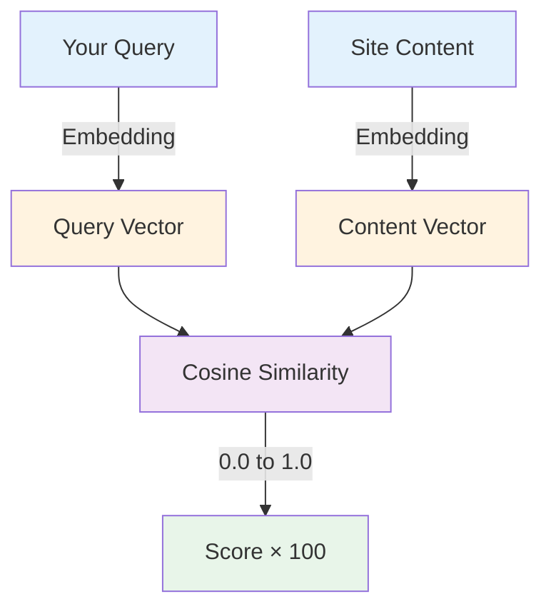

# AI Site Finder

AI-powered semantic search that finds sites based on **meaning**, not just keywords.

## Overview

The Site Finder panel uses **vector embeddings** to understand what you're looking for and return the most relevant sites, even if they don't contain your exact search terms.


**Key Features:**

- 🧠 **Semantic Search** - Finds sites by meaning, not exact keywords
- ⚡ **Fast Results** - Sub-second search across thousands of sites
- 🎯 **Smart Ranking** - Most relevant sites appear first
- 📊 **Score Transparency** - See why each site matched
- 🔍 **Content Preview** - View matched content snippets
- 💾 **Search History** - Recall previous searches
- 📋 **Quick Actions** - Scan, open, manage sites from results

## Opening Site Finder

**Three ways to access:**

### 1. Sidebar Button

Click the **Site Finder** tab in the left sidebar.

```
┌─────────────────┐
│ Fleet Overview  │
│ ▶ Site Finder   │ ← Click here
│   AI Chat       │
│   WPE Mgmt      │
└─────────────────┘
```

### 2. Keyboard Shortcut

Press `Cmd+F` (macOS) or `Ctrl+F` (Windows/Linux).

### 3. Fleet Overview Link

Click **"Search Sites"** from the Fleet Overview dashboard.

## How to Search

### Basic Search

Type your query and press Enter:

```
┌─────────────────────────────────────────┐
│ 🔍 Search sites...                      │
│                                         │
│ e.g., "e-commerce sites using Stripe"  │
└─────────────────────────────────────────┘
```

**Examples:**

| Query | What It Finds |
|-------|---------------|
| "WooCommerce stores" | Sites with WooCommerce products |
| "sites with contact forms" | Sites with contact form content |
| "blog posts about WordPress" | Sites containing WordPress blog posts |
| "sites using Stripe" | E-commerce sites with Stripe integration |
| "portfolio sites for designers" | Designer portfolio websites |
| "sites with job listings" | Sites with career/job content |

### Natural Language Queries

Site Finder understands natural language:

```
✅ "Show me all sites selling products over $100"
✅ "Find sites with recent blog posts about SEO"
✅ "Which sites have contact forms but no SSL?"
✅ "Sites running old versions of WordPress"
✅ "Find WooCommerce stores with abandoned carts"
```

### Advanced Query Syntax

**Quoted Phrases:**
```
"exact phrase match"
```

**Exclude Terms:**
```
e-commerce -WooCommerce
```

**Field-Specific Search:**
```
title:"Contact Us"
category:"WordPress Tips"
tag:"WooCommerce"
```

**Combining Operators:**
```
WooCommerce AND Stripe NOT subscription
```

## Understanding Results

### Result Card Layout

Each result shows:

```
┌─────────────────────────────────────────────┐
│ MySite (mysite.local)              Score: 94 │
│ ─────────────────────────────────────────── │
│ 📄 Posts: 142 | 🛍️ Products: 38            │
│ 🔌 Plugins: 24 | 🎨 Themes: 3              │
│                                             │
│ Matched Content:                            │
│ "...our premium WooCommerce store offers   │
│  Stripe payments and subscription plans..." │
│                                             │
│ [Open Site] [Scan Now] [View Details]      │
└─────────────────────────────────────────────┘
```

**Components:**

| Element | Description |
|---------|-------------|
| **Site Name** | Local site name and domain |
| **Score** | Relevance score (0-100) |
| **Stats** | Quick site statistics |
| **Matched Content** | Text snippet showing why it matched |
| **Quick Actions** | Common operations |

### Relevance Scores

Scores indicate how well the site matches your query:

| Score Range | Meaning | Description |
|-------------|---------|-------------|
| **90-100** | Excellent Match | Highly relevant, strong semantic similarity |
| **75-89** | Good Match | Relevant, clear connection to query |
| **60-74** | Moderate Match | Some relevance, may be partial match |
| **50-59** | Weak Match | Tangentially related |
| **< 50** | Poor Match | Minimal relevance (usually filtered out) |

**How Scores Work:**

Scores are based on **cosine similarity** between your query vector and site content vectors:



**Example:**

```
Query: "e-commerce with subscriptions"
Query Vector: [0.23, -0.45, 0.78, ...]

Site A Content: "WooCommerce store with WooCommerce Subscriptions plugin"
Content Vector: [0.21, -0.43, 0.76, ...]
Similarity: 0.94 → Score: 94

Site B Content: "Static portfolio website for freelance designer"
Content Vector: [-0.12, 0.34, -0.56, ...]
Similarity: 0.23 → Score: 23 (filtered out)
```

### Content Snippets

Snippets show **why** the site matched:

```
Matched Content:
"...our WooCommerce store offers premium subscriptions
with Stripe recurring payments and automatic renewals..."
        ▲                           ▲
        └── Matched terms ──────────┘
```

**Features:**

- **Context Window:** Shows 150 characters before/after matched terms
- **Highlighting:** Key terms appear in bold
- **Ellipsis:** Indicates truncated content
- **Source Indicator:** Shows which content type matched (post, product, page, etc.)

## Filtering Results

### By Site Type

Filter by WordPress site type:

```
┌─────────────────────┐
│ All Sites      [×]  │
│ Single Site    [ ]  │
│ Multisite      [ ]  │
└─────────────────────┘
```

### By Content Type

Filter by what matched:

```
┌─────────────────────┐
│ All Content    [×]  │
│ Posts          [ ]  │
│ Pages          [ ]  │
│ Products       [ ]  │
│ ACF Fields     [ ]  │
│ Comments       [ ]  │
└─────────────────────┘
```

### By Status

Filter by site health:

```
┌─────────────────────┐
│ All Statuses   [×]  │
│ Healthy        [ ]  │
│ Needs Update   [ ]  │
│ Issues         [ ]  │
└─────────────────────┘
```

### Combined Filters

Filters stack for precise results:

```
Filter: Single Site + Products + Healthy
Result: Only healthy single-site WooCommerce stores
```

## Search Modes

### Semantic Search (Default)

**Best for:** Conceptual queries, meaning-based search

```
Query: "sites about digital marketing"
Finds: Sites with content about SEO, social media, email campaigns, etc.
       (even if they never use the exact phrase "digital marketing")
```

**How it works:**

1. Your query is converted to a 384-dimension vector
2. LanceDB searches for similar vectors using ANN (Approximate Nearest Neighbor)
3. Results ranked by cosine similarity

**Pros:**
- Understands concepts and synonyms
- Finds related content even with different wording
- Great for exploratory searches

**Cons:**
- May miss exact phrase matches
- Can return unexpected results for very specific queries

### Keyword Search (Advanced)

**Best for:** Exact matches, technical terms, specific phrases

Enable from settings:

```
Settings → Site Finder → Search Mode → Keyword
```

```
Query: "wp_options autoload"
Finds: Only sites with that exact table/column reference
```

**How it works:**

1. Query is tokenized into keywords
2. Full-text search on indexed content
3. Results ranked by TF-IDF (term frequency-inverse document frequency)

**Pros:**
- Exact phrase matching
- Fast for simple queries
- Predictable results

**Cons:**
- Misses synonyms and related concepts
- No understanding of meaning
- Sensitive to spelling

### Hybrid Search (Beta)

**Best for:** Combining exact matches with semantic understanding

Enable from settings:

```
Settings → Site Finder → Search Mode → Hybrid
```

```
Query: "WooCommerce" AND semantic:"subscription management"
Finds: Sites with exact "WooCommerce" mention + content about subscriptions
```

**How it works:**

1. Keyword search for exact terms
2. Semantic search for concepts
3. Combine scores with configurable weighting

**Weighting:**

```
Final Score = (keyword_score × 0.3) + (semantic_score × 0.7)
```

## Quick Actions

### From Result Cards

**Open Site:**

Opens site in Local's internal browser.

```
[Open Site] → Launches http://mysite.local
```

**Scan Now:**

Triggers immediate re-scan of the site.

```
[Scan Now] → Extracts latest content → Re-indexes
```

**View Details:**

Opens detailed site information panel.

```
[View Details] → Shows full stats, plugins, themes, health
```

### Bulk Actions

Select multiple results for batch operations:

```
☑ Site A (94)
☑ Site B (89)
☐ Site C (76)

[Scan Selected] [Update Plugins] [Export]
```

**Bulk Operations:**

| Action | Description |
|--------|-------------|
| **Scan Selected** | Re-scan all selected sites |
| **Update Plugins** | Update outdated plugins across sites |
| **Export Results** | Export to CSV or JSON |
| **Add to Group** | Add to a site group for later reference |
| **Generate Report** | Create PDF/HTML report |

## Search History

Site Finder remembers your searches:

```
Recent Searches:
─────────────────────────────────────
🕐 e-commerce with subscriptions     (5 results)
🕐 sites with contact forms          (12 results)
🕐 WooCommerce AND Stripe            (3 results)
```

**Features:**

- **Auto-save:** Every search is saved automatically
- **Quick Re-run:** Click to re-execute the search
- **Persistence:** History survives Local restart
- **Privacy:** Stored locally, never sent to cloud
- **Clear History:** Delete individual or all searches

**Accessing History:**

```
Site Finder → 🕐 History → Select search
```

## Saved Queries

Save frequent searches for one-click access:

### Creating Saved Queries

```
1. Execute a search
2. Click "Save Query" button
3. Name your query: "Production E-commerce Sites"
4. Add optional description
5. [Save]
```

### Using Saved Queries

```
Site Finder → ⭐ Saved → Click query name
```

**Example Saved Queries:**

| Query Name | Search | Use Case |
|------------|--------|----------|
| **Production WooCommerce** | `WooCommerce AND environment:production` | Monitor live stores |
| **Needs SSL** | `protocol:http AND NOT localhost` | Security audit |
| **Old WordPress** | `version:<6.0` | Update planning |
| **Subscription Sites** | `WooCommerce Subscriptions OR MemberPress` | Recurring revenue tracking |

### Sharing Queries

Export queries to share with team:

```
Saved Queries → Export → myqueries.json

{
  "name": "Production WooCommerce",
  "query": "WooCommerce AND environment:production",
  "filters": { "type": "single", "status": "healthy" },
  "description": "Monitor all production e-commerce sites"
}
```

Import on another machine:

```
Saved Queries → Import → Select myqueries.json
```

## Performance Optimization

### Search Speed

Typical search performance:

| Sites | First Search | Cached Search |
|-------|-------------|---------------|
| 10 | 50ms | 20ms |
| 100 | 200ms | 50ms |
| 1,000 | 800ms | 150ms |
| 10,000 | 3s | 500ms |

**Optimization Tips:**

**1. Keep Indexes Updated**

Scan sites regularly to maintain fresh indexes:

```
Settings → Auto-Scan → Daily at 2 AM
```

**2. Use Filters**

Narrow results with filters before searching:

```
Filter to "Products" → Then search "Stripe"
Faster than searching all content types
```

**3. Limit Result Count**

Adjust max results for faster rendering:

```
Settings → Site Finder → Max Results → 50
```

**4. Clear Old Data**

Remove indexes for deleted sites:

```
Settings → Database → Cleanup Orphaned Indexes
```

### Index Size

Monitor index disk usage:

```
Settings → Storage → Vector Index Size: 245 MB

Breakdown:
├─ Site A: 12 MB (2,400 chunks)
├─ Site B: 8 MB (1,600 chunks)
└─ Site C: 5 MB (1,000 chunks)
```

**Reducing Index Size:**

```typescript
// Exclude large content types
Settings → Indexing → Exclude:
☑ Media attachments
☑ Revisions
☑ Spam comments
```

## Privacy & Security

### What Gets Indexed

**Indexed:**

- ✅ Published posts, pages, products
- ✅ Public custom post types
- ✅ Post titles, content, excerpts
- ✅ WooCommerce product data
- ✅ ACF field values (non-sensitive)
- ✅ Category/tag names

**NOT Indexed:**

- ❌ User passwords or login credentials
- ❌ Private or draft content (configurable)
- ❌ Email addresses
- ❌ Payment information
- ❌ Session data or cookies
- ❌ Database connection strings
- ❌ API keys or secrets

### Data Storage

**Where Indexes Live:**

```
~/Library/Application Support/Local/nexus-ai/
├─ vector-index.db       (LanceDB database)
├─ metadata.db           (SQLite metadata)
└─ embeddings/           (Cached vectors)
```

**Security:**

- **Local Only:** All data stays on your machine
- **No Cloud Sync:** Never sent to external servers
- **Encrypted:** Indexes use SQLite encryption (optional)
- **Access Control:** Local file permissions apply

### Deleting Indexes

**Per-Site:**

```
Site Details → Advanced → Delete Index
```

**All Sites:**

```
Settings → Database → Clear All Indexes
Warning: This will require re-scanning all sites
```

**Complete Removal:**

```bash
# macOS
rm -rf ~/Library/Application\ Support/Local/nexus-ai/

# Windows
rmdir /s "%APPDATA%\Local\nexus-ai"

# Linux
rm -rf ~/.config/Local/nexus-ai/
```

## Troubleshooting

### No Results Found

**Cause:** Query too specific or site not indexed

**Solutions:**

1. **Check if site is scanned:**

```
Fleet Overview → Site List → Look for scan status
If "Not Scanned": Click "Scan Now"
```

2. **Try broader query:**

```
Instead of: "WooCommerce Subscriptions recurring billing"
Try: "subscription"
```

3. **Check filters:**

```
Ensure filters aren't excluding all results
Reset: Filters → Clear All
```

4. **Verify content exists:**

```
Open site in Local → Check if content actually exists
```

### Wrong Results

**Cause:** Semantic search finding conceptually related but unwanted content

**Solutions:**

1. **Use keyword search mode:**

```
Settings → Search Mode → Keyword
```

2. **Add exclusion terms:**

```
Query: "e-commerce -blog -tutorial"
Excludes: Blog posts and tutorials about e-commerce
```

3. **Use quoted phrases:**

```
Query: "WooCommerce Subscriptions"
Exact phrase match
```

4. **Adjust score threshold:**

```
Settings → Minimum Score → 75
Only show high-confidence matches
```

### Slow Search

**Cause:** Large indexes or many sites

**Solutions:**

1. **Rebuild indexes:**

```
Settings → Database → Rebuild Indexes
Optimizes database structure
```

2. **Reduce indexed content:**

```
Settings → Indexing → Exclude:
☑ Post revisions
☑ Comments
☑ Media metadata
```

3. **Limit search scope:**

```
Use filters before searching
Example: Filter to "Products only" before querying
```

4. **Check system resources:**

```
Activity Monitor → Local process → Check CPU/Memory
If high: Close other apps or restart Local
```

### Outdated Results

**Cause:** Site content changed but index not updated

**Solutions:**

1. **Manual re-scan:**

```
Result Card → [Scan Now]
```

2. **Enable auto-scan:**

```
Settings → Auto-Scan → On Content Change
```

3. **Check scan schedule:**

```
Settings → Scan Schedule → Daily at 2 AM
```

4. **Force full re-index:**

```
Site Details → Advanced → Re-index Site
```

## Keyboard Shortcuts

| Shortcut | Action |
|----------|--------|
| `Cmd/Ctrl+F` | Open Site Finder |
| `Cmd/Ctrl+K` | Focus search input |
| `↓` / `↑` | Navigate results |
| `Enter` | Open selected site |
| `Cmd/Ctrl+Enter` | View site details |
| `Cmd/Ctrl+S` | Save current query |
| `Cmd/Ctrl+H` | View search history |
| `Esc` | Clear search / Close panel |
| `Cmd/Ctrl+A` | Select all results |
| `Cmd/Ctrl+Shift+F` | Advanced search |

## Best Practices

### Writing Effective Queries

**✅ Do:**

- Use natural language: "sites with products over $100"
- Start broad, then narrow with filters
- Use semantic search for concepts
- Save frequent queries for quick access
- Check multiple result pages (don't stop at first page)

**❌ Don't:**

- Don't use overly technical terms unless necessary
- Don't search for UI elements (buttons, forms) - search content instead
- Don't expect exact database/code matches in semantic mode
- Don't ignore relevance scores
- Don't search too broadly (e.g., "website")

### Organizing Results

**1. Use Site Groups**

```
Create groups from search results:
Search → Select sites → "Add to Group" → "E-commerce Sites"
```

**2. Tag Sites**

```
Add tags for quick filtering:
Site Details → Tags → Add "woocommerce", "stripe", "production"
```

**3. Export for Analysis**

```
Search → Select All → Export to CSV
Open in Excel/Google Sheets for deeper analysis
```

### Regular Maintenance

**Weekly:**

- Review and update saved queries
- Clear search history if needed
- Check for sites needing re-scan

**Monthly:**

- Rebuild indexes for performance
- Review and adjust filters
- Clean up deleted site indexes

**Quarterly:**

- Audit excluded content types
- Review privacy settings
- Optimize index size

## Advanced Features

### Custom Scoring

Adjust how scores are calculated:

```typescript
Settings → Advanced → Custom Scoring

{
  "titleWeight": 2.0,      // Title matches count 2× more
  "contentWeight": 1.0,     // Content baseline
  "productWeight": 1.5,     // WooCommerce products 1.5×
  "recencyBoost": 0.2,      // Recent content slight boost
  "popularityBoost": 0.1    // Popular posts slight boost
}
```

### Query Templates

Create reusable query templates:

```json
{
  "name": "Security Audit",
  "template": "{{site_type}} AND ssl:{{ssl_status}} version:{{wp_version}}",
  "variables": {
    "site_type": "WooCommerce",
    "ssl_status": "false",
    "wp_version": "<6.0"
  }
}
```

### API Integration

Search programmatically via MCP:

```javascript
// Via MCP (Claude Desktop, Cursor, etc.)
search_sites({
  query: "WooCommerce with Stripe",
  limit: 10,
  filters: { type: "single", status: "healthy" }
})
```

```bash
# Via CLI
nexus search "WooCommerce with Stripe" \
  --limit 10 \
  --filter type=single \
  --filter status=healthy \
  --format json
```

## Next Steps

- **[AI Chat](ai-chat.md)** - Conversational interface for site management
- **[Smart Filters](smart-filters.md)** - Advanced filtering and site grouping
- **[Semantic Search](../features/semantic-search.md)** - Technical deep dive
- **[Content Extraction](../features/content-extraction.md)** - What gets indexed and how
- **[CLI Search](../cli/examples.md)** - Command-line search interface
