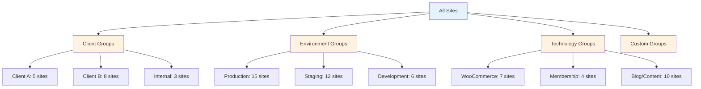

# Site Groups

Organize your WordPress fleet into logical collections for streamlined management.

## Overview

Site Groups let you **organize sites into named collections** that can be managed together as a unit.



**Key Features:**

- 📁 **Collections** - Group sites by client, project, or purpose
- 🏷️ **Tagging** - Add multiple tags to sites for flexible categorization
- 🔄 **Dynamic Groups** - Auto-update based on site attributes
- 📊 **Group Analytics** - View statistics across groups
- ⚡ **Bulk Operations** - Execute operations on entire groups
- 🎨 **Color Coding** - Visual distinction between groups
- 📤 **Import/Export** - Share group definitions with team

## Opening Site Groups

**Three ways to access:**

### 1. Sidebar Button

```
┌─────────────────┐
│ Fleet Overview  │
│   Smart Filters │
│ ▶ Site Groups   │ ← Click here
└─────────────────┘
```

### 2. Fleet Overview

Click **"Manage Groups"** from the dashboard.

### 3. Keyboard Shortcut

Press `Cmd+Shift+G` (macOS) or `Ctrl+Shift+G` (Windows/Linux).

## Creating Groups

### Manual Groups

**Create a static group:**

```
Site Groups → [+ Create Group]

┌─────────────────────────────────────────┐
│ Group Name: Client A - All Sites       │
│                                         │
│ Description:                            │
│ WordPress sites for Client A Corp       │
│ including main site, store, and blog    │
│                                         │
│ Color: 🔵 Blue ▼                        │
│ Icon: 💼 Briefcase ▼                    │
│                                         │
│ Type: ● Static (manual)                │
│       ○ Dynamic (auto-update)          │
│                                         │
│ Select Sites:                           │
│ ☑ clienta-main.local                   │
│ ☑ clienta-store.local                  │
│ ☑ clienta-blog.local                   │
│ ☐ other-site.local                     │
│ ☐ another-site.local                   │
│                                         │
│ [Create Group] [Cancel]                 │
└─────────────────────────────────────────┘
```

**From site selection:**

```
1. Select multiple sites in Fleet Overview
   ☑ site1.local
   ☑ site2.local
   ☑ site3.local

2. Right-click → "Add to Group"

3. Choose:
   ○ New Group → Name it
   ● Existing Group → Select from list

4. [Add]
```

### Dynamic Groups

**Auto-updating groups based on conditions:**

```
Create Dynamic Group

┌─────────────────────────────────────────┐
│ Group Name: Production Sites           │
│                                         │
│ Description:                            │
│ All sites running in production         │
│ environments on WP Engine               │
│                                         │
│ Color: 🟢 Green                         │
│ Icon: 🚀 Rocket                         │
│                                         │
│ Type: ○ Static                         │
│       ● Dynamic (auto-update)          │
│                                         │
│ Update Rule:                            │
│ Include sites where:                    │
│ ┌─────────────────────────────────────┐ │
│ │ WPE Environment = "production"      │ │
│ │   AND                               │ │
│ │ Status = "Running"                  │ │
│ │   AND                               │ │
│ │ SSL = "Valid"                       │ │
│ └─────────────────────────────────────┘ │
│                                         │
│ Refresh Schedule:                       │
│ ● Every scan                           │
│ ○ Daily at [09:00] AM                  │
│ ○ Hourly                               │
│ ○ Manual only                          │
│                                         │
│ Current matches: 15 sites               │
│ Preview: mysite.com, store.com, ...     │
│                                         │
│ [Create Group] [Preview] [Cancel]       │
└─────────────────────────────────────────┘
```

**Benefits:**

- ✅ Always up-to-date
- ✅ No manual maintenance
- ✅ Based on site attributes
- ✅ Auto-includes new sites

**Common Dynamic Group Examples:**

```
Needs Updates:
└─ WordPress updates > 0 OR Plugin updates > 0

High Traffic:
└─ Monthly visits > 10,000

E-Commerce:
└─ Plugin contains "WooCommerce" OR Plugin contains "Easy Digital Downloads"

SSL Expiring Soon:
└─ SSL valid AND SSL expires in < 30 days

Large Database:
└─ Database size > 1 GB
```

## Managing Groups

### Group List

```
Site Groups

┌─────────────────────────────────────────────┐
│ 🔵 Client A - All Sites (5) [Static]       │
│    Last updated: 2 hours ago                │
│    clienta-main, clienta-store, ...         │
│    [View] [Edit] [Scan All] [Delete]        │
├─────────────────────────────────────────────┤
│ 🟢 Production Sites (15) [Dynamic]         │
│    Auto-refreshed: 30 minutes ago           │
│    Health: 12 healthy, 3 need attention     │
│    [View] [Edit Rule] [Bulk Ops] [Delete]   │
├─────────────────────────────────────────────┤
│ 🟡 WooCommerce Stores (7) [Dynamic]        │
│    Auto-refreshed: 1 hour ago               │
│    Total products: 1,247                    │
│    [View] [Edit Rule] [Scan All] [Delete]   │
├─────────────────────────────────────────────┤
│ 🔴 Needs Updates (8) [Dynamic]             │
│    Auto-refreshed: 15 minutes ago           │
│    12 WordPress updates, 34 plugin updates  │
│    [View] [Update All] [Edit] [Delete]      │
└─────────────────────────────────────────────┘

[+ Create Group] [Import] [Export All]
```

### Group Details

**Click a group to view details:**

```
🔵 Client A - All Sites

Overview:
├─ Sites: 5
├─ Type: Static
├─ Created: 2024-02-15
└─ Last modified: 2024-03-18

Sites in Group:
┌─────────────────────────────────────────┐
│ clienta-main.local                      │
│ ├─ Status: Running                      │
│ ├─ WordPress: 6.4.3                     │
│ ├─ Last scan: 2 hours ago               │
│ └─ Health: Healthy                      │
│     [Open] [Scan] [Details]             │
├─────────────────────────────────────────┤
│ clienta-store.local                     │
│ ├─ Status: Running                      │
│ ├─ WordPress: 6.4.2                     │
│ ├─ WooCommerce: 8.5.2                   │
│ └─ Health: 3 updates available          │
│     [Open] [Update] [Details]           │
├─────────────────────────────────────────┤
│ ... (3 more sites)                      │
└─────────────────────────────────────────┘

Group Actions:
[Scan All Sites] [Update All] [Backup All]
[Export Group] [Duplicate] [Delete Group]
```

### Editing Groups

**Modify group membership:**

```
Edit Group: Client A - All Sites

Current Sites (5):
☑ clienta-main.local
☑ clienta-store.local
☑ clienta-blog.local
☑ clienta-support.local
☑ clienta-docs.local

Add More Sites:
☐ new-client-site.local
☐ other-site.local

[Save Changes] [Cancel]
```

**Convert to dynamic:**

```
⚠️ Convert to Dynamic Group

This will replace the static site list with
an auto-updating rule.

Current sites will be used to generate a
suggested rule:

Suggested Rule:
Domain contains "clienta"

Sites matching: 5 (same as current)

[Convert to Dynamic] [Cancel]
```

## Tagging System

### Adding Tags

**Tag individual sites:**

```
Site Details → Tags

Current Tags:
├─ production
├─ client-a
└─ woocommerce

Add Tag:
┌─────────────────────────────────────┐
│ high-priority                       │
└─────────────────────────────────────┘
[+ Add Tag]

Suggested Tags:
[ ecommerce ] [ wordpress ] [ ssl ]
```

**Bulk tagging:**

```
Select sites → Right-click → "Add Tags"

Add to selected sites (3):
┌─────────────────────────────────────┐
│ migration-2024                      │
│ needs-review                        │
└─────────────────────────────────────┘

[Add Tags to All]
```

### Tag Management

```
Manage Tags

All Tags (24):
┌─────────────────────────────────────────┐
│ production (15 sites)                   │
│ 🟢 [Rename] [Delete]                    │
├─────────────────────────────────────────┤
│ staging (12 sites)                      │
│ 🟡 [Rename] [Delete]                    │
├─────────────────────────────────────────┤
│ woocommerce (7 sites)                   │
│ 🔵 [Rename] [Delete]                    │
├─────────────────────────────────────────┤
│ client-a (5 sites)                      │
│ 🟣 [Rename] [Delete]                    │
└─────────────────────────────────────────┘

Tag Cloud:
[ production ] [ staging ] [ woocommerce ]
[ client-a ] [ wordpress ] [ ssl ]
[ high-priority ] [ needs-update ]

[Create Tag] [Import Tags] [Export Tags]
```

### Filtering by Tags

```
Filter by Tags:

Select tags (multi-select):
☑ production
☑ woocommerce
☐ client-a

Logic:
● AND (sites must have ALL selected tags)
○ OR (sites can have ANY selected tag)

Matches: 5 sites
└─ store1.com, store2.com, ...

[Apply Filter] [Save as Group] [Clear]
```

## Group Analytics

### Group Statistics

```
Production Sites - Analytics

Fleet Overview:
├─ Total Sites: 15
├─ Running: 14
├─ Halted: 1
└─ Average Uptime: 99.2%

Health Status:
├─ Healthy: 12 sites (80%)
├─ Needs Attention: 2 sites (13%)
└─ Issues: 1 site (7%)

WordPress Versions:
├─ 6.4.3: 10 sites (67%)
├─ 6.4.2: 3 sites (20%)
└─ < 6.4: 2 sites (13%) ⚠️

Content Summary:
├─ Total Posts: 2,847
├─ Total Pages: 456
├─ Total Products: 1,247
└─ Total Users: 342

Top Plugins:
1. Yoast SEO (12 sites)
2. WooCommerce (7 sites)
3. Akismet (11 sites)
4. Wordfence (9 sites)

[Detailed Report] [Export CSV] [Share]
```

### Comparison View

**Compare multiple groups:**

```
Compare Groups

Selected Groups:
☑ Production Sites (15)
☑ Staging Sites (12)
☑ Development Sites (6)

Comparison:
┌─────────────────────────────────────────┐
│                Prod  Stag  Dev          │
├─────────────────────────────────────────┤
│ Sites          15    12    6            │
│ Avg WP Ver     6.4.3 6.4.2 6.4.3        │
│ Avg Plugins    22    24    28           │
│ Needs Updates  2     5     3            │
│ WooCommerce    7     5     2            │
│ Healthy        80%   67%   50%          │
└─────────────────────────────────────────┘

[Export Comparison] [Create Report]
```

## Bulk Operations on Groups

### Scan Entire Group

```
Scan Group: Production Sites (15)

Options:
☑ Full scan (content + metadata)
☐ Quick scan (metadata only)
☑ Index content for search
☑ Generate embeddings

Estimated time: ~5 minutes

[Start Scan] [Schedule for Later]
```

**Progress:**

```
Scanning Production Sites...

✓ site1.com (1/15)
✓ site2.com (2/15)
⏳ site3.com (3/15) - Extracting content...
⏹ site4.com (4/15) - Queued
⏹ ... (11 more)

Overall: 20% complete
ETA: 4 minutes

[Pause] [Cancel]
```

### Update Group

```
Update Group: Production Sites (15)

Available Updates:
├─ WordPress Core: 2 sites (6.4.2 → 6.4.3)
├─ Plugins: 12 sites (34 total updates)
└─ Themes: 1 site (Astra update)

Select Updates:
☑ WordPress Core (2 sites)
☑ Security plugins (8 sites)
☑ Other plugins (12 sites)
☐ Themes (1 site)

Safety:
☑ Create backup before update
☑ Test on staging first (if available)
☑ Rollback on error

[Update All] [Preview Changes] [Cancel]
```

### Backup Group

```
Backup Group: Production Sites (15)

Backup Type:
● WPE Backup (cloud, WPE sites only)
○ Local Backup (download to disk)
○ Both

Description:
┌─────────────────────────────────────┐
│ Pre-update backup - 2024-03-20      │
└─────────────────────────────────────┘

Notifications:
☑ Email when complete
☑ Slack notification

[Create Backups] [Schedule Backups]
```

## Nested Groups

### Creating Hierarchies

```
Group Hierarchy:

Clients/
├─ Client A/
│  ├─ Production (3 sites)
│  ├─ Staging (2 sites)
│  └─ Development (1 site)
├─ Client B/
│  ├─ Production (5 sites)
│  └─ Staging (3 sites)
└─ Internal/
   ├─ Marketing (2 sites)
   └─ Documentation (1 site)

Technology/
├─ E-Commerce/
│  ├─ WooCommerce (7 sites)
│  └─ Easy Digital Downloads (2 sites)
├─ Membership/
│  └─ MemberPress (4 sites)
└─ Content/
   ├─ Blogs (10 sites)
   └─ Documentation (3 sites)
```

**Creating nested structure:**

```
Create Sub-Group

Parent Group: Client A ▼

Sub-Group Name: Production

Sites:
☑ clienta-main.com
☑ clienta-store.com
☑ clienta-docs.com

[Create Sub-Group]
```

### Managing Hierarchies

```
Group: Client A

Sub-Groups (3):
├─ Production (3 sites)
│  └─ [View] [Edit] [Scan All]
├─ Staging (2 sites)
│  └─ [View] [Edit] [Scan All]
└─ Development (1 site)
   └─ [View] [Edit] [Scan All]

Actions on All Sub-Groups:
[Scan All 6 Sites] [Update All] [Backup All]

[+ Add Sub-Group] [Flatten Hierarchy]
```

## Smart Group Templates

### Pre-Built Templates

```
Group Templates

📋 By Client:
├─ Client Sites Template
│   └─ Domain filter + client tag
├─ Agency Portfolio
│   └─ All client groups + stats
└─ Internal Sites
    └─ Internal domains only

🌐 By Environment:
├─ Production, Staging, Dev
│   └─ WPE environment filter
├─ Local vs Cloud
│   └─ Hosting type split
└─ SSL Status
    └─ Valid, expiring, missing

🛍️ By Technology:
├─ E-Commerce Sites
│   └─ WooCommerce, EDD
├─ Membership Sites
│   └─ MemberPress, etc.
└─ Blogs & Content
    └─ High post count

⚠️ By Health:
├─ Needs Attention
│   └─ Updates, errors, warnings
├─ High Performance
│   └─ Traffic, speed metrics
└─ Archive Candidates
    └─ Inactive, old sites

[Apply Template] [Customize] [Create Custom]
```

### Creating Templates

```
Create Group Template

Template Name: Client Site Collection

Description:
A template for organizing client sites
by environment with automatic health tracking

Groups to Create:
☑ {Client Name} - Production
☑ {Client Name} - Staging
☑ {Client Name} - Development
☑ {Client Name} - All Sites (parent)

Auto-Tag:
☑ Add client name as tag
☑ Add environment tags

Variables:
{Client Name} - Prompt during creation

[Save Template] [Preview] [Cancel]
```

## Import/Export

### Exporting Groups

```
Export Groups

Select groups to export:
☑ Client A - All Sites
☑ Production Sites
☑ WooCommerce Stores
☐ Other groups...

Format:
● JSON
○ YAML
○ CSV (sites only)

Include:
☑ Group metadata
☑ Site lists
☑ Tags
☑ Dynamic rules
☐ Group statistics

[Export] [Copy to Clipboard]
```

**Export format:**

```json
{
  "groups": [
    {
      "name": "Client A - All Sites",
      "description": "WordPress sites for Client A",
      "type": "static",
      "color": "blue",
      "icon": "briefcase",
      "sites": [
        "clienta-main.local",
        "clienta-store.local",
        "clienta-blog.local"
      ],
      "tags": ["client-a", "production"],
      "created": "2024-02-15T10:30:00Z",
      "modified": "2024-03-18T14:22:00Z"
    },
    {
      "name": "Production Sites",
      "type": "dynamic",
      "rule": {
        "conditions": [
          { "field": "wpe_environment", "op": "equals", "value": "production" },
          { "field": "status", "op": "equals", "value": "running" }
        ],
        "logic": "AND"
      },
      "refresh": "on_scan"
    }
  ],
  "version": "1.0"
}
```

### Importing Groups

```
Import Groups

Source: [Browse...] groups-export.json

Preview:
┌─────────────────────────────────────┐
│ 5 groups found                      │
│ ├─ Static: 3                       │
│ └─ Dynamic: 2                      │
│                                     │
│ 18 unique sites referenced          │
│ ├─ Found locally: 15               │
│ └─ Not found: 3 ⚠️                 │
└─────────────────────────────────────┘

Conflict Resolution:
● Skip existing groups
○ Overwrite existing groups
○ Rename imported groups

[Import] [Cancel]
```

## Use Cases

### Client Management

```
Organize by client:

For Each Client:
├─ All Sites (parent group)
│  ├─ Production (dynamic: WPE prod)
│  ├─ Staging (dynamic: WPE staging)
│  └─ Development (dynamic: local sites)
└─ Tags: client-name, active/inactive

Benefits:
- Quick client overview
- Bulk client operations
- Client-specific reporting
- Billing integration
```

### Project Lifecycle

```
Track project stages:

New Projects:
└─ Sites created < 30 days

Active Development:
└─ Last scan < 7 days + dev environment

Staging/QA:
└─ Staging environment + pending deployment

Production:
└─ Production environment + SSL valid

Archived:
└─ Not scanned in 90 days
```

### Maintenance Workflows

```
Weekly maintenance groups:

Monday: Security Updates
└─ Dynamic: Security plugin updates available

Tuesday: WordPress Core
└─ Dynamic: WP version < latest

Wednesday: Plugin Updates
└─ Dynamic: Plugin updates > 3

Thursday: Performance Check
└─ Dynamic: Disk > 80% OR DB > 1GB

Friday: Backups
└─ Dynamic: Last backup > 7 days
```

## Troubleshooting

### Dynamic Group Not Updating

```
Issue: Group shows 0 sites but rule matches many

Solutions:
1. Check refresh schedule:
   Edit Group → Refresh: Every scan ✓

2. Manually refresh:
   Group → [Refresh Now]

3. Verify rule syntax:
   Edit Group → Preview matches

4. Check site scan status:
   Sites must be scanned for attributes to match
```

### Sites Not Appearing in Group

```
Issue: Site should match dynamic rule but doesn't appear

Debug:
1. View site details
2. Check attribute values
3. Compare to group rule
4. Look for mismatches

Example:
Rule: "WPE Environment = production"
Site: wpe_environment = "prod" (mismatch!)

Fix: Adjust rule OR update site metadata
```

### Performance Issues

```
Issue: Groups with 100+ sites are slow

Optimization:
1. Break into smaller sub-groups
2. Use dynamic groups (faster)
3. Reduce stat calculations:
   Settings → Groups → Limit stats

4. Archive old/inactive sites:
   Move to "Archived Sites" group
```

## Best Practices

### Naming Conventions

```
✅ Good Group Names:
- "Client A - Production Sites"
- "E-Commerce - WooCommerce"
- "Needs WordPress Update"
- "High Traffic Sites (>10k/mo)"

❌ Bad Group Names:
- "Group 1"
- "Sites"
- "Test"
- "Misc"
```

### Group Organization

**Recommended structure:**

```
By Client (static):
├─ Client A, B, C...
└─ Internal

By Environment (dynamic):
├─ Production
├─ Staging
└─ Development

By Technology (dynamic):
├─ WooCommerce
├─ Membership
└─ Content/Blogs

By Status (dynamic):
├─ Healthy
├─ Needs Updates
└─ Issues
```

### Maintenance

**Regular tasks:**

- **Weekly:** Review dynamic group rules
- **Monthly:** Clean up empty groups
- **Quarterly:** Archive old groups
- **Annually:** Export groups for backup

## Next Steps

- **[Smart Filters](smart-filters.md)** - Advanced filtering system
- **[Bulk Operations](bulk-operations.md)** - Multi-site operations
- **[Fleet Overview](fleet-overview.md)** - Dashboard views
- **[Preferences](preferences.md)** - Configure group settings
