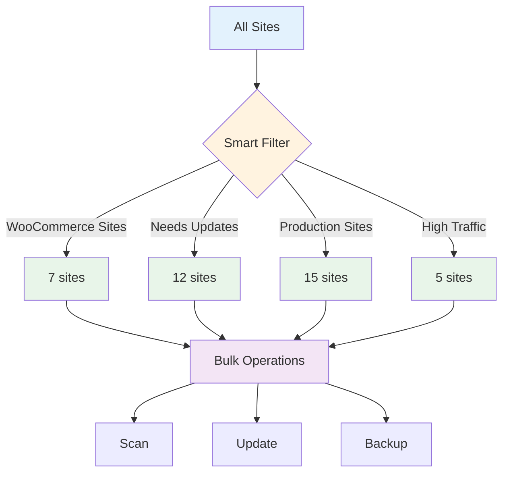

# Smart Filters

Create powerful, reusable filters to segment and organize your WordPress fleet.

## Overview

Smart Filters let you **define, save, and reuse** complex site selection criteria without writing code.



**Key Features:**

- 🎯 **Precision Filtering** - Combine multiple criteria with AND/OR logic
- 💾 **Reusable Filters** - Save and share filter definitions
- 🔄 **Dynamic Updates** - Filters auto-update as sites change
- 📊 **Visual Builder** - No code required
- 🏷️ **Site Groups** - Organize sites into collections
- ⚡ **Quick Access** - One-click filter application
- 📈 **Analytics** - Track filter usage and effectiveness

## Opening Smart Filters

**Three ways to access:**

### 1. Sidebar Button

Click **Smart Filters** in the sidebar.

```
┌─────────────────┐
│ Fleet Overview  │
│ ▶ Smart Filters │ ← Click here
│   Site Groups   │
└─────────────────┘
```

### 2. Fleet Overview

Click **"Filter Sites"** from the dashboard.

### 3. Keyboard Shortcut

Press `Cmd+Shift+F` (macOS) or `Ctrl+Shift+F` (Windows/Linux).

## Filter Builder

### Creating a Filter

**Visual builder interface:**

```
┌─────────────────────────────────────────────┐
│ Create Smart Filter                         │
├─────────────────────────────────────────────┤
│ Filter Name: Production WooCommerce Sites   │
│                                             │
│ Conditions:                                 │
│ ┌─────────────────────────────────────────┐ │
│ │ Plugin    [contains]  WooCommerce        │ │
│ │   AND                                   │ │
│ │ Status    [is]        Running           │ │
│ │   AND                                   │ │
│ │ Domain    [ends with] .com              │ │
│ │   AND                                   │ │
│ │ SSL       [is]        Valid             │ │
│ └─────────────────────────────────────────┘ │
│                                             │
│ [+ Add Condition] [Preview Results]         │
│                                             │
│ Preview: 7 sites match                      │
│ - store1.com                                │
│ - store2.com                                │
│ - ...                                       │
│                                             │
│ [Save Filter] [Cancel]                      │
└─────────────────────────────────────────────┘
```

### Filter Conditions

**Available criteria:**

| Category | Conditions | Operators |
|----------|-----------|-----------|
| **Status** | Running, Halted | is, is not |
| **WordPress** | Version, Type (single/multisite) | =, !=, <, >, contains |
| **Plugins** | Has plugin, Plugin active, Plugin count | contains, is, >, < |
| **Themes** | Active theme, Theme installed | is, contains |
| **Content** | Post count, Product count, Page count | >, <, =, between |
| **Domain** | Domain name, Protocol, SSL status | is, contains, starts with, ends with |
| **WPE** | Environment, Account, Install name | is, contains |
| **Health** | Issues, Updates available | has, count > |
| **Scanned** | Last scan time, Indexed status | <, >, is null |
| **Custom Fields** | ACF field value, Meta key | contains, is, exists |

### Condition Operators

**Comparison operators:**

```
is              → Exact match
is not          → Not equal
contains        → Substring match
starts with     → Prefix match
ends with       → Suffix match
>               → Greater than
<               → Less than
>=              → Greater or equal
<=              → Less or equal
between         → Range
exists          → Field is present
is null         → Field is empty
matches regex   → Regular expression
```

**Logical operators:**

```
AND  → All conditions must match
OR   → Any condition can match
NOT  → Exclude matches
```

### Complex Logic

**Nested conditions:**

```
┌─────────────────────────────────────────────┐
│ Filter: High-Value E-Commerce Sites         │
├─────────────────────────────────────────────┤
│ ┌─ Group 1 (AND) ───────────────────────┐   │
│ │ Plugin contains "WooCommerce"         │   │
│ │   AND                                 │   │
│ │ Product Count > 50                    │   │
│ └───────────────────────────────────────┘   │
│          AND                                │
│ ┌─ Group 2 (OR) ────────────────────────┐   │
│ │ Plugin contains "Stripe"              │   │
│ │   OR                                  │   │
│ │ Plugin contains "PayPal"              │   │
│ └───────────────────────────────────────┘   │
│          AND                                │
│ ┌─ Group 3 (NOT) ───────────────────────┐   │
│ │ Status is not "Halted"                │   │
│ │   AND                                 │   │
│ │ SSL is "Valid"                        │   │
│ └───────────────────────────────────────┘   │
│                                             │
│ Matches: 5 sites                            │
└─────────────────────────────────────────────┘
```

**Translation:**

```
(Plugin = WooCommerce AND Products > 50)
AND
(Plugin = Stripe OR Plugin = PayPal)
AND
(Status ≠ Halted AND SSL = Valid)
```

## Pre-Built Filters

### System Filters

**Built-in filters ready to use:**

```
📋 All Sites
├─ All running sites
└─ All halted sites

⚠️ Needs Attention
├─ WordPress updates available
├─ Plugin updates available
├─ SSL expiring soon
└─ Disk usage > 80%

🛍️ E-Commerce
├─ WooCommerce sites
├─ Easy Digital Downloads sites
├─ Sites with payment gateways
└─ Subscription sites

🌐 WP Engine
├─ Production environments
├─ Staging environments
├─ Sites without SSL
└─ High bandwidth usage

🔌 Plugins
├─ Sites with Yoast SEO
├─ Sites with ACF
├─ Sites with Jetpack
└─ Most plugins installed (top 10%)

📊 Content
├─ High post count (> 100)
├─ Sites with products
├─ Sites with ACF fields
└─ Recently updated content

🏥 Health
├─ All healthy sites
├─ Sites with errors
├─ Not scanned recently (> 7 days)
└─ Large database (> 1GB)
```

### Using Pre-Built Filters

```
Smart Filters → Pre-Built → Select filter

Example: "WooCommerce sites"

✓ Applied filter
  └─ 7 sites match

Result Actions:
[ Scan All ] [ Update Plugins ] [ Export List ]
```

## Saved Filters

### Managing Saved Filters

```
My Saved Filters

┌─────────────────────────────────────────────┐
│ ⭐ Production Sites (15)                    │
│    Status = Running AND Domain ends with    │
│    .com AND SSL = Valid                     │
│    [Apply] [Edit] [Duplicate] [Delete]      │
├─────────────────────────────────────────────┤
│ 🛍️ Active WooCommerce (7)                  │
│    Plugin contains WooCommerce AND          │
│    Status = Running                         │
│    [Apply] [Edit] [Duplicate] [Delete]      │
├─────────────────────────────────────────────┤
│ ⚠️ Needs WordPress Update (3)              │
│    WordPress Version < 6.4                  │
│    [Apply] [Edit] [Duplicate] [Delete]      │
├─────────────────────────────────────────────┤
│ 🔧 Client Sites - Acme Corp (5)            │
│    Domain contains "acmecorp" OR            │
│    Domain contains "acme-client"            │
│    [Apply] [Edit] [Duplicate] [Delete]      │
└─────────────────────────────────────────────┘

[+ Create New Filter]
```

### Filter Actions

**Quick actions on saved filters:**

```
Right-click filter → Context menu

┌─────────────────────────┐
│ Apply Filter            │
│ Edit Conditions         │
│ Duplicate               │
│ Rename                  │
│ ─────────────────────── │
│ Export                  │
│ Share                   │
│ ─────────────────────── │
│ Delete                  │
└─────────────────────────┘
```

## Site Groups

### Creating Groups

**Manual grouping:**

```
Site Groups → Create Group

┌─────────────────────────────────────────┐
│ Group Name: Client Sites - Acme Corp   │
│                                         │
│ Description:                            │
│ All WordPress sites for Acme Corp      │
│ customer account                        │
│                                         │
│ Color: 🔵 Blue ▼                        │
│                                         │
│ Add Sites:                              │
│ ☑ acmecorp-main.local                  │
│ ☑ acmecorp-store.local                 │
│ ☑ acmecorp-blog.local                  │
│ ☐ other-site.local                     │
│                                         │
│ [Create Group] [Cancel]                 │
└─────────────────────────────────────────┘
```

**From filter results:**

```
Apply filter → Select sites → [Create Group]

Example:
1. Filter: "WooCommerce sites"
2. Results: 7 sites
3. Select all 7 sites
4. Click "Create Group from Selection"
5. Name: "E-Commerce Sites"
6. [Save]

✓ Group created with 7 sites
```

### Group Management

```
Site Groups

┌─────────────────────────────────────────────┐
│ 🔵 Client Sites - Acme Corp (5)            │
│    acmecorp-main, acmecorp-store, ...       │
│    Last updated: 2 hours ago                │
│    [View Sites] [Bulk Ops] [Edit] [Delete] │
├─────────────────────────────────────────────┤
│ 🟢 E-Commerce Sites (7)                    │
│    store1, store2, store3, ...              │
│    Last scan: 1 day ago                     │
│    [View Sites] [Bulk Ops] [Edit] [Delete] │
├─────────────────────────────────────────────┤
│ 🟡 Production Sites (15)                   │
│    All live customer sites                  │
│    Health: 12 healthy, 3 need attention     │
│    [View Sites] [Bulk Ops] [Edit] [Delete] │
├─────────────────────────────────────────────┤
│ 🔴 Needs Update (8)                        │
│    Sites with available updates             │
│    Auto-updated daily                       │
│    [View Sites] [Update All] [Edit]         │
└─────────────────────────────────────────────┘

[+ Create Group] [Import] [Export]
```

### Dynamic Groups

**Auto-updating groups:**

```
Create Dynamic Group

┌─────────────────────────────────────────┐
│ Group Name: Sites Needing Updates      │
│                                         │
│ Type: ● Dynamic (auto-update)          │
│       ○ Static (manual)                │
│                                         │
│ Update Rule:                            │
│ Include sites where:                    │
│ ┌─────────────────────────────────────┐ │
│ │ WordPress updates available > 0     │ │
│ │   OR                                │ │
│ │ Plugin updates available > 0        │ │
│ └─────────────────────────────────────┘ │
│                                         │
│ Refresh: ● Daily                       │
│          ○ Hourly                      │
│          ○ On every scan               │
│                                         │
│ Current matches: 8 sites                │
│                                         │
│ [Create Group] [Cancel]                 │
└─────────────────────────────────────────┘
```

**Benefits:**

- ✅ Always current
- ✅ No manual updates needed
- ✅ Based on filter conditions
- ✅ Auto-refreshes on schedule

**Use cases:**

- Sites needing updates
- High disk usage (> 80%)
- SSL expiring soon (< 30 days)
- Not scanned recently (> 7 days)

## Filter Templates

### Importing Templates

```
Smart Filters → Templates → Import

Popular Templates:

📋 WordPress Basics
├─ Sites by WP version
├─ Multisite instances
└─ Sites with specific theme

🔌 Plugin Management
├─ Sites with inactive plugins
├─ Sites missing security plugins
└─ Most plugins installed

🛍️ E-Commerce
├─ WooCommerce + Stripe
├─ Subscription sites
└─ High-value stores (> 100 products)

🌐 WP Engine
├─ Production vs staging
├─ Environment comparison
└─ Sites by account

[Import Selected] [Browse All]
```

### Exporting Filters

**Share filters with team:**

```
Select filter → Export

Format: ○ JSON ● YAML

myfilter.yaml:
────────────────────────────────────
name: Production WooCommerce Sites
description: All live WooCommerce stores
conditions:
  - field: plugin
    operator: contains
    value: WooCommerce
  - field: status
    operator: is
    value: Running
  - field: domain
    operator: ends_with
    value: .com
logic: AND
────────────────────────────────────

[Copy to Clipboard] [Save File] [Share URL]
```

**Import on another machine:**

```
Smart Filters → Import → Select myfilter.yaml

✓ Filter imported successfully
  "Production WooCommerce Sites" added to your filters
```

## Advanced Features

### Filter Combinators

**Combine multiple saved filters:**

```
Create Combinator Filter

Base Filter: WooCommerce Sites (7)

Combine with:
☑ Production Sites (15)
  Operator: AND → 5 sites

☑ Needs Updates (8)
  Operator: OR → 9 sites

☐ High Traffic Sites (5)

Result: "Prod WooCommerce Needing Updates"
Matches: 3 sites

[Save Combinator]
```

### Scheduled Filters

**Run filters on schedule:**

```
Filter: Sites Needing Updates

Schedule:
☑ Auto-run daily at 9:00 AM

Actions on match:
☑ Send email summary
☑ Slack notification (#maintenance)
☐ Auto-update WordPress
☐ Create backup

Email Preview:
────────────────────────────────────
Subject: 8 sites need updates

Sites requiring attention:
- Site1: WP 6.3.1 → 6.4.3 (2 plugin updates)
- Site2: WP 6.4.2 → 6.4.3 (5 plugin updates)
...

[View in Local] [Update All]
────────────────────────────────────

[Save Schedule]
```

### Filter Analytics

**Track filter usage:**

```
Filter Analytics

Most Used Filters (Last 30 Days):
1. WooCommerce Sites - 45 uses
2. Needs Updates - 38 uses
3. Production Sites - 22 uses
4. Client Sites - Acme - 15 uses
5. High Traffic - 12 uses

Filter Performance:
┌─────────────────────────────────────────┐
│ Filter              Avg Time  Sites     │
├─────────────────────────────────────────┤
│ WooCommerce Sites   120ms     7         │
│ All Sites           45ms      24        │
│ Complex Query       850ms     3         │
└─────────────────────────────────────────┘

Slowest Filters:
⚠️ "Complex Client Filter" - 850ms (optimize?)

[View Detailed Report] [Optimize Filters]
```

## Use Cases

### Client Management

**Organize by client:**

```
Create filters for each client:

Filter: Client A Sites
└─ Domain contains "clienta" OR Tag = "clienta"
   Result: 5 sites

Filter: Client B Sites
└─ Domain contains "clientb" OR Tag = "clientb"
   Result: 8 sites

Filter: Internal Sites
└─ Domain ends with "internal.com"
   Result: 3 sites

Bulk operation per client:
- Client A Sites → Update all
- Client B Sites → Scan all
- Internal Sites → Backup all
```

### Maintenance Workflows

**Weekly maintenance routine:**

```
Monday: High Priority Updates
Filter: "WordPress < 6.4 AND Status = Running"
Action: Update WordPress core

Tuesday: Plugin Updates
Filter: "Plugin updates > 0 AND Environment = Production"
Action: Update all plugins

Wednesday: Security Scan
Filter: "SSL expiring < 30 days OR Firewall = Off"
Action: Review and fix

Thursday: Performance Check
Filter: "Disk usage > 80% OR Database > 1GB"
Action: Optimize and clean

Friday: Backup Verification
Filter: "Last backup > 7 days"
Action: Create manual backups
```

### E-Commerce Management

**Monitor stores:**

```
Filter: Active Stores
└─ WooCommerce + Status = Running + Products > 10
   Action: Daily scan

Filter: High-Value Stores
└─ Products > 100 AND Revenue tracking enabled
   Action: Priority monitoring

Filter: New Stores (Setup)
└─ Products < 10 AND Created < 30 days
   Action: Setup assistance

Filter: Abandoned Stores
└─ Products > 0 AND Last scan > 90 days
   Action: Archive candidate
```

### Development Stages

**Track site lifecycle:**

```
Filter: Development
└─ Domain ends with .local AND Tag = "dev"

Filter: Staging
└─ WPE Environment = Staging

Filter: Production
└─ WPE Environment = Production AND SSL = Valid

Filter: Archived
└─ Status = Halted AND Last scan > 180 days
```

## Troubleshooting

### No Results

**Filter too restrictive:**

```
Filter: Production WooCommerce with Subscriptions
Conditions: 5
Result: 0 sites

Troubleshooting:
1. Remove one condition at a time
2. Check condition: Plugin contains "WooCommerce"
   → 7 sites (OK)
3. Add: Status = Running
   → 7 sites (OK)
4. Add: Domain ends with .com
   → 5 sites (OK)
5. Add: SSL = Valid
   → 5 sites (OK)
6. Add: Plugin contains "WooCommerce Subscriptions"
   → 0 sites (PROBLEM!)

Issue: No sites have Subscriptions plugin
Fix: Remove Subscriptions condition or adjust
```

### Slow Filters

**Optimize performance:**

```
Filter: Complex Client Query
Execution time: 2.3s (slow)

Optimization tips:
1. Limit regex conditions (slow)
2. Use "contains" instead of "matches regex"
3. Filter by Status first (fast)
4. Avoid multiple OR conditions with nested groups
5. Create indexes for frequently used fields

After optimization:
Execution time: 180ms (13× faster)
```

### Unexpected Results

**Debug filter logic:**

```
Filter: Production Sites
Expected: 15 sites
Actual: 22 sites

Debug Mode:
┌─────────────────────────────────────────┐
│ Condition 1: Domain ends with .com     │
│ ├─ Matches: 18 sites                   │
│ └─ site1.com, site2.com, ...           │
│                                         │
│ Condition 2: SSL is Valid              │
│ ├─ Matches: 20 sites                   │
│ └─ site1.com, site3.com, ...           │
│                                         │
│ Logic: OR (should be AND!)             │
│ ├─ Result: 22 sites (18 ∪ 20)         │
│ └─ FIX: Change to AND → 15 sites       │
└─────────────────────────────────────────┘

[Fix Logic] [Export Debug Report]
```

## Best Practices

### Filter Organization

**Naming conventions:**

```
✅ Good Names:
- "Production WooCommerce Sites"
- "Client A - All Sites"
- "Needs WordPress Update"
- "High Disk Usage (>80%)"

❌ Bad Names:
- "Filter1"
- "Test"
- "asdf"
- "Sites"
```

**Folder structure:**

```
Organize filters into categories:

Clients/
├─ Client A Sites
├─ Client B Sites
└─ Internal Sites

Maintenance/
├─ Needs WordPress Update
├─ Needs Plugin Updates
└─ SSL Expiring Soon

E-Commerce/
├─ WooCommerce Stores
├─ High-Value Stores
└─ Subscription Sites

WP Engine/
├─ Production Environments
├─ Staging Environments
└─ Development Sites
```

### Performance

**Optimize filter queries:**

- ✅ Put fast conditions first (Status, Domain)
- ✅ Use indexed fields when possible
- ✅ Limit regex to final conditions
- ✅ Avoid deep nesting (max 3 levels)
- ❌ Don't use complex regex on large fields
- ❌ Don't create 20+ condition filters

### Maintenance

**Regular cleanup:**

- Delete unused filters monthly
- Archive old client filters
- Update dynamic groups when sites change
- Review filter analytics to optimize

## Next Steps

- **[Site Groups Panel](site-groups.md)** - Deep dive into grouping
- **[Bulk Operations](bulk-operations.md)** - Apply operations to filter results
- **[Fleet Overview](fleet-overview.md)** - Dashboard views
- **[Saved Queries](saved-queries.md)** - Reusable search queries
- **[CLI Filters](../cli/filtering.md)** - Command-line filtering
