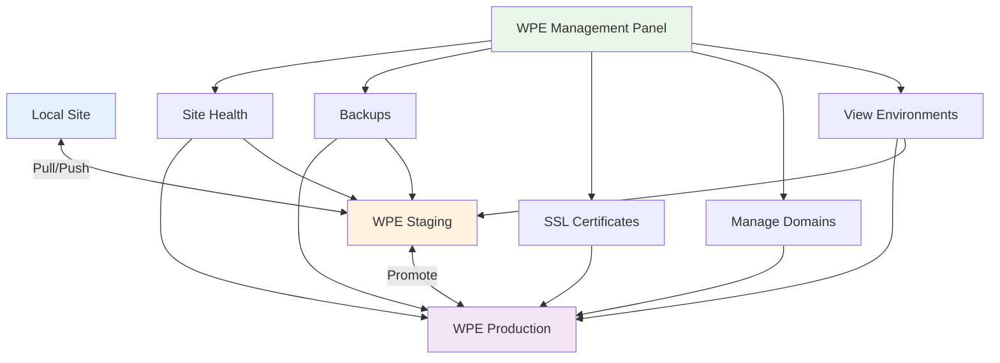
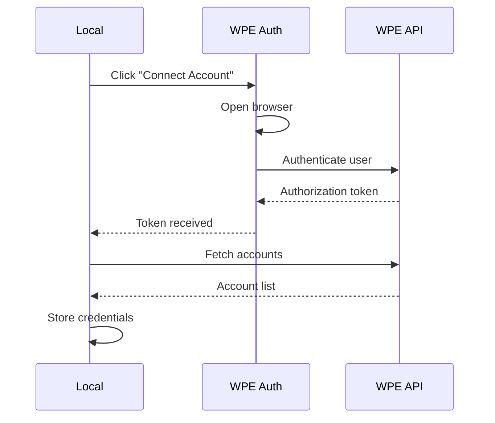
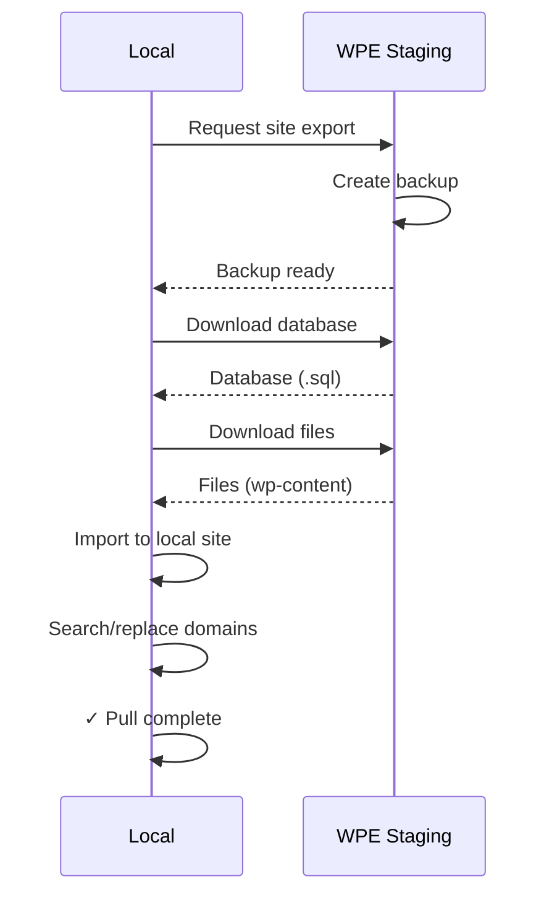

# WP Engine Management

Manage your entire WP Engine hosting infrastructure directly from Local.

## Overview

The WPE Management panel provides **unified control** over WP Engine accounts, sites, and environments without leaving Local.

## How WPE Sync Works

Nexus AI uses a **two-tier sync model** to keep WP Engine site data up to date without blocking Local's startup.

| Tier | When | Duration | What it fetches |
|------|------|----------|-----------------|
| **Tier 1 — CAPI sync** | Every startup (automatic) | ~2–3 seconds | PHP versions, account info, detects new installs and ghost installs |
| **Tier 2 — SSH sync** | Scheduled (configurable) | Seconds to minutes depending on fleet size | WordPress versions, installed plugins, user lists |

**On startup**, Nexus AI automatically runs the fast CAPI sync to detect any new installs added to your WP Engine account and refresh PHP/account data. This is lightweight and runs in the background.

**The SSH sync** runs on the configured schedule (or manually via the Operations panel). It fetches deeper data — WP core versions, plugins, users — that requires an SSH connection to each install.

The Operations panel (under WPE Management) shows the current sync status, lets you stop a running sync, and allows triggering a sync for a single install without waiting for the next scheduled run.



**Key Features:**

- 🌐 **Multi-Account Management** - View all WPE accounts in one place
- 🔄 **Environment Sync** - Pull/push between Local and WPE
- 📊 **Site Health Monitoring** - Track bandwidth, disk usage, backups
- 🔒 **SSL Management** - Request and monitor certificates
- 🌍 **Domain Configuration** - Add, update, and verify domains
- 💾 **Backup Management** - Create and restore backups
- 🚀 **Deployment Tools** - Promote staging to production
- 📈 **Usage Analytics** - Monitor resource consumption

## Opening WPE Management

**Three ways to access:**

### 1. Sidebar Button

Click the **WPE Mgmt** tab in the left sidebar.

```
┌─────────────────┐
│ Fleet Overview  │
│   Site Finder   │
│   AI Chat       │
│ ▶ WPE Mgmt      │ ← Click here
└─────────────────┘
```

### 2. Site Context Menu

Right-click any Local site → **WPE Management**.

### 3. Fleet Overview

Click **"View WPE Sites"** from Fleet Overview dashboard.

## Authentication

### Connecting Your WPE Account

**First Time Setup:**

```
1. WPE Management → Connect Account
2. Enter your WPE credentials
3. Authenticate via browser
4. Grant Local access
5. Select accounts to manage
```

**Visual Flow:**



### Managing Multiple Accounts

View and switch between WPE accounts:

```
WPE Management → Accounts

┌─────────────────────────────────────────┐
│ Connected Accounts (3)                  │
├─────────────────────────────────────────┤
│ ● Personal Account                      │
│   Sites: 5 | Installs: 12              │
│   [View] [Disconnect]                   │
├─────────────────────────────────────────┤
│ ○ Agency Account                        │
│   Sites: 24 | Installs: 68             │
│   [View] [Disconnect]                   │
├─────────────────────────────────────────┤
│ ○ Client Account                        │
│   Sites: 3 | Installs: 9               │
│   [View] [Disconnect]                   │
└─────────────────────────────────────────┘

[+ Add Another Account]
```

### Credential Storage

**Where Credentials Live:**

```
~/Library/Application Support/Local/nexus-ai/
└─ wpe-credentials.json (encrypted)
```

**Security:**

- 🔒 Credentials encrypted at rest
- 🔒 OAuth tokens, not passwords
- 🔒 Tokens auto-refresh
- 🔒 Local file permissions protect access

### Disconnecting

Remove WPE account access:

```
Accounts → Select account → Disconnect

Warning: This will:
- Remove API access
- Clear cached site data
- Prevent pull/push operations
- Preserve local sites

[Cancel] [Disconnect]
```

## Environment Overview

### Viewing Environments

See all WPE environments for a site:

```
WPE Management → Select Site → Environments

┌─────────────────────────────────────────┐
│ MySite                                  │
├─────────────────────────────────────────┤
│ Production                              │
│ ├─ Status: Active                       │
│ ├─ Domain: mysite.com                   │
│ ├─ SSL: Valid (expires 2024-12-15)     │
│ ├─ PHP: 8.1                             │
│ ├─ Disk: 2.4 GB / 10 GB (24%)          │
│ ├─ Bandwidth: 45 GB / 100 GB (45%)     │
│ └─ Last Backup: 6 hours ago             │
│     [Open] [Backup] [View Logs]        │
├─────────────────────────────────────────┤
│ Staging                                 │
│ ├─ Status: Active                       │
│ ├─ Domain: mysite.wpengine.com          │
│ ├─ SSL: Valid                           │
│ ├─ PHP: 8.1                             │
│ ├─ Disk: 2.1 GB / 10 GB (21%)          │
│ └─ Last Backup: 1 day ago               │
│     [Pull to Local] [Push from Local]  │
├─────────────────────────────────────────┤
│ Development                             │
│ ├─ Status: Active                       │
│ ├─ Domain: mysite-dev.wpengine.com      │
│ ├─ SSL: Valid                           │
│ └─ Last Backup: 3 days ago              │
│     [Pull to Local]                    │
└─────────────────────────────────────────┘
```

### Environment Details

Click any environment for detailed info:

```
Production (mysite.com)

📊 Resource Usage:
├─ Disk: 2.4 GB / 10 GB (24%)
│   ├─ Database: 450 MB
│   ├─ Files: 1.8 GB
│   └─ Logs: 150 MB
├─ Bandwidth: 45 GB / 100 GB (45%)
│   ├─ This month: 45 GB
│   └─ Daily avg: 1.5 GB
└─ Visits: 12,450 this month

🔒 Security:
├─ SSL: Valid until 2024-12-15
├─ Firewall: Enabled
└─ IP Restrictions: None

⚙️ Configuration:
├─ PHP: 8.1.15
├─ MySQL: 8.0
├─ WordPress: 6.4.3
├─ Cache: Enabled
└─ CDN: Enabled

💾 Backups:
├─ Automatic: Daily at 2 AM
├─ Last backup: 6 hours ago
└─ Retention: 30 days

[Edit Configuration] [View Backups] [Manage SSL]
```

## Pull & Push

### Pulling from WPE to Local

**Pull a WPE site to Local:**

```
1. Select WPE environment (e.g., Staging)
2. Click "Pull to Local"
3. Choose what to pull:
   ☑ Database
   ☑ Files (wp-content)
   ☐ Plugins (already synced)
   ☐ Themes (already synced)
4. [Start Pull]
```

**Visual Flow:**



**Progress Indicator:**

```
Pulling from WPE Staging...

✓ Connected to WPE
✓ Creating backup
⏳ Downloading database (2.1 MB)... 45%
⏹ Downloading files (pending)
⏹ Importing database (pending)
⏹ Search/replace URLs (pending)

[Cancel]
```

**Post-Pull Actions:**

```
Pull Complete! ✓

Local site updated:
├─ Database: 2.1 MB imported
├─ Files: 1.8 GB synced
└─ URLs: Replaced with .local domain

Next steps:
[ Open Site ] [ Scan Content ] [ View Changes ]
```

### Pushing from Local to WPE

**Push local changes to WPE:**

```
⚠️ Warning: This will overwrite WPE Staging

1. Select Local site
2. Click "Push to WPE"
3. Select target environment: Staging ▼
4. Choose what to push:
   ☑ Database
   ☑ Files (wp-content)
   ☐ Plugins
   ☐ Themes
5. Review changes
6. [Confirm Push]
```

**Safety Checks:**

```
Pre-Push Validation:

✓ Local site is running
✓ WPE environment is accessible
✓ Backup will be created first
✓ Database size within limits
✗ Warning: Production environment selected

⚠️ You're pushing to PRODUCTION

This will:
- Overwrite live database
- Replace live files
- Affect real users
- Take site offline briefly

Are you SURE?

[ No, use Staging ] [ Yes, I'm sure ]
```

**Progress:**

```
Pushing to WPE Staging...

✓ Creating WPE backup (safety)
✓ Exporting local database
✓ Search/replace URLs
⏳ Uploading database... 67%
⏹ Uploading files (pending)
⏹ Clearing cache (pending)

[Cancel]
```

### Comparing Environments

**View differences before sync:**

```
Local vs. WPE Staging

Database Changes:
├─ wp_posts: 12 new, 3 modified, 1 deleted
├─ wp_postmeta: 48 new, 12 modified
└─ wp_options: 3 modified

File Changes:
├─ wp-content/uploads/
│   └─ +24 new images (8.4 MB)
├─ wp-content/plugins/
│   ├─ woocommerce: updated 8.4.0 → 8.5.2
│   └─ akismet: updated 5.3 → 5.3.1
└─ wp-content/themes/
    └─ astra: no changes

[Push Changes] [Pull Instead] [Cancel]
```

## Domain Management

### Viewing Domains

See all domains for an environment:

```
Production Domains

Primary Domain:
├─ mysite.com
│   ├─ Status: Active
│   ├─ SSL: Valid
│   ├─ DNS: Configured ✓
│   └─ Redirects to HTTPS: Yes

Additional Domains:
├─ www.mysite.com
│   ├─ Status: Active
│   ├─ Redirects to: mysite.com
│   └─ SSL: Shared cert
├─ old-domain.com
│   ├─ Status: Active
│   ├─ Redirects to: mysite.com
│   └─ SSL: Valid

WPE Default:
└─ mysite.wpengine.com
    └─ Status: Active (fallback)

[+ Add Domain] [Manage Redirects]
```

### Adding Domains

**Add a custom domain:**

```
1. Click [+ Add Domain]
2. Enter domain: newdomain.com
3. Select domain type:
   ○ Primary (main site URL)
   ● Redirect (301 to primary)
   ○ Additional (separate content)
4. [Add Domain]
```

**DNS Configuration:**

```
Domain Added: newdomain.com

⚠️ DNS Configuration Required

Add these records to your DNS provider:

A Record:
├─ Name: @
└─ Value: 141.193.213.10

CNAME Record:
├─ Name: www
└─ Value: mysite.wpengine.com

[Copy DNS Settings] [Verify DNS]
```

### SSL Certificates

**Request SSL for domain:**

```
Domains → Select domain → Request SSL

newdomain.com

SSL Certificate:
├─ Status: Pending
├─ Type: Let's Encrypt
└─ Validation: DNS

⏳ Validating domain ownership...

DNS TXT Record Required:
├─ Name: _acme-challenge.newdomain.com
└─ Value: xK7d...9mPq (copy this)

Add this TXT record to your DNS, then:
[Check DNS] [Retry Validation]
```

**SSL Status:**

```
SSL Certificates

✓ mysite.com
  ├─ Issuer: Let's Encrypt
  ├─ Expires: 2024-12-15 (87 days)
  └─ Auto-renew: Enabled

✓ www.mysite.com
  └─ Shared with mysite.com

⏳ newdomain.com
  ├─ Status: Validating
  └─ ETA: 5-10 minutes

[Renew All] [View Logs]
```

## Backup Management

### Viewing Backups

See all backups for an environment:

```
Production Backups

Automatic Backups (30-day retention):
├─ 2024-03-20 02:00 AM (6 hours ago)
│   ├─ Size: 2.4 GB
│   ├─ Database: 450 MB
│   ├─ Files: 1.95 GB
│   └─ [Restore] [Download] [Delete]
├─ 2024-03-19 02:00 AM (1 day ago)
│   └─ Size: 2.3 GB
└─ 2024-03-18 02:00 AM (2 days ago)
    └─ Size: 2.3 GB

Manual Backups:
├─ 2024-03-15 "Before plugin update"
│   └─ Size: 2.2 GB
└─ 2024-03-01 "Pre-launch backup"
    └─ Size: 2.0 GB

[+ Create Backup] [Schedule Settings]
```

### Creating Backups

**Manual backup:**

```
Create Backup

Environment: Production ▼

☑ Include database
☑ Include files
☐ Include logs

Description (optional):
┌─────────────────────────────────────┐
│ Before major content update         │
└─────────────────────────────────────┘

Email notification: me@example.com

[Create Backup]
```

**Progress:**

```
Creating backup...

✓ Queued backup job
⏳ Backing up database... 34%
⏹ Backing up files (pending)

Estimated time: 3-5 minutes

[Cancel]
```

### Restoring Backups

**Restore from backup:**

```
⚠️ Warning: Restore will overwrite current site

Backup Details:
├─ Date: 2024-03-15 3:45 PM
├─ Description: "Before plugin update"
├─ Database: 450 MB
└─ Files: 1.95 GB

This will:
- Replace current database with backup
- Replace files with backup versions
- Take site offline briefly (~5 minutes)
- Create a safety backup first

Are you sure?

[ No, Cancel ] [ Yes, Restore ]
```

**Restore Progress:**

```
Restoring backup...

✓ Creating safety backup (current state)
✓ Preparing restore
⏳ Restoring database... 56%
⏹ Restoring files (pending)
⏹ Clearing cache (pending)

[Cancel] (will revert to safety backup)
```

### Backup Schedules

**Configure automatic backups:**

```
Backup Schedule Settings

Production:
├─ Frequency: Daily ▼
├─ Time: 2:00 AM ▼
├─ Retention: 30 days ▼
└─ Notifications: Enabled

Staging:
├─ Frequency: Weekly ▼
├─ Day: Sunday ▼
├─ Time: 3:00 AM ▼
└─ Retention: 14 days ▼

Development:
└─ Frequency: Manual only

[Save Schedule]
```

## Site Health

### Health Dashboard

Monitor site health metrics:

```
Production Health

🟢 Overall Status: Healthy

📊 Resource Usage:
├─ Disk: 24% (2.4 GB / 10 GB)
│   └─ Trend: +2% this week
├─ Bandwidth: 45% (45 GB / 100 GB)
│   └─ Trend: Normal
└─ Visits: 12,450 this month
    └─ Trend: +8% vs last month

⚡ Performance:
├─ Page Load: 1.2s (Good)
├─ TTFB: 340ms (Good)
└─ Cache Hit Rate: 94% (Excellent)

🔒 Security:
├─ SSL: Valid (87 days until renewal)
├─ Firewall: Active
├─ Failed Logins: 3 (Normal)
└─ Last Scan: 2 hours ago

💾 Backups:
├─ Last Backup: 6 hours ago
├─ Next Scheduled: Today 2:00 AM
└─ Total Backups: 32

⚠️ Warnings:
└─ None

[View Detailed Report] [Export PDF]
```

### Alerts & Notifications

Configure health alerts:

```
Health Alerts

Disk Usage:
☑ Alert at 80% capacity
☑ Critical at 90%
Email: me@example.com

Bandwidth:
☑ Alert at 80% of monthly quota
☑ Alert on unusual spikes (3× normal)

SSL:
☑ Remind 30 days before expiration
☑ Alert on validation failures

Backups:
☑ Alert on backup failures
☑ Alert if no backup in 48 hours

Performance:
☑ Alert on page load > 3s
☑ Alert on TTFB > 1s

[Save Alert Settings]
```

### Usage Analytics

View detailed resource usage:

```
Production Usage - March 2024

Bandwidth (100 GB quota):
┌─────────────────────────────────────────┐
│                  ▁▂▃▅▆▇█▇▆▅▃▂▁          │
│ 45 GB used                              │
│ 55 GB remaining                         │
└─────────────────────────────────────────┘

Daily Breakdown:
├─ 2024-03-20: 1.8 GB
├─ 2024-03-19: 2.1 GB
├─ 2024-03-18: 1.5 GB
└─ [View Full Report]

Disk Usage (10 GB quota):
├─ Database: 450 MB (18%)
├─ Uploads: 1.2 GB (48%)
├─ Themes: 85 MB (3%)
├─ Plugins: 320 MB (13%)
├─ Logs: 150 MB (6%)
└─ Other: 295 MB (12%)

Top Bandwidth Consumers:
1. /wp-content/uploads/video.mp4 - 8.2 GB
2. /product-images/* - 4.1 GB
3. Homepage - 2.8 GB

[Optimize Usage] [Upgrade Plan]
```

## Deployment

### Staging to Production

**Promote staging to production:**

```
⚠️ Deploy to Production

Source: Staging
Target: Production

Changes Preview:
├─ Database: 45 modified records
├─ Files: 12 new, 3 modified
└─ Plugins: WooCommerce 8.4.0 → 8.5.2

Pre-Deploy Checklist:
☑ Backup created (2024-03-20-pre-deploy)
☑ Maintenance mode ready
☑ Cache will be cleared
☑ CDN will be purged

⏱️ Estimated downtime: 2-3 minutes

Deploy at:
○ Now
● Scheduled: 2024-03-21 2:00 AM ▼

Notifications:
☑ Email me when complete
☑ Slack notification (#deployments)

[Schedule Deploy] [Cancel]
```

**Deploy Progress:**

```
Deploying to Production...

✓ Backup created
✓ Maintenance mode ON
⏳ Copying database... 78%
⏹ Copying files (pending)
⏹ Search/replace URLs (pending)
⏹ Clear cache (pending)
⏹ Maintenance mode OFF (pending)

ETA: 1 minute

[Cancel Deploy] (will rollback)
```

**Deploy Complete:**

```
✓ Deploy Successful!

Production Updated:
├─ Database: 45 records synced
├─ Files: 12 added, 3 modified
├─ Cache: Cleared
├─ CDN: Purged
└─ Downtime: 2m 15s

Site Status:
✓ Live and responding
✓ SSL valid
✓ Cache rebuilding

[View Production] [Create Backup] [Rollback]
```

### Rollback

**Revert a deployment:**

```
⚠️ Rollback Production

Current State:
├─ Deployed: 15 minutes ago
└─ From: Staging (2024-03-20 deploy)

Rollback To:
├─ Backup: 2024-03-20-pre-deploy
├─ Created: 15 minutes ago
└─ Size: 2.4 GB

This will:
- Restore database to pre-deploy state
- Restore files to pre-deploy state
- Clear cache and CDN
- Take site offline briefly (~2 minutes)

Reason for rollback (optional):
┌─────────────────────────────────────────┐
│ Plugin conflict causing errors          │
└─────────────────────────────────────────┘

[Cancel] [Confirm Rollback]
```

## Troubleshooting

### Connection Issues

**Can't connect to WPE:**

```
Error: Failed to connect to WP Engine API

Possible causes:
1. Invalid credentials
   → Re-authenticate: Settings → WPE → Reconnect

2. Network issues
   → Check internet connection
   → Try again in 30 seconds

3. WPE API outage
   → Check status: https://status.wpengine.com

[Retry] [Re-authenticate] [View Logs]
```

### Pull/Push Failures

**Pull operation failed:**

```
Error: Failed to pull from WPE Staging

Details:
- Connection: OK
- Backup creation: OK
- Download: FAILED
  └─ Database download timed out

Solutions:
1. Try again (temporary network issue)
2. Use WPE User Portal for manual backup
3. Contact WPE support if persistent

[Retry] [Manual Backup Guide] [Contact Support]
```

### Domain Issues

**Domain not propagating:**

```
⚠️ Domain Validation Pending

newdomain.com

DNS Status:
├─ A Record: ✗ Not found
├─ CNAME: ✗ Not found
└─ Expected IP: 141.193.213.10

Troubleshooting:
1. Verify DNS records added correctly
2. Wait for DNS propagation (up to 48 hours)
3. Use DNS checker: https://dnschecker.org

Current DNS Results:
└─ No records found for newdomain.com

[Recheck DNS] [View Setup Guide]
```

### SSL Errors

**SSL validation failed:**

```
Error: SSL Certificate Validation Failed

newdomain.com

Issue:
└─ TXT record not found for _acme-challenge

Required TXT Record:
├─ Name: _acme-challenge.newdomain.com
└─ Value: xK7d...9mPq

Current DNS:
└─ Record not found

Solutions:
1. Add TXT record to DNS
2. Wait 5-10 minutes for propagation
3. Click "Retry Validation"

[Copy TXT Value] [Retry] [Help Guide]
```

## Best Practices

### Development Workflow

**Recommended flow:**

```
1. Pull Production → Local
   └─ Get latest live data

2. Develop & Test Locally
   └─ Make changes safely

3. Push Local → Staging
   └─ Test in WPE environment

4. Verify on Staging
   └─ QA, UAT, client review

5. Promote Staging → Production
   └─ Deploy to live site

Always:
✓ Backup before each step
✓ Test on staging first
✓ Deploy during low-traffic hours
```

### Backup Strategy

**Best practices:**

- ✅ Automatic daily backups on production
- ✅ Manual backup before any major change
- ✅ Keep at least 30 days of production backups
- ✅ Test restores quarterly
- ✅ Export critical backups to local storage

### Security

**Protection measures:**

- 🔒 Use WPE firewall
- 🔒 Enable IP restrictions for admin
- 🔒 Keep SSL certificates valid
- 🔒 Monitor failed login attempts
- 🔒 Regular security scans
- 🔒 Limit production access to essential team members

## Next Steps

- **[Fleet Overview](fleet-overview.md)** - Monitor all sites
- **[Bulk Operations](bulk-operations.md)** - Multi-site management
- **[WP-CLI Integration](../features/wp-cli-integration.md)** - Remote command execution
- **[Safety System](../features/safety-system.md)** - Understanding operation safety
- **[WPE Integration Architecture]** - Technical details
