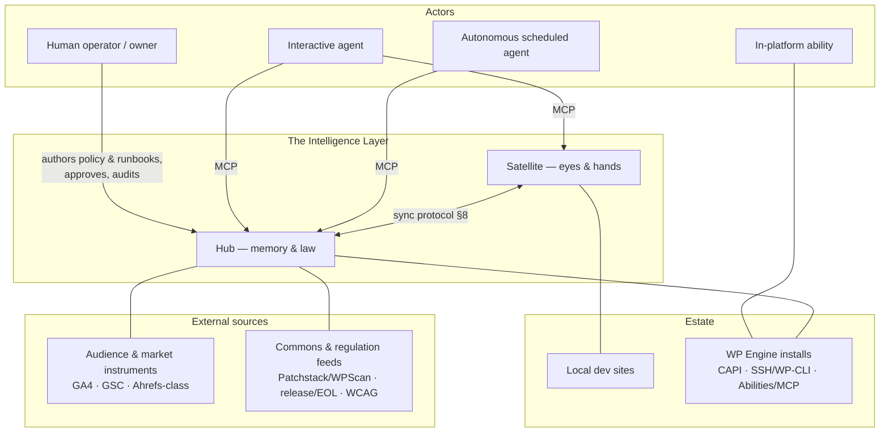
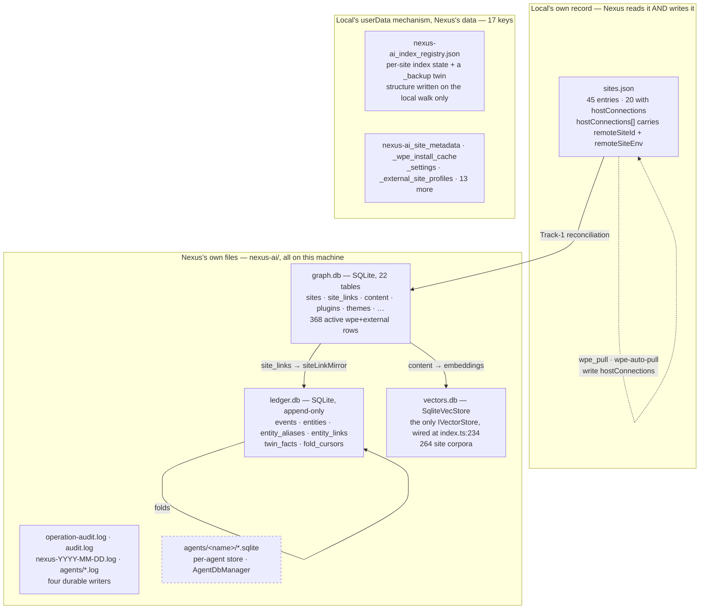
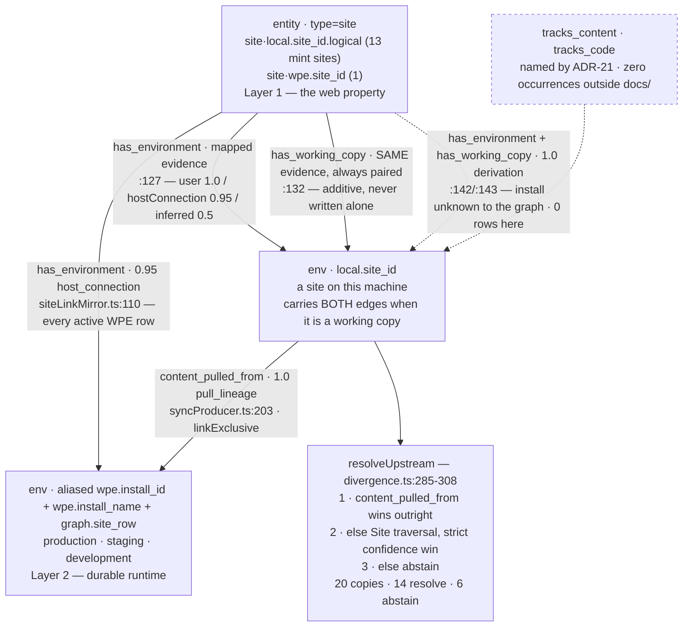

# The Intelligence Layer — Architecture Design Document
### Engineering companion to "The Intelligence Supply Chain"

*Draft 0.3 · 2026-08-14 · Portable core, concrete choices grounded in the Local (desktop) + WP Engine (cloud) reality · 0.2: the five §11 open questions resolved → ADRs 11–15 · 0.3: implementation decisions → ADRs 16–19*

---

## 1. Purpose, goals, non-goals

This document turns the conceptual model (five types · nine sources · governance control plane + enforcement fabric · four distribution patterns · closed loop) into a buildable system design. It goes deep on the three components chosen as first priorities — **event backbone & schemas**, **entity graph & identity**, and the **context assembler** — treats the gateway/policy engine and hub↔satellite sync at contract level, and captures the load-bearing decisions as ADRs.

**Goals**

- G1. Topology (all-local / hybrid / hub-heavy) is a deployment profile, not an architecture. Same components, three configurations.
- G2. Each intelligence type gets its native store, consistency model, and distribution pattern. No flattening.
- G3. Governance is enforced outside the model: one gateway choke point, provenance on every fact, audit reconstructable from records alone.
- G4. Agents are stateless visitors. All accumulated intelligence survives model swaps.
- G5. The closed loop is structural: acting through the system emits history by construction, not by agent discipline.

**Non-goals (v1)**

- Multi-hub federation between organizations.
- Real-time collaborative editing of runbooks/policy (git-style async review is the v1 model).
- A general workflow engine — runbooks guide agents; they are not BPMN.
- Replacing the platform's own APIs (WP Engine CAPI, WP-CLI, WordPress Abilities/MCP) — we orchestrate them, never re-implement them.

---

## 2. System context (C4 level 1)



Boundary rule: **actors never touch the estate or external sources directly** — every read is stamped and every write is gated by passing through the layer. The single exception is in-platform abilities (they *are* estate code); they participate by emitting events to the layer and being invoked through it.

---

## 3. Container view (C4 level 2)

**Hub** (cloud; always-on; multi-tenant):

| Container | Responsibility | v1 technology |
|---|---|---|
| **Ledger** | Append-only event log; the spine; episodic store is its durable retention | Postgres (`events` table, partitioned by month) — a log-first system (Kafka/NATS) is deliberately deferred, see ADR-2 |
| **Entity service** | Identity spine: entities, aliases, pairings, resolution API | Postgres + small resolver service |
| **Twin views** | Materialized state views folded from events; freshness & drift computed here | Postgres tables + fold workers |
| **Semantic index** | Production content embeddings + graph, source-linked | pgvector (or LanceDB-in-cloud); graph edges in Postgres |
| **Policy & runbook repo** | The authored, binding intelligence — policy constraints + runbooks; versioned, reviewed, signed | Git repository + thin index service (ADR-5) |
| **Assembler** | Compiles per-task context bundles; emits manifests | Stateless service |
| **Gateway** | MCP server; policy evaluation, thresholds, stamping, emission | MCP + policy engine (ADR-8) |
| **Conductors** | Schedulers, monitors, feed & instrument sync, drift detection | Workers on the ledger |
| **Control UI** | Grants, thresholds, audit views, review queue | Web app |

**Satellite** (desktop daemon beside Local; single-tenant; offline-capable):

| Container | Responsibility | v1 technology |
|---|---|---|
| **Local ledger** | Same envelope, local retention, replication cursor | SQLite |
| **Local observers** | Site scan, WP-CLI introspection, filesystem/webhook events | Existing Local addon surface |
| **Local twins + index** | Views over local events; local content index | SQLite + LanceDB (existing) |
| **Policy & runbook cache** | Pinned policy/runbook versions + staleness clock | Git clone / content-addressed cache |
| **Local gateway** | Same MCP surface, same gates, enforced offline | Shared gateway library |
| **Local assembler** | Same assembler library, local stores | Shared library |

The satellite is a **miniature of the runtime planes**, not a thin client: gates hold with the laptop offline; only canonical memory (the ledger) and the canonical policy & runbook repo live at the hub.

---

## 3A. The system as built

§2 and §3 describe the target. This section describes what is on the disk on
`poc/nexintelligence-ux` today, so the distance between the two is legible
without reading both and subtracting. **There is no hub and no Postgres: the
satellite is the whole system**, and no intelligence-layer store leaves the
machine. (Telemetry does — `src/cli/utils/telemetry.ts:27` — which is why the
claim is scoped to the stores rather than to the process.)

Every box, edge and number below was read from source or measured; the
verdict for each, with its citation, is in `wp64-figure-corrections.md`.
Fleet numbers are marked **[fleet]** and were measured **2026-08-22 15:28Z on
one machine** — they describe this data, not the system. Everything unmarked
is structural.

### 3A.1 The stores, and the boundary that is not a boundary



**Six store families, not four, and the fifth is not a store.** `IndexRegistry`
is one *key* in Local's userData store (`nexus-ai_index_registry`,
`src/common/constants.ts:439`) — one JSON file plus a `_backup` twin written by
the adapter at `src/main/index.ts:182-193`, not a database. The four SQLite
databases are the complete set of `new Database(...)` sites in non-test `src/`:
`intelligence/ledger/ledger.ts:33`, `main/vector-store/SqliteVecStore.ts:17`,
`main/events/GraphService.ts:162`, `main/agent-runtime/AgentDbManager.ts:20`.
The last has **no instance on this fleet** and is drawn dashed for that reason.
Two artifacts beside the live ones are dead and should not be mistaken for
stores: `nexus-ai/vectors/` (the LanceDB directory) and a zero-byte
`nexus-ai/registry.db`.

**The dashed self-edge on `sites.json` is the correction that matters.**
Nexus does not only read Local's site record. Seven call sites write it
through `siteData.updateSite`, and **three of them write `hostConnections`
itself** — `wpe-auto-pull.ts:410`, `wpe-pull.ts:157` and `wpe-pull.ts:200`,
the last two deliberately writing twice to survive a race the comment names.
`local-services-bridge.ts:378` exposes an unrestricted
`updateSite(siteId, updates)` passthrough, so that list is what is used, not
what is reachable. `wpe_pull` is an MCP tool: an agent asking for a pull
writes Local's own record.

What *is* true, and is the load-bearing half, is narrower: **nothing reads
`remoteSiteEnv` back.** The person's recorded choice of environment is
written by Local, written by Nexus, and consulted by neither when upstream is
resolved (§3A.2). `src/main/types/site-data.ts:24` types it as
`{ environment?: string }` where live data is a plain string in 20 of 20
**[fleet]**, so a reader that tried would get `undefined` and typecheck clean.

**Where each store is incomplete.**

| store | gap | citation |
|---|---|---|
| `vectors.db` | remote extraction issues one `wp post list --posts_per_page=200`, with no pagination and no total-count query, so the cap is indistinguishable from the total; `customFields: {}` is hard-coded | `RemoteContentExtractor.ts:54`, `:102` |
| index registry | `structure` is only ever written by the local filesystem walk — 322 local-shaped ids all carry one, 307 `wpe-*` and 6 `ssh:` entries all carry `null` **[fleet]** | measured, zero counterexamples |
| index registry | 277 of 636 entries are ids of Local sites that no longer exist, all carrying a `structure` **[fleet]** — nothing prunes | measured |
| `graph.db` | `wpe_site_id` is a *Site* UUID with sibling installs beneath it: 71 UUIDs carry more than one active install, 168 of 365 **[fleet]**. Resolving on it without an environment is ambiguous for 46% of the fleet | measured |
| `ledger.db` | `semantic.content.changed` is structurally local-only — 2,549 of 2,550 on `source='local'` rows, **zero for `wpe` and zero for `external`** **[fleet]**, against a `state.plugin.observed` control that splits 9,251/432/31 over the same join | measured |
| `ledger.db` | no success-side agent-run producer: `episodic.agent_run.failed` exists (`agentFailureProducer.ts:78`), its counterpart does not, while `graph.db.agent_runs` holds 116 rows **[fleet]** | measured |
| `sites.json` | the type is wrong in four ways: `remoteSiteEnv` typed as an object, `remoteSiteId` and `userId` absent from the interface, `installId` declared and present in 0 of 20 **[fleet]** | `types/site-data.ts:17-27` |

### 3A.2 Identity: two entity types, six namespaces, three link kinds

ADR-21 rules that layer membership is expressed **relationally**, through link
kinds rather than id strings. Two of the four kinds it names are written.
`tracks_content` and `tracks_code` appear **nowhere in the repository outside
`docs/`** — not in `src/`, `tests/`, `lib/`, `dist/`, `build/`, `scripts/`,
`law/` or `agents/`; not written, not read, not declared, not in a migration
or a fixture. The absence is why upstream must be inferred.



**One env entity, two link kinds — not two entities.** `has_working_copy` is
never written alone: every one is written in the same breath as a
`has_environment` on the *same* (site, env) pair at identical confidence and
evidence (`siteLinkMirror.ts:127`+`:132`, and `:142`+`:143`). `siteOf`
searches both kinds for exactly that reason
(`entityService.ts:305-313` — *"Both containment kinds are searched because a
copy carries both"*). The kind therefore does not partition Layer 2 from
Layer 3; the working-copy set is a **subset** of the environment set, and
`resolveCandidates` (`divergence.ts:249-266`) is written as that subtraction —
it removes `workingCopiesOf(site)` from `environmentsOf(site)` so a colleague's
sandbox is never offered as production's upstream.

**Resolution has three tiers, not one.** `content_pulled_from` is an *observed*
pull and outranks any structural link however confident — a `user_link` says
two things belong together, not that content came from one of them. Only when
there is no lineage does the Site traversal run, and it resolves only on a
strict confidence win. On a tie it abstains, which is correct: an unordered
first-row-wins over two equally-confident environments is a coin toss whose
losing side is a report telling someone their production install is forty
plugins behind.

**The abstention lands exactly where the nesting is needed [fleet].** Of 20
working copies, 14 resolve — 2 by content lineage, 12 by traversal — and 6
abstain. Every decline is a Site with two or three candidate environments all
at `0.95 host_connection`: a genuine tie, because every environment arrived by
the same mechanism. A Site with one environment needs no hierarchy; a Site with
several is the only reason to draw one, and it is the set that declines. The
fix is not to vary the confidence number — that overloads a provenance value
with a preference and corrupts every reader that orders by it. It is to write
the link ADR-21 already named, from the `hostConnections` record that already
exists.

**The identity surface, measured.**

| | live | note |
|---|---|---|
| entity types | `site` 604 · `env` 421 **[fleet]** | no third type; ADR-21's third layer is a link kind and an envelope role |
| alias namespaces | 6 — `local.site_id` 421 · `graph.site_row` 374 · `wpe.install_id` 374 · `wpe.install_name` 374 · `local.site_id.logical` 330 · `wpe.site_id` 274 **[fleet]** | all at `derivation` 1.0; the pairing-proposal path has never been confirmed into an alias here |
| link kinds | `has_environment` 394 · `has_working_copy` 20 · `content_pulled_from` 2 **[fleet]** | `belongs_to_client` is a schema comment only (`migrations.ts:64`) |
| `working_copy` envelope role | 2 events, both `episodic.sync.pulled` **[fleet]** | ADR-21's "producers additively stamp" is, in the tree, one producer |
| topics | 22 literals in `src/`, 16 with rows **[fleet]** | never fired here: `episodic.incident.opened`, `episodic.sync.pushed`, `state.plugin.removed`, `state.user.observed` |

The two namespaces easiest to overlook are the ones that make the joins work:
`graph.site_row` and `wpe.install_name`. Producers derive env ids from
`sites.id`; `FleetAssembler` addresses installs by `remote_install_id ?? id`.
Only aliasing every WPE env under both makes a join through either land on the
one entity whose ledger history already exists
(`siteLinkMirror.ts:100`/`:105`/`:139`, and its header calls this "the subtle
trap").

### 3A.3 Who has a Site entity, and who does not

```
source     active rows   env entity   Site entity      [fleet]
wpe                365          365          365   ← 100%, converse is zero
external             3            3            0
local               42           42           20   ← exactly the 20 with a site_links row
```

**A local site gets a Site entity if and only if it has a host connection.**
The 20 are the same 20 across three populations: `sites.json` non-empty
`hostConnections`, `graph.db.site_links` rows, and `has_working_copy` targets.
WP-63 stated this as a hypothesis because the datasets had not been joined;
the join is above. A purely local site — the most common kind — has **no Site
entity by construction**, and an external host has none at all.

This is the shape of the remaining producer work, and it is not symmetric:
the WP Engine case is solved by reading a record that already exists, while
external hosts remain genuinely unresolved.

---

## 4. Deep dive A — Event backbone & schemas

### 4.1 The envelope

Every fact that enters the layer is an event with one envelope. This is the enforcement fabric made concrete: provenance, freshness, and access ride the envelope, not tribal knowledge.

```jsonc
{
  "id": "evt_01J5X8K3V9Q2M7",          // ULID — sortable, globally unique (ADR-6)
  "recorded_at": "2026-08-14T17:03:22Z", // when the layer recorded it
  "observed_at": "2026-08-14T17:03:19Z", // when the fact was true at its source
  "topic": "state.plugin.observed",      // taxonomy §4.2
  "schema": "plugin.observed/2",         // payload schema + version
  "entity": {                            // entity refs, never names (§5)
    "site": "ent_site_01J3...",
    "environment": "ent_env_01J3..._wpe_prod"
  },
  "actor": { "id": "act_agent_claude", "kind": "agent", "via": "gw_hub" },
  "source": {
    "class": "platform",                 // one of the nine source classes
    "system": "wp-cli",                  // concrete system observed through
    "trust": "observed"                  // observed | derived | emitted | authored |
  },                                     // elicited | measured | estimated | imposed | imported
  "access": { "tenant": "tn_agency", "client": "ent_client_01J9...", "sensitivity": "ops" },
  "correlation": "task_01J5X7...",       // the task moment this belongs to
  "causation": "evt_01J5X8K2...",        // the event that caused this one
  "payload": { "slug": "woocommerce", "version": "11.0.1", "active": true }
}
```

Rules:

- **`observed_at` ≠ `recorded_at` is load-bearing.** Freshness is computed from `observed_at`; M6-03's "synced-at is not changed-at" bug becomes structurally impossible to make.
- **`source.trust` is an enum matched 1:1 to the nine source classes.** Downstream consumers rank by it; the assembler surfaces it; report generators must carry it to the user.
- **Envelope is immutable.** Corrections are new events with `causation` pointing at what they correct (supersession, §4.4).
- **`correlation` = task id** groups a task moment: assembly manifest, tool calls, outcome, rationale — one thread. Audit is a `WHERE correlation =` query.

### 4.2 Topic taxonomy

`<type>.<subject>.<verb>` — the first segment is *always* one of the five types plus `task` and `control`:

```
state.site.observed        state.plugin.observed      state.drift.detected
state.instrument.summarized  // conductor rollups & anomaly events from GA4/GSC-class
                             // instruments (trust: measured) — raw data stays external (ADR-13)
semantic.content.indexed   semantic.content.changed
procedure.runbook.published  procedure.runbook.deprecated
policy.constraint.published  policy.constraint.retired
episodic.*                 // reserved: episodic IS the ledger; this namespace
                           // exists only for imported histories
task.run.assigned    task.context.assembled  task.action.executed
task.run.completed   task.outcome.recorded   task.rationale.recorded
                           // (respelled 2026-08-16 at WP-11 escalation: the
                           // original two-segment spellings predated any
                           // producer and failed the validator's three-segment
                           // rule — the validator was right; entity.verb
                           // matches every other namespace)
control.grant.issued  control.grant.revoked  control.threshold.changed
control.audit.finding
```

The type-prefixed taxonomy means "which supply chain does this belong to" is answerable by string prefix — cheap routing, cheap retention policy, cheap audit scoping.

### 4.3 Twins as materialized views

Fold workers consume `state.*` events into per-entity view tables:

```sql
CREATE TABLE twin_facts (
  entity_id     TEXT NOT NULL,
  fact          TEXT NOT NULL,       -- 'wp.version', 'php.version', 'plugin:woocommerce'
  value         JSONB NOT NULL,
  observed_at   TIMESTAMPTZ NOT NULL,
  source_trust  TEXT NOT NULL,
  event_id      TEXT NOT NULL,       -- provenance pointer back into the ledger
  PRIMARY KEY (entity_id, fact)
);
```

- The twin is **rebuildable from the ledger at any time** — it is a cache by construction, which settles every "is the twin authoritative?" argument in code.
- **Freshness SLOs per fact class** (config, not code): `wp.version: 24h`, `plugin.*: 8h`, `ssl.expiry: 24h`, `health: 1h`. The assembler and gateway read these SLOs to decide pull-live vs. serve-cached (§6.3).
- **Drift detection is a fold worker** that diffs an incoming observation against the current fact and emits `state.drift.detected` — drift handling becomes ordinary event consumption.

### 4.4 Retention, compaction, supersession

- `task.*` and `control.*`: **never deleted**. This is the audit substrate.
- `state.*`: full granularity for 90 days, then compacted to daily last-known-good per fact (the twin keeps current regardless).
- `semantic.*`: pointers only (the index holds content); prune with reindex epochs.
- **Compaction produces summary events** (`episodic.summary.compacted`) — the ledger summarizes itself into itself; nothing exits the provenance chain.
- Supersession: correction events carry `causation`; readers resolve "latest wins along the causation chain." The E-03 eval (use the corrected fact, cite the chain) tests exactly this path.

### 4.5 Delivery semantics

At-least-once everywhere; **idempotency by event `id`** (ULID assigned at first write, satellite-side for satellite events). Fold workers are idempotent by `(entity_id, fact, observed_at)` — replays are harmless. Ordering is per-entity best-effort; correctness derives from `observed_at`, not arrival order.

### 4.6 Migration from today

`event_queue` (WP Connector real-time events, currently unsurfaced) becomes the first producer onto the local ledger — it already captures the right things and drops them. CAPI sync and WP-CLI scans wrap their writes in envelopes instead of writing caches directly; `SiteMetadataCache` and the graph.db `sites/plugins` tables become fold-worker *outputs* rather than sources of truth. That inversion — caches become views — is the single most important migration step.

---

## 5. Deep dive B — Entity graph & identity

### 5.1 The model

```
Tenant ──< Client ──< Site (logical) ──< Environment >── Host
                          │                   │
                          │                   ├── observations (twin facts, events)
                          │                   └── kind: local | wpe_prod | wpe_stg | wpe_dev
                          ├──< Domain
                          └──< ContentCorpus (per environment, versioned by index epoch)
Actor (human | agent | ability | system)
Capability (grant: actor × operation × scope, with runbook ref)
```

The pivotal choice: **Site is logical; Environment is physical.** A Local dev copy and its WPE production install are *two environments of one site*. Every eval-suite pain point around pairing ("do I have a local copy of jppblank?", M3-03/M5-03) is a symptom of environments being modeled as unrelated sites today.

### 5.2 IDs and aliases

- IDs: `ent_<type>_<ULID>` — stable, meaningless, never derived from names or domains (names change; IDs don't).
- Every external handle is an **alias**, not an identity:

```sql
CREATE TABLE aliases (
  entity_id  TEXT NOT NULL,
  namespace  TEXT NOT NULL,   -- 'local.site_id' | 'wpe.install_name' | 'domain' | 'user.label'
  value      TEXT NOT NULL,
  confidence REAL NOT NULL,   -- 1.0 explicit; <1.0 heuristic
  established_by TEXT NOT NULL, -- 'user_link' | 'domain_match' | 'name_heuristic' | 'pull_lineage'
  UNIQUE (namespace, value)
);
```

- The resolver API (`resolve("jppblank") → candidates ranked by confidence`) is what agents call; ambiguous resolution returns candidates *with their evidence*, which is exactly the honest-disambiguation behavior the M5-N1 eval demands.

### 5.3 Pairing

Pairing local↔production is **an assertion with provenance**, never an inference silently treated as fact:

- `established_by: pull_lineage` — created automatically when a pull/push flows through the gateway (strongest signal; the sync operation *is* the proof).
- `user_link` — explicit, confidence 1.0.
- `domain_match` / `name_heuristic` — created by a matcher worker at confidence <1.0; surfaced to the user for one-click confirmation, which upgrades them.

Environments of one site inherit each other's client, policy scope, and red-lines — which is how "this local copy is production-adjacent" (the inherited-site walk-through) becomes derivable rather than remembered.

### 5.4 Migration from today

graph.db's `sites` table splits: rows become Environments; a linking pass proposes Site groupings from existing `local_wpe_link` data (highest confidence), then domains, then name heuristics — each proposal carrying its `established_by`. Nothing is silently merged; the confirmation queue is a control-UI view. LanceDB corpora re-key from site-name to `ContentCorpus` id.

---

## 6. Deep dive C — The context assembler

### 6.1 Contract

```ts
assemble(req: AssembleRequest): ContextBundle

interface AssembleRequest {
  actor: ActorRef;               // resolved actor with autonomy class
  capability: CapabilityRef;     // the granted operation this task runs under
  task: { id: TaskId; intent: string; };
  targets: EntityRef[];          // resolved entities (never raw names)
  budget?: { tokens?: number; toolCalls?: number };
}

interface ContextBundle {
  manifest: BundleManifest;      // §6.4 — the audit artifact
  ambient: PolicySet;            // pinned version, whole set, always present
  procedure: Runbook | null;     // content-addressed, attached to the capability;
                                 // carries strictness: 'strict' | 'guided' (ADR-12)
  tools: ToolGrant[];            // scoped live-pull handles — capabilities, not data
  retrieved: RetrievedItem[];    // semantic + episodic slices, provenance per item
}
```

### 6.2 Assembly algorithm

1. **Resolve & scope.** Targets → entities; derive client/tenant scope; load the actor's autonomy class (interactive | autonomous).
2. **Ambient.** Load the policy set for scope at its **current pinned version**. If the local copy's version age exceeds the policy-staleness threshold *and* the actor is autonomous → **fail closed**: emit a refusal bundle whose only tool grants are read-only diagnostics. (Interactive actors get the stale set plus a mandatory staleness warning — a human is present to judge.)
3. **Procedure.** Fetch the runbook bound to the capability grant, by content hash. No hash on the grant = no procedure = the capability itself decides whether bare execution is allowed (most write capabilities: no).
4. **State plan.** Do *not* copy state into the bundle. Attach tool grants for live pull, plus the relevant twin SLOs so the agent (and gateway) know which cached facts are servable and which demand a live check. State enters context at execution time, stamped.
5. **Retrieve.** Scoped semantic + episodic queries derived from task intent and targets — including the mandatory **"prior incidents touching these entities/components"** episodic query when the capability class is risky (E-01's consult-before-risk, made structural). Each item carries source, trust, and freshness.
6. **Budget & rank.** Trim retrieval to budget by relevance × trust × freshness. Ambient policy and procedure are never trimmed — by construction, not by ranking (they are small; §types).
7. **Manifest & emit.** Write the manifest, emit `task.context_assembled`, return the bundle.

### 6.3 The cache/live boundary (mechanized)

The assembler doesn't decide freshness ad hoc — it evaluates per-fact SLOs from config: browsing/targeting intents may be served from twins with staleness disclosed; **acting intents require a live pre-check for every fact listed in the runbook's preconditions.** The B-01 eval pair (twin-for-browsing, live-for-acting) tests this boundary; the A-01 stale-twin trap tests the disclosure half.

### 6.4 The manifest is the audit artifact

```jsonc
{
  "bundle_id": "bun_01J5...", "task": "task_01J5...", "assembled_at": "...",
  "actor": "act_...", "capability": "cap_bulk_plugin_update",
  "policy": { "set": "ops-default+client-acme", "version": "psv_0142", "age_s": 610 },
  "procedure": { "runbook": "rb_bulk_update", "hash": "sha256:9f2c..." },
  "tools": ["wp.plugin.list@live", "wpe.backup.create", "..."],
  "retrieval": [
    { "query": "incidents: woocommerce checkout", "store": "ledger",
      "returned": 3, "ids": ["evt_...", "evt_...", "evt_..."] }
  ],
  "freshness_report": [ { "fact": "plugin:woocommerce", "age_s": 4210, "slo_s": 28800, "served": "twin" } ],
  "budget": { "tokens_used": 6400, "of": 12000 }
}
```

"What did the agent know when it acted?" is now a stored answer. Incident review diffs the manifest against the ledger; the A-04 groundedness eval greps it; the "context stuffing" failure mode becomes a measurable number (`budget`, retrieval counts) instead of a vibe.

### 6.5 Statelessness & caching

The assembler holds no session state (G4). Bundles are cacheable on `(actor-class, capability, targets, policy-version, runbook-hash)` for the ambient+procedure portion; retrieval and state-plan portions are per-task. Hub and satellite run the **same assembler library** over different store bindings — that one library being shared is what makes "profile is configuration" true in practice.

---

## 7. Gateway & policy engine (contract level)

- **Grant model:** `grant = (actor, capability, scope, conditions, runbook_hash, expiry)`. Issued in the control UI, stored as `control.grant.issued` events — the grant table is itself a fold view, so grant history is audit-native. Today's `wpeOperationPermissions` + site exceptions map directly: operation → capability, environment defaults → scope conditions, exceptions → per-entity condition overrides (the M4-09/10 semantics carry over unchanged).
- **Evaluation:** every tool call passes `(actor, capability, target, operation, args)` through the policy engine. v1 is a small custom evaluator over the registry (the semantics are simple: default-deny for writes, scoped allows, exceptions, thresholds); OPA/Rego or Cedar is the swap-in when policy outgrows it (ADR-8). Confirmation tiers (the existing Tier-3 token pattern) are conditions, not code paths.
- **Stamping middleware:** every tool *response* is wrapped: `{ data, provenance: { source, trust, observed_at, entity } }` before it reaches the agent. Agents never see naked facts — which is what makes "the answer names its source" (A-01's communication assertion) enforceable rather than aspirational.
- **Emission:** the gateway emits `task.action.executed` (+ `task.outcome.recorded`) for every gated call *(respelled to the §4.2 three-segment taxonomy; implemented WP-19 at both dispatch chokepoints — ToolRegistry.call and AgentDispatcher)*. The loop's write side costs agents nothing.

---

## 8. Hub ↔ satellite sync protocol

Four flows, one transport (mutual-TLS HTTPS; satellite initiates; long-poll or push for policy/runbook updates):

| Flow | Direction | Mechanics | Consistency |
|---|---|---|---|
| **Episodic** | up | Batched event replication from SQLite by replication cursor; at-least-once; idempotent by event id | Append-only, eventually complete |
| **Policy + procedure** | down | Satellite pulls signed policy & runbook repo refs; pins version + hash; staleness clock starts at pin | Strong-ish: version-pinned, **fail-closed** past threshold (autonomous actors) |
| **State** | federated | Satellite state events replicate up like all events; hub folds them into fleet-summary twins with `origin: satellite` and their own SLOs; fleet queries read summaries + pointers, detail queries route to the origin | Eventual + read-through-live at action time |
| **Semantic** | lazy | Optional corpus sync on schedule/on-demand; hub search federates or degrades with an explicit coverage note | Cheapest; staleness degrades quality, not safety |

Offline behavior: satellite keeps observing, gating, and executing local-scope work; episodic buffers; the pinned policy/runbook copy ages toward its threshold; on reconnect, replication drains and pins refresh. The M3-05-style *honest coverage note* ("hub content search excludes satellite X, last synced Y") is generated from replication cursors — the disclosure is computed, not remembered.

---

## 9. Architecture Decision Records (condensed)

- **ADR-1 · Event log as spine.** All acquisition writes envelopes to a ledger; stores are views. *Trade-off:* fold-worker complexity vs. rebuildability, native audit, and emission-by-construction. **Accepted.**
- **ADR-2 · Postgres-as-log before a broker.** Partitioned `events` table + cursor consumers; NATS/Kafka deferred until fan-out demands it. *Trade-off:* lower throughput ceiling vs. one fewer moving part and SQL over the ledger for free (fleet_sql heritage preserved). **Accepted.**
- **ADR-3 · One store per type.** Twin tables, vector+graph index, git law repo, ledger. *Rejected alternative:* unified vector store — fails all four consistency profiles at once. **Accepted.**
- **ADR-4 · Site-logical / environment-physical entity model.** Pairing is an assertion with provenance and confidence. **Accepted.**
- **ADR-5 · Git-backed policy & runbook repo.** Policy and runbooks version together in one git repository: diff, review (= the loop's promotion workflow), signing, content-addressing free. Thin index service for query. *Trade-off:* git ergonomics for non-developers → control UI mediates. **Accepted.** *(Naming settled 2026-08-15: "policy & runbook repo" — earlier drafts called this the "law repo.")*
- **ADR-6 · ULIDs everywhere.** Sortable ids double as coarse ordering; satellite-assignable without coordination. **Accepted.**
- **ADR-7 · Fail-closed law staleness for autonomous actors; warn-and-proceed for interactive.** The autonomy class, not the operation, selects the semantics. **Accepted.**
- **ADR-8 · Custom policy evaluator v1, Cedar/OPA later.** Current semantics are small and testable (the M4 suite is its regression harness); adopt an engine when policy language outgrows it. **Accepted.**
- **ADR-9 · MCP as the delivery protocol** for agent↔gateway, aligning with WordPress core's Abilities/MCP direction — the estate is becoming natively MCP-addressable; the layer's value is the law and memory around that, not the plumbing. **Accepted.**
- **ADR-10 · Stateless assembler, manifest as audit artifact.** *Rejected alternative:* agent-side context management — unauditable, model-coupled. **Accepted.**
- **ADR-11 · Satellite-first; hub tenancy deferred, `access` reserved.** Steps 1–5 ship hub-free. The envelope carries the `access` block (tenant/client/sensitivity) from day one, so every event is migratable into whichever tenancy model the hub adopts. Tenancy is re-decided when the hub becomes concrete, with real compliance requirements in hand. **Accepted 2026-08-14.**
- **ADR-12 · Per-runbook strictness.** Runbook schema carries `strictness: strict | guided`. Strict: the gateway enforces step ordering and requires per-step attestation on gated calls (promotion, incident response, deletes). Guided: the agent may adapt; deviations are logged as `task.*` events with rationale (diagnosis, investigation). Authoring decides per procedure; the B-03/D-01 evals arbitrate where each mode belongs. Corollary: D-01 (outdated-runbook detection) is elevated — a wrong strict runbook *blocks* correct behavior, so strict runbooks need the tightest review triggers. **Accepted 2026-08-14.**
- **ADR-13 · Instrument residency: summaries in, raw query-through.** Conductors fold compact rollups and anomaly events into the ledger as `state.instrument.summarized` (trust: measured); raw analytics stays in the client's external systems, queried live for depth. Episodic correlation and client reports compound from summaries; the compliance surface stays light. **Accepted 2026-08-14.**
- **ADR-14 · Satellite = machine identity + human/agent session.** The satellite holds machine credentials (replication, law cache); every task carries the authenticated session actor. Events attribute as *actor X via satellite Y* (`actor.id` + `actor.via`). Survives laptop handoffs and shared machines; step 1's emission middleware implements it immediately. **Accepted 2026-08-14.**
- **ADR-15 · Semantic unification deferred; embedding contract pinned now.** No unified search yet. Every corpus records embedding model, version, and chunking scheme in its metadata, making future federation or re-embedding a mechanical migration. Keeps both futures (one space vs. rank fusion) open at zero present cost. **Accepted 2026-08-14.**
- **ADR-16 · Satellite lives in the Local addon, behind an extraction seam.** Ledger, gateway, and assembler are a clean internal package inside the addon: no Electron imports in the core package, boundaries enforced by lint/build rules, all host access through interfaces. Extraction to a standalone daemon later is packaging, not rewrite. *Rejected for now:* daemon-first (installer/lifecycle cost before value), library-only (SQLite multi-host locking tax). **Accepted 2026-08-14.**
- **ADR-17 · Runbooks are Markdown + YAML frontmatter.** Frontmatter carries the contract (id, version, capability, strictness, preconditions, abort paths); prose body carries the instructions humans review and agents follow. Refinement from ADR-12: **strict runbooks must enumerate checkpoints as an ordered frontmatter list with stable step ids** (gateway attestation needs step identity); guided runbooks may keep frontmatter minimal. One format, two ceremony levels; PR-native; compatible with the emerging skills convention. **Accepted 2026-08-14.**
  **Authoring vocabulary (amendment 2026-08-16, from WP-09 review — two artifact types were guessing at it):** `requires_sources` entries name their intelligence with `class:` from the nine source classes — the authoritative enum is `SOURCE_CLASSES` in `src/intelligence/envelope/types.ts` (`platform`, `work`, `work_product`, `operator`, `intent`, `audience`, `market`, `regulation`, `commons`; the doc-model names "authored/imposed/imported" map onto `operator|intent`, `regulation`, `commons` respectively) — plus `type:` from the five intelligence types (`state`, `semantic`, `procedural`, `policy`, `episodic`) and `via:` naming the concrete tool or twin-fact key that supplies it. Guided runbooks enumerate `steps:` rather than `checkpoints:` — the word checkpoint is reserved for gateway-sequenced strict execution.
  **Third amendment (2026-08-17, WP-20 phase-1 ruling):** four additive frontmatter fields — `attest:` (per-checkpoint: event-verifiable vs narrative — the gateway enforces sequence and presence, never quality, and the UI must never render a narrative checkpoint with a verified tick), `tools:` (the runbook's declared tool surface, incl. lifecycle constraints like no-auto-start), `tool_scope:` (`advisory` default; `exclusive` shipped as mechanism, off), `arms_on:` (lexical arming predicate) — plus a **10,240-byte (10 KB) ceiling measured over the canonical whole document** (fences + frontmatter + body, CRLF→LF — the same canonical text the integrity hash covers): the registry REFUSES an over-ceiling strict runbook (trimming is forbidden by §6.2; refusal is the only honest alternative). *(Wording corrected at the WP-20a adjudication, 2026-08-17: the ruling originally said "body ceiling", which contradicted its own evidence — every shipped runbook body is under 8 KB, so a literal body-only ceiling refuses nothing, while the ruling's two named refusals cite whole-file sizes. The whole-canonical-document basis reproduces the ruled outcome exactly, matches the phase-1 note's own token arithmetic, and measures what actually rides the arming turn, since a runbook's binding obligations live in its frontmatter. Raised from 8,192 at the WP-20c gate, same day: the incident split's halves cleared 8,192 by 138 and 88 bytes — a contract-heavy strict runbook's irreducible frontmatter spends that margin on the next authored sentence, and a ceiling that forces the contract itself to be written thinner than it wants is bounding the wrong thing. 10,240 still bounds the arming turn at ~2.5k tokens, and both pre-split originals (15,853 / 10,453) still refuse at it — the raise does not retroactively make the splits cosmetic. The registry WARNs at 90% of ceiling so authors learn the margin at load time, not at refusal in production.)* The ceiling is scoped to `strictness: strict` per the phase-1 note's qualifier; the two guided runbooks' whole-document oversize (8,967 / 8,359 bytes) is a recorded exception, not a silent one — see the WP-20a adjudication in WORK_PACKETS. The two strict runbooks over ceiling were split at AUTHORITY seams in WP-20c — incident-response → containment + remediation, staging-promotion → preflight + execute — with contract conservation pinned by test; the seam rule is "where the authority changes, not where the prose got long."
  **Fourth amendment (2026-08-18, WP-28 gate ruling):** one additive per-checkpoint frontmatter field — `unrequested: true` (optional boolean; absent = not badged, so the uniform-rail defect cannot recur by omission; a non-boolean value is refused as invalid frontmatter, never read as truthy). It answers the one question the platform cannot see — "did the user ask for this step?" — and is therefore AUTHORED in the reviewed document and derived at render, never inferred. The authoring rule: the badge marks the runbook's ADDED PRUDENCE (history checks, dry runs, canaries, verifications the bare request never contained); neither the request's own mechanics nor the platform's ceremony around writes (consent, backup, reporting) is badged. Authored on all five strict runbooks at WP-28 with version bumps; grants repin by hash with a chained reissuance.
- **ADR-18 · Anchor slice: bulk plugin update, full loop.** Steps 1–5 build toward one end-to-end scenario — ambient policy → pushed strict runbook → live state vs. twins → episodic consult (prior breakage) → gated execution → outcome + rationale emitted. It is the only candidate that forces every plane including the loop, and it maps directly to evals B-03, E-01, E-02. Definition of done includes those evals passing against the slice. **Accepted 2026-08-14.**
- **ADR-19 · Slice actor: the product's own agent surface.** The in-product Ask/Tell-style agent drives the anchor slice; confirmation gates render in the product UI; the demo is self-contained in Local. External MCP clients (visitors we don't control) become the *second* consumer — proving the contract — once the slice works. **Accepted 2026-08-14.** *Refinement (2026-08-16, WP-10 review): the anchor surface is the Docked Panel chat specifically — the persisting surface, so the slice proves context survives the product's ordinary resumption path.*
- **ADR-20 · Ambient policy re-asserts by version hash, not by full copy.** Amends the §6.2 "never trimmed" rule for per-turn delivery: the per-turn carrier holds the policy set's version hash; the full set rides only when the hash changes or the session's context lacks it (which covers sessions rehydrated without their system prompt). Rationale: the token budget is already the binding constraint on the chat path (~2k prompt tokens + ~190 tool schemas × up to 25 iterations, no token counter anywhere), and a hash is sufficient for the manifest's audit claim — "policy vX was in effect" is provable without re-shipping X. The full set remains permanently present in the system prompt where one exists. Staleness disclosure for twin-served facts follows the fleet-tools pattern: the bundle obliges the model to relay the warning in its prose; no new UI channel in v0. **Accepted 2026-08-16 (owner-ruled at WP-10 review).**
  **Amendment (2026-08-17, WP-20c gate):** the re-assert mechanism has a **second instance — procedure**. An armed capability's runbook rides the trusted per-turn carrier as the canonical whole document once per task (the arming turn), and as hash + checkpoint cursor on every turn after (`context.procedureHash` — a distinct key with a distinct payload; the cursor is absent until the gateway folds it, WP-20d, and its absence renders as "the platform is not attesting checkpoints", never as "none attested yet"). A turn that does not deliver CLEARS the session's procedure memory, so a disarm followed by a re-arm ships the full document again rather than re-asserting a procedure the model was told to stop following. On the carrier the **policy re-assert precedes the procedure block** — law outranks procedure, and the reading order mirrors the authority order.
- **ADR-21 · Three-layer identity: Site / Environment / Working copy.** Working copies (local sandboxes; disposable previews are the same species) are entities with stable identity and per-flow MOVING upstream pointers — code lineage (branch/sha) and content lineage (environment @ pull-time). "Which environment is this copy?" is an invalid question by design; divergence-from-upstream is the valid one. **Adoption ruling (binding, from the implementation audit A1): entity ids are FROZEN — the `ent_env_` prefix and `local.site_id` namespace on shipped entities are opaque legacy, never re-derived. Layer membership is expressed RELATIONALLY (link kinds `has_working_copy`, `tracks_content`/`tracks_code`), never in the id string. Producers additively stamp a third `working_copy` envelope role while keeping `environment` for shipped readers; folds bump to v2 with precedence `working_copy ?? environment ?? site` + rebuild.** Full model: `reconciliation-site-environment-model.md`. **Accepted 2026-08-17 (owner).**
- **ADR-22 · Per-type intelligence routing.** The routing table in `reconciliation-site-environment-model.md` §4 is normative: state → the entity being touched, age-labeled; audience/market → the production environment ALWAYS (binds to the Site, source stated); semantic → the flow's canonical source; procedural → Site with per-environment gate parameters; policy → intent at Site, gates per environment, edges carry the TARGET's gates; episodic → Site-scoped across environments. The assembler applies the table; actors never route ("routing intelligence lives in exactly one place"). **Accepted 2026-08-17 (owner).**
- **ADR-23 · Two-flow write decomposition.** Any operation moving a working copy's changes toward an upstream decomposes into a code-flow leg (branch → promotion path) and a content-flow leg (publish on the canonical source) with independently evaluated gates. A combined "push everything" against a target with live content is refused by construction, with the safe split offered (surface contract S4). **Accepted 2026-08-17 (owner).**
- **ADR-24 · The citation contract.** Citations are model-authored inline spans naming the supplying record’s id — a ledger event (`evt_…`), a tool call of the current task (name + call index), or an addressable carrier line. The platform verifies the cited record EXISTS in the task’s supply (manifest + trace are the universe) and renders the link; it NEVER verifies that the record supports the claim — adherence is judged by evals and sittings, never by the gateway, and an uncited reply is never refused. Unlinked is a state, not an error: cited-and-resolves (quiet), cited-but-unresolvable (the loudest state), uncited-factual-claim (strictness set by the moment; Investigate loud, Glance renders no citations). No NLP in the render path — the renderer renders what the model marked, the eval judges whether the marking was honest. The span format is an output convention carried as a carrier instruction block — versioned policy, re-asserted by hash; NOT a new topic, envelope field, or trust class (a citation inherits the cited record’s trust label). The eval half precedes the surface: a criterion family on existing specs where every historical/stateful specific must carry a resolving citation, and a citation resolving to a record that does not contain the cited fact is fabrication-with-a-costume — a FAIL worse than honest omission. Judge and renderer import ONE shared claim→record resolution (the PROCEDURE_AUDIT_COLUMNS precedent). Full note: `citation-contract-design-note.md`. **Accepted 2026-08-18 (owner, all five positions).**

---

## 10. Migration map (today's Nexus → target)

| Today | Becomes | Motion |
|---|---|---|
| `event_queue` (WP Connector) | First producer onto the local ledger | Surface, don't rebuild |
| `SiteMetadataCache`, graph.db `sites/plugins` | Fold-worker outputs (twin views) | Invert: caches become views |
| graph.db site rows | Environments; linking pass proposes Sites | §5.4, confirmation queue |
| LanceDB | Satellite semantic index (stays) | Re-key to corpus ids |
| `wpeOperationPermissions` + exceptions | Policy registry v0 (first citizens of the policy & runbook repo) | Translate, keep M4 evals green as the harness |
| Skills / implicit procedures | Runbook repo entries (schema'd: preconditions, checkpoints, aborts) | Author top 5 first: bulk update, promotion, pull, diagnosis, incident |
| Confirmation tiers | Grant conditions | Carry over |
| MCP server | Gateway (add stamping + emission middleware) | Wrap, don't rewrite |
| Eval suite | CI for the layer: M4 → policy engine regression; new families (A/B/C/E) land as the components they test land | Part 4 of the eval doc |

Sequence (each step ships value alone): **(1)** local ledger + envelopes + emission middleware → **(2)** twins as folds + freshness SLOs → **(3)** entity service + pairing queue → **(4)** policy & runbook repo v0 (translate permissions; author 5 runbooks) → **(5)** assembler + manifests → **(6)** hub + sync flows → **(7)** instruments & feeds as hub conductors.

Step 1 is deliberately first: it's the cheapest (the data already exists and is being dropped) and everything else folds from it.

**Anchor slice (ADR-18/19):** steps 1–5 are built and sequenced against one scenario — *bulk plugin update, full loop*, driven by the product's own agent surface, with evals B-03 / E-01 / E-02 as the definition of done. Each step ships standalone value, but the slice is what proves the planes compose.

## 11. Resolved questions & remaining watch items

The five open questions from draft 0.1 were resolved 2026-08-14 and promoted to ADRs 11–15 (tenancy deferred with envelope reserved; per-runbook strictness; instrument summaries-in/raw-through; machine+session satellite identity; embedding contract pinned, unification deferred).

Watch items these decisions create:

1. **Hub tenancy (reopens with hub work)** — re-decide with real compliance requirements; candidate models unchanged (scoped rows + RLS, per-tenant ledgers, per-client payload encryption).
2. **Strict-runbook authoring UX** — strict mode is only as good as its review triggers; define who may author/promote strict runbooks and what platform changes force re-review (interacts with the policy & runbook repo's PR workflow).
3. **Summary schema governance** — instrument rollup schemas (`state.instrument.summarized` payloads) will be tempted to grow; keep them boring and versioned, or the "light compliance surface" claim erodes.
4. **Session auth on the satellite** — machine+session attribution requires an actual session concept in the desktop context; v1 can be lightweight (OS user + explicit actor config) but must be real before multi-user machines appear.
5. **Fusion quality benchmark** — when hub search arrives, decide unification vs. rank fusion empirically: build a small retrieval eval over paired corpora first (the eval doc's Family B retrieval-discipline cases extend naturally).
